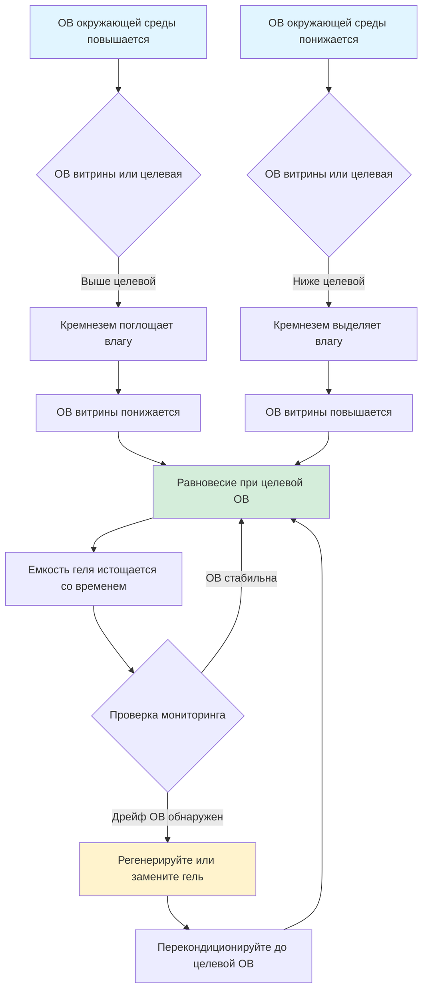

Кремнезем обеспечивает пассивную буферизацию влажности в герметичных или полугерметичных витринах, поддерживая стабильные условия относительной влажности без активных механических систем. Правильно кондиционированный кремнезем поглощает или выделяет водяной пар для противодействия колебаниям окружающей среды, защищая предметы искусства от деградации, вызванной изменением ОВ.

## Типы кремнезема и его характеристики

**Кремнезем обычной плотности**
Стандартный аморфный кремнезем (SiO₂·nH₂O) обладает емкостью по влаге 30-40% по массе при 40-95% ОВ. Материал работает посредством физической адсорбции на поверхности кремнезема, с емкостью, пропорциональной площади поверхности пор. Гель обычной плотности требует больших объемов для адекватной буферизации, но стоит дешевле на килограмм, чем специализированные продукты.

**Art-Sorb (буферизованный кремнезем)**
Art-Sorb и аналогичные музейные продукты сочетают кремнезем с гигроскопичными солями, создавая точную буферизацию ОВ при определенных заданных точках. Типичные составы рассчитаны на 40%, 50%, 55% или 65% ОВ. Компонент соли обеспечивает повышенную емкость буферизации в точке проектирования ОВ, улучшая производительность по сравнению с обычным кремнеземом. Кассеты Art-Sorb упрощают установку и регенерацию в витринах.

**Индикаторный кремнезем**
Кремнезем, пропитанный хлоридом кобальта (синий → розовый) или метилфиолетом (оранжевый → зеленый), обеспечивает визуальное указание на состояние насыщения. Используйте индикаторный гель только в небольшой доле (5-10%) от общей массы геля в целях мониторинга, так как химикаты-индикаторы могут выделять газы и влиять на предметы искусства.

## Емкость буферизации и количество геля

Емкость буферизации влаги зависит от массы геля, объема витрины, скорости воздухообмена и разницы ОВ между целевым и окружающим условиями.

### Расчет требуемой массы геля

**Базовое уравнение размеров:**
```
M_gel = (V_case × ACH × ρ_air × ΔW × t) / (ε × 3600)
```

Где:
- M_gel = Требуемая масса геля (кг)
- V_case = Объем витрины (м³)
- ACH = Воздухообмены в час (типично 0,1-0,5 для герметичных витрин)
- ρ_air = Плотность воздуха (1,2 кг/м³)
- ΔW = Разница влажностного отношения (кг_воды/кг_воздуха)
- t = Желаемый период буферизации (часы)
- ε = Эффективность геля при рабочей ОВ (0,10-0,25 кг_воды/кг_геля)

### Рекомендуемые количества геля

| Объем витрины | Целевая ОВ | Обычный кремнезем | Art-Sorb | Интервал регенерации |
|-------------|-----------|-------------------|----------|----------------------|
| 0,5 м³ | 50% | 2,5 кг | 1,5 кг | 6 месяцев |
| 1,0 м³ | 50% | 5,0 кг | 3,0 кг | 6 месяцев |
| 2,5 м³ | 50% | 12,5 кг | 7,5 кг | 4 месяца |
| 5,0 м³ | 50% | 25 кг | 15 кг | 3 месяца |
| 0,5 м³ | 55% | 2,0 кг | 1,2 кг | 6 месяцев |
| 1,0 м³ | 55% | 4,0 кг | 2,4 кг | 6 месяцев |

*Значения предполагают герметичную конструкцию витрины (ACH ≤ 0,2) с колебаниями окружающей среды ±5% ОВ. Удвойте количество для протекающих витрин или высокой изменчивости окружающей среды.*

## Процедуры кондиционирования

Новый кремнезем прибывает с произвольным содержанием влаги и требует кондиционирования до целевой ОВ перед установкой. Кондиционирование устанавливает содержание влаги в равновесии, соответствующее желаемой ОВ витрины.

**Метод кондиционирующей камеры:**

1. Поместите гель в перфорированные подносы с максимальной толщиной слоя 25 мм для адекватной циркуляции воздуха
2. Расположите подносы в контролируемой камере, поддерживаемой при целевой ОВ ± 2%
3. Кондиционируйте минимум 48-72 часа на килограмм массы геля
4. Проверьте равновесие путем взвешивания образцов; стабилизация веса указывает на завершение
5. Немедленно запечатайте кондиционированный гель в герметичные контейнеры до установки

**Кондиционирование с использованием солевого раствора:**

Для небольших количеств геля насыщенные солевые растворы обеспечивают точный контроль ОВ:

| Солевой раствор | ОВ равновесия при 20°C |
|---------------|------------------------|
| Хлорид лития (LiCl) | 11% |
| Хлорид магния (MgCl₂) | 33% |
| Карбонат калия (K₂CO₃) | 43% |
| Бромид натрия (NaBr) | 58% |
| Хлорид натрия (NaCl) | 75% |
| Сульфат калия (K₂SO₄) | 97% |

Поместите гель и насыщенный солевой раствор в герметичный контейнер без прямого контакта. Уравновешивание требует 5-7 дней для полного обмена влагой.

## Регенерация и замена

Регенерация кремнезема восстанавливает емкость буферизации путем удаления накопленной влаги или добавления влаги в истощенный гель. Контролируйте состояние геля посредством изменения цвета индикаторного кремнезема, периодического взвешивания или дрейфа ОВ в витрине.

### Тепловая регенерация (сушка)

**Процедура:**
1. Удалите гель из витрины
2. Разложите гель тонкими слоями (≤ 20 мм толщины) на противнях
3. Нагрейте в конвекционной печи при 120-150°C в течение 2-4 часов
4. Охладите в герметичном контейнере с осушителем
5. Перекондиционируйте до целевой ОВ перед переустановкой

**Внимание:** Чрезмерная температура (>175°C) ухудшает структуру кремнезема и снижает емкость. Art-Sorb не должен превышать 120°C во избежание разложения соли.

### Добавление влаги (регидратация)

Для пересушенного геля постепенно добавляйте дистиллированную воду, контролируя вес:

```
Water_added = M_gel × (W_target - W_current)
```

Где W представляет фракционное содержание влаги (кг_воды/кг_сухого геля). Тщательно перемешайте и дайте 24-48 часов для уравновешивания перед использованием.

## Производительность буферизации влажности



## Лучшие практики установки

**Размещение геля:**
Позиционируйте контейнеры с кремнеземом в нижней или задней части витрины для максимизации циркуляции воздуха без препятствования обзору предмета. Перфорированные кассеты или тканевые мешки позволяют обмен пара при удерживании частиц геля. Поддерживайте минимальный зазор 50 мм вокруг контейнеров с гелем для потока воздуха.

**Циркуляция воздуха:**
Пассивная конвекция, приводимая в движение градиентами температуры, обеспечивает адекватное перемешивание в большинстве витрин. Для витрин, превышающих 2 м³, рассмотрите небольшие батарейные вентиляторы (0,001-0,005 м³/с поток воздуха) для улучшения однородности ОВ.

**Мониторинг:**
Установите регистраторы данных, записывающие ОВ и температуру с интервалом 15-60 минут. Позиционируйте датчики рядом с предметами искусства, не рядом с кремнеземом. Приемлемое изменение ОВ: ±5% для общих коллекций, ±3% для чувствительных материалов (гигроскопичные металлы, слоновая кость, фотографии).

## Проверка производительности

Контролируйте ОВ в витрине минимум 2 недели после установки для проверки производительности буферизации. Ожидаемая производительность:

- **Отличная:** ОВ в витрине остается в пределах ±2% от целевой несмотря на колебания окружающей среды ±10%
- **Приемлемая:** ОВ в витрине остается в пределах ±5% от целевой несмотря на колебания окружающей среды ±10%
- **Неадекватная:** ОВ в витрине превышает ±5% изменение; указывает на недостаточное количество геля, плохую герметизацию витрины или неправильное кондиционирование

Неадекватная производительность требует увеличения массы геля на 50-100%, улучшения герметизации витрины или переключения на Art-Sorb для повышенной емкости буферизации.
