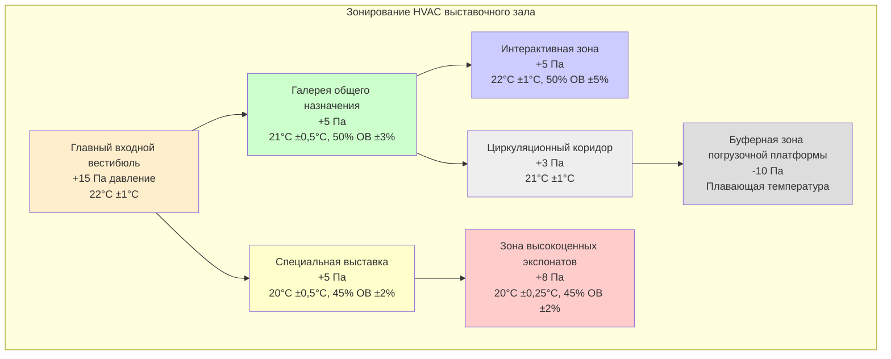

Выставочные пространства представляют уникальные задачи HVAC, требующие одновременной защиты ценных коллекций и комфорта для высокоплотного населения посетителей. Система должна быть рассчитана на резкие колебания занятости, временные установки выставок и различные уровни чувствительности экспонатов, при этом поддерживая точный контроль окружающей среды.

## Расчеты нагрузки от посетителей

Выставочные пространства испытывают высокую вариативность занятости, требующую динамического ответа системы HVAC. Рекомендации ASHRAE для выставочных пространств музеев предполагают расчеты конструкции на основе максимальной ожидаемой плотности.

### Параметры проектируемой занятости

| Тип помещения | Плотность (м²/человек) | Явное тепло (кДж/ч/человек) | Скрытое тепло (кДж/ч/человек) | Выделение CO2 (м³/ч/человек) |
|------------|---------------------|-------------------------------|----------------------------|---------------------------|
| Галерея общего назначения | 2,8-4,6 | 264 | 211 | 0,008 |
| Специальная выставка | 1,4-2,3 | 264 | 211 | 0,008 |
| Открытие выставки | 0,9-1,4 | 264 | 211 | 0,008 |
| Интерактивные экспонаты | 1,9-2,8 | 317 | 264 | 0,010 |

**Расчет общей охлаждающей нагрузки:**

$Q_{total} = (N × Q_{sensible}) + (N × Q_{latent}) + Q_{envelope} + Q_{lighting} + Q_{equipment}$

Где N = площадь пола ÷ коэффициент плотности занятости

Для специальной выставки площадью 464 м² при 1,9 м²/человека = 244 человека:
- Явная нагрузка: 244 × 264 = 64 416 кДж/ч
- Скрытая нагрузка: 244 × 211 = 51 484 кДж/ч
- Общая нагрузка от посетителей: 115 900 кДж/ч (32,1 кВт)

## Управление CO2 и вентиляция

Высокая плотность посетителей создает значительное накопление CO2, требующее стратегий вентиляции с контролем по требованию.

### Требования к вентиляции

**Нормы вентиляции ASHRAE 62.1 для выставочных пространств:**
- Базовая вентиляция: 0,3 м³/(ч·м²) (компонент площади)
- Вентиляция на человека: 3,5 м³/ч на человека (компонент количества людей)

**Контроль спроса на основе CO2:**
- Целевое значение: 800-1000 ppm (600-800 ppm выше уличного воздуха)
- Максимально приемлемое: 1200 ppm
- Размещение датчика: на высоте дыхания (122-152 см)
- Время отклика: модуляция регуляторов наружного воздуха для поддержания заданного значения

**Для выставки площадью 464 м² с 244 посетителями:**
- Компонент площади: 464 × 0,3 = 139 м³/ч
- Компонент количества людей: 244 × 3,5 = 854 м³/ч
- Минимальный наружный воздух: 993 м³/ч

Установите датчики CO2 в нескольких зонах для фиксирования пространственных вариаций и предотвращения застойных карманов в путях циркуляции.

## Стратегия зонирования выставочного пространства

Эффективное зонирование разделяет области по чувствительности коллекции, схемам занятости и графикам работы, при этом поддерживая отношения давления.

### Принципы проектирования зонирования

**Каскады давления:**
- Поддерживайте положительное давление в выставочных областях относительно служебных пространств
- Входные вестибюли с наибольшим положительным давлением (+15 Па)
- Площади загрузки/обслуживания с отрицательным давлением для сдерживания контаминантов
- Поток воздуха от чистых к менее чистым пространствам

**Независимый контроль:**
- Отдельные воздухоприемные блоки для зон высокоценных экспонатов
- Выделенный контроль влажности по зонам
- Индивидуальный контроль температуры ±0,25°C до ±1°C в зависимости от чувствительности
- Функция переопределения для специальных выставок

## Переходы климата временной выставки

Временные выставки требуют контролируемых переходов окружающей среды для предотвращения повреждения экспонатов от быстрых климатических изменений.

### График протокола переходов

| Этап | Длительность | Изменение температуры | Изменение ОВ | Частота мониторинга |
|-------|----------|----------------------|---------------|---------------------|
| Предварительная подготовка | 7 дней | Соответствие климату происхождения ±1°C | Соответствие ±3% ОВ | Непрерывная регистрация |
| Начальный переход | 3-5 дней | Максимум 0,5°C в сутки | Максимум 1% ОВ в сутки | Каждые 2 часа |
| Акклиматизация | 7-14 дней | 0,25°C в сутки до целевого | 0,5% ОВ в сутки до целевого | Каждые 4 часа |
| Период выставки | Переменный | Поддержание ±0,5°C | Поддержание ±3% ОВ | Ежедневная проверка |
| Предварительное снятие | 5-7 дней | Протокол обратного перехода | Протокол обратного перехода | Каждые 4 часа |

### Критические параметры переходов

**Пределы переходов температуры:**
- Никогда не превышайте изменение на 1°C за 24 часа для чувствительных экспонатов
- 0,5°C за 24 часа для бумаги, текстиля, органических материалов
- Отдельно контролируйте температуру поверхности от температуры окружающей среды

**Пределы переходов влажности:**
- Максимум 1,5% ОВ изменения за 24 часа для дерева, панельной живописи
- 1% ОВ за 24 часа для композитных материалов
- 0,5% ОВ за 24 часа для высокочувствительных гигроскопичных материалов

**Контроль точки росы:**
- Отслеживайте точку росы для предотвращения конденсации при переходах
- Поддерживайте температуру поверхности на 2,8°C выше точки росы окружающей среды
- Используйте портативные датчики точки росы рядом с массивными экспонатами

## Системы гибкого управления

Выставочные пространства требуют адаптивного управления HVAC для балансирования противоречивых требований сохранения экспонатов и комфорта посетителей.

### Многорежимная работа

**Режим приоритета консервации:**
- Температура: 20°C ±0,25°C
- ОВ: 45% ±2%
- Скорость воздуха: <0,15 м/с рядом с экспонатами
- Координация освещения и HVAC для минимизации лучистого тепла

**Режим приоритета комфорта посетителей:**
- Температура: 21-22°C ±0,5°C
- ОВ: 45-50% ±3%
- Повышенная циркуляция воздуха: 0,25-0,38 м/с
- Улучшенная вентиляция при высокой занятости

**Режим мероприятия:**
- Предварительное охлаждение/кондиционирование за 2-4 часа до мероприятия
- Максимальные скорости вентиляции активированы
- Контроль спроса по CO2 включен
- Мониторинг коэффициента влажности для предотвращения быстрых изменений ОВ от влажностной нагрузки

### Характеристики отклика системы

**Компенсация тепловой массы:**
- Тепловая масса здания создает задержку в ответе температуры
- Алгоритмы предварительного управления корректируют за 30-60 минут до ожидаемых изменений нагрузки
- Восстановление после ночного снижения требует 2-4 часов в зависимости от конструкции

**Отклик влажности:**
- Время отклика осушения: 15-30 минут
- Время отклика увлажнения: 10-20 минут
- Используйте пропорционально-интегральный контроль для предотвращения перерегулирования
- Сезонная калибровка корректировок для вариаций наружной влажности

## Конструкция распределения воздуха

**Соображения подачи воздуха:**
- Низкоскоростная вентиляция вытеснением (0,25-0,38 м/с) снижает движение пыли
- Потолочные диффузоры с характеристиками выброса, избегающими прямого воздействия на экспонаты
- Размещение возвратного воздуха на уровне пола для захвата тепла и влаги, производимых посетителями
- Минимум 4 воздухообмена в час для галерей общего назначения
- 6-8 воздухообменов в час для выставок высокой занятости

**Требования к фильтрации:**
- Минимум MERV 13 для выставочных пространств общего назначения
- MERV 14-16 для высокоценных коллекций
- Газофазная фильтрация для кислых газов и летучих органических соединений
- Счетчики частиц для проверки эффективности фильтрации

Системы HVAC выставочных пространств добиваются успеха, когда инженерная точность встречается с операционной гибкостью, создавая среды, в которых бесценные экспонаты остаются сохраненными, а посетители испытывают комфортное взаимодействие с культурным наследием.
