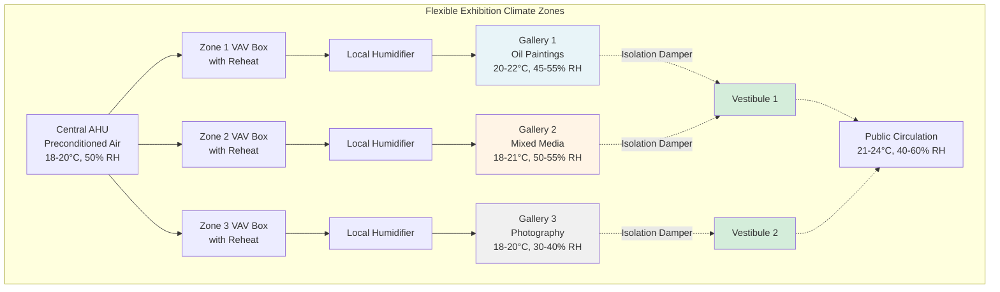

## Обзор

Выставочные пространства с ротационными коллекциями и временными займами требуют систем HVAC, способных адаптироваться к различным требованиям артефактов. В отличие от постоянных галерей коллекций с фиксированными уставками, эти пространства требуют гибких стратегий управления, которые учитывают материалы от масляной живописи до текстилей, археологических артефактов до современных инсталляций. Основная сложность заключается в создании изолированных зон, которые могут переходить между различными климатическими режимами без перекрестного загрязнения при сохранении энергоэффективности и комфорта занимающих.

Справочник ASHRAE по коллекциям музеев, библиотек и архивов, а также ASHRAE Chapter 24 устанавливают гибкие полосы окружающей среды (15-25°C, 40-60% ОВ) как приемлемые для многих типов коллекций, отходя от исторических жестких спецификаций. Такой подход позволяет проектировщикам выставок сбалансировать требования консервации против условий соглашения о займах, проблемы отображения смешанных материалов и операционные ограничения.

## Архитектура зонированного климатического контроля

Эффективное гибкое управление требует физической и управляющей системной инфраструктуры, поддерживающей независимое функционирование зон.

**Принципы проектирования зон:**

- **Физическое разделение:** отдельные галереи или подразделения галереи, обслуживаемые выделенными воздухообрабатывающими установками или концевыми устройствами с минимальной передачей воздуха между зонами
- **Независимые управляющие петли:** отдельные датчики температуры и влажности, контроллеры и модулирующие устройства для каждой зоны
- **Изолирующие демпферы:** моторизованные демпферы на границах зон для предотвращения миграции воздуха в различных режимах работы
- **Переходные вестибюли:** буферные пространства между зонами с градиентами 2-3°C и 5-10% ОВ для минимизации шока артефактам при перемещении

**Требования управляющей системы:**

- Программируемые логические контроллеры (PLC) или системы автоматизации зданий (BAS), способные хранить несколько профилей уставок на зону
- Возможности переопределения для временных выставочных установок с конкретными требованиями соглашения о займах
- Ограничение скорости изменения для предотвращения быстрых изменений окружающей среды (максимум 2°C за 24 часа, 3% ОВ за 24 часа)
- Логика блокировки, предотвращающая одновременное отопление и охлаждение или увлажнение и осушение

## Требования к окружающей среде по типам выставок

Различные категории артефактов требуют определенных диапазонов температуры и влажности в зависимости от состава материала и механизмов деградации.

| Тип выставки | Диапазон температуры | Диапазон влажности | Критические факторы | Предел скорости перехода |
|--------------|----------------------|-------------------|---------------------|-------------------------|
| Масляная живопись | 20-22°C | 45-55% ОВ | Натяжение холста, стабильность слоя краски | 1°C/день, 2% ОВ/день |
| Произведения на бумаге | 18-20°C | 40-50% ОВ | Стабильность размеров, предотвращение плесени | 2°C/день, 3% ОВ/день |
| Текстиль/костюмы | 18-20°C | 45-55% ОВ | Прочность волокна, активность вредителей | 1°C/день, 2% ОВ/день |
| Фотографии (ч/б) | 18-20°C | 30-40% ОВ | Растрескивание эмульсии, выцветание | 2°C/день, 3% ОВ/день |
| Фотографии (цветные) | 15-18°C | 30-40% ОВ | Стабильность красителя, химическая деградация | 1°C/день, 2% ОВ/день |
| Археологический металл | 18-21°C | 35-45% ОВ | Предотвращение коррозии | 2°C/день, 5% ОВ/день |
| Деревянные предметы | 18-21°C | 45-55% ОВ | Стабильность размеров, растрескивание | 1°C/день, 2% ОВ/день |
| Смешанные медиа (современное) | 18-24°C | 40-60% ОВ | Переменная в зависимости от материалов | 2°C/день, 5% ОВ/день |

## Реализация регулируемой уставки

Практическая реализация требует баланса между консервацией артефактов и возможностями системы и потреблением энергии.

**Стратегия управления уставкой:**

1. **Базовое кондиционирование:** центральные воздухообрабатывающие установки поддерживают предварительно подготовленный воздух при нейтральных уставках (19-20°C, 50% ОВ) для минимизации перегрева в концевых устройствах и локальных нагрузок увлажнения

2. **Регулировка уровня зоны:** ящики переменного объема воздуха (VAV) с катушками повторного нагрева и локальными паровыми или ультразвуковыми увлажнителями приводят условия в соответствие с требованиями конкретной зоны

3. **Разрешение сезонного дрейфа:** разрешить постепенные сезонные корректировки уставок (±2-3°C, ±5% ОВ) для снижения нагрузок на механические системы в условиях экстремальной погоды при сохранении в приемлемых диапазонах консервации

4. **Размещение соглашения о займах:** программировать временные переопределения уставок для конкретных выставок с автоматическим возвратом к базовым условиям после закрытия выставки

**Пример управляющей последовательности:**

Для галереи, переходящей от выставки фотографии (18°C, 35% ОВ) к выставке текстиля (20°C, 50% ОВ):

- День 1-2: повысить температуру до 19°C при 0,5°C/12 часов
- День 3-4: повысить температуру до 20°C и начать увеличение влажности до 40% ОВ
- День 5-8: увеличить влажность до 45% ОВ при 1,25% ОВ/день
- День 9-12: увеличить влажность до 50% ОВ при 1,25% ОВ/день
- Общий период перехода: 12 дней до установки

## Изоляция зоны и контроль миграции воздуха

Предотвращение перекрестного загрязнения окружающей среды между соседними зонами требует как физических барьеров, так и управляющих стратегий.

**Методы изоляции:**

- **Каскад давления:** поддерживать небольшое положительное давление (+2,5 Па) в чувствительных выставочных зонах относительно участков общего пользования для предотвращения инфильтрации менее контролируемого воздуха
- **Буферизация вестибюля:** проектировать переходные пространства с промежуточными условиями и независимым управлением для создания градуированных шагов окружающей среды
- **Автоматические блокировки дверей:** координировать моторизованные демпферы изоляции с датчиками положения дверей для увеличения приточного воздуха при открывании дверей, сохраняя перепады давления
- **Выделенные пути возврата воздуха:** предотвращать смешивание воздуха возврата между зонами, обеспечивая отдельные каналы возврата или возвратные камеры в центральную систему

**Проектирование переходного вестибюля:**

Для галерей с разницей температуры 5°C и разницей влажности 15% ОВ, спроектировать вестибюль с:
- Температура: T_галерея + 0,4(T_общее - T_галерея)
- Влажность: ОВ_галерея + 0,4(ОВ_общее - ОВ_галерея)
- Минимальный объем вестибюля: 20 воздушных изменений для буферизации артефактов при перемещении
- Приточный воздух направлен в зону с большей влажностью для предотвращения миграции влаги

## Руководящие принципы проектирования музейной HVAC

ASHRAE Handbook—HVAC Applications, Chapter 24 (Museums, Galleries, Archives, and Libraries) предоставляет фундаментальные критерии проектирования:

- Стабильность окружающей среды критичнее абсолютных уставок: пределы суточного изменения ±2°C и ±5% ОВ
- Требуется резервирование оборудования для критических пространств: емкость N+1 для охладителя и котла, двойные пути обработки воздуха
- Фильтрация: минимум MERV 13 для удаления частиц, активированный уголь для контроля газовых загрязнителей
- Мониторинг: непрерывная регистрация данных с интервалами 15 минут для проверки температуры и влажности

Американский институт консервации (AIC) и Международный институт консервации (IIC) одобрили гибкие руководящие принципы окружающей среды, признав, что умеренные колебания в расширенных полосах вызывают меньше повреждений, чем энергоемкий плотный контроль с неизбежными отказами оборудования.

**Соображения надежности системы:**

Гибкое управление не означает ослабленные стандарты надежности. Отказы оборудования, вызывающие быстрые скачки окружающей среды, представляют больший риск консервации, чем разрешение постепенного сезонного дрейфа. Проектировать избыточные системы с автоматическим переходом на резервную, резервное питание для компонентов критического контроля окружающей среды и предупреждение с протоколами реагирования в течение 24 часов.
