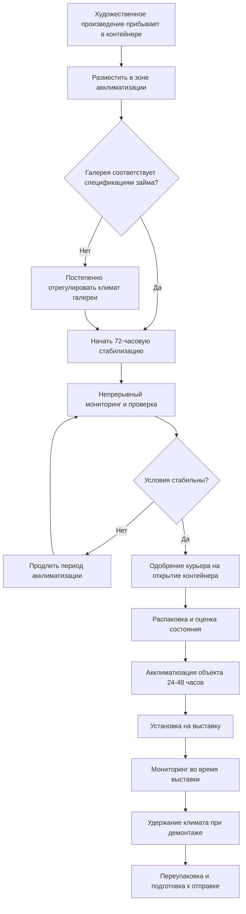

## Обзор

Временные выставки представляют уникальные вызовы для HVAC из-за строгих требований кредиторов, сжатых графиков установки и необходимости быстро достичь и поддерживать точные параметры окружающей среды. В отличие от постоянных коллекций, временные выставки должны удовлетворять внешние соглашения о займах, которые определяют точные климатические параметры, часто требуя более жесткие допуски, чем стандартные условия заимствующего учреждения.

Система экологического контроля должна обеспечивать три отчетливых фазы: акклиматизация контейнеров при прибытии, период установки и выставки, а также демонтаж. Каждая фаза требует разных стратегий управления и протоколов мониторинга.

## Требования к климату в соглашениях о займах

Кредитующие учреждения указывают условия окружающей среды как юридически обязывающие условия контракта. Заимствующее учреждение должно продемонстрировать способность поддерживать эти условия до одобрения займа.

### Стандартные параметры соглашения о займе

| Параметр | Типичный диапазон | Максимальное отклонение | Интервал измерения |
|-----------|-------------------|-------------------------|-------------------|
| Температура | 20-22°C | ±0,5°C | Непрерывно, запись каждые 15 мин |
| Относительная влажность | 45-55% | ±3% | Непрерывно, запись каждые 15 мин |
| Уровень освещенности | 50-150 люкс | В зависимости от чувствительности объекта | Ежедневная проверка |
| Скорость воздуха | <0,15 м/с у объекта | <0,25 м/с везде | Наладка + ежеквартально |
| Твердые частицы | <75 мкг/м³ PM10 | - | Ежемесячный отбор проб |

### Реакция системы кондиционирования

Система HVAC должна реагировать на изменения уставки в течение определенных периодов:

- **Регулировка температуры:** ≤0,3°C/час скорость изменения для предотвращения теплового шока
- **Регулировка влажности:** ≤2% ОВ/час скорость изменения для предотвращения изменений размеров
- **Период стабилизации:** 72 часа стабильных условий перед открытием контейнера

## Требования к отчетам о помещениях

Кредиторы требуют подробную документацию о возможностях окружающей среды перед одобрением займов. Отчет о помещениях должен продемонстрировать возможность системы HVAC и историческую производительность.

### Требуемые компоненты отчета

| Раздел отчета | Требования к содержанию | Период данных |
|----------------|------------------------|--------------|
| Описание системы HVAC | Мощность, избыточность, архитектура управления, график обслуживания | Текущие спецификации |
| Историческая производительность | Фактические данные Т/ОВ для выставочных пространств | Минимум 12 месяцев |
| Журнал инцидентов | Все превышения параметров за пределами ±2,8°C или ±5% ОВ | 24 месяца |
| Процедуры аварийного реагирования | Отказ HVAC, резервные системы, протоколы уведомления | Текущие процедуры |
| Системы мониторинга | Спецификации логгера данных, записи калибровки, пороги тревоги | Текущий список оборудования |
| Управление вредителями | Протоколы IPM, данные мониторинга, записи об обработке | 12 месяцев |
| Интеграция с безопасностью | Связь мониторинга климата с системами безопасности | Архитектура системы |

### Метрики производительности для одобрения займа

Кредитующие учреждения оценивают надежность HVAC, используя количественные метрики:

- **Поддержание уставки:** ≥95% показаний в пределах ±0,5°C и ±3% ОВ за предшествующие 12 месяцев
- **Время работы системы:** ≥99,5% доступность HVAC (исключая плановое обслуживание)
- **Время восстановления:** Возврат к уставке в течение 4 часов после любого превышения
- **Избыточность:** Минимум N+1 для всех критических компонентов HVAC

Учреждения, не соответствующие этим метрикам, могут быть отказаны в займах или должны установить дополнительное оборудование.

## Протоколы акклиматизации

Быстрые переходы климата вызывают изменения размеров в гигроскопических материалах (дерево, холст, бумага), потенциально приводя к растрескиванию, деформации или расслоению. Надлежащая акклиматизация предотвращает повреждения.

### Процесс акклиматизации контейнера

**Фаза 1: Первоначальная стабилизация (24-72 часа)**
- Разместить герметичные контейнеры в галерее или обозначенной комнате акклиматизации
- Галерея должна быть в окончательных условиях выставки до прибытия контейнера
- Контролировать микроклимат контейнера при наличии внутренних логгеров данных
- Проверить отсутствие конденсации на внешней поверхности контейнера, указывающей на чрезмерный дифференциал ОВ

**Фаза 2: Постепенное выравнивание (минимум 72 часа)**
- Контейнеры остаются герметичными во время выравнивания внутренней атмосферы с галереей
- Рассчитать время выравнивания: t = (V × k) / A где V – объем контейнера, A – площадь поверхности, k – коэффициент материала
- Типичный герметичный контейнер: 3-5 дней для 90% выравнивания при 10% дифференциале ОВ
- Контролировать непрерывно—продлить период при наличии дрейфа условий

**Фаза 3: Проверка и акклиматизация объекта (24-48 часов)**
- Открывать контейнеры только после одобрения курьера или регистратора
- Распаковать объекты и позволить дополнительное выравнивание перед установкой
- Проверить наличие конденсации, изменения материала, активность вредителей
- Задокументировать состояние с фотографией перед установкой

### Расчеты климатических переходов

Максимальные безопасные скорости переходов зависят от гигроскопических свойств материала:

**Деревянные панели и мебель:**
- ΔОВ: максимум 2% за 24 часа
- ΔТ: максимум 1,7°C за 24 часа

**Холстовые картины:**
- ΔОВ: максимум 3% за 24 часа
- ΔТ: максимум 2,2°C за 24 часа

**Бумага и фотографии:**
- ΔОВ: максимум 2% за 24 часа (наиболее чувствительны)
- ΔТ: максимум 1,7°C за 24 часа

## Требования к мониторингу окружающей среды

Соглашения о займах требуют специфических протоколов мониторинга с определенными спецификациями оборудования и сохранением данных.

### Стандарты оборудования мониторинга

**Логгеры данных:**
- Точность: ±0,3°C для температуры, ±2% ОВ для влажности
- Разрешение: 0,1°C температура, 0,1% ОВ
- Интервал выборки: максимум 15 минут
- Калибровка: Годовая сертификация, отслеживаемая NIST
- Резервное питание: минимум 72 часа
- Хранение данных: Полный период выставки плюс 30 дней

**Требования к размещению:**
- Один логгер на 185 м² выставочного пространства минимум
- Позиционировать на высоте художественного произведения (1,2-1,5 м от пола)
- Избегать прямых потоков воздуха, освещения или солнечного света
- Защитить от глаз публики, но доступен для обслуживания
- Резервные логгеры для займов высокой стоимости

### Документирование во время периода выставки

**Ежедневные требования:**
- Визуальная проверка работы системы HVAC
- Проверка показаний логгера данных на наличие превышений
- Проверка того, что система управления показывает нормальную работу
- Задокументировать влияние нагрузки посетителей на условия

**Еженедельные требования:**
- Загрузить и архивировать файлы логгера данных
- Создать отчеты тренда для температуры и ОВ
- Проверить объекты на наличие изменений состояния
- Протестировать системы оповещения об тревоге

**Отчетность об инцидентах:**
- Любое превышение за пределы допусков соглашения о займе требует немедленного уведомления кредитора
- Задокументировать причину, продолжительность, корректирующее действие и оценку влияния на объект
- Сфотографировать затронутые объекты при наблюдении изменений состояния
- Предоставить формальный отчет об инциденте в течение 24 часов

## Дополнительное оборудование кондиционирования

Постоянные системы HVAC могут требовать увеличения для соответствия строгим требованиям займа.

**Портативные осушители/увлажнители:**
- Производительность: 1,4-2,8 м³/день для типичной галереи
- Использование, когда системы здания не могут достичь требуемую ОВ
- Должны включать непрерывный слив и удаленный мониторинг
- Рассчитать требуемую производительность: Q = (V × ΔW × ρ) / t

**Локальная фильтрация воздуха:**
- MERV 13 минимум, HEPA для чувствительных материалов
- Позиционировать для рециркуляции без прямых потоков на объекты
- Размер для 4-6 воздухообменов в час в выставочном пространстве

**Временные воздушные барьеры:**
- Тамбуры или воздушные завесы для изоляции выставочных галерей
- Минимизировать инфильтрацию из смежных пространств с другими условиями
- Критично, когда требования выставки отличаются от стандарта здания
