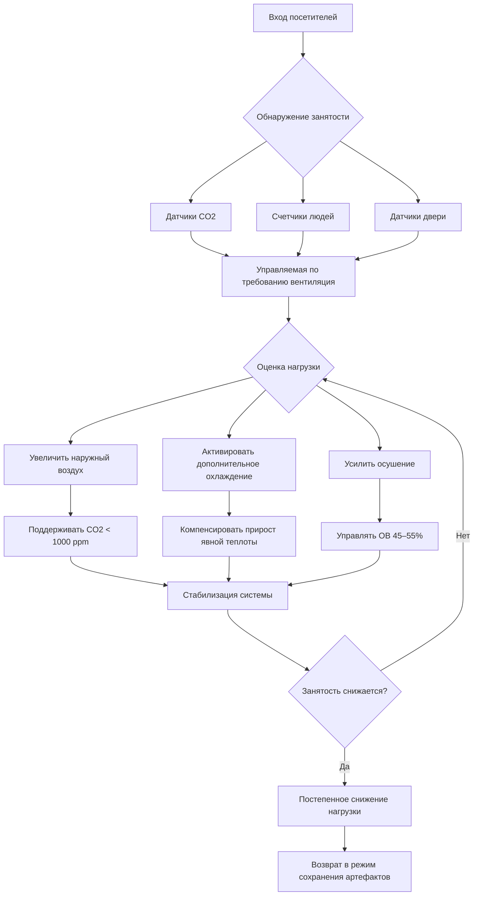

## Физические принципы воздействия посетительских нагрузок

Посетители представляют высоко вариативные тепловые и влажностные нагрузки, которые затрудняют работу систем HVAC музеев, спроектированных в основном для сохранения артефактов. Каждый человек генерирует явную теплоту посредством метаболической активности и радиационного обмена, скрытую теплоту через дыхание и потоотделение, а также CO2 через дыхание. Эти нагрузки колеблются значительно между пустыми галереями и периодами пиковой посещаемости.

Фундаментальный механизм теплопередачи включает конвекцию с поверхностей тела (примерно 70% от общего количества теплоты) и излучение на окружающие поверхности (30%). Выделение влаги происходит в основном через дыхание (скрытая теплота), с коэффициентами, варьирующимися в зависимости от уровня активности и продолжительности пребывания.

## Скорости выделения метаболической теплоты

Тепловой выход человека зависит от уровня активности и массы тела. В выставочных пространствах посетители обычно поддерживают низкий уровень активности стоя, медленно прогуливаясь или сидя.

| Уровень активности | Явная теплота (кДж/ч) | Скрытая теплота (кДж/ч) | Общая теплота (кДж/ч) | Влага (кг/ч) |
|---|---|---|---|---|
| Сидя, спокойно | 222 | 148 | 370 | 0,063 |
| Стоя, легкая активность | 232 | 190 | 422 | 0,077 |
| Медленная ходьба (3,2 км/ч) | 243 | 232 | 475 | 0,095 |
| Умеренная ходьба (4,8 км/ч) | 264 | 317 | 581 | 0,132 |

Эти значения представляют взрослых людей при температуре помещения 24°C. Дети генерируют примерно 75% от значений для взрослых. Во время торжественных приемов с повышенным уровнем активности и более плотным расположением люди, общие теплоприходы приближаются к верхнему диапазону.

## Расчеты плотности занятости

Проектная плотность занятости определяет сценарии пиковой нагрузки и минимальные требования к вентиляции в соответствии со стандартом ASHRAE 62.1.

| Тип пространства | Проектная занятость (м²/человек) | Пиковая занятость (м²/человек) | ASHRAE 62.1 Вентиляция (м³/ч на человека) |
|---|---|---|---|
| Основная выставочная галерея | 4,6–9,3 | 2,3–3,7 | 12,8 |
| Популярная выставка | 2,8–4,6 | 1,4–2,3 | 12,8 |
| Пространство для приемов/событий | 1,4–2,8 | 0,93–1,4 | 12,8 |
| Лекционный зал/аудитория | 0,93–1,4 | 0,65–0,93 | 12,8 |

Для галереи площадью 464 м² при плотности 4,6 м²/человека проектная занятость достигает 100 человек. При 422 кДж/ч на человека общей теплоты пиковая нагрузка посетителей составляет 42,2 МДж/ч (11,7 кВт). Это представляет значительное добавление к нагрузкам от ограждающей конструкции и освещения.

## Генерирование CO2 и требования к вентиляции

Каждый человек генерирует приблизительно 0,005 м³/ч CO2 в состоянии покоя, увеличиваясь до 0,009–0,011 м³/ч при легкой активности. При наружной концентрации CO2 400–450 ppm внутренние уровни быстро повышаются при недостаточной вентиляции.

Установившаяся концентрация CO2 следует уравнению:

**C_indoor = C_outdoor + (N × G) / Q**

Где:
- C_indoor = внутренняя концентрация CO2 (ppm)
- C_outdoor = наружная концентрация CO2 (ppm)
- N = количество людей
- G = коэффициент генерирования CO2 на человека (м³/ч)
- Q = скорость вентиляции (м³/ч)

Чтобы поддерживать уровень CO2 1000 ppm (рекомендуемый предел ASHRAE), галерея на 100 человек требует примерно 3050–3400 м³/ч наружного воздуха, при условии генерирования 0,009 м³/ч на человека и наружной концентрации 400 ppm.

## Скачки влажности при пиковой посещаемости

Выделение влаги посетителями прямо влияет на управление относительной влажностью. Полностью заполненная галерея площадью 464 м² со 100 посетителями при выделении влаги 0,077 кг/ч на человека производит 7,7 кг/ч общей влаги. Это представляет примерно 32 л в час при пиковой занятости.

Без адекватной осушающей способности относительная влажность может скачкообразно возрасти на 5–15% выше установки во время пиковых периодов продолжительностью 2–4 часа. Музеи обычно поддерживают 45–55% ОВ для сохранения артефактов, что делает выделение влаги посетителями особенно проблематичным для чувствительных коллекций.

Скорость повышения ОВ зависит от объема помещения и воздухообмена. Для галереи объемом 1415 м³ (потолок высотой 3,05 м) скорость добавления влаги 7,7 кг/ч требует примерно 578 м³/ч осушенного наружного воздуха при 50% наружной влажности для поддержания равновесия.

## Стратегии реагирования систем HVAC

Эффективное управление посетительскими нагрузками требует нескольких скоординированных стратегий:

**Управляемая по требованию вентиляция (DCV)**: Датчики CO2 модулируют заслонки наружного воздуха для поддержания установки 800–1000 ppm. Это обеспечивает экономию энергии во время периодов низкой занятости при обеспечении адекватной вентиляции во время пиковых нагрузок. Размещение датчиков должно учитывать стратификацию и застойные зоны.

**Дополнительная охлаждающая способность**: Спроектируйте системы с резервной охлаждающей способностью 20–30% сверх базовых нагрузок для обработки пиковых событий посетителей без снижения температурного контроля. Компрессоры с переменной скоростью или ступенчатая мощность обеспечивают эффективную работу при частичной нагрузке.

**Улучшенное осушение**: Системы приточного воздуха (DOAS) с рекуперацией энергии и дополнительными осушающими катушками обеспечивают независимое управление влажностью. Это предотвращает выбросы ОВ во время влажных наружных условий в сочетании с высокой занятостью.

**Зонирование и распределение нагрузок**: Отдельные зоны HVAC для высокопроходимых галерей в сравнении с хранилищами чувствительных коллекций позволяют целенаправленное реагирование. Соотношения давления предотвращают миграцию неподготовленного воздуха в критические пространства.

**Использование тепловой массы**: Стратегии ночного снижения температуры предварительно охлаждают конструктивную массу перед прогнозируемой пиковой посещаемостью, обеспечивая тепловую буферизацию при скачках нагрузки. Этот подход снижает мгновенный спрос охлаждения.

## Рассмотрения при проектировании в соответствии с справочником ASHRAE Applications

Глава 24 ASHRAE (Музеи, галереи, архивы и библиотеки) рекомендует спроектировать системы HVAC выставочных пространств на двойную прогнозируемую среднюю занятость для размещения специальных событий и популярных выставок. Последовательности управления должны приоритизировать установки сохранения артефактов при управлении комфортом посетителей в приемлемых диапазонах.

Критические параметры проектирования включают:
- Максимальное колебание температуры 1,1°C при занятом периоде
- Максимальное колебание ОВ 5% при пиковых нагрузках
- Уровни CO2 поддерживаются ниже 1000 ppm
- Время восстановления к установкам сохранения в течение 2–4 часов после события
- Акустические уровни ≤ NC 35 в выставочных пространствах

Системы, обслуживающие как коллекции, так и высокозаполняемые общественные пространства, требуют тщательной интеграции требований сохранения с вариативностью посетительских нагрузок.
