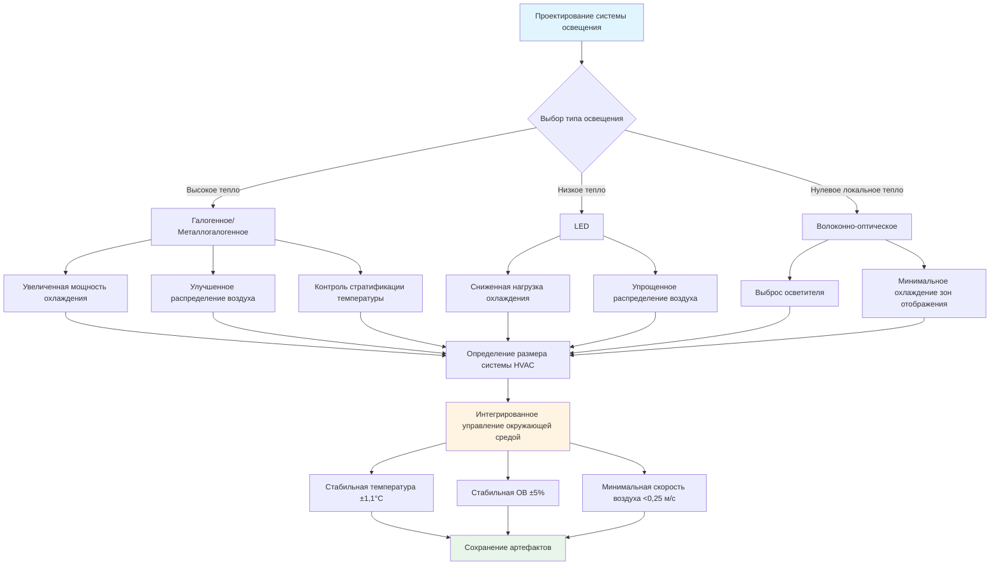

## Обзор

Системы освещения в музеях, галереях, архивах и библиотеках создают уникальные проблемы для HVAC из-за противоречивых требований: надлежащее освещение для просмотра при минимизации теплового прироста, УФ-радиации и стратификации температуры, которые могут повредить чувствительные коллекции. Надлежащая интеграция систем освещения и HVAC критична как для сохранения артефактов, так и для энергоэффективности.

## Основы тепловой нагрузки освещения

Все системы освещения преобразуют электрическую энергию в видимый свет и отходящее тепло. Тепловая нагрузка от освещения напрямую влияет на мощность охлаждения HVAC, локальные температурные градиенты и схемы циркуляции воздуха вокруг выставленных артефактов.

### Расчет тепловой нагрузки

Прирост явного тепла от освещения рассчитывается как:

**Q = (W × 3,412 × BF) / 1000**

Где:
- Q = Прирост тепла (кДж/ч)
- W = Общая мощность светильников
- 3,412 = Коэффициент преобразования (кДж/ч на ватт)
- BF = Коэффициент балласта (типично 1,0 для LED, 1,15-1,20 для люминесцентных)

Для точного определения размера HVAC расчет должен учитывать эффективность ламп, расположение светильников, графики работы и режимы передачи тепла.

## Сравнение тепловой нагрузки LED и галогенного освещения

Переход от ламп накаливания и галогенного освещения на технологию LED значительно снизил нагрузки охлаждения в музейной среде.

| Тип освещения | Люмены на ватт | Выход тепла (%) | ИК-излучение | УФ-содержание | Влияние на HVAC |
|---------------|-----------------|-----------------|--------------|------------|-------------|
| Галогенное | 15-25 | 90-95% | Высокое | Среднее | 100% базовое |
| Металлогалогенное | 60-90 | 60-70% | Среднее | Высокое | Снижение на 40-50% |
| Люминесцентное (T8) | 60-100 | 75-80% | Низкое | Среднее (с люминофором) | Снижение на 35-45% |
| LED | 80-150 | 60-75% | Очень низкое | Минимальное | Снижение на 50-70% |
| Волоконно-оптическое (удаленный источник) | Варьируется | Тепло только у источника | Отсутствует у светильника | Отсутствует у светильника | Снижение на 80-90% в месте расположения |

### Пример расчета тепловой нагрузки

**Галерея с галогенным трековым освещением:**
- 40 светильников × 75 Вт = 3000 Вт
- Q = (3000 × 3,412 × 1,0) / 1000 = 10,24 кДж/ч

**Та же галерея с заменой на LED:**
- 40 светильников × 12 Вт = 480 Вт
- Q = (480 × 3,412 × 1,0) / 1000 = 1,64 кДж/ч
- **Снижение: 8,6 кДж/ч (снижение на 84%)**

## Характеристики систем освещения и последствия для HVAC

### Волоконно-оптические системы освещения

Волоконно-оптические системы отделяют источник света, генерирующий тепло (металлогалогенный или LED-осветитель), от точки отображения, обеспечивая исключительный тепловой контроль.

**Преимущества для интеграции HVAC:**
- Отсутствие тепла у точки светильника исключает локальные горячие точки
- Отсутствие УФ или ИК-радиации на поверхности артефакта
- Позволяет близко расположенное освещение без риска теплового повреждения
- Централизует источник тепла для эффективного выброса или охлаждения
- Упрощает контроль микроклимата в витринах

**Особенности проектирования HVAC:**
- Разместить осветители в отдельных механических помещениях с прямым выбросом
- Определить мощность выброса для концентрированного теплового выхода (типично 150-250 Вт на осветитель)
- Исключить нагрузку охлаждения из зон отображения

### Требования УФ-фильтрации

УФ-радиация (длины волн 280-400 нм) вызывает фотохимическую деградацию в текстиле, бумаге, пигментах и органических материалах. Стандарты ASHRAE и IES ограничивают экспозицию УФ 75 микроваттами на люмен для музейных приложений.

**Интегрированные стратегии контроля УФ:**

1. **Выбор лампы**: источники LED по сути производят минимальное УФ
2. **УФ-фильтрующее стекло**: поглощает УФ перед входом света в помещение
3. **Воздушная фильтрация**: фильтры HVAC не могут удалить УФ-радиацию, но контролируют взвешенные вещества, которые ускоряют фотодеградацию
4. **Контроль уровня света**: более низкое освещение снижает как тепло, так и УФ-воздействие

## Стратегии координации HVAC и освещения

## Рекомендации по интеграции проектирования

### Управление тепловой стратификацией

Трековое и точечное освещение создают вертикальные температурные градиенты, которые конфликтуют с предположениями системы HVAC. Теплый воздух, поднимающийся от светильников, может создать разницу температур 2,8-5,6°C между уровнями пола и потолка в галереях с высокими потолками.

**Стратегии смягчения:**
1. Увеличить количество воздухообменов в верхних зонах (целевой показатель 6-8 ACH для зон отображения с концентрированным освещением)
2. Спроектировать возвратные воздушные отверстия рядом со светильниками для перехвата тепла у источника
3. Использовать потолочные диффузоры с горизонтальным броском для улучшения стратификации воздуха
4. Установить отдельные температурные датчики на уровне артефакта, а не на потолке

### Контроль микроклимата в витринах

Закрытые витрины требуют независимого контроля окружающей среды, когда внутреннее освещение генерирует тепло внутри герметичного объема.

**Требования проектирования:**
- Максимум 2 Вт на кубический метр объема витрины для пассивных витрин
- Активная вентиляция для витрин, превышающих пороговую плотность тепла
- Силикагель или механическое осушение для герметичных витрин
- Мониторинг температуры на уровне артефакта с точностью ±0,6°C

### Управление освещением и отклик HVAC

Элементы управления освещением на основе присутствия и системы использования дневного света создают динамические тепловые нагрузки, которые система HVAC должна аккомодировать.

**Стратегии управления:**
1. Интегрировать систему управления освещением с BAS для предварительного предупреждения о нагрузке
2. Определить размер HVAC для пиковых условий освещения, но позволить отключение при сниженном освещении
3. Запрограммировать ночное снижение температур с учетом нулевого теплового прироста от освещения
4. Постоянно контролировать температуру в помещении для проверки адекватности отклика HVAC

## Стандарты и справочные материалы

**ASHRAE Handbook - HVAC Applications, Chapter 24**: Руководство по контролю окружающей среды в музеях, галереях, архивах и библиотеках

**IES RP-30-17**: Рекомендуемые уровни освещенности и ограничения УФ для музеев и художественных галерей

**ASHRAE Standard 55**: Тепловые условия окружающей среды для занятости людьми (комфорт посетителей в галереях)

**ISO 11799**: Информация и документация - требования к хранению документов для архивных и библиотечных материалов

**National Park Service Museum Handbook**: Мониторинг и контроль окружающей среды для федеральных коллекций

## Оптимизация энергии

Синергия между эффективным освещением и сниженными нагрузками HVAC создает кумулятивную экономию энергии.

**Кумулятивная экономия от модернизации LED:**
- Прямое снижение энергии освещения: 60-80%
- Снижение энергии охлаждения: 10-25% от общей энергии HVAC
- Увеличение энергии отопления: 2-5% (сниженные внутренние приросты в зимний период)
- Чистая экономия энергии: 35-55% для комбинированных систем освещения и HVAC

Надлежащая координация между дизайнерами освещения и инженерами HVAC во время проектирования обеспечивает оптимальные условия окружающей среды для коллекций при минимизации операционных затрат и потребления энергии.
