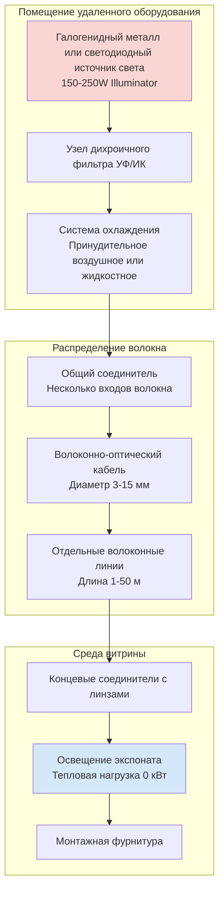

## Основы волоконно-оптических систем освещения

Волоконно-оптические системы освещения исключают передачу тепла к выставляемым экспонатам, отделяя источник света от точки отображения. Эта технология передает свет через оптические волокна посредством полного внутреннего отражения, обеспечивая освещение без инфракрасного излучения и конвективного тепла, связанного с обычными светильниками.

**Основные преимущества для музейных приложений:**

- Нулевое тепловыделение в точке выставки
- Полная фильтрация УФ и ИК-излучения в удаленном источнике
- Минимальное влияние на охлаждающие нагрузки HVAC внутри витрин
- Точное управление пучком и направленное освещение
- Отсутствие электрической проводки у мест расположения экспонатов
- Продолжительный срок службы лампы благодаря контролируемым условиям работы

## Архитектура системы

Система волоконно-оптического освещения состоит из трех основных компонентов, работающих в тепловой изоляции от кондиционируемой выставочной среды.

## Типы волокон и технические характеристики

Оптические характеристики и эффективность передачи определяют надлежащий выбор волокна для конкретных музейных приложений.

| Тип волокна | Материал сердечника | Диапазон диаметра | Эффективность передачи | Максимальная длина линии | Типичное применение |
|-----------|---------------|----------------|------------------------|-------------|---------------------|
| Стеклянное однопроводное | Кремнеземное стекло | 0,5-3,0 мм | 95-98% | 100 м | Прецизионное точечное освещение, небольшие экспонаты |
| Пластиковое однопроводное | Полимер PMMA | 1,0-5,0 мм | 85-92% | 50 м | Основное выставочное освещение |
| Стеклянный пучок | Массив кремнеземного стекла | 3,0-10,0 мм | 90-95% | 75 м | Освещение больших витрин |
| Волокно с концевым свечением | Кремнезем или PMMA | 0,75-2,0 мм | Световое излучение по длине | 15 м | Краевое освещение, световые указатели |
| Волокно с боковым свечением | PMMA с насечками | 2,0-8,0 мм | Распределенное излучение | 25 м | Линейное освещение, полочное освещение |

## Световой поток и производительность

Световой поток, доставляемый к экспонату, зависит от мощности источника, передачи волокна и длины линии. В следующей таблице представлены типовые характеристики для музейных установок высокого качества.

| Мощность источника | Диаметр волокна | Длина линии | Выход на конце | Освещенность на расстоянии 300 мм | Угол пучка |
|-------------|----------------|------------|-------------------|---------------------|------------|
| 150W галогенид металла | 5 мм однопроводное | 10 м | 1200 люмен | 800 люкс | 12-45° регулируемый |
| 150W галогенид металла | 8 мм пучок | 15 м | 2400 люмен | 1600 люкс | 25-60° регулируемый |
| 250W галогенид металла | 10 мм пучок | 25 м | 3000 люмен | 2000 люкс | 30-70° регулируемый |
| 100W светодиодный массив | 5 мм однопроводное | 10 м | 900 люмен | 600 люкс | 15-50° регулируемый |
| 200W светодиодный массив | 8 мм пучок | 20 м | 2100 люмен | 1400 люкс | 20-65° регулируемый |

## Конфигурации удаленных источников света

Узел осветителя располагается в контролируемой среде, отделенной от выставочных площадей, что позволяет отводить тепло и проводить техническое обслуживание без влияния на условия экспонатов.

**Галогенидные металлические осветители:**
- Цветовая температура: 3000-5500K выбираемая
- Индекс цветопередачи: 85-95 CRI
- Тепловыделение: 1,3-2,2 кВт в источнике
- Срок службы лампы: 6000-10000 часов
- Требует активного охлаждения и дихроичных фильтров УФ/ИК

**Светодиодные матричные осветители:**
- Цветовая температура: 2700-6500K изменяемая
- Индекс цветопередачи: 90-98 CRI
- Тепловыделение: 0,9-1,9 кВт в источнике
- Срок службы источника: 50000-70000 часов
- Встроенное управление тепловым режимом, сниженное УФ/ИК-излучение

## Устранение УФ и ИК-излучения

Узлы дихроичных фильтров, установленные в осветителе, удаляют длины волн вне видимого спектра перед поступлением света в систему передачи волоконно-оптического кабеля.

**Технические характеристики фильтра:**
- Пропускание УФ: <0,01% при λ <400 нм
- Пропускание ИК: <0,05% при λ >760 нм
- Пропускание видимого света: 95-98% при λ 400-760 нм
- Рабочая температура: До 149°C
- Замена фильтра: 10000-15000 часов

Эта фильтрация предотвращает фотохимическую деградацию и исключает инфракрасное излучение, которое в противном случае способствовало бы нагреву экспоната и тепловой нагрузке витрины.

## Интеграция витрины

Волоконно-оптические концеваты монтируются внутри витрин без электрических соединений, устраняя источники зажигания и упрощая установку в существующих экспозициях.

**Аспекты монтажа:**
- Арматура концевика: диаметр 15-40 мм, длина 50-150 мм
- Регулировка пучка: 180-270° по горизонтали, 90° по вертикали
- Прокладка волокна: Минимальный радиус изгиба 10× диаметр волокна
- Герметизация проникновения: Сохранение целостности пароизоляции витрины
- Тепловая нагрузка при выставке: 0,0-0,15 кВт на один конец (только потери волокна)

## Примеры использования в музеях

**Коллекции рукописей и бумаги:**
- Освещенность: максимум 50-100 люкс
- Конфигурация волокна: однопроводные 3-5 мм, линии 5-10 м
- Типичная установка: 4-6 регулируемых точек на витрину
- Годовой лимит воздействия: <50000 люкс-часов

**Текстиль и органические материалы:**
- Освещенность: максимум 50-150 люкс
- Конфигурация волокна: пучки 5-8 мм, линии 10-20 м
- Типичная установка: Периметральное освещение с 8-12 точками
- Цветовая температура: 3000K теплый белый

**Картины и фотографии:**
- Освещенность: 150-300 люкс
- Конфигурация волокна: пучки 8-10 мм, линии 15-30 м
- Типичная установка: Регулируемые точки с кадрирующими жалюзи
- Требование по CRI: >90 для точности цветопередачи

**Трехмерные экспонаты:**
- Освещенность: 150-500 люкс в зависимости от материала
- Конфигурация волокна: Несколько типов волокон для подсветки и заполнения
- Типичная установка: 10-20 отдельных волоконных линий на основной экспонат
- Углы пучка: 12-30° для подсветки, 40-70° для основного освещения

## Снижение тепловой нагрузки HVAC

Волоконно-оптические системы устраняют тепловыделение освещения внутри кондиционируемых витрин, снижая как явные охлаждающие нагрузки, так и требования к удалению влаги.

**Обычное галогенное освещение витрин:** 4,4-14,6 кВт на лампу, 17,5-58,6 кВт на витрину
**Волоконно-оптическое освещение витрин:** 0-0,6 кВт на витрину (только потери при передаче волокна)
**Типичное снижение нагрузки:** 95-100% устранение тепловыделения от выставочного освещения

Это устранение тепла позволяет использовать более компактные, эффективные системы климат-контроля для витрин и снижает риск температурной стратификации внутри экспозиций.
