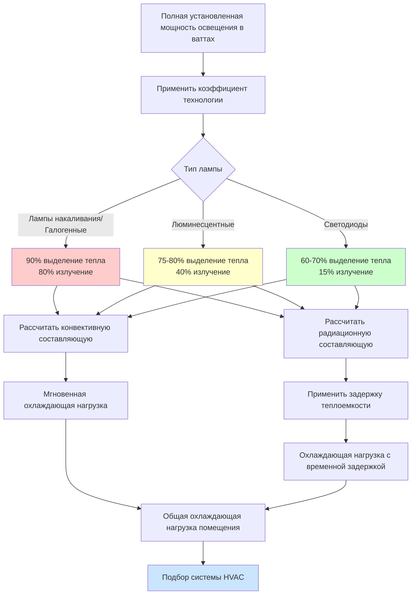

## Основы теплопритока от освещения

Системы освещения вносят значительный явный теплоприток в кондиционируемые помещения тремя механизмами: конвекцией с поверхностей ламп, излучением на окружающие поверхности и кондукцией через светильники. В музеях, галереях, архивах и библиотеках теплопритоки от освещения требуют точного расчета из-за требований консервации и температурной чувствительности коллекций.

Общий тепловой прирост от освещения равен полной установленной мощности в ваттах, умноженной на коэффициенты использования и диверсификации. Однако распределение между радиационной и конвективной составляющими существенно варьируется в зависимости от технологии лампы, что влияет как на непосредственные охлаждающие нагрузки, так и на задержанную теплопередачу через конструктивную массу здания.

## Методология расчета теплопритока

В соответствии с ASHRAE Fundamentals, мгновенный тепловой прирост от электрического освещения рассчитывается как:

**q = W × FUT × FSA**

Где:
- q = тепловой прирост (Вт)
- W = полная установленная мощность освещения (ватты)
- FUT = коэффициент использования освещения (доля работающих светильников)
- FSA = коэффициент специального допуска (обычно 1,0 для люминесцентных и светодиодных, может варьироваться для закрытых светильников)

Для расчетов охлаждающей нагрузки применяются соответствующие коэффициенты временной задержки в зависимости от теплоемкости помещения и графиков работы освещения. В галереях с большой тепловой массой и 12-часовыми циклами освещения пиковые охлаждающие нагрузки от освещения могут возникать через 2–4 часа после включения светильников.

## Тепловые характеристики технологий ламп

### Лампы накаливания и галогенные лампы

Лампы накаливания преобразуют примерно 90% входной энергии в тепло, с производством видимого света только на 10%. Распределение тепла составляет примерно 80% излучения и 20% конвекции. Трековые светильники и акцентные приборы с галогенными лампами создают сосредоточенные тепловые нагрузки, которые напрямую влияют на произведения искусства и поверхности экспозиций.

**Тепловые характеристики ламп накаливания:**
- Светоотдача: 12–18 люмен/ватт
- Тепловыделение: 3,3–3,6 кДж/ч на ватт
- Доля излучения: 80%
- Температура поверхности: 200–260°C

Галогенные лампы работают при более высоких температурах (250–350°C), но с аналогичной эффективностью преобразования энергии. Интенсивное инфракрасное излучение от галогенных источников требует осторожного позиционирования, чтобы предотвратить локальный нагрев светочувствительных материалов.

### Люминесцентные лампы

Люминесцентная технология преобразует 20–25% входной энергии в видимый свет, остаток выделяется в виде тепла. Распределение тепла смещается в сторону конвекции: примерно 60% конвективной и 40% радиационной составляющей.

**Тепловые характеристики люминесцентных ламп:**
- Светоотдача: 50–100 люмен/ватт (в зависимости от типа лампы и балласта)
- Тепловыделение: 3,6 кДж/ч на ватт (включая потери в балласте)
- Доля излучения: 40%
- Коэффициент электронного балласта: 1,10–1,20 (добавляет 10–20% к мощности лампы)

Устаревшие магнитные балласты генерируют дополнительное тепло (15–25% от мощности лампы), которое должно быть включено в расчеты нагрузки. Современные электронные балласты снижают этот штраф до 10–15%.

### Системы светодиодного освещения

Светодиодная технология достигает 30–40% эффективности преобразования в видимый свет, с теплом, выделяемым в основном путем кондукции в радиаторы, а не прямого излучения. Это фундаментальное различие снижает радиационный тепловой перенос на освещаемые объекты на 70–80% по сравнению с источниками накаливания.

**Тепловые характеристики светодиодов:**
- Светоотдача: 80–150 люмен/ватт (на системном уровне с потерями драйвера)
- Тепловыделение: 3,6 кДж/ч на ватт
- Доля излучения: 10–20%
- Эффективность драйвера: 85–95% (добавляет 5–15% к мощности светодиода)

Требование конвективного охлаждения для светодиодных светильников влияет на локальные воздушные потоки. Надлежащая вентиляция светильника предотвращает деградацию производительности и преждевременный отказ.

## Плотность мощности освещения по технологии

| Технология освещения | Светоотдача (лм/Вт) | Ватт на 1000 люкс (100 м²) | Снижение теплопритока относительно ламп накаливания |
|---------------------|-----------------|------------------------------|-------------------------------------|
| Лампы накаливания | 15 | 6 667 Вт | Базовое значение |
| Галогенные | 18 | 5 556 Вт | 17% |
| Люминесцентные T8 | 85 | 1 176 Вт | 82% |
| Компактные люминесцентные | 65 | 1 538 Вт | 77% |
| Светодиоды (стандартные) | 100 | 1 000 Вт | 85% |
| Светодиоды (высокопроизводительные) | 140 | 714 Вт | 89% |

*Значения представляют системную светоотдачу включая потери в балласте/драйвере для типичного музейного освещения 150–200 люкс на поверхностях экспозиций*

## Коэффициенты теплопритока от освещения ASHRAE

ASHRAE предоставляет табулированные коэффициенты теплопритока, учитывающие тип светильника, конфигурацию монтажа и характеристики помещения. Для музейных применений ключевые коэффициенты включают:

**Коэффициент использования помещения (FUT):**
- Галереи во время рабочего времени: 0,85–1,0
- Читальные залы архивов: 0,70–0,85
- Складские помещения с датчиками присутствия: 0,20–0,40
- Консервационные лаборатории: 0,90–1,0

**Коэффициент диверсификации:**
- Дисплейное освещение с диммированием: 0,60–0,80
- Общее окружающее освещение: 0,85–0,95
- Акцентное и декоративное освещение: 0,30–0,60

Применяйте коэффициенты диверсификации для учета реалистичных схем эксплуатации вместо проектирования с одновременным полнонагруженным режимом всех цепей.

## Сосредоточенные нагрузки дисплейного освещения

Сфокусированное акцентное освещение создает локализованные тепловые потоки, которые влияют на сохранение артефактов. Один 50-ватный галогенный светильник, сфокусированный на 0,5 м² поверхности картины, доставляет 100 Вт/м² плотность радиационного теплового потока, потенциально повышая температуру поверхности на 5–8°C выше окружающей в условиях неподвижного воздуха.

Рассчитывайте сосредоточенные нагрузки отдельно для:
- Прогноза температуры поверхности артефакта
- Стратегий управления микроклиматом
- Внутренних нагрузок витрин
- Требований вентиляции витрин

## Стратегия управления тепловыделением от освещения

## Рекомендации по проектированию

**Для расчетов нагрузки HVAC:**
1. Составьте инвентарь всех осветительных цепей по технологии и стратегии управления
2. Рассчитайте пиковую охлаждающую нагрузку с использованием соответствующих коэффициентов диверсификации (обычно 0,70–0,85 для музеев)
3. Смоделируйте эффекты временной задержки для абсорбции радиационного тепла в помещениях с высокой тепловой массой
4. Добавьте коэффициент безопасности 10–15% на будущие дополнения осветительных установок

**Для оптимизации энергопотребления:**
- Переход на светодиоды снижает теплопритоки от освещения на 80–85% по сравнению с устаревшими системами накаливания
- Каждое снижение освещения на 1 000 Вт экономит примерно 1,2 т охлаждающей мощности
- Сниженный чувственный тепловой прирост позволяет использовать более компактное и эффективное оборудование HVAC
- Сниженные чувственные нагрузки улучшают точность контроля влажности

**Для консервации:**
- Минимизируйте доставку радиационного тепла на поверхности артефактов путем внедрения светодиодов
- Обеспечьте локальный выпуск или повышенный воздушный поток у высокоинтенсивных дисплейных светильников
- Мониторьте температуры поверхности критических объектов под акцентным освещением
- Спроектируйте вентиляцию витрин для удаления тепла светильника до его влияния на содержимое

Переход от ламп накаливания к светодиодному освещению в учреждениях культуры обеспечивает двойную выгоду: снижение ультрафиолетового и инфракрасного повреждения коллекций и снижение требований к охлаждению HVAC, что обычно снижает общее энергопотребление объекта на 15–25%.
