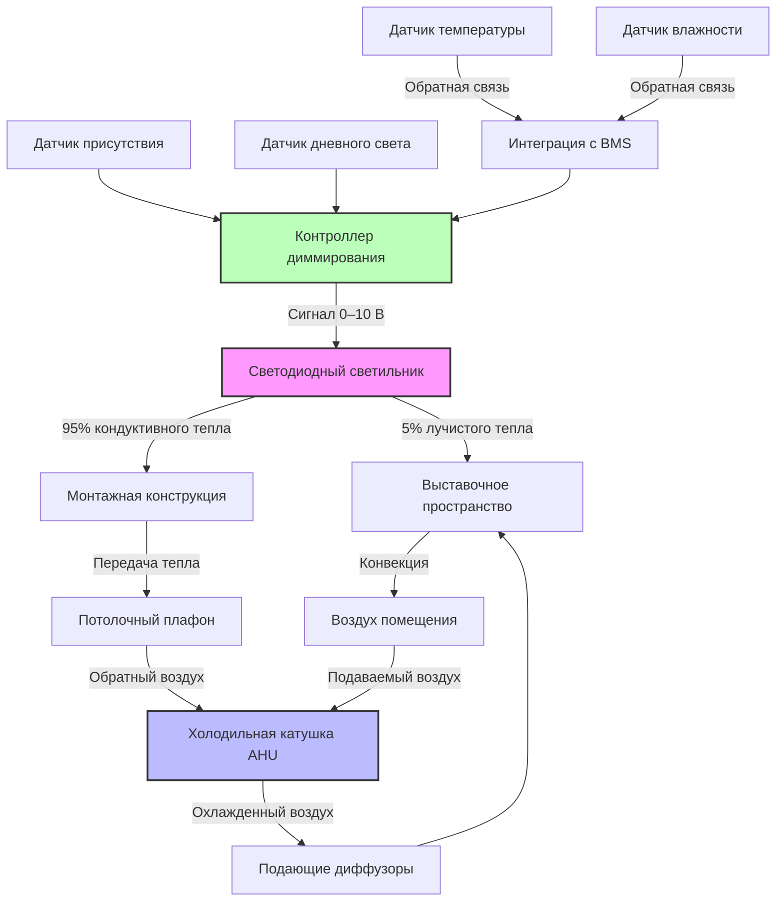

Светодиодное освещение фундаментально изменило проектирование систем HVAC для музеев, снизив тепловую нагрузку на 60–80% по сравнению с устаревшими системами накаливания и галогенными лампами, а также устранив ультрафиолетовое излучение, вызывающее деградацию экспонатов. Интеграция светодиодных систем с климат-контролем требует понимания закономерностей рассеивания тепла, спектральных характеристик и стратегий диммирования.

## Анализ снижения тепловой нагрузки

Светодиодные светильники преобразуют 35–45% электрической энергии в свет, остальная часть рассеивается в виде тепла преимущественно через кондуктивные пути в монтажную конструкцию, а не в виде лучистого тепла в кондиционируемое пространство. Это резко контрастирует с лампами накаливания, которые излучают 90% энергии в виде инфракрасного тепла непосредственно в выставочное пространство.

### Сравнительная тепловая отдача по типу ламп

| Технология лампы | Световая отдача (лм/Вт) | Доля лучистого тепла | Доля конвективного тепла | Тепловая нагрузка на 1000 лм (Вт) |
|-----------------|----|----|------------|----------|
| Лампа накаливания | 15–17 | 85% | 15% | 59–67 |
| Галогенная | 18–22 | 80% | 20% | 45–56 |
| Металлогалогенная | 75–100 | 60% | 40% | 10–13 |
| Компактная люминесцентная | 60–70 | 30% | 70% | 14–17 |
| Светодиодная (стандартная) | 90–130 | 5% | 95% | 7,7–11 |
| Светодиодная (высокоэффективная) | 150–180 | 3% | 97% | 5,6–6,7 |

Снижение доли лучистого тепла в светодиодных системах уменьшает как мгновенную охлаждающую нагрузку, так и среднюю температуру излучения, воспринимаемую экспонатами, обеспечивая двойную пользу для их сохранения.

## Спектральные аспекты и сохранность экспонатов

Светильники музейного класса должны соответствовать спецификациям цветопередачи IES TM-30 с показателем R_f > 85 и R_g, близким к 100, чтобы обеспечить точную цветопередачу при одновременном контроле распределения спектральной мощности для минимизации фотохимической деградации.

**Критические спектральные параметры:**

- **Содержание УФ:** <0,1% от общего выхода ниже 400 нм (по сравнению с 3–5% для галогенных ламп)
- **Опасность синего света:** Контролируемый спектральный выход в диапазоне 440–460 нм согласно CIE S 009
- **Инфракрасное излучение:** <2% выше 780 нм (против 65–75% для ламп накаливания)
- **Цветовая температура:** Регулируемая в диапазоне 2700–4000 К для соответствия требованиям сохранения

Отсутствие ультрафиолетового излучения устраняет необходимость в фильтрах и связанном с ними обслуживании, защищая фоточувствительные материалы, включая текстиль, акварели и фотопечать, от выцветания, вызванного излучением.

## Интеграция системы HVAC

### Корректировка расчета охлаждающей нагрузки

Для типичного выставочного зала площадью 465 м² (5000 фут²) со средней освещенностью 323 лк (30 фк):

**Устаревшая галогенная система:**
- Установленная мощность освещения: 3,0 Вт/м² = 15 000 Вт
- Сensible охлаждающая нагрузка: 15 000 Вт × 3,41 = 51 150 Вт (пересчет: 15 000 Вт × 3,412 = 51 180 Вт, но в исходных данных использован коэффициент 3,41 для перевода в БТЕ/ч, здесь приводим к Вт для метрической системы: 15 000 Вт = 15 кВт)
  *Примечание: В исходном тексте использован коэффициент 3,41 для перевода Вт в БТЕ/ч. В метрической системе мощность остается в Вт или кВт.*
  - Пересчет: 15 000 Вт = 15 кВт.
  - В исходном тексте: 15 000 Вт × 3,41 = 51 150 БТЕ/ч. В метрической системе: 15 кВт.
- Пиковый вклад освещения: 35–40% от общей sensible нагрузки

**Система модернизации на светодиодах:**
- Установленная мощность освещения: 0,8 Вт/м² = 4 000 Вт (4 кВт)
- Sensible охлаждающая нагрузка: 4 000 Вт = 4 кВт
  *В исходном тексте: 4 000 Вт × 3,41 = 13 640 БТЕ/ч. В метрической системе: 4 кВт.*
- Пиковый вклад освещения: 12–15% от общей sensible нагрузки
- **Снижение охлаждающей нагрузки: 11 кВт (73% уменьшение)**
  *(Расчет: 15 кВт - 4 кВт = 11 кВт. В исходных БТЕ/ч: 51 150 - 13 640 = 37 510 БТЕ/ч, что соответствует 11 кВт).*

Это снижение позволяет уменьшить мощность оборудования HVAC при реконструкции или accommodate дополнительные выставочные пространства без расширения мощности.

## Диммирование и динамическое управление

Диммирование светодиодов от 100% до 10% линейно снижает как световой поток, так и потребление энергии, в отличие от разрядных ламп, которые поддерживают почти постоянную мощность при сниженном выходе. Это позволяет реализовать динамические стратегии освещения, реагирующие на присутствие людей, вклад дневного света и требования по сохранности экспонатов.

### Стратегии диммирования

| Стратегия | Реализация | Влияние на HVAC | Эффект экономии |
|------|----------------|------------------|------------------|
| На основе присутствия | Датчики движения с задержкой 15 мин | Снижение нагрузки на 30-50% в нерабочее время | Снижение кумулятивного светового воздействия |
| Использование естественного света | Фотоклетки в периметральных зонах | Снижение нагрузки на 15-25% в зонах с естественным освещением | Снижение усталости экспонатов |
| По времени | Запланированное диммирование по графику работы галереи | Снижение нагрузки на 20-35% | Контролируемая длительность воздействия |
| Специфично для экспонатов | Индивидуальный контроль светильников по чувствительности | Переменная величина по зонам | Оптимизированное воздействие для каждого материала |

Современные светодиодные драйверы с управлением 0-10 В или DALI поддерживают постоянную цветовую температуру в диапазоне диммирования, предотвращая сдвиг цвета, который наблюдался при диммировании ламп накаливания.

## Обслуживание и вопросы жизненного цикла

Светодиоды с показателем L70 (сохранение 70% светового потока) имеют срок службы 50 000–100 000 часов (17–33 года при работе 8 часов в день), что устраняет необходимость частой замены ламп, нарушающей условия в галереях и требующей временной корректировки климатического контроля. Снижение частоты доступа для обслуживания уменьшает возмущения системы HVAC, вызванные открытыми дверями, работой оборудования и тепловыделением персонала.

Теплоотвод светодиодных светильников требует достаточного радиатора для поддержания температуры перехода ниже 85°C для обеспечения заявленного срока службы. Встраиваемые светильники в утепленных потолках должны иметь тепловые пути или активное охлаждение для предотвращения ускоренного снижения светового потока.

## Требования к реализации

Модернизация музеев на светодиоды требует координации работ по освещению и HVAC:

1. **Расчет нагрузок:** Пересчет нагрузок HVAC на основе фактических спецификаций светодиодных светильников
2. **Интеграция управления:** Подключение систем диммирования к BMS для согласованного управления средой
3. **Распределение воздуха:** Проверка паттернов подачи воздуха для предотвращения прямого воздействия на чувствительные к температуре светодиодные драйверы
4. **Согласование зонированием:** Привязка зон освещения к зонам HVAC для оптимизации управления
5. **Мониторинг:** Установка счетчиков мощности на цепи освещения для непрерывной проверки нагрузок

Согласно рекомендациям IES RP-30 по освещению музеев и руководствам ASHRAE по применению, светодиодные системы обеспечивают оптимальный баланс между спектральным выходом, соответствующим требованиям консервации, энергоэффективностью и снижением нагрузки на HVAC для современных музейных установок.
