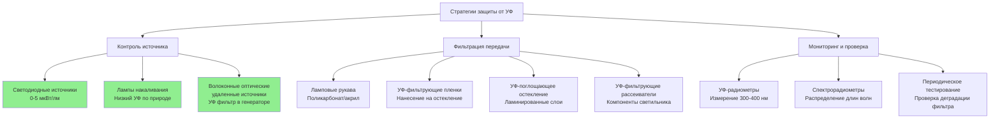

## УФ-излучение и повреждение коллекций

Ультрафиолетовое излучение в диапазоне длин волн 300-400 нм вызывает необратимые фотохимические повреждения музейных коллекций. УФ-энергия разрушает молекулярные связи в органических материалах, приводя к выцветанию, обесцвечиванию, хрупкости и структурной деградации. Поскольку УФ-повреждение является кумулятивным и необратимым, исключение УФ-излучения является основной стратегией защиты в сохранении коллекций.

Стандарты ASHRAE и руководства по консервации музеев рекомендуют полное исключение УФ-излучения ниже 400 нм для всех источников света в помещениях с коллекциями. Допустимое содержание УФ выражается в микроваттах на люмен (мкВт/лм), при этом стандарты консервации требуют значений ниже 75 мкВт/лм, а лучшая практика предполагает полное исключение, где это возможно.

## Характеристики длин волн УФ-излучения

УФ-излучение разделено на три диапазона по длине волны и энергии:

| УФ-диапазон | Диапазон длин волн | Уровень энергии | Потенциал повреждения | Распространенность источников |
|-------------|-------------------|-----------------|----------------------|-------------------------------|
| УФ-A | 315-400 нм | 3,10-3,94 эВ | Высокий | Дневной свет, люминесцентное, металлогалогенное |
| УФ-B | 280-315 нм | 3,94-4,43 эВ | Очень высокий | Дневной свет (в основном экранирован стеклом) |
| УФ-C | 100-280 нм | 4,43-12,4 эВ | Экстремальный | Только бактерицидные лампы |

УФ-A излучение представляет основную угрозу в музейной среде, поскольку проходит через обычное оконное стекло и испускается распространенными источниками света. УФ-B в основном блокируется зданием остекления, но требует внимания в приложениях со световыми люками.

## УФ-фильтрующие технологии

### УФ-поглощающие ламповые рукава

Рукава из поликарбоната и акрила, установленные над люминесцентными и компактными люминесцентными лампами, поглощают УФ-излучение при передаче видимого света. Эти рукава содержат УФ-поглощающие соединения, которые преобразуют УФ-фотоны в более длинные волны посредством фотолюминесценции.

**Характеристики производительности:**

- Снижение передачи УФ: 95-99% ниже 400 нм
- Передача видимого света: 88-92%
- Срок службы: 5-7 лет перед необходимостью замены
- Стабильность температуры: Подходит для рабочих температур ламп до 80°C
- Применение: Решение для модернизации существующих люминесцентных установок

Деградация рукава происходит путем фотолитического разложения УФ-поглощающих соединений. Периодическое спектрорадиометрическое тестирование проверяет продолжающуюся эффективность. Заменяйте рукава, когда передача УФ превышает 75 мкВт/лм или передача видимого света падает ниже 85% от начальных значений.

### УФ-фильтрующие пленки и остекление

Оконные пленки и специализированные системы остекления фильтруют УФ-излучение, проникающее через апертуры дневного освещения.

| Тип фильтра | Передача УФ <400нм | Передача видимого света | Долговечность | Применение |
|-------------|-------------------|-------------------------|---------------|-----------|
| Стандартное флоат-стекло | 45-60% | 88-90% | Постоянная | Базовое (неадекватное) |
| Ламинированное УФ-стекло | <1% | 85-88% | 25+ лет | Новое строительство, световые люки |
| Нанесенная УФ-пленка | 1-3% | 80-85% | 10-15 лет | Модернизация |
| Музейный акрил высокого качества | <1% | 92-94% | 20+ лет | Витрины, рамы |
| Низкожелезное УФ-стекло | <0,5% | 91-93% | 25+ лет | Премиум установки |

Ламинированное остекление включает УФ-поглощающие слои поливинилбутираля (ПВБ) между стеклянными слоями. Эти системы обеспечивают постоянную УФ-защиту без проблем деградации, связанных с нанесенными пленками.

Нанесенные пленки используют чувствительные к давлению клеи и УФ-поглощающие полимерные слои. Установка требует тщательной подготовки поверхности для предотвращения вздутия и расслоения. Пленки деградируют со временем через УФ-воздействие и требуют замены при повышении передачи УФ или снижении оптической прозрачности.

### Светодиодные источники с нулевым УФ

Современные светодиодные источники испускают пренебрежимо малое УФ-излучение благодаря своему механизму излучения твердого тела. Преобразование люминофора светодиода производит видимый свет без процессов плазменного разряда, которые генерируют УФ в люминесцентных и газоразрядных источниках.

**Характеристики УФ-излучения светодиодов:**

- УФ-содержание: 0-5 мкВт/лм (в сравнении с 75+ мкВт/лм для нефильтрованного люминесцентного)
- Спектральный предел: Минимальное излучение ниже 420 нм
- Долгосрочная стабильность: Нет увеличения УФ в течение срока службы
- Цветопередача: CRI 80-98 доступна с нулевым УФ
- Интеграция с HVAC: Снижение тепловой нагрузки охлаждения из-за сниженного радиационного тепла

Светодиодные источники исключают необходимость отдельных УФ-фильтрующих систем, упрощая конструкцию светильника и снижая техническое обслуживание. Отсутствие УФ-генерируемого озона также благоприятствует качеству воздуха в помещении в герметичных музейных помещениях, обслуживаемых системами HVAC.

### УФ-фильтрация в конструкции светильника

Полные сборки светильников включают УФ-фильтрацию посредством нескольких стратегий:

1. **Выбор источника:** Указывайте источники с внутренне низким УФ (светодиод, лампа накаливания, фильтрованное люминесцентное)
2. **Оптическая фильтрация:** Интегрируйте УФ-поглощающие рассеиватели и линзы в светопровод
3. **Герметичная оптика:** Предотвратите утечку УФ через зазоры в корпусе светильника
4. **Спектральная проверка:** Заводское тестирование подтверждает УФ-выход ниже предельных значений

Музейные светильники высокого качества сопровождаются отчетами спектрорадиометрического тестирования, документирующими УФ-излучение в диапазоне 300-700 нм. Укажите максимальное УФ-содержание 10 мкВт/лм для критического музейного освещения.

## Измерение и мониторинг УФ

Проверка эффективности УФ-фильтрации требует приборов, способных измерять излучение в диапазоне 300-400 нм независимо от выходной мощности видимого света.

**Протоколы измерения:**

- **Первоначальный ввод в эксплуатацию:** Спектрорадиометрическое обследование всех источников света, измеряющее УФ-содержание в мкВт/лм
- **Ежегодная проверка:** Выборочная проверка с использованием калиброванных УФ-радиометров на представительных светильниках
- **Триггеры замены фильтра:** Измерение УФ, превышающее 75 мкВт/лм или увеличение на 50% от базового
- **Документация:** Ведите журналы УФ-измерений как часть записей профилактического обслуживания

УФ-радиометры предоставляют прямое чтение УФ-облученности (мкВт/см²) на плоскости измерения. Преобразуйте в мкВт/лм путем деления УФ-облученности на освещенность (люкс) и умножения на 1000.

**Рассмотрения при измерении:**

- Расположите датчик на плоскости объекта, где расположены коллекции
- Учитывайте отраженный УФ от поверхностей и витрин
- Измеряйте в рабочих условиях с работающими системами HVAC
- Темнадаптируйте прибор перед измерениями в низколюминесцентных галереях

## Интеграция с системами HVAC

Стратегии УФ-фильтрации влияют на расчеты тепловой нагрузки охлаждения HVAC и параметры качества воздуха:

**Термические соображения:**

- Рукава люминесцентных ламп снижают радиационное тепло на 3-5% через повышенное поглощение в светопроводе
- Преобразование светодиода снижает тепловую нагрузку охлаждения на 40-60% в сравнении с фильтрованными люминесцентными источниками
- УФ-фильтрующее остекление может увеличить солнечную теплоприток, если передача видимого света снижена

**Взаимодействие качества воздуха:**

- УФ-излучение от нефильтрованных люминесцентных источников генерирует озон (O₃) через фотолиз кислорода
- Полная УФ-фильтрация исключает генерацию озона, снижая требования к вентиляции
- Конструкции герметичных светильников предотвращают накопление частиц на УФ-фильтрующих компонентах

Рассчитайте снижение чувствительной охлаждающей нагрузки при переходе от люминесцентных источников к светодиодам, используя:

**Q = (P_люм - P_светодиод) × 1,055 × BF**

Где:
- Q = снижение чувствительной охлаждающей нагрузки (кДж/ч)
- P_люм = мощность люминесцентной системы (кВт)
- P_светодиод = мощность системы светодиода (кВт)
- BF = коэффициент балласта с учетом тепла в кондиционируемое помещение (0,8-1,0)

Исключение УФ-излучения обеспечивает точное управление окружающей средой в помещениях с коллекциями путем удаления переменного фотохимического стрессора, который взаимодействует с температурой и относительной влажностью при ускорении механизмов деградации.
