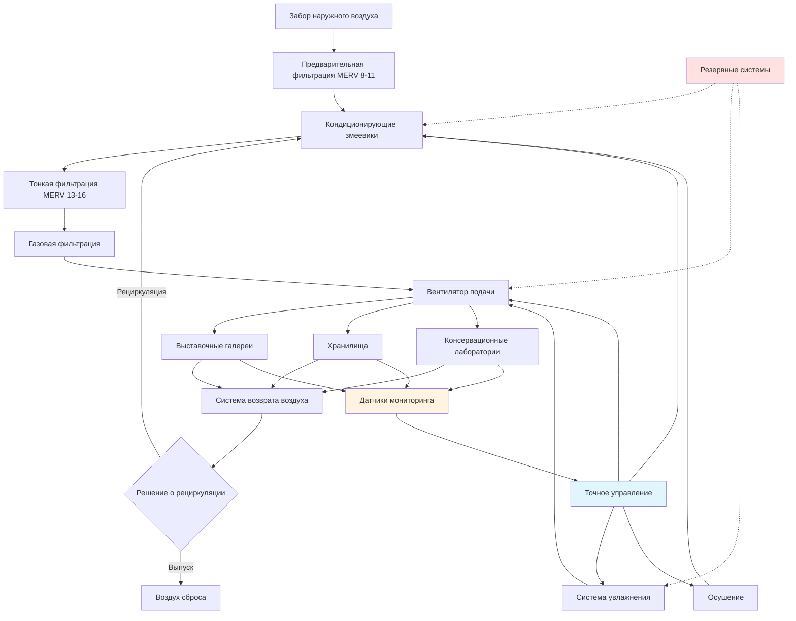

Системы HVAC музеев сталкиваются с уникальной задачей одновременного сохранения бесценных артефактов и поддержания комфорта посетителей. Эти требования предполагают точный контроль окружающей среды, высокое качество воздуха и операционные стратегии, которые уравновешивают конкурирующие потребности в разные сезоны и при различных уровнях посещаемости.

## Целевые значения температуры и влажности

Музеи требуют строгого контроля окружающей среды для предотвращения деградации коллекций. Справочник ASHRAE для музеев устанавливает целевые значения конкретных классов в зависимости от чувствительности коллекции и возможностей учреждения.

**Стандартные уставки температуры:**
- **Класс AA (Точный контроль):** $21°C \pm 1°C$
- **Класс A (Точный контроль):** $21°C \pm 2,8°C$
- **Класс B (Предотвращение влажности):** $15,5-24°C$
- **Класс C (Предотвращение замерзания):** $>2°C$

**Требования к относительной влажности:**
- **Класс AA:** $50\% \pm 5\%$ RH
- **Класс A:** $50\% \pm 10\%$ RH
- **Класс B:** $25-75\%$ RH
- **Класс C:** $<75\%$ RH

Скорость изменения столь же важна, как и абсолютные значения. Резкие колебания вызывают изменения размеров гигроскопичных материалов, что приводит к растрескиванию, короблению и отслоению. Максимальные рекомендуемые скорости изменения:

$$\frac{dT}{dt} \leq 1,1°C/ч, \quad \frac{dRH}{dt} \leq 5\%/ч$$

Стратегии сезонного дрейфа позволяют постепенные переходы между зимними и летними уставками, снижая потребление энергии при поддержании стабильных краткосрочных условий. Этот подход признает, что медленные сезонные изменения вызывают меньше повреждений, чем быстрые суточные колебания.

## Стандарты контроля окружающей среды в музеях

| Тип коллекции | Температура | Относительная влажность | Воздухообмены/час | Фильтрация |
|----------------|-------------|-------------------|------------------|------------|
| Общие коллекции | $20-22°C$ | $45-55\%$ | $8-12$ | MERV 13-16 |
| Живопись/Холст | $20-22°C$ | $45-55\%$ | $10-15$ | MERV 16 + Газ |
| Бумага/Фотографии | $18-21°C$ | $30-50\%$ | $8-12$ | MERV 16 + Газ |
| Текстиль/Ткани | $18-21°C$ | $45-55\%$ | $10-15$ | MERV 16 |
| Металлы | $20-22°C$ | $30-40\%$ | $6-10$ | MERV 13 + Газ |
| Органические материалы | $15-18°C$ | $45-55\%$ | $10-15$ | MERV 16 + Газ |
| Смешанные коллекции | $20-22°C$ | $45-55\%$ | $10-15$ | MERV 16 + Газ |

## Требования к качеству воздуха

Музеи требуют исключительного качества воздуха для предотвращения химической деградации, загрязнения частицами и роста микроорганизмов.

**Фильтрация частиц:**
- Минимум MERV 13 для общественных помещений
- MERV 16 для чувствительных коллекций
- Фильтрация HEPA (99,97% при 0,3 мкм) для редких предметов

**Контроль газового загрязнения:**
- Активированный уголь для органических соединений
- Перманганат калия для окисляющих газов
- Специальные материалы для диоксида серы и оксидов азота

**Целевые уровни загрязняющих веществ:**
- PM2.5: $<15$ мкг/м³
- Озон: $<2$ ppb
- Диоксид серы: $<1$ ppb
- Диоксид азота: $<10$ ppb
- Летучие органические соединения: $<200$ мкг/м³

Места забора наружного воздуха требуют тщательного рассмотрения, чтобы избежать выхлопных газов транспортных средств, промышленных выбросов и пыли от строительства. Предварительные стадии фильтрации защищают финальные фильтры и продлевают срок их службы.

## Комфорт посетителей и сохранение коллекций

Музеи должны уравновешивать тепловой комфорт посетителей и оптимальные условия сохранения. Это создает операционные сложности:

**Конкурирующие требования:**
- Посетители предпочитают $22-24°C$; коллекциям требуется $20-22°C$
- Активные посетители генерируют чувствительное тепло: $Q_s = 71$ кДж/ч на человека
- Скрытое тепло от дыхания: $Q_l = 57$ кДж/ч на человека
- Высокая посещаемость временно повышает температуру и влажность

**Стратегии уравновешивания:**
- Отдельно зонировать выставочные помещения от хранилищ
- Предусмотреть локализованное отопление/охлаждение в зонах с высокой посещаемостью
- Использовать стратегическое распределение воздуха для поддержания микроклимата коллекций
- Планировать техническое обслуживание в периоды низкой посещаемости
- Информировать посетителей о требованиях к сохранению

Рассчитайте влияние теплонагрузки посетителей:

$$Q_{total} = n \times (Q_s + Q_l) = n \times 128 \text{ кДж/ч}$$

Для $n = 100$ посетителей: $Q_{total} = 12,8$ МДж/ч (3,75 кВт охлаждения)

## Обзор систем HVAC музеев

## Энергетические соображения

Стандарты контроля окружающей среды в музеях потребляют значительную энергию. Стратегии для повышения эффективности без ущерба для сохранения:

**Оптимизация системы:**
- Приводы переменной скорости на вентиляторы и насосы
- Рекуперация тепла из потоков выпускного воздуха
- Вентиляция по требованию в зонах без коллекций
- Аккумулирование тепловой энергии для сдвига пиков
- Циклы экономайзера при благоприятных наружных условиях

**Конструкция здания:**
- Высокоэффективная теплоизоляция (R-5,3 стены, R-8,8 кровля)
- Остекление Low-E с фильтрацией УФ
- Пароизоляция и герметизация воздуха
- Тепловая масса для буферизации колебаний

**Выбор оборудования:**
- Высокоэффективные чиллеры (COP > 6,0)
- Конденсационные котлы (>95% эффективности)
- Осушение с использованием адсорбентов для контроля влажности
- Вентиляторы с рекуперацией энергии (ERV) с коэффициентом полезного действия 70-80%

Интенсивность потребления энергии в музеях обычно составляет $215-430$ кДж/м²/год, причем точный климатический контроль представляет 40-60% от общего потребления.

## Стратегии сезонной работы

Сезонный дрейф позволяет постепенные изменения окружающей среды, которые снижают энергию при поддержании стандартов сохранения:

**Зимняя стратегия:**
- Снизить уставку до $18-20°C$
- Позволить дрейф влажности до $40-45\%$
- Минимизировать наружный воздух для снижения нагрузки отопления
- Эффективно увлажнять, используя паровые или испарительные системы

**Летняя стратегия:**
- Увеличить уставку до $21-22°C$
- Позволить дрейф влажности до $50-55\%$
- Максимизировать часы работы экономайзера
- Осушать, используя охлаждающие змеевики или адсорбентные системы

**Переходные периоды:**
- Реализовать постепенные изменения уставки ($<1,1°C$/неделя)
- Мониторить реакцию коллекции
- Корректировать на основе гигротермического поведения здания
- Координировать с персоналом по консервации

Этот сезонный подход может снизить потребление энергии HVAC на 20-35% при сохранении условий класса A или B. Ключевой принцип: краткосрочная стабильность важнее круглогодичной однородности.

**Понижение уставок в незанятые периоды:**
Музеи могут реализовать ограниченное понижение уставок во время продолжительного закрытия, но должны поддерживать условия сохранения. Типовые ночные/выходные стратегии снижают время работы вентилятора, а не температуру, экономя 10-15% энергии без риска для коллекций.

Справочник ASHRAE для музеев подчеркивает, что спецификации окружающей среды должны соответствовать ресурсам учреждения, уязвимости коллекции и толерантности к риску, а не преследовать максимальную точность независимо от затрат или выгоды.
