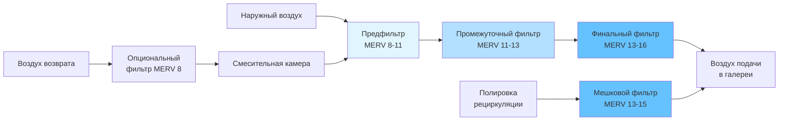

Музейные коллекции требуют превосходной фильтрации твёрдых частиц для предотвращения накопления пыли, сажи, пыльцы и мелких частиц, вызывающих необратимое повреждение экспонатов. Фильтры MERV 13-16 обеспечивают высокоэффективное удаление, необходимое для поддержания безупречных условий окружающей среды для чувствительных материалов, включая картины, текстиль, бумагу и металлические предметы.

## Производительность фильтров MERV 13-16

Эффективность фильтрации фильтров MERV 13-16 значительно варьируется в зависимости от размера частиц. Рейтинги MERV определяют минимальную эффективность удаления по трём диапазонам размеров частиц:

**Производительность MERV 13:**
- Частицы 0,3-1,0 мкм: $E_1 \geq 50\%$ минимальная эффективность
- Частицы 1,0-3,0 мкм: $E_2 \geq 85\%$ минимальная эффективность
- Частицы 3,0-10,0 мкм: $E_3 \geq 90\%$ минимальная эффективность

**Производительность MERV 14:**
- Частицы 0,3-1,0 мкм: $E_1 \geq 75\%$ минимальная эффективность
- Частицы 1,0-3,0 мкм: $E_2 \geq 90\%$ минимальная эффективность
- Частицы 3,0-10,0 мкм: $E_3 \geq 90\%$ минимальная эффективность

**Производительность MERV 15-16:**
- Частицы 0,3-1,0 мкм: $E_1 \geq 95\%$ (MERV 16)
- Частицы 1,0-3,0 мкм: $E_2 \geq 95\%$
- Частицы 3,0-10,0 мкм: $E_3 \geq 95\%$

Среднюю эффективность фильтрации в течение срока службы фильтра можно рассчитать по формуле:

$$E_{avg} = \frac{1}{t_f} \int_0^{t_f} E(t) \, dt$$

где $E(t)$ представляет эффективность, зависящую от времени, а $t_f$ — общий срок службы фильтра.

## Требования по удалению частиц по размерам

Фильтрация в музеях нацелена на конкретные диапазоны размеров частиц на основе механизмов повреждения:

**Критические диапазоны размеров частиц:**
- **0,1-1,0 мкм:** Частицы сгорания, сажа, выхлопные газы дизеля — глубоко проникают в пористые материалы
- **1,0-3,0 мкм:** Вторичные аэрозоли, мелкая пыль — медленно оседают, накапливаются на вертикальных поверхностях
- **3,0-10,0 мкм:** Грубая пыль, пыльца, волокна текстиля — видимое загрязнение, абразивное повреждение
- **>10,0 мкм:** Крупные частицы обычно задерживаются предфильтрами

Скорость осаждения частиц на поверхностях коллекций следует формуле:

$$v_d = \frac{C \cdot D}{H} \left( Sc^{-2/3} + 10^{-3/St} \right)$$

где $C$ — концентрация частиц, $D$ — коэффициент диффузии, $H$ — характерная высота, $Sc$ — число Шмидта, $St$ — число Стокса. Фильтры MERV 13-16 снижают $C$ на 85-95% для частиц, наиболее вероятно осаждающихся на экспонатах.

## Конфигурация многоступенчатой фильтрации для музеев

## Многоступенчатая фильтрация

Системы HVAC музеев используют поэтапную фильтрацию для оптимизации удаления частиц при управлении перепадом давления и сроком службы фильтра:

**Ступень 1 — Предфильтрация (MERV 8-11):**
- Удаляет крупные частицы >3,0 мкм
- Защищает фильтры нижних ступеней от быстрого засорения
- Типовая эффективность: 70-85% на частицах 3-10 мкм
- Начальный перепад давления: 0,4-0,6 см вд. ст.

**Ступень 2 — Промежуточная фильтрация (MERV 11-13):**
- Захватывает частицы среднего размера 1-10 мкм
- Продлевает срок службы финального фильтра
- Эффективность: 80-90% на частицах 1-3 мкм
- Начальный перепад давления: 0,6-1,0 см вд. ст.

**Ступень 3 — Финальная фильтрация (MERV 13-16):**
- Высокоэффективное удаление мелких частиц 0,3-10 мкм
- Основная защита коллекций
- Конструкция мешкового или жёсткого коробчатого фильтра
- Начальный перепад давления: 1,0-2,0 см вд. ст.

Общий перепад давления во всех ступенях:

$$\Delta P_{total} = \Delta P_1 + \Delta P_2 + \Delta P_3 = \sum_{i=1}^{n} \Delta P_i$$

Типовое начальное значение: 2,0-3,8 см вд. ст., финальное значение при замене: 5,1-7,6 см вд. ст.

## Управление перепадом давления

Перепад давления увеличивается по мере засорения фильтров твёрдыми частицами. Соотношение следует формуле:

$$\Delta P(t) = \Delta P_0 + k \cdot m_p(t)$$

где $\Delta P_0$ — начальный перепад давления чистого фильтра, $k$ — коэффициент загрузки, $m_p(t)$ — накопленная масса частиц.

**Стратегии управления:**

1. **Мониторинг дифференциального давления:** Установите датчики давления на каждую батарею фильтра, сигнализация при 5,1-6,4 см вд. ст. для фильтров MERV 13-16
2. **Выбор вентилятора:** Размер вентилятора на 6,4-7,6 см вд. ст. общего статического давления для размещения загруженных фильтров
3. **Приводы с переменной скоростью:** Поддерживайте постоянный расход воздуха при увеличении перепада давления, снижая энергопотребление при чистых фильтрах
4. **Конструкция батареи фильтра:** Используйте глубокогофрированные или мешковые фильтры с высокой пыленакопительной способностью (9,1-13,6 кг для мешкового фильтра 610×610×305 мм)

Энергетический штраф от перепада давления:

$$P_{fan} = \frac{Q \cdot \Delta P}{6356 \cdot \eta_{fan}}$$

где $P_{fan}$ — мощность вентилятора (л. с.), $Q$ — расход воздуха (CFM), $\Delta P$ — перепад давления (см вд. ст.), $\eta_{fan}$ — КПД вентилятора.

## График замены фильтров

| Ступень фильтра | Рейтинг MERV | Типовой срок службы | Критерии замены |
|-----------------|--------------|-------------------|-----------------|
| Предфильтр | MERV 8-11 | 3-6 месяцев | 2,5-3,8 см вд. ст. ΔP |
| Промежуточный | MERV 11-13 | 6-12 месяцев | 3,8-5,1 см вд. ст. ΔP |
| Финальный фильтр | MERV 13-14 | 12-18 месяцев | 5,1-6,4 см вд. ст. ΔP |
| Премиум финальный | MERV 15-16 | 18-24 месяцев | 5,1-7,6 см вд. ст. ΔP |

Срок службы варьируется в зависимости от качества наружного воздуха, процента наружного воздуха и часов работы. Городские локации с высокой концентрацией частиц требуют более частой замены. Постоянный мониторинг перепада давления обеспечивает оптимальное время замены.

**Протокол замены:**
1. Запланируйте замену во время закрытия музея для минимизации воздействия на посетителей
2. Изолируйте затронутые зоны временными барьерами
3. Упакуйте фильтры при демонтаже для предотвращения повторного перемешивания
4. Очистите корпуса фильтров перед установкой новых фильтров
5. Проверьте целостность батареи фильтра тестированием на герметичность (DOP-тест для MERV 15-16)
6. Задокументируйте рейтинги эффективности фильтров и даты установки

## Рейтинги MERV и приложения в музеях

| Рейтинг MERV | Эффективность удаления частиц | Приложение в музее | Типовой тип фильтра |
|--------------|-------------------------------|-------------------|-------------------|
| MERV 13 | 50-75% при 0,3-1,0 мкм ≥85% при 1,0-10 мкм | Стандартные галереи Общие коллекции | Гофрированная панель Мешковой фильтр |
| MERV 14 | 75-85% при 0,3-1,0 мкм ≥90% при 1,0-10 мкм | Усиленная защита Смешанные коллекции | Глубокогофрированный мешок Жёсткий короб |
| MERV 15 | 85-95% при 0,3-1,0 мкм ≥95% при 1,0-10 мкм | Премиум коллекции Бумага, текстиль | Мешковой фильтр Жёсткий короб |
| MERV 16 | ≥95% при 0,3-1,0 мкм ≥95% при 1,0-10 мкм | Архивы, редкие книги Чувствительные металлы | Жёсткий короб Компактный фильтр |

## Защита коллекций от загрязнения

Фильтрация твёрдых частиц предотвращает три основных механизма повреждения:

**1. Обезображивающее загрязнение:**
Поверхностное осаждение мелких частиц создаёт видимый налёт на картинах, скульптурах и витринах. Скорость загрязнения пропорциональна концентрации частиц:

$$\frac{dm_{soil}}{dt} = v_d \cdot C \cdot A$$

где $m_{soil}$ — отложенная масса, $v_d$ — скорость осаждения, $C$ — концентрация частиц, $A$ — площадь поверхности. Фильтрация MERV 13-16 снижает $C$ на 85-95%, пропорционально снижая скорость загрязнения.

**2. Абразивное повреждение:**
Твёрдые частицы (кремнезём, оксиды металлов), встроенные в волокна текстиля или поверхности бумаги, вызывают механический износ при обращении. Высокоэффективная фильтрация удаляет эти частицы до осаждения.

**3. Химическое разложение:**
Углеродистые частицы (сажа, дизельные выхлопы) содержат кислотные соединения и каталитические металлы, ускоряющие разложение органических материалов. Частицы в диапазоне 0,1-1,0 мкм проникают в пористые материалы наиболее эффективно. Фильтры MERV 15-16 захватывают 85-95% этих субмикронных частиц.

**Эффективность защиты:**

Доля проникновения частиц через систему фильтрации составляет:

$$P = (1 - E_1)(1 - E_2)(1 - E_3)$$

Для трёхступенчатой системы с предфильтром MERV 11 (85%), промежуточным фильтром MERV 13 (90%) и финальным фильтром MERV 15 (95%):

$$P = (1 - 0,85)(1 - 0,90)(1 - 0,95) = 0,15 \times 0,10 \times 0,05 = 0,00075$$

Эта конфигурация достигает общего удаления частиц 99,925%, снижая скорости загрязнения и деградации коллекций до незначительных уровней по сравнению с нефильтрованным воздухом.

Музеи, работающие с фильтрацией MERV 13-16 при надлежащем техническом обслуживании, демонстрируют улучшение чистоты поверхностей экспонатов в 10-20 раз по сравнению со стандартной коммерческой фильтрацией MERV 8, непосредственно продлевая долговечность коллекций и снижая необходимость консервационных мероприятий.
