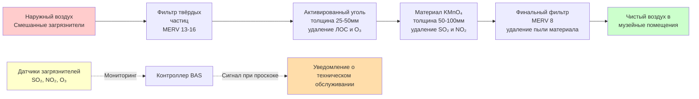

## Обзор

Системы газофазной очистки защищают музейные коллекции от атмосферных загрязнителей, вызывающих необратимую химическую деградацию. В то время как фильтрация твердых частиц удаляет твердые загрязнители, газофазная очистка устраняет молекулярные загрязнители, которые вступают в реакцию с материалами коллекции, вызывая коррозию, обесцвечивание и охрупчивание.

## Угрозы загрязнителей для коллекций

### Первичные газовые загрязнители

Наружный воздух и внутренние источники вносят несколько вредных загрязнителей:

**Диоксид серы (SO₂)**
- Источник: сжигание ископаемого топлива, промышленные выбросы
- Воздействие: подкисляет гигроскопичные материалы, вызывает коррозию металлов, ослабляет бумагу
- Механизм: образует серную кислоту в присутствии влаги
- Целевой уровень: <2 мкг/м³ для чувствительных коллекций

**Диоксид азота (NO₂)**
- Источник: выбросы автомобилей, процессы сгорания
- Воздействие: окисляет органические красители, выцветают ткани и картины
- Механизм: фотохимические окислительные реакции
- Целевой уровень: <10 мкг/м³

**Озон (O₃)**
- Источник: фотохимический смог, электронное оборудование
- Воздействие: трещины на резине, выцветание красителей, повреждение фотографий
- Механизм: сильный окислитель атакует двойные связи
- Целевой уровень: <2 мкг/м³

**Летучие органические соединения (ЛОС)**
- Источник: строительные материалы, изделия из дерева, посетители
- Воздействие: кислотная деградация объектов на основе свинца
- Распространённые соединения: муравьиная кислота, уксусная кислота, формальдегид
- Целевой уровень: <100 мкг/м³ всего ЛОС

| Загрязнитель | Источник | Первичный ущерб | Уязвимые материалы | Целевая концентрация |
|-----------|--------|----------------|---------------------|---------------------|
| SO₂ | Сгорание | Подкисление | Бумага, кожа, камень | <2 мкг/м³ |
| NO₂ | Автомобили | Окисление | Ткани, красители, картины | <10 мкг/м³ |
| O₃ | Фотохимический | Растрескивание, выцветание | Резина, фотографии | <2 мкг/м³ |
| Уксусная кислота | Испарение дерева | Коррозия | Свинец, цинк, известковые материалы | <50 мкг/м³ |
| Формальдегид | Строительные материалы | Сшивание | Белки, палеонтологические образцы | <10 мкг/м³ |

## Технологии газофазной очистки

### Фильтрация активированным углём

Активированный уголь удаляет загрязнители путём адсорбции на сыпучий материал с высокой удельной поверхностью.

**Физические свойства**
- Удельная поверхность: 800-1200 м²/г
- Структура пор: микропоры (< 2 нм) и мезопоры (2-50 нм)
- Типичная толщина: 25-50 мм
- Поверхностная скорость: 1,5-2,5 м/с

**Механизмы удаления**
- Силы Ван-дер-Ваальса притягивают полярные молекулы
- Капиллярная конденсация в микропорах
- Химическое притяжение для определённых соединений
- Эффективен для: ЛОС, озона, запахов

**Прогнозирование производительности**

Уравнение Уилера-Йонаса прогнозирует время до проскока:

$$t_b = \frac{W_e \cdot W}{C_0 \cdot Q} - \frac{\rho_b \cdot W \cdot k_v}{C_0 \cdot Q} \ln\left(\frac{C_0 - C_b}{C_b}\right)$$

Где:
- $t_b$ = время до проскока (мин)
- $W_e$ = ёмкость адсорбции (г загрязнителя/г угля)
- $W$ = масса угля (г)
- $C_0$ = входная концентрация (г/м³)
- $Q$ = расход воздуха (м³/мин)
- $\rho_b$ = объёмная плотность слоя (г/м³)
- $k_v$ = коэффициент скорости адсорбции (мин⁻¹)
- $C_b$ = концентрация при проскоке (г/м³)

### Материалы с перманганатом калия

Хемосорбентные материалы химически реагируют с загрязнителями для их полного разрушения.

**Химические реакции**

Перманганат калия (KMnO₄) окисляет восстановленные соединения серы и азота:

$$\text{H}_2\text{S} + \text{KMnO}_4 → \text{K}_2\text{SO}_4 + \text{MnO}_2 + \text{H}_2\text{O}$$

$$\text{SO}_2 + 2\text{KMnO}_4 → \text{K}_2\text{SO}_4 + 2\text{MnO}_2$$

**Характеристики применения**
- Основа: гранулы оксида алюминия, пропитанные 4-6% KMnO₄
- Толщина: 50-100 мм
- Поверхностная скорость: 1,3-2,0 м/с
- Эффективен для: SO₂, H₂S, NO₂, формальдегида
- Необратимая реакция предотвращает повторное выделение

**Индикатор изменения цвета**
- Свежий материал: фиолетовый/коричневый
- Исчерпанный материал: тёмно-коричневый/чёрный
- Визуальное указание на необходимость замены

### Выбор фильтрующего материала по угрозе

**Приложения с одним загрязнителем**
- SO₂ доминирует: перманганат калия первичный
- ЛОС доминируют: активированный уголь первичный
- Смешанные окислители: слоистый подход

**Конфигурация с множественными угрозами**

Типичная музейная установка использует последовательное расположение:

1. **Предварительный фильтр твёрдых частиц**: MERV 13-16 удаляет частицы
2. **Активированный уголь**: толщина 25-50 мм для ЛОС и озона
3. **Хемосорбент**: толщина 50-100 мм KMnO₄ для кислых газов
4. **Финальный фильтр твёрдых частиц**: MERV 8 предотвращает выделение частиц из материала

## Мониторинг газовых загрязнителей

### Стратегии непрерывного мониторинга

**Сравнение входной и выходной концентраций**
- Установите датчики до и после банков материала
- Расчёт эффективности: $\eta = \frac{C_{in} - C_{out}}{C_{in}} \times 100\%$
- Снижающаяся эффективность указывает на насыщение материала
- Типичный порог замены: эффективность < 80%

**Датчики критичных загрязнителей**
- Электрохимические датчики: SO₂, NO₂ (диапазон: 0-200 мкг/м³)
- УФ-фотометрический: O₃ (диапазон: 0-100 мкг/м³)
- Детектор фото-ионизации (PID): всего ЛОС
- Частота калибровки: ежеквартально для критичных приложений

**Пассивный мониторинг**

Диффузионные значки обеспечивают средневзвешенные по времени концентрации:
- Период развёртывания: 2-4 недели
- Лабораторный анализ определяет накопленные загрязнители
- Более экономичная альтернатива непрерывному мониторингу
- Расположение: галереи и внутри витрин

### Интеграция с автоматизацией зданий

Отслеживайте эффективность газофазной очистки через BAS:
- Перепад давления через банки материала
- Отношение входной к выходной концентрации
- Рассчитанный оставшийся срок службы материала на основе интегрального расхода
- Автоматические уведомления о техническом обслуживании

## Графики технического обслуживания и замены

### Прогнозирование срока службы

Долговечность материала зависит от нагрузки загрязнителя:

$$\text{Срок службы (дни)} = \frac{W_e \times m_{\text{material}}}{C_{\text{avg}} \times Q \times 1440}$$

Где:
- $W_e$ = ёмкость адсорбции (г/г)
- $m_{\text{material}}$ = масса материала (г)
- $C_{\text{avg}}$ = средняя концентрация загрязнителя (г/м³)
- $Q$ = расход воздуха (м³/мин)

**Типичные интервалы обслуживания**

| Тип материала | Городская местность | Пригородная местность | Сельская местность |
|------------|----------------|-------------------|----------------|
| Активированный уголь (ЛОС) | 12-18 месяцев | 18-24 месяца | 24-36 месяцев |
| KMnO₄ (Кислые газы) | 6-12 месяцев | 12-18 месяцев | 18-24 месяца |
| Комбинированные панели | 12 месяцев | 18 месяцев | 24 месяца |

### Индикаторы конца срока службы

**Сигналы исчерпания ресурса**
- Показания датчиков показывают потерю эффективности >20%
- Изменение цвета KMnO₄ на тёмно-коричневый/чёрный на >50% глубины
- Накопленный перепад давления >125 Па
- Проскок запаха в занятых помещениях
- Плановая замена на основе интегрального расхода

**Процедура замены**
1. Изолируйте банк материала с помощью изолирующих демпферов
2. Упакуйте отработанный материал как потенциально опасные отходы
3. Пропылесосьте корпус для удаления остаточной пыли
4. Установите свежий материал с правильной ориентацией
5. Убедитесь в отсутствии обхода вокруг рамок материала
6. Перезагрузите базовые линии системы мониторинга
7. Задокументируйте дату замены и спецификации материала

### Тестирование гарантии качества

**Проверка после установки**
- Испытание под нагрузкой с известной концентрацией целевого загрязнителя
- Измерьте выходную концентрацию для проверки эффективности удаления
- Проведите тест герметичности с дымом или газом-индикатором
- Допустимая утечка: <1% при расчётном расходе

**Периодическое тестирование производительности**
- Ежегодное испытание эффективности с использованием портативных датчиков
- Ежеквартальный визуальный осмотр на обесцвечивание материала
- Ежемесячный мониторинг тренда перепада давления
- Немедленное исследование при изменении перепада давления >25%

## Соображения при проектировании

**Распределение воздушного потока**
- Равномерная поверхностная скорость через материал предотвращает каналирование
- Глубина камеры >300 мм в верхней части материала
- Перфорированные распределительные пластины для больших установок
- Максимальное изменение скорости: ±20% по фасаду

**Требования безопасности**
- Перманганат калия — окислитель (опасность возгорания при загрязнении)
- Храните сменный материал отдельно от горючих веществ
- Утилизация может требоваться как опасные отходы
- Паспорта безопасности материала (MSDS) должны быть на месте

**Экономический анализ**

Сравните стоимость газофазной очистки с риском повреждения коллекции:
- Стоимость материала: 150-400 р./м² (€15-€40/м²) в год
- Консервационная обработка: 500-5000 евро за объект
- Защита неоценимого артефакта: бесценна
- Период окупаемости: немедленный для коллекций высокой стоимости

Инвестиция в комплексную газофазную очистку представляет собой важнейшую защиту неоценимого культурного наследия, предотвращая ущерб, который никакое количество консервационных усилий не может полностью устранить.
