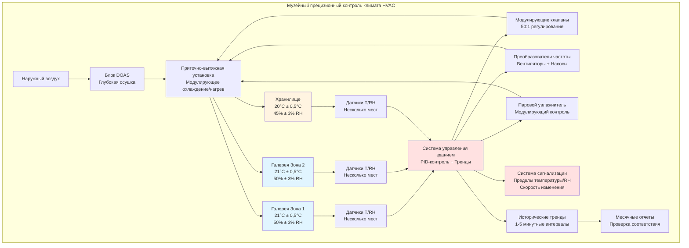

Музейные коллекции требуют точности контроля окружающей среды, намного превосходящей стандартные требования HVAC зданий. Колебания температуры и влажности вызывают изменения размеров гигроскопичных материалов, конденсацию на поверхностях, химическую деградацию и биологический рост. Системы прецизионного контроля поддерживают стабильные условия в узких допусках для обеспечения долгосрочного сохранения уникальных артефактов.

## Требования к контролю температуры

Контроль температуры в музеях требует стабильности ±0,5°C вокруг уставок в диапазоне 20-22°C в зависимости от типа коллекции. Эта точность предотвращает циклы теплового расширения и сжатия, которые напряжают материалы с различными коэффициентами теплового расширения.

**Расчет стабильности температуры:**

Допустимое отклонение температуры выражается как:

$$T_{фактическая} = T_{уставка} \pm 0,5°C$$

Для уставки 21°C приемлемый диапазон составляет 20,5-21,5°C.

Системы контроля, достигающие такой стабильности, требуют:

- **Модулирующие регулирующие клапаны** с высокими коэффициентами регулирования (минимум 50:1)
- **Насосы и вентиляторы с переменной скоростью** обеспечивающие непрерывную модуляцию мощности
- **Несколько ступеней нагрева/охлаждения** для избежания больших скачков
- **Алгоритмы упреждающего контроля** реагирующие на изменения нагрузки до того, как условия изменятся
- **Распределенные датчики** усредняющие пространственные вариации температуры

Переустановка температуры подаваемого воздуха в зависимости от нагрузки в помещении предотвращает чрезмерное охлаждение с последующим перегревом, что вводит нестабильность контроля. Соотношение переустановки:

$$T_{подача} = T_{уставка} - \frac{Q_{пространство}}{\dot{m} \cdot c_p}$$

где $Q_{пространство}$ — нагрузка охлаждения помещения, $\dot{m}$ — расход воздуха по массе, и $c_p$ — удельная теплоемкость воздуха.

## Требования к контролю влажности

Допуски контроля относительной влажности ±3% (Класс AA) до ±5% (Класс A) предотвращают ухудшение, вызванное влагой. Плотный контроль влажности критичен, потому что относительная влажность влияет на содержание воды в гигроскопичных материалах в соответствии с изотермами сорбции, специфичными для каждого материала.

**Методы контроля влажности:**

1. **Системы приточного воздуха (DOAS)** с глубокой осушкой, охлаждающие наружный воздух до точки росы 7-9°C
2. **Осушка с использованием десиканта** для применений, требующих точек росы ниже 4°C
3. **Паровое увлажнение** с распределенным впрыском для равномерного распределения
4. **Пропорционально-интегрально-дифференциальный (PID) контроль** с узкими полосами пропорциональности

Уравнение баланса влаги для влажности в помещении:

$$\frac{dm_{вода}}{dt} = \dot{m}_{увлажн} - \dot{m}_{осушка} + \dot{m}_{внутренние} + \dot{m}_{инфильтрация}$$

Системы контроля модулируют увлажнение и осушку для поддержания равновесия на уставке.

## Ограничения скорости изменения

Быстрые изменения окружающей среды вызывают больший стресс материалов, чем абсолютные условия. Ограничения скорости изменения защищают коллекции:

- **Температура:** Максимум 1°C/час
- **Относительная влажность:** Максимум 3% RH/час для общих коллекций, 2% RH/час для чувствительных материалов

Системы контроля обеспечивают ограничение скорости через:

$$\frac{dT}{dt} \leq 1°C/ч \quad \text{и} \quad \frac{dRH}{dt} \leq 3\%/ч$$

Реализация функций разгона при:
- Сезонных переходах уставки
- Запуске системы после обслуживания
- Восстановлении после отказов оборудования

## Сезонные корректировки уставок

Некоторые учреждения применяют сезонные корректировки уставок для снижения потребления энергии при поддержании стабильных условий. Зимние уставки могут быть 20°C/45% RH, а летние уставки 22°C/50% RH. Переходы между сезонными уставками происходят постепенно в течение 4-6 недель.

Энергетическое преимущество достигается за счет снижения увлажнения зимой и осушки летом, но должно быть уравновешено стрессом коллекции от переходов.

## Требования к системе контроля

Музейная прецизионность требует передовых возможностей контроля:

**Спецификации контроллера:**
- PID-петли, настроенные на минимальный выброс (коэффициент демпфирования ≥ 0,7)
- Частота сканирования 10-30 секунд для контуров окружающей среды
- Мертвые зоны ≤ 0,25°C температуры, ≤ 2% RH
- Интегральное действие с защитой от перекомпенсации
- Каскадный контроль для условий подаваемого воздуха и помещения

**Требования к датчикам:**
- Датчики температуры: точность ±0,1°C, разрешение 0,05°C
- Датчики влажности: точность ±2% RH в диапазоне 20-80% RH
- Проверка калибровки ежеквартально со стандартами, отслеживаемыми NIST

## Мониторинг и анализ тенденций

Непрерывный мониторинг с интервалами регистрации данных 1-5 минут обеспечивает доказательство стабильности окружающей среды и раннее предупреждение об отклонениях. Ключевые функции мониторинга:

**Мониторинг в реальном времени:**
- Текущая температура и RH во всех помещениях коллекций
- Условия подаваемого воздуха (температура, RH, точка росы)
- Статус оборудования (вентиляторы ПВУ, насосы, клапаны)
- Наружные условия для упреждающей оценки нагрузки

**Анализ тенденций:**
- Графики тенденций за 24 часа, 7 дней и год
- Статистический анализ: среднее значение, стандартное отклонение, максимальное отклонение
- Отчеты соответствия стандартам учреждения
- Корреляционный анализ между наружными условиями и откликом помещения

**Управление сигнализацией:**
- Сигналы о высокой/низкой температуре при уставке ±1°C
- Сигналы о высокой/низкой RH при уставке ±5% RH
- Сигналы о скорости изменения
- Сигналы отказа оборудования с резервными путями уведомления (email, SMS, телефон)

## Требования к точности по типу коллекции

Различные коллекционные материалы имеют разную чувствительность к условиям окружающей среды:

| Тип коллекции | Диапазон температуры | Диапазон RH | Класс допуска | Максимальная скорость изменения |
|----------------|-------------------|----------|-----------------|----------------------|
| Масляная живопись | 20-22°C | 45-55% | ±0,25°C, ±3% RH (AA) | 1°C/ч, 2% RH/ч |
| Работы на бумаге | 20-21°C | 45-50% | ±0,5°C, ±3% RH (AA) | 0,5°C/ч, 2% RH/ч |
| Фотографии (ч/б) | 18-21°C | 30-40% | ±0,25°C, ±3% RH (AA) | 1°C/ч, 2% RH/ч |
| Фотографии (цветные) | 2-18°C | 30-40% | ±0,25°C, ±3% RH (AA) | 1°C/ч, 2% RH/ч |
| Текстиль | 20-21°C | 45-55% | ±0,25°C, ±3% RH (AA) | 1°C/ч, 2% RH/ч |
| Деревянные предметы | 20-22°C | 45-55% | ±0,25°C, ±5% RH (A) | 1°C/ч, 3% RH/ч |
| Металлы | 20-22°C | 35-45% | ±0,25°C, ±5% RH (A) | 1,5°C/ч, 3% RH/ч |
| Этнографические материалы | 20-22°C | 45-55% | ±0,25°C, ±5% RH (A) | 1°C/ч, 3% RH/ч |
| Камень/керамика | 20-24°C | 40-60% | ±0,5°C, ±5% RH (B) | 1,5°C/ч, 5% RH/ч |
| Общие смешанные коллекции | 20-22°C | 45-55% | ±0,25°C, ±5% RH (A) | 1°C/ч, 3% RH/ч |

**Примечания:**
- Класс AA: Прецизионный контроль для наиболее чувствительных материалов
- Класс A: Прецизионный контроль для общих музейных коллекций
- Класс B: Умеренный контроль для менее чувствительных материалов
- Диапазоны температуры предполагают условия экспозиции; хранилища часто поддерживаются при более низких температурах
- Холодное хранилище для цветных фотографий требует специализированных систем рефрижерации

Достижение этих уровней точности требует правильно рассчитанного оборудования, резервных систем, непрерывного мониторинга и регулярного обслуживания. Инвестиции в прецизионный контроль предотвращают ухудшение, которое было бы необратимым и намного более дорогостоящим, чем инфраструктура HVAC.
