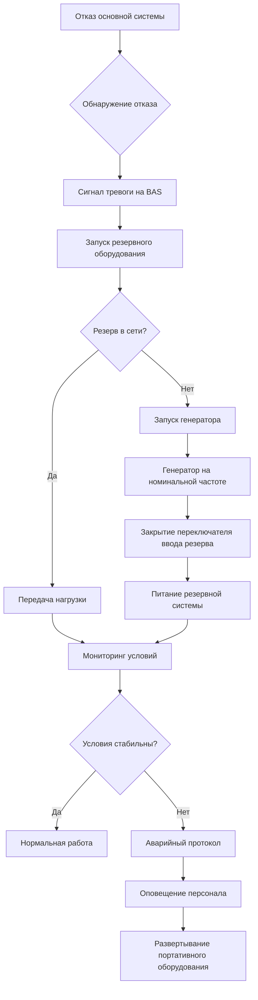

## Обзор

Резервирование HVAC для музейных приложений защищает бесценные коллекции от повреждений окружающей средой во время отказов оборудования. Экономическая и культурная ценность музейных фондов оправдывают использование сложных стратегий резервирования, которые превышают типичные требования к зданиям. Правильное проектирование резервирования уравновешивает капитальные инвестиции с риском воздействия.

## Принципы резервирования N+1

Резервирование N+1 предусматривает один дополнительный компонент сверх минимально необходимого для полной пропускной способности системы. Для музея, требующего трех холодильных машин при условиях проектирования, конфигурация N+1 включает четыре холодильные машины, каждая мощностью 33% от необходимой. Этот подход обеспечивает полную холодопроизводительность при отказе одного оборудования.

Доступность системы значительно улучшается с резервированием:

$$A_{system} = 1 - (1 - A_{component})^{n+1}$$

Где:
- $A_{system}$ = общая доступность системы
- $A_{component}$ = надежность отдельного компонента
- $n$ = количество компонентов, необходимых для полной пропускной способности

Для компонента с надежностью 95% конфигурация 3+1 достигает 99,9994% доступности системы в сравнении с 85,7% для нерезервированной системы.

### Конфигурации резервирования

**Параллельное резервирование** соединяет идентичные компоненты с общими системами распределения. При отказе одного устройства другие автоматически принимают нагрузку. Эта конфигурация подходит для холодильных машин, котлов, воздухообрабатывающих установок и насосов.

**Резервирование в режиме ожидания** поддерживает резервное оборудование в режиме отключения до отказа основных систем. Этот подход снижает операционные расходы, но вводит задержки переключения, которые могут повредить чувствительные коллекции.

**Распределенное резервирование** развертывает несколько меньших систем, обслуживающих различные зоны. Отказ влияет только на затронутую зону, в то время как другие области сохраняют надлежащие условия.

## Резервное копирование критических компонентов

### Системы холодного водоснабжения

Холодильные установки музеев требуют нескольких агрегатов с изолирующими клапанами, позволяющими техническому обслуживанию без остановки. Типовая конфигурация включает:

- Несколько холодильных машин общей мощностью 125-150% от проектной
- Двойное первичное/вторичное насосное хозяйство с управлением VFD
- Клапаны автоматического переключения
- Резервные средства управления с аварийным питанием
- Резервуар холодной воды для тепловой инерции

Резервуар холодной воды обеспечивает 2-4 часа охлаждения при полном отказе холодильной машины, предоставляя время для ремонта или запуска генератора.

### Системы отопления

Резервные котлы предотвращают зимние скачки температуры. Требования включают:

- Конфигурация котлов N+1 с модульными устройствами
- Двухтопливная способность (природный газ с резервным маслом)
- Резервные средства управления горелкой и предохранители пламени
- Резервные баки для горячей воды
- Перекрестно соединенные трубопроводы с изолирующими клапанами

### Системы обработки воздуха

Воздухообрабатывающие установки, обслуживающие помещения коллекций, требуют:

- Дублирующих вентиляторов подачи и возврата с автоматическим переключением
- Двойных фильтровальных секций с мониторингом перепада давления
- Резервных систем увлажнения
- Резервных паровых или электрических теплообменников
- Исполнительных механизмов с аварийным питанием, сохраняющих положение заслонок при отключении электропитания

### Управление влажностью

Мощность осушения должна сохраняться при отказе основной системы:

- Резервные адсорбционные или холодильные осушители
- Емкость для хранения влаги в гигроскопичных материалах конструкции здания
- Портативные осушители скорой помощи с предварительно подготовленными подключениями
- Резервные увлажнители с отдельной водоочисткой

## Требования к аварийным генераторам

Аварийные генераторы поддерживают климатконтроль во время отключений сети. Расчеты мощности должны учитывать:

$$P_{gen} = (P_{HVAC} + P_{lights} + P_{controls}) \times 1,25$$

Где мощность генератора включает 25% запас прочности сверх одновременных нагрузок HVAC, освещения и управления.

### Технические характеристики генератора

- **Мощность**: 150-200% от критической нагрузки HVAC
- **Хранилище топлива**: запас на 48-72 часа при полной нагрузке
- **Время переключения**: менее 10 секунд для автоматических переключателей ввода резерва
- **Возможность параллельной работы**: несколько генераторов с распределением нагрузки
- **Техническое обслуживание**: еженедельное тестирование, ежемесячное тестирование под нагрузкой

Критические нагрузки автоматически переходят на аварийное питание в течение 10 секунд. Менее критичные системы могут использовать отложенное переключение для снижения мощности генератора.

## Последовательности отказоустойчивости

Автоматизированные последовательности отказоустойчивости сохраняют стабильность окружающей среды:

Типовое время отказоустойчивости:

| Событие | Время от отказа |
|---------|-----------------|
| Обнаружение отказа | 0-30 сек |
| Запуск резервного оборудования | 30-60 сек |
| Завершение передачи нагрузки | 60-120 сек |
| Запуск генератора (если необходимо) | 10-15 сек |
| Принятие нагрузки генератором | 30-45 сек |
| Стабилизация условий | 5-15 мин |

## Оценка риска для коллекций

Требования резервирования зависят от уязвимости и ценности коллекции. Факторы оценки включают:

**Чувствительность к окружающей среде:**
- Органические материалы (текстиль, бумага, дерево): высокая чувствительность к влажности
- Картины на холсте: чувствительны к колебаниям температуры
- Металлы: подвержены влиянию влажности и качества воздуха
- Камень, керамика: относительно стабильны, но подвержены влиянию быстрых изменений

**Ценность коллекции:**
- Неуникальные артефакты: максимальное резервирование
- Высокостоимостные коллекции: минимум N+1
- Учебные коллекции: допустимо пониженное резервирование
- Помещения хранения: подход на основе риска

**Допустимое время отклонения:**

$$t_{max} = \frac{\Delta T_{allow}}{dT/dt}$$

Где:
- $t_{max}$ = максимальное время перед требуемым корректирующим действием
- $\Delta T_{allow}$ = допустимое отклонение температуры
- $dT/dt$ = скорость дрейфа температуры после отказа

Для галереи, допускающей отклонение 1,1°C с темпом дрейфа 0,28°C/час, корректирующее действие должно произойти в течение 4 часов.

## Рекомендации по уровню резервирования

| Тип коллекции | Категория стоимости | Уровень резервирования | Резервное питание | Годовой бюджет риска |
|---------------|-------------------|------------------------|------------------|----------------------|
| Мировые шедевры изобразительного искусства | Неуникальные | N+2 | Полное (72ч топлива) | 0,01% вероятность отказа |
| Основные музейные фонды | Высокая стоимость (>10M$) | N+1 | Полное (48ч топлива) | 0,1% вероятность отказа |
| Региональные коллекции | Значительная (1-10M$) | N+1 | Частичное (24ч топлива) | 0,5% вероятность отказа |
| Учебные коллекции | Умеренная (<1M$) | N+0,5 | Только критичное (12ч топлива) | 1% вероятность отказа |
| Общее хранилище | Низкая | N+0 | Дополнительно | 5% вероятность отказа |

## Анализ затрат и выгод

Инвестиции в резервирование должны уравновешивать капитальные затраты с риском коллекции:

**Капитальные затраты:**
- Дополнительное оборудование: 125-200% от стоимости базовой системы
- Улучшенные средства управления: $50 000-$200 000
- Аварийный генератор: $100 000-$500 000 в зависимости от мощности
- Хранилище топлива: $20 000-$100 000
- Сложность установки: премия 15-30%

**Операционные затраты:**
- Повышенное обслуживание: на 40-60% больше годовых расходов
- Дополнительная энергия: 5-15% от потерь в насосах и распределении
- Тестирование генератора: $5 000-$15 000 в год
- Обслуживание системы управления: $10 000-$30 000 в год

**Снижение риска:**

$$V_{protected} = P_{failure} \times C_{collection} \times D_{damage}$$

Где:
- $V_{protected}$ = годовая стоимость, защищенная резервированием
- $P_{failure}$ = вероятность выхода за пределы окружающей среды
- $C_{collection}$ = стоимость коллекции
- $D_{damage}$ = доля повреждений при отклонении

Для коллекции стоимостью $100M с 2% годовой вероятностью отказа и потенциальным ущербом в 10%, резервирование, защищающее от этого риска, оправдывает годовые расходы $2M или капитальные инвестиции в размере $20-30M при типичной экономике проекта.

**Рассмотрения окупаемости:**
- Снижение страховых премий: 10-30% при надлежащем резервировании
- Избежанные расходы на восстановление: $100 000-$10M за инцидент
- Защита репутации: неоценимая стоимость
- Приемлемость для заимствований: крупные выставки требуют гарантии окружающей среды

## Мониторинг и тестирование системы

Резервированные системы требуют непрерывной проверки:

- Еженедельное автоматическое чередование оборудования, обеспечивающее готовность резерва
- Ежемесячное полнонагруженное тестирование резервных систем
- Ежеквартальное тестирование генератора под нагрузкой
- Ежегодные учения отказоустойчивости с участием всего персонала
- Непрерывный мониторинг состояния всех резервных компонентов

Программы прогнозного обслуживания выявляют потенциальные отказы до того, как они повлияют на коллекции, дополнительно улучшая общую надежность.

## Заключение

Правильное резервирование HVAC защищает бесценные музейные коллекции от повреждений окружающей средой при отказах оборудования. Конфигурации N+1, аварийное питание и автоматизированные последовательности отказоустойчивости сохраняют стабильные условия. Высокая ценность и чувствительность музейных фондов оправдывают инвестиции в резервирование, которые превышают типичные требования к зданиям. Оценка на основе рисков определяет надлежащие уровни резервирования для конкретных коллекций, уравновешивая капитальные затраты с защитной стоимостью.
