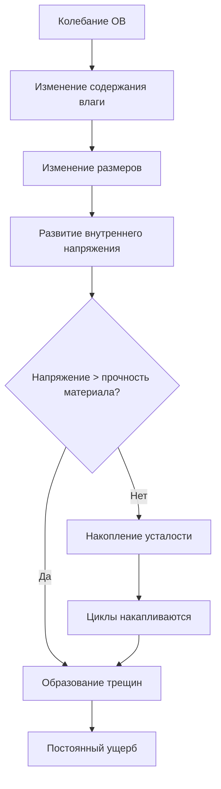
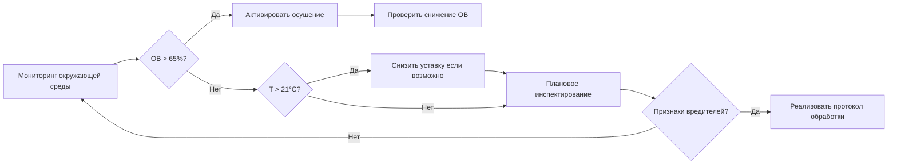

# Профилактическая консервация посредством контроля окружающей среды

Профилактическая консервация использует контроль окружающей среды в качестве основной защиты от деградации коллекций. В отличие от интервенционной консервации, которая восстанавливает поврежденные объекты, профилактические стратегии создают стабильные условия, которые минимизируют скорость деградации по всей коллекции. Системы HVAC служат основным инструментом для реализации этих стратегий, контролируя температуру, влажность, качество воздуха и косвенно управляя воздействием света и биологической активностью.

## Структура агентов разрушения

Канадский институт консервации определил десять агентов разрушения, которые наносят ущерб материалам культурного наследия. Системы HVAC непосредственно смягчают пять основных агентов:

| Агент | Физический механизм | Стратегия контроля HVAC |
|-------|-------------------|----------------------|
| Неправильная температура | Ускоренные химические реакции | Оптимизация уставки (15-25°C типично) |
| Неправильная относительная влажность | Изменение размеров, гидролиз | Точный контроль влажности (±5% ОВ) |
| Колебания температуры/ОВ | Циклические механические напряжения | Высокая тепловая масса, плавные переходы уставки |
| Загрязнители | Катализ химических реакций | Фильтрация (MERV 13-16), активированный уголь |
| Вредители | Биологическое потребление | Температура/ОВ вне жизнеспособных диапазонов |

Оставшиеся агенты (физические силы, кража, вандализм, пожар, вода, свет/УФ, диссоциация) требуют вмешательств, не связанных с HVAC, хотя системы окружающей среды способствуют подавлению пожара и предотвращению водяного ущерба посредством интеграции обнаружения.

## Кинетика химической деградации

Температура напрямую влияет на скорость деградации через уравнение Аррениуса:

$$k = A e^{-E_a/RT}$$

Где:
- $k$ = константа скорости реакции
- $A$ = предэкспоненциальный множитель
- $E_a$ = энергия активации (Дж/моль)
- $R$ = газовая постоянная (8,314 Дж/моль·K)
- $T$ = абсолютная температура (К)

Для большинства органических материалов скорость реакции удваивается с каждым увеличением температуры на 10°C (Q₁₀ = 2). Коллекция, содержащаяся при температуре 25°C, деградирует в два раза быстрее, чем при 15°C. Это соотношение количественно определяет преимущество консервации при более низких температурах, уравновешенное комфортом для посетителей и энергозатратами.

Относительная влажность влияет на деградацию несколькими путями:

1. **Реакции гидролиза** требуют молекул воды в качестве реагентов
2. **Изменения размеров** в гигроскопических материалах создают механические напряжения
3. **Скорость коррозии** возрастает экспоненциально выше критических порогов ОВ (40-60% для большинства металлов)

Равновесное содержание влаги (РСВ) в органических материалах следует кривым сорбции, которые зависят от материала и демонстрируют гистерезис между циклами адсорбции и десорбции.

## Требования климатической стабильности

Ущерб от колебаний часто превышает ущерб в установившемся состоянии. Гигроскопические материалы (бумага, дерево, текстиль, костный клей) испытывают изменения размеров при колебаниях ОВ:

$$\Delta L/L_0 = \alpha \cdot \Delta \text{ОВ}$$

Где $\alpha$ — коэффициент гигроскопического расширения (обычно 0,001-0,003 на %ОВ для дерева в поперечном направлении). Суточные колебания ОВ ±10% создают усталостное напряжение, которое накапливается на протяжении лет, вызывая растрескивание, расслоение и потерю краски.

Спецификации консервации обычно требуют:

- **Класс AA (прецизионный)**: ±2°C, ±5% ОВ, без сезонного дрейфа
- **Класс A (прецизионный)**: ±2°C, ±5% ОВ, небольшой допуск сезонного дрейфа
- **Класс B (общий)**: ±5°C, ±10% ОВ, умеренный сезонный дрейф
- **Класс C (релаксированный)**: Предотвращение экстремальных ОВ (<25%, >75%)

## Управление окружающей средой на основе рисков

Традиционные подходы определяли узкие диапазоны уставок (20°C ± 1°C, 50% ± 3% ОВ), которые требуют значительной энергии. Рамки, основанные на рисках, оценивают:

1. **Уязвимость коллекции**: Состав материалов и состояние
2. **Серьезность окружающей среды**: Величина и скорость колебаний
3. **Продолжительность воздействия**: Кумулятивное время в условиях риска
4. **Ценность/значимость**: Приоритизация ресурсов

Этот подход позволяет более широкие диапазоны уставок для устойчивых коллекций (стабильная керамика, металлы в сухих условиях), сохраняя при этом строгий контроль для уязвимых материалов (акварели, ацетатная пленка, железо).

Индекс консервации (ИК) количественно определяет срок службы бумаги в эквивалентных годах при 20°C, 50% ОВ:

$$\text{ИК} = e^{[(E_a/R) \cdot (1/293,15 - 1/T)] - [(B \cdot \text{ОВ})/100]}$$

Где $B$ — эмпирический коэффициент чувствительности к влаге. Этот показатель позволяет сравнивать различные сценарии окружающей среды.

## Комплексная борьба с вредителями (КБВ)

Системы HVAC способствуют КБВ посредством манипуляции окружающей средой. Большинство вредителей культурного наследия (насекомые, плесень) требуют определенных диапазонов температуры и влажности:

- **Рост плесени**: Требует >65% ОВ, поддерживаемой в течение 72+ часов при температуре выше 15°C
- **Развитие насекомых**: Подавляется ниже 13-15°C; скорость развития экспоненциально возрастает с температурой
- **Кожееды**: Процветают при 20-30°C, 60-80% ОВ

Поддержание коллекций ниже 18°C и 55% ОВ создает враждебные условия для большинства вредителей без химического вмешательства. Кратковременное замораживание (−20°C в течение 72 часов) или обработки в среде с отсутствием кислорода устраняют активные заражения.

## Смягчение светового ущерба

Хотя системы освещения отделены от HVAC, контроль окружающей среды влияет на светоиндуцированную деградацию. Фотохимический ущерб следует:

$$\text{Ущерб} = k \cdot E \cdot t$$

Где $E$ — освещенность (люкс) и $t$ — время воздействия. Более высокие температуры ускоряют реакции фото-окисления, создавая синергетические эффекты. Поддержание более низких температур (18-20°C) снижает скорость светового ущерба на 30-50% по сравнению с 25°C.

Размещение воздуховодов HVAC должно избегать освещения светочувствительных объектов теплым воздухом, что объединяет тепловой и фотохимический стресс.

## Следствия для проектирования системы

Достижение требований профилактической консервации требует:

- **Оборудование с высоким коэффициентом регулирования**: Точный контроль при неполной нагрузке
- **Разделенный контроль температуры/влажности**: Независимое управление
- **Интеграция тепловой массы**: Буферизация против переходных нагрузок
- **Контроль давления**: Предотвращение инфильтрации некондиционированного воздуха
- **Фильтрация**: MERV 13 минимум, рассмотрить фильтрацию газообразных загрязнителей
- **Мониторинг**: Непрерывное логирование с интервалом минимум 15 минут

Вентиляторы рекуперации энергии (ВРЭ) рискуют перекрестным загрязнением между выходным и входным потоками воздуха. Полная рекуперация энергии может передавать летучие органические соединения обратно в выставочные залы, требуя в некоторых приложениях только чувствительной рекуперации тепла.

---

**Связанные темы**: Спецификации климата в музеях, оценка риска коллекции, контроль точки росы, сезонные стратегии уставок, поведение гигроскопических материалов
