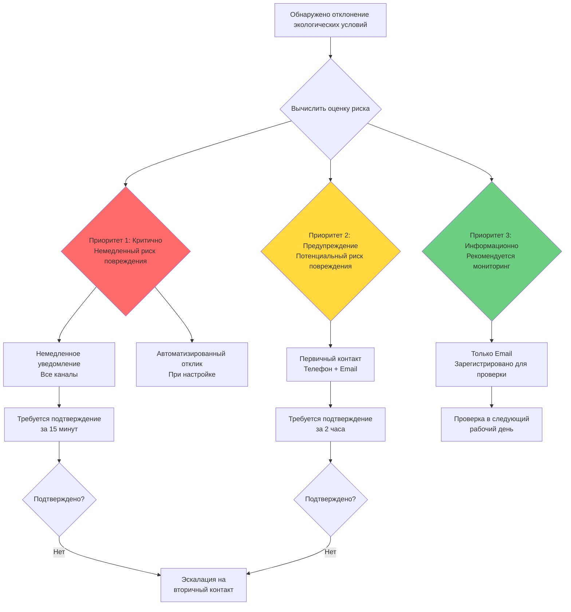
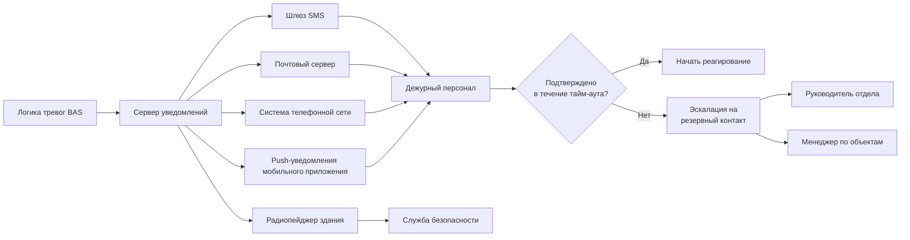

Системы экологических тревог служат критическим интерфейсом между отказами управления HVAC и персоналом по сохранению коллекций, обеспечивая своевременное уведомление об условиях, угрожающих целостности артефактов. Эффективное использование тревог уравновешивает чувствительность к реальным рискам против усталости от тревог, которая десенсибилизирует персонал к предупреждениям.

## Физика тревог и пороги срабатывания

Фундаментальная проблема консервационной сигнализации заключается в различении между нормальными колебаниями окружающей среды и условиями, требующими вмешательства. Это требует понимания термодинамического отклика артефактов на отклонения параметров окружающей среды.

### Тревоги отклонения от уставки

Абсолютные пороговые тревоги срабатывают при превышении условиями диапазонов целей сохранения. Порог тревоги должен учитывать как чувствительность артефактов, так и нормальное отклонение системы:

$$\Delta T_{\text{alarm}} = \Delta T_{\text{damage}} - (\sigma_{\text{system}} + \sigma_{\text{sensor}})$$

где $\Delta T_{\text{damage}}$ представляет отклонение температуры, вызывающее повреждение артефакта, $\sigma_{\text{system}}$ — ожидаемое отклонение системы, а $\sigma_{\text{sensor}}$ — погрешность датчика.

**Типичные пороги тревог консервации:**

| Параметр | Жесткое управление | Стандартное управление | Хранилище |
|-----------|------------------|----------------------|-----------|
| Температура высокая | +0,8°C | +1,7°C | +2,8°C |
| Температура низкая | -0,8°C | -1,7°C | -2,8°C |
| ОВ высокая | +3% | +5% | +8% |
| ОВ низкая | -3% | -5% | -8% |
| Отклонение точки росы | ±1,1°C | ±1,7°C | ±2,8°C |

Тревога точки росы обеспечивает превосходную стабильность по сравнению с тревогой ОВ, поскольку исключает эффекты, связанные с температурой. Тревога точки росы срабатывает на основе абсолютного содержания влаги, а не значения ОВ, зависящего от температуры.

### Тревоги скорости изменения

Обнаружение скорости изменения выявляет отказы оборудования до срабатывания абсолютных порогов. Критическая скорость зависит от тепловой массы артефакта и времени отклика на гигроскопичность:

$$\frac{dT}{dt}_{\text{alarm}} = \frac{h \cdot A}{m \cdot c_p} \cdot \Delta T_{\text{critical}}$$

где $h$ — коэффициент конвективной теплопередачи (обычно 5-15 Вт/м²·K при неподвижном воздухе), $A/m$ — отношение площади поверхности к массе артефакта, $c_p$ — удельная теплоемкость, а $\Delta T_{\text{critical}}$ — повреждающее изменение температуры.

**Рекомендуемые пороги скорости изменения:**

| Категория артефакта | Скорость изменения температуры | Скорость изменения ОВ | Период обнаружения |
|-------------------|-------------------------------|-------------------|------------------|
| Картины на панели | 1,1°C/ч | 5%/ч | 30 минут |
| Картины маслом на холсте | 1,7°C/ч | 8%/ч | 30 минут |
| Бумажные коллекции | 2,2°C/ч | 10%/ч | 30 минут |
| Металлические предметы | 2,8°C/ч | — | 1 час |
| Камень/керамика | 3,3°C/ч | — | 1 час |

Тревоги скорости изменения обнаруживают отказы компрессора, неисправности заслонок и ошибки системы управления значительно быстрее, чем абсолютные пороговые тревоги.

## Иерархия приоритизации тревог

Эффективные системы тревог реализуют многоуровневую приоритизацию для надлежащего направления внимания:

### Расчет приоритета на основе риска

Приоритет тревоги основывается как на величине отклонения, так и на уязвимости затронутых коллекций:

$$P_{\text{risk}} = \left(\frac{\Delta E}{E_{\text{threshold}}}\right)^2 \cdot V_{\text{collection}} \cdot t_{\text{exposure}}$$

где $\Delta E$ — отклонение экологических условий, $E_{\text{threshold}}$ — уставка тревоги, $V_{\text{collection}}$ — коэффициент уязвимости (шкала 1-10), а $t_{\text{exposure}}$ — продолжительность воздействия.

**Условия приоритета 1 (Критично):**
- Точка росы приближается к температурам поверхности (конденсация неминуема)
- Отклонение температуры >2,8°C в коллекциях с жесткими требованиями
- Отклонение ОВ >10% в гигроскопичных коллекциях
- Скорость изменения >3× нормальных порогов
- Полный отказ системы HVAC

**Условия приоритета 2 (Предупреждение):**
- Отклонение уставки 50-100% от критического порога
- Скорость изменения 2-3× нормальных порогов
- Проблемы отдельной зоны с потенциалом распространения
- Повторяющиеся колебания на границах порогов

**Условия приоритета 3 (Информационно):**
- Отклонение уставки 25-50% от критического порога
- Оборудование работает вне оптимальной эффективности
- Тенденция к условиям тревоги
- Разрешенные тревоги, требующие документирования

## Системы уведомления и протоколы реагирования

### Многоканальная архитектура уведомлений

**Требования протокола реагирования в нерабочее время:**

1. **Уведомление первичного контакта** (0-5 минут)
   - Одновременные SMS и телефонный звонок
   - Детали тревоги, включая локацию, условие и приоритет
   - Прямая ссылка на панель мониторинга в реальном времени

2. **Окно подтверждения** (5-15 минут)
   - Первичный контакт должен подтвердить получение
   - Система подтверждает прием и регистрирует время ответа
   - Отказ запускает эскалацию

3. **Вторичная эскалация** (15-30 минут)
   - Автоматизированное уведомление резервным контактам
   - Информирование руководителя отдела и менеджера по объектам
   - Направление персонала безопасности для физической проверки

4. **Инициирование реагирования** (в течение 1 часа для приоритета 1)
   - Оценка на месте или удаленное устранение неполадок
   - Решение: немедленный ремонт, временное смягчение или контролируемое отключение
   - Документирование условий и предпринятых действий

## Стратегии снижения ложных тревог

Ложные тревоги подрывают эффективность системы тревог путем создания усталости от реагирования. Снижение требует как технического, так и процедурного подхода.

### Техническое предотвращение ложных тревог

**Качество датчиков и их размещение:**
- Используйте датчики точности класса A (±0,17°C, ±2% ОВ согласно ASHRAE Guideline 2019)
- Экранируйте датчики от радиационного и аэродинамического воздействия
- Избегайте размещения рядом с дверями, окнами или раздаточными диффузорами
- Реализуйте резервные датчики с логикой голосования для критических пространств

**Задержка тревоги и подтверждение:**
- Требуйте устойчивого отклонения для срабатывания (обычно 5-10 минут)
- Реализуйте гистерезис для предотвращения колебаний: тревога устанавливается при пороге +Δ, очищается при пороге -Δ
- Используйте фильтрацию скользящего среднего (15-минутное окно) для сглаживания преходящих скачков

$$\bar{T}_{\text{alarm}}(t) = \frac{1}{n}\sum_{i=0}^{n-1} T(t-i\Delta t)$$

где $n$ — количество выборок, а $\Delta t$ — интервал выборки.

**Условная логика тревог:**
- Подавляйте тревоги во время запланированного технического обслуживания
- Корректируйте пороги при сезонных переходах
- Отключайте тревоги скорости изменения при контролируемых изменениях уставки
- Требуйте одновременное отклонение температуры и влажности для тревог приоритета 1

### Предотвращение усталости от тревог

Усталость от тревог возникает при чрезмерном количестве уведомлений, десенсибилизирующих персонал к предупреждениям. Стратегии профилактики включают:

**Рационализация тревог:**
- Максимум 3-5 тревог приоритета 1 в месяц на зону
- Тревоги приоритета 2 не должны превышать 10 на зону в месяц
- Ежеквартальная проверка журналов тревог для выявления паразитных тревог

**Интеллектуальное группирование тревог:**
- Консолидируйте множественные тревоги датчиков в одной зоне в одно уведомление
- Группируйте коррелированные тревоги (например, отказ вентилятора подачи запускает множественные тревоги зоны → отчет как одна системная тревога)
- Подавляйте последующие тревоги при выявлении основной причины

**Динамическая корректировка порогов:**
- Сезонная переклибровка уставок (автоматически корректируйте пороги ±10% на основе 30-дневного скользящего среднего)
- Пороги режима занятости и незанятости
- Модификация временных порогов для специальных выставок

## Метрики производительности и тестирование

**Ключевые показатели производительности системы тревог:**

| Метрика | Цель | Метод расчета |
|---------|------|--------------|
| Уровень ложных тревог | <5% от всех тревог | Ежемесячная проверка тревог vs. проверенные условия |
| Время подтверждения (P1) | <15 минут | Автоматическая регистрация от тревоги до подтверждения |
| Время подтверждения (P2) | <2 часа | Автоматическая регистрация от тревоги до подтверждения |
| Время реагирования (P1) | <1 час | От тревоги до действия персонала на месте или удаленного |
| Уровень пропущенных тревог | 0% | Ежеквартальное тестирование инъекций отказов датчиков |
| Соотношение тревог к инцидентам | >80% | Тревоги, приводящие к документированному вмешательству |

**Ежеквартальный протокол тестирования:**
1. Имитируйте отказы датчиков (отключение, сигналы вне диапазона)
2. Проверьте доставку уведомлений на все каналы
3. Подтвердите правильное выполнение логики эскалации
4. Протестируйте реагирование в нерабочее время (учение с дежурным персоналом)
5. Валидируйте приоритизацию тревог со смешанными сценариями серьезности

Системы экологических тревог функционируют как механизм защиты от отказов, защищающий коллекции от сбоев системы HVAC. Надлежащим образом спроектированная сигнализация уравновешивает отзывчивость к реальным угрозам с подавлением паразитных тревог, поддерживая бдительность персонала и одновременно предотвращая усталость от тревог, которая компрометирует безопасность коллекций.
