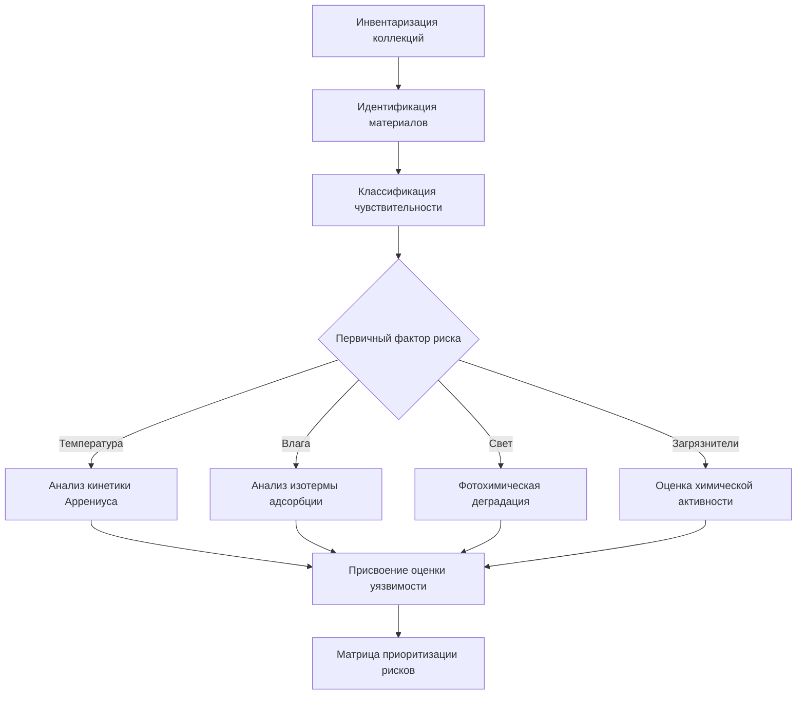
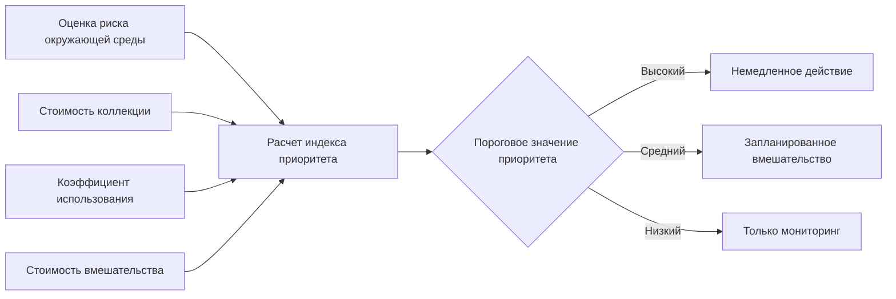

## Обзор

Обследования коллекций создают количественную основу для стратегий профилактической консервации путем документирования существующих условий, определения воздействия окружающей среды и приоритизации мер климатического контроля. Процесс обследования интегрирует оценку физического состояния с данными об окружающей среде для создания практических профилей риска для коллекций.

Фундаментальная взаимосвязь между воздействием окружающей среды и скоростью деградации следует зависимости типа Аррениуса:

$$k = A \cdot e^{-E_a / RT}$$

где $k$ — константа скорости деградации, $A$ — предэкспоненциальный фактор, $E_a$ — энергия активации (кДж/моль), $R$ — газовая постоянная (8,314 кДж/моль·К), и $T$ — абсолютная температура (К). Эта зависимость демонстрирует, почему небольшие колебания температуры оказывают экспоненциальное воздействие на скорости деградации.

## Методологии обследования

### Обследование условий окружающей среды

Обследования окружающей среды количественно оценивают условия воздействия на коллекции путем систематического мониторинга температуры, относительной влажности, уровней освещенности и концентраций загрязняющих веществ. Продолжительность обследования должна охватывать сезонные колебания, обычно требуя 12 месяцев непрерывного сбора данных с интервалом 15 минут.

**Критические параметры и требования к измерениям:**

| Параметр | Точность | Разрешение | Частота выборки |
|-----------|----------|------------|---------------|
| Температура | ±0,5°C | 0,1°C | 15 минут |
| Относительная влажность | ±2% ОВ | 0,1% ОВ | 15 минут |
| Видимый свет | ±10% | 10 люкс | По требованию |
| УФ-радиация | ±5% | 1 µW/лм | По требованию |
| Взвешенные частицы (PM2.5) | ±10% | 1 µг/м³ | 1 час |

Емкость коллекций по буферизации влаги влияет на кратковременные колебания относительной влажности. Эффективная глубина проникновения влаги $\delta_m$ определяет время отклика:

$$\delta_m = \sqrt{\frac{D_m \cdot t}{\pi}}$$

где $D_m$ — коэффициент диффузии влаги (м²/с) материала и $t$ — продолжительность воздействия (с). Материалы с высокими значениями $\delta_m$ медленно реагируют на изменения относительной влажности, обеспечивая естественную буферизацию.

### Оценка уязвимости коллекций

Оценка уязвимости классифицирует материалы по их чувствительности к параметрам окружающей среды. Оценка использует принципы материаловедения для ранжирования механизмов деградации по энергии активации и зависимости от влаги.

**Классификация чувствительности материалов:**

| Категория материала | Чувствительность к T (Q₁₀) | Критический диапазон ОВ | Порог светового повреждения |
|-------------------|---------------------|-------------------|------------------------|
| Целлюлоза (бумага) | 2–3 | >65% ОВ | 50 клюкс·ч/год |
| Белковые материалы | 2–4 | <30%, >60% ОВ | 150 клюкс·ч/год |
| Фотографические | 3–5 | >50% ОВ | 15 клюкс·ч/год |
| Металлы (реактивные) | 1,5–2 | >45% ОВ | Минимально |
| Синтетические полимеры | 2–6 | Переменный | 200 клюкс·ч/год |

Значение Q₁₀ представляет увеличение скорости реакции на каждые 10°C повышения температуры. Более высокие значения указывают на большую чувствительность к температуре.

### Оценка риска воздействия окружающей среды

Оценка риска окружающей среды количественно определяет вероятность и величину деградации при документированных условиях. Величина риска $R$ объединяет серьезность воздействия и уязвимость коллекции:

$$R = P \cdot V \cdot E$$

где $P$ — вероятность возникновения (0–1), $V$ — уязвимость (шкала 0–10), и $E$ — значение воздействия (измеренное отклонение от целевого значения).

**Расчет взвешенного по времени воздействия** для температурных эффектов:

$$TWE_T = \sum_{i=1}^{n} \left( \frac{t_i}{t_{total}} \cdot 2^{(T_i - T_{ref})/10} \right)$$

где $t_i$ — время при температуре $T_i$, и $T_{ref}$ — эталонная температура (обычно 20°C). Эта метрика преобразует переменное температурное воздействие в эквивалентное изотермальное время воздействия.

### Определение приоритетов консервации

Установление приоритетов использует количественные оценки риска в сочетании с оценками стоимости коллекции для эффективного распределения ресурсов. Индекс приоритета $PI$ интегрирует несколько факторов:

$$PI = \frac{R \cdot V_c \cdot U}{\sqrt{C}}$$

где $R$ — оценка риска окружающей среды, $V_c$ — стоимость коллекции (культурная/денежная), $U$ — коэффициент использования (частота доступа), и $C$ — смета затрат на вмешательство. Более высокие значения $PI$ указывают на приоритетные действия.

### Выбор мест расположения мониторинга

Стратегическое размещение оборудования мониторинга охватывает репрезентативные условия при определении микроклиматов. Количество мест мониторинга $N$ масштабируется в зависимости от площади коллекции и сложности окружающей среды:

$$N = \left\lceil \frac{A}{A_{zone}} \right\rceil + N_{critical}$$

где $A$ — общая площадь коллекции (м²), $A_{zone}$ — площадь репрезентативной зоны (обычно 200–400 м²), и $N_{critical}$ — дополнительные датчики для известных проблемных зон.

**Критерии выбора мест расположения:**

- Центральные позиции в каждой зоне HVAC
- Рядом с внешними стенами и окнами (тепловые мосты)
- Рядом с высокоценными или уязвимыми предметами
- Зоны с подозрением на утечку воздуха или инфильтрацию
- Места с историческими картинами повреждений
- Контрольные позиции вдали от источников стресса окружающей среды

### Установление исходных условий

Исходная документация обеспечивает эталонное состояние для измерения эффективности улучшений. Статистический анализ данных мониторинга устанавливает показатели производительности:

**Средний индекс консервации (MPI)** для коллекций на бумажной основе:

$$MPI = \frac{1}{n} \sum_{i=1}^{n} \frac{1}{k_i}$$

где $k_i$ — относительная скорость деградации на каждом интервале измерения, нормализованная к условиям 20°C и 50% ОВ.

**Показатели производительности для документирования:**

| Метрика | Определение | Целевой диапазон |
|--------|------------|--------------|
| Стабильность температуры | Стандартное отклонение за 24 часа | <2°C |
| Стабильность относительной влажности | Стандартное отклонение за 24 часа | <5% ОВ |
| Отклонение от уставки | Средняя абсолютная ошибка от целевого значения | <1°C, <3% ОВ |
| Скорость изменения | Максимум ΔT/Δt или ΔОВ/Δt | <5°C/ч, <10% ОВ/ч |
| Циклы в день | Отклонения за пределы мертвой зоны | <3 циклов |

## Требования к документированию обследования

Комплексная документация включает пространственное картирование, временной анализ и статистические сводки:

- Планы этажей с местами мониторинга и зонами окружающей среды
- Графики временных рядов, показывающие годовые закономерности
- Частотные распределения для температуры и относительной влажности
- Психрометрические диаграммы, отображающие воздействие на коллекции
- Матрицы рисков, коррелирующие условия с уязвимостями
- Фотографическая документация существующих повреждений
- Инвентаризация материалов с оценками состояния
- Рекомендуемые вмешательства, ранжированные по индексу приоритета

## Протокол реализации

1. **Фаза планирования**: Определение объема обследования, продолжительности и распределения ресурсов
2. **Развертывание оборудования**: Установка откалиброванных датчиков в соответствии с пространственными требованиями
3. **Сбор данных**: Поддержание непрерывного мониторинга в течение минимум 12 месяцев
4. **Оценка коллекций**: Каталогизация материалов и присвоение оценок уязвимости
5. **Анализ данных**: Расчет метрик воздействия и индексов риска
6. **Ранжирование приоритетов**: Применение формулы индекса приоритета для определения вмешательств
7. **Отчетность**: Подготовка комплексного пакета документации
8. **Установление базового уровня**: Определение целевых показателей производительности на основе анализа

## Интеграция с улучшениями HVAC

Результаты обследования непосредственно информируют спецификации системы климатического контроля. Требуемая емкость охлаждения $Q_c$ для устранения риска, вызванного температурой, вытекает из исходного энергетического баланса:

$$Q_c = \rho \cdot c_p \cdot V \cdot ACH \cdot \Delta T + U \cdot A \cdot \Delta T + Q_{internal}$$

где $\rho$ — плотность воздуха (кг/м³), $c_p$ — удельная теплоемкость (кДж/кг·К), $V$ — объем (м³), $ACH$ — коэффициент воздухообмена (ч⁻¹), $U$ — коэффициент теплопередачи оболочки здания (Вт/м²·К), $A$ — площадь оболочки (м²), и $Q_{internal}$ представляет внутренние тепловыделения (Вт).

Аналогично, требования к емкости осушения следуют из расчетов влажностной нагрузки, информируемых исходными отклонениями относительной влажности.

## Справочные стандарты

- **ISO 11799**: Информация и документирование — Требования к хранилищам для архивных и библиотечных материалов
- **ASHRAE Handbook — HVAC Applications**, Глава 24: Музеи, галереи, архивы и библиотеки
- **PAS 198**: Спецификация управления условиями окружающей среды для культурных коллекций
- **Рекомендации Institute for Image Permanence** по показателям консервации

## Заключение

Обследования коллекций обеспечивают количественную основу для основанной на доказательствах профилактической консервации. Путем документирования существующих условий окружающей среды и их корреляции с уязвимостями материалов обследования позволяют рационально устанавливать приоритеты для улучшения климатического контроля. Интеграция данных непрерывного мониторинга с оценками физического состояния создает измеримые базовые уровни для оценки эффективности вмешательств и оптимизации распределения ресурсов при сохранении культурного наследия.
