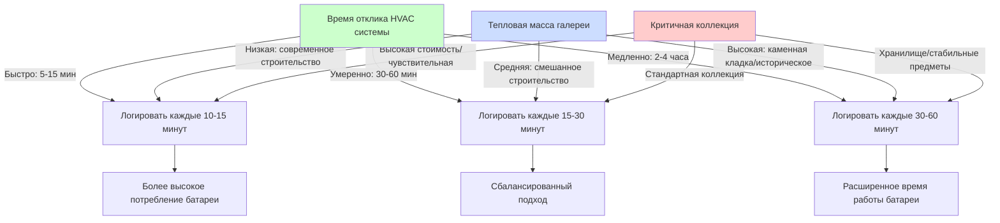
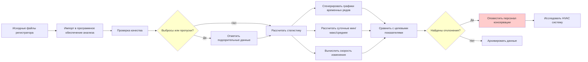

Регистраторы данных об окружающей среде служат основой верификации систем климат-контроля музеев, обеспечивая непрерывное измерение температуры и условий относительной влажности, которые напрямую влияют на стабильность коллекций. Эти приборы заполняют разрыв между характеристиками HVAC системы и фактическими условиями окружающей среды в местах расположения артефактов.

## Физические принципы измерения параметров окружающей среды

### Механизмы измерения температуры

Современные музейные регистраторы используют термисторы или датчики температуры сопротивлением (RTD) для измерения температуры воздуха. Термисторы используют температурный коэффициент электрического сопротивления в полупроводниковых материалах, где сопротивление $R$ изменяется в зависимости от абсолютной температуры $T$ в соответствии с уравнением Штейнхарта-Харта:

$$\frac{1}{T} = A + B\ln(R) + C(\ln(R))^3$$

где $A$, $B$ и $C$ — коэффициенты калибровки, специфичные для материала термистора. Это нелинейное соотношение обеспечивает высокую чувствительность (обычно 3-5% изменение сопротивления на °C), но требует точной характеризации.

RTD используют чистые металлы (предпочтительно платину) с линейными зависимостями сопротивления от температуры. Сопротивление при температуре $T$ подчиняется:

$$R_T = R_0[1 + \alpha(T - T_0)]$$

где $R_0$ — сопротивление при эталонной температуре $T_0$ (обычно 0°C или 25°C), и $\alpha$ — температурный коэффициент (0,00385 Ω/Ω/°C для платины). RTD обеспечивают превосходную долгосрочную стабильность при более высокой стоимости.

### Измерение относительной влажности

Емкостные датчики влажности доминируют в музейных приложениях. Эти устройства используют гигроскопические полимерные диэлектрики между электродами, где поглощенные молекулы воды изменяют диэлектрическую проницаемость $\epsilon_r$ и, следовательно, емкость $C$:

$$C = \epsilon_0 \epsilon_r \frac{A}{d}$$

где $\epsilon_0$ — диэлектрическая проницаемость свободного пространства, $A$ — площадь электрода, и $d$ — толщина диэлектрика. Поглощение воды увеличивает $\epsilon_r$ приблизительно с 2,5 (сухой полимер) до значений, близких к 80 (вода), обеспечивая измеримое изменение емкости, пропорциональное окружающей влажности.

Равновесное содержание влаги в гигроскопическом слое следует поведению изотермы сорбции, вводя эффекты гистерезиса 1-3% отн.вл. в зависимости от того, увеличивается или уменьшается влажность.

## Требования к точности для мониторинга коллекций

| Параметр | Цель консервации | Точность регистратора | Обоснование |
|-----------|---------------------|---------------------|-----------|
| Температура | ±1,1°C | ±0,3°C или лучше | Выявить отклонения HVAC до повреждения артефакта |
| Относительная влажность | ±5% отн.вл. | ±2% отн.вл. или лучше | Отследить влажностные циклы, вызывающие изменение размеров |
| Комбинированная неопределенность | - | ±3% отн.вл. при 25°C | Учесть перекрестную чувствительность температуры и влажности |
| Долгосрочный дрейф | - | <0,5% отн.вл./год | Сохранить действительность между ежегодными калибровками |

Требование точности ±2% отн.вл. вытекает из характеристик отклика материала. Органические гигроскопические материалы (бумага, дерево, текстиль) имеют содержание влаги $M$, связанное с отн.вл. изотермами сорбции, приблизительно как:

$$M = \frac{a \cdot RH}{1 + b \cdot RH}$$

где $a$ и $b$ — коэффициенты, специфичные для материала. Изменение влажности на 5% отн.вл. обычно производит изменение содержания влаги на 0,5-1,0%, достаточное для обнаруживаемого деформирования размеров в ограниченных материалах.

## Выбор интервала выборки

Подходящий интервал логирования зависит от постоянной времени тепловой инерции контролируемого пространства и характеристик отклика HVAC системы. Для галереи с тепловой емкостью $C_{th}$ (Дж/К) и тепловой проводимостью $U$ (Вт/К) к окружающим пространствам, температурные возмущения затухают с постоянной времени:

$$\tau = \frac{C_{th}}{U}$$

Типичные музейные галереи имеют постоянные времени 2-6 часов из-за высокой тепловой массы (каменная кладка, массивные витрины). Теорема выборки Найквиста требует выборки с интервалами $\Delta t < \tau/2$ для захвата температурных переходных процессов. Это устанавливает интервалы 15-30 минут как подходящие для большинства приложений.

Влажность реагирует медленнее из-за буферизации влаги гигроскопическими материалами (текстиль, бумага, деревянная мебель). Эффективная влажностная емкость продлевает постоянные времени влажности до 8-24 часов в обставленных галереях, что позволяет использовать почасовые интервалы логирования.

## Архитектура проводных и беспроводных систем

### Проводные системы регистраторов

Проводные системы подключают датчики к централизованному оборудованию сбора данных через кабелирование низкого напряжения (обычно RS-485 или токовые петли 4-20 мА). Преимущества включают непрерывное питание, доступ к данным в реальном времени и устойчивость к радиопомехам. Кабельные линии ограничены 1200 м для RS-485, короче для аналоговых систем из-за падения напряжения и подхвата шума.

Потребление мощности на датчик: 0,1-0,5 Вт постоянно. Замена батареи не требуется.

### Беспроводные системы регистраторов

Беспроводные системы используют радиочастотную связь (обычно диапазоны ISM 433 МГц, 868 МГц или 915 МГц, или 2,4 ГГц для WiFi/Bluetooth). Автономное питание от батареи исключает нарушения при установке в исторических зданиях.

Время работы батареи $t_b$ зависит от интервала логирования $\Delta t$, мощности передачи $P_{tx}$, продолжительности передачи $t_{tx}$, тока в режиме ожидания $I_{sleep}$ и емкости батареи $Q$:

$$t_b = \frac{Q \cdot V}{I_{sleep} + \frac{P_{tx} \cdot t_{tx}}{V \cdot \Delta t}}$$

Для типичных параметров (литиевая батарея 3,6В, $Q$ = 2400 мАч, $I_{sleep}$ = 10 мкА, $P_{tx}$ = 50 мВт, $t_{tx}$ = 100 мс, $\Delta t$ = 15 мин), время работы батареи приближается к 3-5 годам. Частая передача (каждые 5 минут) сокращает время работы до 1-2 лет.

| Тип системы | Начальная стоимость | Стоимость установки | Гибкость | Доступ в реальном времени | Источник питания | Типичное применение |
|-------------|--------------|-------------------|-------------|------------------|--------------|---------------------|
| Проводные датчики | Средняя | Высокая (кабельные линии) | Низкая | Да | Питание здания | Новое строительство, переделки |
| Беспроводные автономные | Низкая | Очень низкая | Высокая | Нет (ручная загрузка) | Батарея (1-3 года) | Небольшие музеи, временные выставки |
| Беспроводные сетевые | Высокая | Низкая | Очень высокая | Да | Батарея (3-5 лет) | Распределенные коллекции, исторические здания |

## Стратегия расположения регистраторов

Расположение датчиков должно представлять микроклимат артефактов, избегая ложных показаний от радиационного тепла, воздушных потоков и эффектов тепловой массы.

**Рекомендации по расположению:**

- Расположить датчики на высоте артефактов (не под потолком, если не мониторится верхняя зона галереи)
- Поддерживать минимальное расстояние 1 м от стен, окон и приточных диффузоров, чтобы избежать эффектов пограничного слоя
- Поместить датчики внутри закрытых витрин для мониторинга закрытых артефактов
- Избежать прямого солнечного излучения, которое производит ошибки радиационной температуры 5-15°C
- Защитить датчики от прямого воздушного потока (>30 м/ч), что вызывает ошибки аспирационного охлаждения

Для естественно аспирируемых датчиков коэффициент конвективного теплопередачи $h_c$ варьируется с воздушной скоростью $v$ приблизительно как:

$$h_c \approx 10.5 \sqrt{v}$$

где $h_c$ в Вт/м²К и $v$ в м/с. При типичных скоростях галереи (0,1-0,3 м/с), $h_c$ = 3-6 Вт/м²К. При радиационном воздействии 50 Вт/м² (непрямой дневной свет), ошибка температуры датчика достигает:

$$\Delta T = \frac{q_{rad}}{h_c} = \frac{50}{5} = 10°C$$

Радиационные экраны снижают эту ошибку до <0,5°C.

## Анализ данных и отслеживание тенденций

### Статистическая характеризация

Анализируйте записанные данные с использованием описательной статистики, которая выявляет характеристики HVAC системы:

- **Средние значения:** Указывают на точность отслеживания уставки и систематическое смещение
- **Стандартное отклонение:** Количественно определяет краткосрочную изменчивость (минуты-часы) от управляющих циклов
- **Суточный диапазон:** Захватывает суточные колебания от солнечных поступлений и паттернов занятости
- **Скорость изменения:** Определяет быстрые переходные процессы (°C/ч или %отн.вл./ч) во время отказов HVAC

Стандарты консервации указывают:

- Максимальная скорость изменения отн.вл.: 10% отн.вл. за 24 часа (ISO 11799 для библиотек/архивов)
- Максимальная скорость изменения температуры: 2°C в час (предотвращает шок для артефактов)
- Годовой диапазон температур: ±2°C для окружающей среды класса AA (ASHRAE глава 24)

### Протоколы отслеживания тенденций

## График верификации калибровки

Дрейф датчика результирует из старения гигроскопических полимеров (датчики влажности) и механического стресса в датчиках температуры. Частота верификации:

- **Датчики температуры:** Ежегодная верификация (допуск ±0,3°C)
- **Датчики влажности:** Полугодовая верификация (допуск ±2% отн.вл.)
- **Критичные приложения:** Ежеквартальная верификация для окружающей среды класса AA

Методы верификации:

1. **Метод солевого раствора (отн.вл.):** Насыщенные солевые растворы производят определенную отн.вл. при контролируемой температуре. LiCl (11% отн.вл.), MgCl₂ (33% отн.вл.), NaCl (75% отн.вл.) при 25°C обеспечивают трехточечную калибровку.

2. **Метод ледяной бани (температура):** Ледяная водяная суспензия производит эталон 0,0°C (±0,05°C неопределенность). Требует чистой воды и полного покрытия льдом.

3. **Сравнение стандарта-переносчика:** Сравнить полевой регистратор с недавно откалиброванным эталонным инструментом в идентичных условиях в течение 24-48 часов.

Датчики, превышающие допуск, требуют повторной калибровки или замены. Документируйте все результаты верификации для установления паттернов дрейфа и оптимизации графиков замены.

## Протоколы замены батареи

Истощение батареи следует экспоненциальному затуханию, модифицированному температурными эффектами. Емкость батареи снижается приблизительно на 0,7% на °C ниже 20°C для литиевых элементов. В неотапливаемых складских помещениях (10°C) эффективная емкость падает на 7-10%, пропорционально сокращая интервалы замены.

**Индикаторы замены:**

- Регистраторы сообщают напряжение батареи <2,8В (литиевые элементы номиналом 3,6В)
- Пропущенные точки данных указывают на перебои в питании
- Плановая замена на 80% расчетного времени работы предотвращает потерю данных

Реализуйте ступенчатые графики замены (ежемесячная ротация через зоны) для распределения рабочей силы и предотвращения одновременных отказов по всей сети мониторинга.

## Сетевые системы мониторинга в нескольких местах

Большие музеи требуют 50-200+ регистраторов, распределенных по галереям, хранилищам и механическим пространствам. Соображения дизайна сети:

- **Пространственное разрешение:** Один регистратор на 200-500 м² в кондиционируемых галереях
- **Вертикальная стратификация:** Мониторить несколько высот в пространствах с потолком >6 м
- **Мониторинг микроклимата:** Отдельные регистраторы внутри герметичных витрин и шкафов для хранения
- **Верификация HVAC:** Датчики в приточных воздуховодах, возвратном воздухе и наружных условиях

Централизованные системы управления данными объединяют измерения, автоматизируют оповещения и генерируют отчеты о соответствии для аудитов консервации. Сетевые беспроводные системы передают данные каждые 15-60 минут, обеспечивая панели управления в реальном времени при сохранении многолетней работы батареи.
