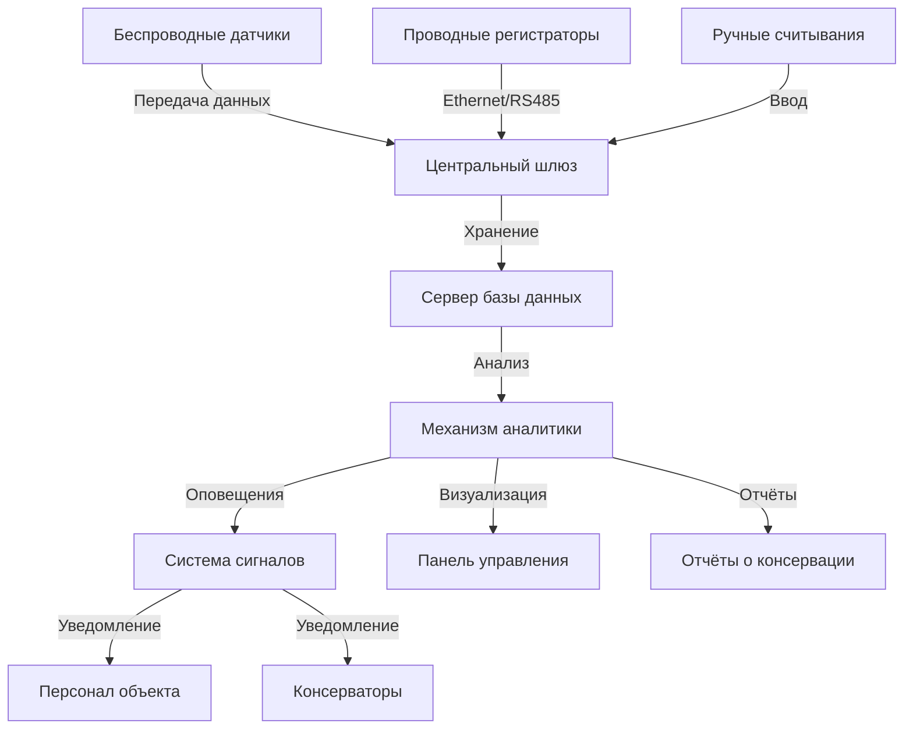

Экологический мониторинг составляет основу превентивной консервации путём количественного определения физических и химических факторов, ускоряющих деградацию материалов музейных коллекций. Надлежащие системы мониторинга измеряют температуру, относительную влажность, освещённость, концентрации загрязняющих веществ и уровни вибрации для обеспечения соответствия стандартам консервации и выявления аномалий до возникновения повреждений.

## Мониторинг температуры и относительной влажности

### Физические основы измерения

Датчики температуры в консервационных приложениях обычно используют датчики сопротивления температуры (RTD) или термисторы. RTD используют линейную зависимость между электрическим сопротивлением и температурой:

$$R_T = R_0[1 + \alpha(T - T_0)]$$

где $R_T$ — сопротивление при температуре $T$, $R_0$ — сопротивление при эталонной температуре $T_0$, а $\alpha$ — температурный коэффициент сопротивления (0,00385 °C⁻¹ для платины).

Датчики относительной влажности измеряют содержание влаги в воздухе относительно насыщения. Ёмкостные датчики RH изменяют диэлектрическую проницаемость при абсорбции водяного пара:

$$C = \epsilon_0 \epsilon_r \frac{A}{d}$$

где $\epsilon_r$ варьируется в зависимости от поглощённой влаги, $A$ — площадь электрода, $d$ — толщина диэлектрика.

### Критические характеристики производительности

Мониторинг консервационного уровня требует датчиков, соответствующих определённым пороговым значениям точности:

| Параметр | Требуемая точность | Время отклика | Стабильность |
|-----------|------------------|---------------|-----------|
| Температура | ±0,2°C | <5 минут | <0,1°C/год |
| Относительная влажность | ±2% RH | <10 минут | <1% RH/год |
| Температура точки росы | ±0,3°C | <10 минут | <0,2°C/год |

Температура точки росы $T_d$ обеспечивает метрику влажности, независимую от температуры:

$$T_d = \frac{b\gamma(T,RH)}{a - \gamma(T,RH)}$$

где $\gamma(T,RH) = \frac{a T}{b+T} + \ln(RH/100)$, с константами $a = 17,27$ и $b = 237,7°C$ (аппроксимация Магнуса-Тетенса).

### Стратегия размещения датчиков

Размещайте датчики на основе картины потоков воздуха и уязвимостей коллекций. Рекомендуемая плотность:

- Общие галереи: 1 датчик на 200–500 м²
- Чувствительные коллекции: 1 датчик на 50–100 м²
- Микроклиматический мониторинг: несколько датчиков на витрину

Размещайте датчики вдали от воздухораспределителей HVAC (минимум 2 м), внешних стен (минимум 0,5 м) и прямого солнечного света.

## Измерение уровня освещения

### Основы радиометрии и фотометрии

Освещённость $E_v$ (люкс) измеряет интенсивность видимого света, взвешенную по фотопическому отклику:

$$E_v = K_m \int_{\lambda} E_\lambda(\lambda) V(\lambda) d\lambda$$

где $K_m = 683$ лм/Вт, $E_\lambda$ — спектральное облучение, $V(\lambda)$ — фотопическая функция видимости.

Для консервации полная световая экспозиция интегрирует освещённость во времени:

$$H = \int_0^t E_v \, dt$$

измеряемая в люкс-часах или мегалюкс-часах (Млх·ч). Фотохимический ущерб следует принципу взаимности: 100 люкс в течение 10 часов равен 1000 люкс в течение 1 часа по потенциалу деградации.

### Мониторинг УФ и ИК

Ультрафиолетовое излучение (300–400 нм) ускоряет фотодеградацию. Коэффициент содержания УФ:

$$\text{УФ коэффициент} = \frac{E_{УФ}}{E_v}$$

не должен превышать 75 мкВт/лм для чувствительных материалов. Кремниевые фотодиоды с оптическими фильтрами отдельно измеряют УФ и видимые полосы.

Инфракрасное излучение (>780 нм) способствует тепловому стрессу без визуальной пользы. Полная лучистая экспозиция включает ИК-эффекты нагревания, не отражённые в измерениях только освещённости.

### Пределы консервационного света

| Категория материала | Максимальная освещённость | Годовая экспозиция |
|-------------------|---------------------|-----------------|
| Высокочувствительные (ткани, акварели) | 50 люкс | 150 000 лх·ч |
| Умеренно чувствительные (масла, дерево) | 150 люкс | 450 000 лх·ч |
| Нечувствительные (камень, металл, керамика) | 300 люкс | Без ограничений |

## Обнаружение загрязняющих веществ

### Мониторинг газообразных загрязняющих веществ

Ключевые атмосферные загрязняющие вещества, влияющие на коллекции:

**Диоксид серы** ($SO_2$) образует серную кислоту на гигроскопических поверхностях:

$$SO_2 + H_2O \rightarrow H_2SO_3 \rightarrow H_2SO_4$$

Электрохимические датчики определяют $SO_2$ посредством реакций окисления на электродах датчика. Консервационный порог: <10 мкг/м³.

**Диоксид азота** ($NO_2$) деградирует органические материалы через нитрование и окисление. Колориметрические пассивные пробоотборники или хемилюминесцентные анализаторы измеряют концентрации. Порог: <10 мкг/м³.

**Озон** ($O_3$) атакует ненасыщенные связи в резине, красителях и органических материалах. Целевой уровень: <2 мкг/м³.

**Уксусная кислота** выделяется из деревянных изделий и атакует свинец, медь и карбонат кальция. Пассивные диффузионные пробоотборники с анализом ионной хроматографией определяют органические кислоты.

### Взвешенные частицы

Аэрозольные частицы осаждаются на поверхностях и катализируют химическую деградацию. Оптические счётчики частиц измеряют концентрации:

- PM₁₀: частицы <10 мкм (целевое значение: <50 мкг/м³)
- PM₂.₅: частицы <2,5 мкм (целевое значение: <25 мкг/м³)

## Мониторинг вибрации

Вибрация от близлежащего транспорта, строительства или механических систем может повредить хрупкие предметы. Акселерометры измеряют смещение:

$$a = \frac{d^2x}{dt^2}$$

Пиковая скорость частиц (PPV) количественно определяет интенсивность вибрации:

$$\text{PPV} = 2\pi f A$$

где $f$ — частота, а $A$ — амплитуда смещения.

Консервационные пороги вибрации (ISO 2041):

- Хрупкие предметы: <0,2 мм/с PPV
- Картины на стенах: <2,0 мм/с PPV
- Строительная конструкция: <5,0 мм/с PPV

## Системы управления данными

### Архитектура системы

**Сети датчиков**: Беспроводные mesh-сети (Zigbee, LoRaWAN) обеспечивают распределённый мониторинг с:

- Низким энергопотреблением (батарея на 2–10 лет)
- Резервными путями связи
- Интервалами регистрации 15 минут — 1 час

**Хранение данных**: Реляционные базы данных хранят данные временных рядов с:

- Точностью временной метки до 1 секунды
- Метаданными датчика (местоположение, даты калибровки)
- Пороговыми значениями сигналов тревоги и журналом событий

**Обеспечение качества**: Применяйте автоматическую проверку данных:

- Проверки диапазона (отклонение физически невозможных значений)
- Ограничения скорости изменения (флаг отказов датчиков)
- Обнаружение дублирующихся временных меток
- Выявление отсутствующих данных

### Калибровка и проверка

Датчики дрейфуют со временем. Установите протоколы калибровки:

1. **Полевая проверка** каждые 3–6 месяцев с использованием сертифицированных эталонных приборов
2. **Лабораторная калибровка** ежегодно в аккредитованных учреждениях
3. **Тесты с насыщенными солевыми растворами** для датчиков RH (определённые соли создают известные уровни RH)

Общие точки калибровки с солью:

| Соль | RH при 20°C | RH при 25°C |
|------|-----------|-----------|
| LiCl | 11,3% | 11,3% |
| MgCl₂ | 33,1% | 32,8% |
| NaCl | 75,5% | 75,3% |
| KCl | 85,1% | 84,3% |

## Отчётность для консерваторов

### Статистический анализ

Количественно определяйте стабильность окружающей среды с помощью статистических метрик:

**Среднее значение и стандартное отклонение** характеризуют центральную тенденцию и изменчивость:

$$\sigma = \sqrt{\frac{1}{N}\sum_{i=1}^N (x_i - \mu)^2}$$

**Проверенное колебание (PF)** количественно определяет краткосрочную изменчивость:

$$\text{PF} = \max(x_{\text{24ч}}) - \min(x_{\text{24ч}})$$

Значения не должны превышать ±2°C или ±5% RH ежедневно.

**Взвешенный по времени индекс сохранения (TWPI)** интегрирует деградацию при изменяющихся условиях на основе кинетики Аррениуса.

### Необходимые элементы отчёта

Отчёты о консервации должны включать:

1. **Краткое резюме соответствия**: процент времени в пределах целевых диапазонов
2. **Анализ выбросов**: продолжительность, величина и частота внедиапазонных событий
3. **Сезонные закономерности**: ежемесячные средние значения и экстремумы
4. **Пространственная изменчивость**: сравнение по зонам мониторинга
5. **Производительность оборудования**: статус датчика, даты калибровки, время безотказной работы системы
6. **Анализ тенденций**: долгосрочный дрейф или циклические закономерности

### Конфигурация сигналов тревоги

Установите сигналы тревоги на основе уязвимости коллекций:

**Предупредительные сигналы** (отклонение на 5–10% от заданного значения):
- Уведомляйте персонал объекта
- Регистрируйте для анализа тенденций
- Немедленное действие не требуется

**Критические сигналы** (отклонение >10% или быстрое изменение):
- Уведомляйте консерваторов и руководство
- Требуется немедленное расследование
- Возможное перемещение коллекции

Внедрите задержку сигнала (15–30 минут), чтобы избежать ненужных уведомлений от кратких переходных процессов.

## Интеграция с управлением HVAC

Экологический мониторинг обеспечивает обратную связь для оптимизации HVAC. Системы прямого цифрового управления (DDC) могут:

- Регулировать заданные значения сезонно на основе требований коллекций
- Модулировать оборудование, чтобы минимизировать колебания
- Активировать блокировки экономайзера во время высокого загрязнения
- Оптимизировать фильтрацию на основе тенденций счёта частиц

Система мониторинга служит критической валидацией того, что системы HVAC поддерживают консервационные условия, соединяя управление объектом и заботу о коллекциях.

## Ссылки

- ASHRAE Handbook—HVAC Applications, Chapter 24: Museums, Galleries, Archives, and Libraries
- ISO 11799: Information and documentation—Document storage requirements for archive and library materials
- ASHRAE 2015: Thermal Guidelines for Data Processing Environments
- Michalski, S. (2014). "The Ideal Climate, Risk Management, the ASHRAE Chapter, Proofed Fluctuations, and Toward a Full Risk Analysis Model"
