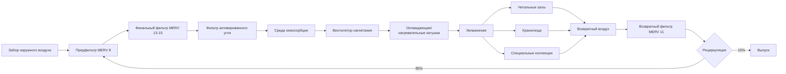

## Требования к фильтрации твердых частиц

Библиотеки редких книг требуют исключительной фильтрации твердых частиц для защиты ценных коллекций от пыли, волокон и переносимых по воздуху загрязнителей, которые ускоряют износ. Накопление твердых частиц на поверхности книг служит подложкой для удержания влаги и химических реакций, повреждающих бумагу, переплеты и чернила.

Фильтрация MERV 13 представляет собой минимально приемлемый стандарт для общих коллекций редких книг, улавливая 90% частиц в диапазоне 1,0–3,0 микрона и 85% в диапазоне 0,3–1,0 микрона. Премиальные коллекции, содержащие инкунабулы, иллюстрированные рукописи или неоценимые документы, требуют фильтрации MERV 15 или выше, достигая эффективности 95% при 1,0–3,0 микронах и 90% при 0,3–1,0 микронах.

Фильтрация HEPA (99,97% при 0,3 микронах) применяется в помещениях специальных коллекций, где рукописи подвергаются консервационным работам или подготовке к экспонированию. Связь эффективности фильтрации следует:

$$\eta = 1 - e^{-\frac{KL}{U}}$$

где $\eta$ — эффективность фильтрации, $K$ — коэффициент фильтра (м⁻¹), $L$ — глубина фильтра (м), а $U$ — лицевая скорость (м/с).

## Удаление газообразных загрязнителей

Газообразные загрязнители представляют равную или большую угрозу редким книгам, чем загрязнение твердыми частицами. Диоксид серы, оксиды азота, озон и органические кислоты катализируют деградацию бумаги посредством окисления и реакций кислотного гидролиза, которые разрывают цепи целлюлозы и делают волокна бумаги хрупкими.

Активированная угольная фильтрация удаляет газообразные загрязнители посредством физической адсорбции и химической реакции. Девственная активированная уголь с большой площадью поверхности (1000–1200 м²/г) обеспечивает срок службы 6–12 месяцев в зависимости от концентрации наружных загрязнителей и расходов воздуха через систему.

Инфильтрированная перманганатом калия оксидная среда специально предназначена для удаления диоксида серы, сероводорода и формальдегида. Эта химически активная среда окисляет загрязнители, преобразуя их в менее вредные соединения, задержанные внутри структуры среды.

Емкость адсорбции следует изотерме Фрейндлиха:

$$q_e = K_f C_e^{1/n}$$

где $q_e$ — адсорбированное количество на единицу массы (мг/г), $C_e$ — равновесная концентрация (мг/м³), $K_f$ — постоянная Фрейндлиха, а $n$ — фактор неоднородности.

## Защита от кислотных паров

Кислотные пары, образующиеся из реакций диоксида серы и оксидов азота с влагой, создают серную и азотную кислоты, которые необратимо повреждают бумагу посредством кислотного гидролиза. Внешние источники включают выхлопные газы транспортных средств, промышленные выбросы и сжигание угля. Внутренние источники связаны с дегазацией из деревянной мебели, клеев ковровых покрытий и даже самих бумажных коллекций.

Среды хемосорбции, специально составленные для удаления кислотных газов, включают:

- Перманганат калия на подложке оксида алюминия (удаление SO₂, H₂S)
- Активированный уголь, инфильтрированный йодидом калия (окислители, озон)
- Смешанная среда, объединяющая активированный уголь и перманганат
- Молекулярные сита из цеолита (формальдегид, органические кислоты)

Требования к глубине среды варьируются от 50–100 мм в зависимости от лицевой скорости и целевых показателей эффективности удаления. Более низкие лицевые скорости (0,3–0,5 м/с) максимизируют время контакта и эффективность адсорбции.

## Конфигурация системы фильтрации

Многоступенчатые системы фильтрации для библиотек редких книг используют последовательные ступени фильтрации, оптимизированные для удаления конкретных загрязнителей.

Предфильтры продлевают срок службы финального фильтра, улавливая более крупные частицы и снижая нагрузку на дорогостоящие среды MERV 13–15 и газовой фильтрации. Интервалы замены фильтра обычно следуют:

- Предфильтры MERV 8: 3–4 месяца
- Финальные фильтры MERV 13–15: 9–12 месяцев
- Активированный уголь: 6–12 месяцев
- Среда хемосорбции: 12–18 месяцев

## Рассмотрение перепада давления

Перепад давления по системе фильтрации непосредственно влияет на энергопотребление вентилятора и пропускную способность системы. Многоступенчатая фильтрация создает значительное сопротивление, требующее тщательного анализа на этапе проектирования.

Общий перепад давления системы равен сумме отдельных перепадов компонентов:

$$\Delta P_{total} = \Delta P_{pre} + \Delta P_{final} + \Delta P_{carbon} + \Delta P_{chem}$$

Начальный и конечный перепады давления значительно отличаются по мере того, как фильтры загружаются захваченными загрязнителями. Проектные расчеты используют среднее значение перепада давления:

$$\Delta P_{avg} = \frac{\Delta P_{initial} + \Delta P_{final}}{2}$$

Типичные значения перепада давления:

| Тип фильтра | Начальный ΔP (Па) | Конечный ΔP (Па) | Лицевая скорость (м/с) |
|-------------|------------------|-----------------|----------------------|
| Предфильтр MERV 8 | 50–75 | 200–250 | 2,5 |
| Финальный MERV 13 | 100–150 | 300–400 | 2,5 |
| Финальный MERV 15 | 150–200 | 400–500 | 2,5 |
| Активированный уголь | 75–125 | 200–300 | 0,5 |
| Среда хемосорбции | 100–150 | 250–350 | 0,4 |
| Фильтр HEPA | 250–300 | 500–600 | 1,3 |

Выбор размера двигателя вентилятора требует мощности при условиях конечного перепада давления плюс коэффициент безопасности 20%. Частотные приводы поддерживают постоянный расход воздуха по мере загрузки фильтров, увеличивая скорость вентилятора для компенсации повышающегося перепада давления.

## Мониторинг качества воздуха

Непрерывный мониторинг качества воздуха подтверждает производительность системы фильтрации и защищает коллекции от воздействия загрязнителей. Мониторинг в реальном времени обеспечивает раннее предупреждение о прорыве фильтра или неисправностях системы.

**Мониторинг твердых частиц**

Оптические счетчики частиц измеряют концентрации частиц в шести диапазонах размеров (0,3, 0,5, 1,0, 2,5, 5,0, 10,0 микронов). Целевые концентрации для зон редких книг:

- 0,3–0,5 μm: <500 000 частиц/м³
- 0,5–1,0 μm: <50 000 частиц/м³
- 1,0–2,5 μm: <10 000 частиц/м³
- >2,5 μm: <1 000 частиц/м³

**Мониторинг газообразных загрязнителей**

Электрохимические датчики отслеживают ключевые загрязнители, влияющие на бумажные коллекции:

| Загрязнитель | Целевой уровень | Порог сигнализации | Метод измерения |
|-------------|-----------------|-------------------|-----------------|
| SO₂ | <2 μг/м³ | >5 μг/м³ | Электрохимическая ячейка |
| NO₂ | <5 μг/м³ | >10 μг/м³ | Электрохимическая ячейка |
| O₃ | <2 μг/м³ | >5 μг/м³ | УФ-поглощение |
| Формальдегид | <10 μг/м³ | >20 μг/м³ | Фотометрический |
| Уксусная кислота | <50 μг/м³ | >100 μг/м³ | ГХ/МС отбор проб |
| Муравьиная кислота | <25 μг/м³ | >50 μг/м³ | ГХ/МС отбор проб |

**Мониторинг дифференциального давления**

Манометры Magnehelic или электронные датчики давления отслеживают перепад давления на каждой ступени фильтра. Растущее давление указывает на загрузку фильтра; снижающееся давление предполагает отказ фильтра или обход. Точки сигнализации срабатывают при 90% от конечного расчетного перепада давления, планируя замену фильтра до деградации производительности.

**Логирование и анализ данных**

Системы автоматизации зданий логируют данные о качестве воздуха через интервалы 15 минут, генерируя отчеты о тенденциях, определяя сезонные закономерности, деградацию производительности фильтра и эпизоды наружного загрязнения. Ежегодный анализ сопоставляет воздействие загрязнителей с оценками состояния коллекций, подтверждая эффективность системы фильтрации.

Пассивный мониторинг с использованием металлических пластинок или полосок pH-индикатора дополняет электронный мониторинг, обеспечивая долгосрочные данные об усредненном воздействии независимо от работы электронной системы. Эти дозиметры остаются в зонах коллекций в течение периодов 3–6 месяцев, затем лабораторный анализ количественно определяет кумулятивное воздействие загрязнителей.
