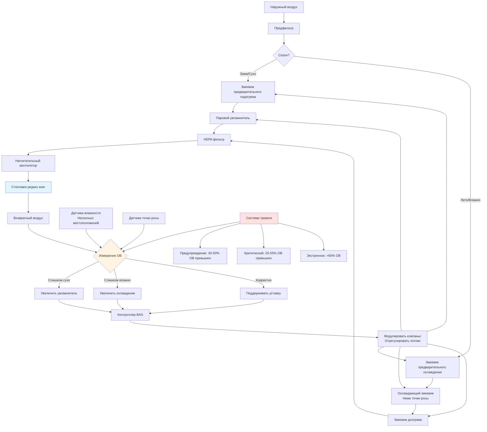

Контроль влажности представляет наиболее критический параметр окружающей среды для сохранения редких книг. Колебания относительной влажности вызывают изменения размеров гигроскопических материалов, ускоряют химическую деградацию и создают условия, благоприятные для биологического роста. Точное управление влажностью требует круглогодичного мониторинга, быстрого реагирования и избыточных систем управления.

## Целевые диапазоны влажности

Консенсусный стандарт для хранения редких книг поддерживает относительную влажность между 30-50% ОВ, при этом 35-45% ОВ представляет оптимальный диапазон для большинства коллекций. Эта узкая полоса уравновешивает конкурирующие риски: низкая влажность делает бумагу хрупкой и высушивает кожаные переплеты, в то время как высокая влажность способствует росту плесени и ускоряет кислотный гидролиз.

### Требования, специфичные для материалов

| Тип материала | Оптимальный диапазон ОВ | Максимальное колебание | Критические проблемы |
|--------------|------------------------|----------------------|----------------------|
| Бумага (тряпичное содержание) | 35-45% | ±3% в день | Стабильность размеров |
| Бумага (древесная целлюлоза) | 30-40% | ±3% в день | Ускорение кислотного гидролиза |
| Кожаные переплеты | 45-55% | ±5% в день | Пересушивание и красная гниль |
| Пергамент/веллум | 45-55% | ±2% в день | Крайняя гигроскопическая реакция |
| Фотоматериалы | 30-40% | ±3% в день | Деградация эмульсии |
| Смешанные коллекции | 35-45% | ±3% в день | Компромисс между крайностями |

Стабильность важнее абсолютного значения. Постоянная влажность 48% ОВ причиняет меньше вреда, чем цикличные колебания между 35-45% ОВ, так как размерные напряжения от расширения и сжатия ослабляют переплетные конструкции и трещат хрупкую бумагу.

## Механизмы деградации бумаги

Влажность напрямую влияет на скорость химической и физической деградации. Кислотный гидролиз целлюлозы—первичный механизм старения в кислотной бумаге—следует соотношению:

$$k = A e^{-E_a/RT} \cdot f(RH)$$

где $k$ представляет константу скорости реакции, $E_a$ — энергия активации (типично 80-100 кДж/моль для гидролиза целлюлозы), $R$ — газовая постоянная, $T$ — абсолютная температура, и $f(RH)$ — зависящий от влажности фактор, экспоненциально растущий выше 50% ОВ.

При 70% ОВ кислотный гидролиз протекает приблизительно в 3-4 раза быстрее, чем при 40% ОВ при постоянной температуре. Содержание влаги $M$ в целлюлозных материалах следует сорбционным изотермам:

$$M = \frac{aRH}{1-bRH} + \frac{cRH}{1+dRH}$$

где $a$, $b$, $c$ и $d$ — коэффициенты, специфичные для материала. Это соотношение объясняет, почему изменения размеров ускоряются выше 60% ОВ, когда влага проникает глубже в структуру волокон.

## Сезонное управление влажностью

География климата определяет сезонные стратегии:

**Объекты в холодном климате (сезон зимнего отопления)**
- Наружный воздух при -10°C и 80% ОВ содержит только 0,0015 кг влаги на кг сухого воздуха
- При нагреве до 20°C это снижается до 10% ОВ
- Паровое увлажнение требуется для поддержания уставки 40% ОВ
- Производительность увлажнителя: 0,0045 кг H₂O на кг сухого воздуха при типичных условиях отопления

**Объекты во влажном климате (летний сезон охлаждения)**
- Наружный воздух при 30°C и 80% ОВ содержит 0,0214 кг влаги на кг сухого воздуха
- Охлаждение до 20°C и 50% ОВ требует удаления 0,0141 кг H₂O на кг сухого воздуха
- Необходимо выделенное осушение или охлаждение ниже точки росы
- Штраф на энергию доогрева для надлежащего контроля влажности

**Переходные периоды**
- Наиболее сложные периоды управления из-за быстрых изменений наружных условий
- Тепловая масса здания создает задержку в реакции внутренней влаги
- Требуется как увлажнение, так и осушение в режиме ожидания

## Системы осушения

Несколько технологий решают проблему избыточной влажности:

**Охлаждающие змеевики с холодной водой**
Снижают температуру воздуха ниже точки росы для конденсации влаги. Температура поверхности змеевика должна достичь:

$$T_{coil} = T_{dp,supply} - \Delta T_{approach}$$

где $T_{dp,supply}$ — температура точки росы подаваемого воздуха и $\Delta T_{approach}$ — температурный подход (типично 2-3°C). Требует доогрева для поддержания надлежащей температуры подачи, создавая штраф на энергию.

**Десикантное осушение**
Использует твердые или жидкие десиканты для поглощения влаги без охлаждения ниже точки росы. Регенерация требует тепла, типично 120-150°C. Коэффициент производительности:

$$COP_{desiccant} = \frac{m_{H_2O} \cdot h_{fg}}{Q_{regen}}$$

где $m_{H_2O}$ — масса удаленной воды, $h_{fg}$ — скрытая теплота парообразования (2450 кДж/кг), и $Q_{regen}$ — входящее тепло регенерации. Типичные значения COP колеблются от 0,5-1,0.

**Выделенные системы наружного воздуха (DOAS)**
Разделяют скрытые и явные нагрузки. Осушают вентиляционный воздух до низкой точки росы (10-13°C точка росы), затем подают воздух нейтральной температуры. Исключают нагрузку влажности из оборудования кондиционирования помещения.

## Системы увлажнения

Зимнее увлажнение поддерживает минимальную ОВ:

**Паровые увлажнители**
Впрыскивают чистый пар из электрических или газовых генераторов. Обеспечивают точный контроль, без загрязнения минералами, самостерилизирующиеся. Потребление энергии:

$$Q_{steam} = \dot{m}_{steam} \cdot h_{fg} = \dot{m}_{air} \cdot (W_{supply} - W_{return}) \cdot h_{fg}$$

где $\dot{m}_{steam}$ — расход пара по массе и $W$ представляет коэффициент влажности в кг H₂O на кг сухого воздуха.

**Испарительные увлажнители**
Адиабатический процесс, без внешнего теплоснабжения. Более низкая стоимость энергии, но риск отложения минералов и биологического роста. Требуют деионизированную или обратноосмотическую воду для приложений с редкими книгами.

**Ультразвуковые увлажнители**
Тонкое генерирование тумана через пьезоэлектрические преобразователи. Компактные, тихие, но требуют высокого качества воды для предотвращения белых отложений пыли на коллекциях.

## Стратегии предотвращения плесени

Пороговое значение роста плесени достигается при 65-70% ОВ для большинства видов при устойчивом воздействии 72+ часа. Предотвращение требует:

**Первичные управления**
- Поддерживать ОВ ниже 60% при всех рабочих условиях
- Исключить холодные поверхности, где может произойти конденсация
- Обеспечить адекватную циркуляцию воздуха в областях хранения (минимум 4 воздухообмена в час)

**Управление поверхностной точкой росы**
Все внутренние поверхности должны оставаться выше точки росы. Для 20°C и 40% ОВ (точка росы 6°C), значение R изоляции должно предотвратить температуру поверхности ниже 10°C:

$$R_{required} = \frac{T_{inside} - T_{outside}}{U \cdot (T_{inside} - T_{surface,min})}$$

**Мониторинг**
- Непрерывное измерение ОВ в нескольких местоположениях
- Логирование данных с интервалами 5-15 минут
- Тревоги для выходов за пределы ±5% от уставки
- Ежегодная калибровка датчиков в сравнении со стандартами, прослеживаемыми к NIST

## Мониторинг и тревожные сигналы

Комплексный мониторинг влажности требует:

**Расположение датчиков**
- Один датчик на 1000-2000 кв.м площади хранилища
- Дополнительные датчики в высокорисковых местах (внешние стены, рядом с механическими системами)
- Избыточное измерение в критических помещениях хранилища
- Выборка вариации по высоте (пол, середина высоты, потолок)

**Пороги тревоги**
- Предупреждающая тревога: ОВ вне диапазона 35-45% более 2 часов
- Критическая тревога: ОВ <30% или >55% более 30 минут
- Экстренная тревога: ОВ >60% (требуется немедленный ответ)
- Тревога скорости изменения: >5% ОВ изменения в час

**Протоколы реагирования**
- Автоматическое уведомление управления объектом
- Эскалация персоналу сохранения при расширенных событиях
- Процедуры временного перемещения коллекции при отказе оборудования
- Переносное осушающее оборудование в режиме ожидания

Успешный контроль влажности для коллекций редких книг требует понимания физики переноса влаги, химии деградации материалов и инженерии систем точного управления. Инвестиция в надлежащее оборудование и инфраструктуру мониторинга обеспечивает измеримое продление срока жизни коллекции, часто оправдывая затраты через избежанное консервационное лечение и потерю невозместимого материала.
