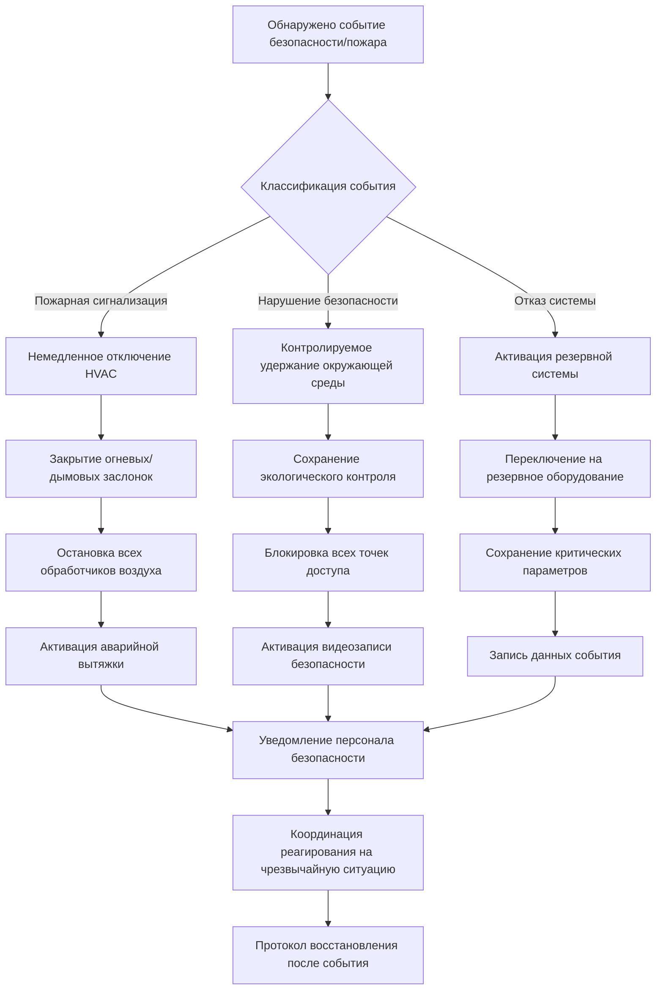

## Обзор

HVAC системы в редких библиотеках создают уникальные проблемы безопасности, требующие тщательной интеграции экологического контроля с мерами физической безопасности. Воздуховоды и механические проникновения создают потенциальные точки несанкционированного входа, пожарные опасности и уязвимости безопасности, требующие комплексных стратегий защиты с балансировкой требований сохранения и защиты объекта.

## Безопасность воздуховодов для ценных материалов

Воздуховоды представляют критическую уязвимость безопасности в объектах с неоценимыми коллекциями. Системы распределения воздуха должны включать функции безопасности, предотвращающие несанкционированный доступ при сохранении оптимальных условий окружающей среды.

### Защита проникновений через воздуховоды

**Установка стальных решеток:**
- Установите сварные стальные решетки с полосами на всех наружных выходах воздуховодов
- Минимальный зазор между полосами: 100 мм максимум
- Диаметр полосы: минимум 12,7 мм для зон высокой безопасности
- Безопасное крепление с винтами, защищенными от несанкционированного отключения
- Расположение решеток для предотвращения снятия с наружной стороны

**Выбор материала воздуховода:**
Спецификации воздуховодов с рейтингом безопасности:
- Зоны высокой безопасности: оцинкованная сталь калибра 16 минимум
- Стандартные зоны: оцинкованная сталь калибра 20
- Избегайте гибких воздуховодов в доступных потолочных пространствах
- Усилите воздуховод на критических проникновениях стальным калибром 14

### Расчеты предотвращения доступа

Коэффициент безопасности проникновений $PSF$ оценивает уязвимость воздуховода:

$$PSF = \frac{A_d \times F_a}{L_p \times t_w}$$

Где:
- $A_d$ = площадь поперечного сечения воздуховода (м²)
- $F_a$ = коэффициент доступности (1.0 = общедоступно, 0.5 = защищено)
- $L_p$ = длина пути через защищенный барьер (м)
- $t_w$ = эквивалентная толщина стенки (мм)

Целевое значение $PSF < 2.0$ для установок высокой безопасности.

## Безопасность проникновений HVAC

Проникновения оболочки здания для механических систем требуют тщательной герметизации и мер безопасности для защиты от вторжений при сохранении огневых и дымовых барьеров.

### Стандарты герметизации проникновений

**Проникновения через огневые барьеры:**

| Рейтинг барьера | Система герметизации | Усиление безопасности |
|-----------------|----------------------|----------------------|
| Огневая стена 2 часа | Противопожарное уплотнение UL | Стальной рукав с мониторингом |
| Огневая стена 1 час | Самозатухающее уплотнение | Защищенная от несанкционированного отключения проверка |
| Дымовой барьер | Уплотнение дымового барьера | Доступ для визуального контроля |
| Стена безопасности | Уплотнение с баллистической защитой | Интеграция обнаружения движения |

**Требования к установке:**
- Все проникновения через барьеры безопасности требуют документированного одобрения
- Минимальное кольцевое пространство 50 мм для надлежащей установки противопожарного уплотнения
- Установите проникновения только в контролируемых или недоступных местах
- Ведите полную документацию системы противопожарного уплотнения

### Мониторинг проникновений

Эффективность мониторинга проникновений $PME$ количественно оценивает способность обнаружения:

$$PME = \frac{N_m \times R_r}{N_t} \times 100\%$$

Где:
- $N_m$ = количество контролируемых проникновений
- $R_r$ = коэффициент надежности реагирования (0.85-0.99)
- $N_t$ = количество критических проникновений

Целевое значение $PME > 95\%$ для механических систем редких книжных хранилищ.

## Обнаружение пожара в воздуховодах

Системы обнаружения пожара и дыма в воздуховодах обеспечивают возможности раннего предупреждения, необходимые для защиты неоценимых коллекций от пожара и повреждения дымом.

### Проектирование системы обнаружения

**Размещение датчиков дыма в воздуховодах:**
- Установите датчики в приточных и обратных воздуховодах, обслуживающих помещения хранилища
- Расположите датчики минимум на 150 мм от стенок воздуховода
- Размещайте выше по потоку от выхода обработчика воздуха
- Установите в обратном воздухе перед дымовыми заслонками
- Диапазон скорости отбора проб: 1.5-20.3 м/с

**Параметры чувствительности:**
Редкие библиотеки требуют повышенной чувствительности:
- Порог тревоги: 2-4% затемнения на метр
- Предварительное уведомление: 1-2% затемнения на метр
- Время реагирования: максимум 30 секунд до тревоги
- Интеграция с последовательностью отключения HVAC

### Расчет охвата датчиками

Требуемый интервал размещения датчиков $S_d$ на основе геометрии воздуховода:

$$S_d = \frac{V_d}{A_d \times SR}$$

Где:
- $V_d$ = объем обнаружения на устройство (м³)
- $A_d$ = площадь поперечного сечения воздуховода (м²)
- $SR$ = эффективность частоты отбора проб (обычно 0.85)

## Интеграция аварийного отключения

Координированные процедуры аварийного отключения защищают коллекции во время пожара, нарушений безопасности или отказов системы окружающей среды через интегрированные последовательности управления.

### Проектирование последовательности отключения

### Требования ко времени реагирования

Критические параметры времени отключения:
- От пожарной сигнализации до остановки вентилятора: максимум 10 секунд
- Время закрытия заслонки: максимум 30 секунд
- Аварийное уведомление: одновременно с отключением
- Проверка статуса системы: в течение 60 секунд

## Контроль доступа в механические помещения

Механические пространства, обслуживающие редкие библиотеки, требуют строгого контроля доступа для защиты от несанкционированного доступа, саботажа и неоправданных регулировок окружающей среды.

### Иерархия контроля доступа

**Уровни безопасности:**

| Зона | Требования доступа | Уровень контроля |
|------|-------------------|-----------------|
| Помещение основного AHU хранилища | Биометрия + карта + сопровождение | Непрерывное видео + обнаружение движения |
| Помещения вспомогательных систем | Доступ по карте + PIN | Видео при входе |
| Общие механические пространства | Доступ по карте | Периодическая проверка |
| Наружное оборудование | Запертый корпус | Контроль периметра |

**Методы аутентификации:**
- Многофакторная аутентификация для критического оборудования
- Авторизация доступа с ограничением по времени
- Логирование доступа с корреляцией событий
- Автоматическая блокировка в нерабочее время

### Требования аудита доступа

Коэффициент соответствия доступа $ACF$ оценивает эффективность контроля:

$$ACF = \frac{N_a - N_u}{N_a} \times 100\%$$

Где:
- $N_a$ = общее количество авторизованных событий доступа
- $N_u$ = несанкционированные или аномальные события

Поддерживайте $ACF > 99.5\%$ для механических систем объектов редких книг.

## Влияние вибрации и шума

Вибрация и шум механических систем могут нарушить как системы безопасности, так и условия сохранения, требуя тщательной изоляции и звукоизоляции.

### Контроль вибрации

**Помехи системе безопасности:**
- Диапазон частот вибрации HVAC: 5-500 Гц
- Рабочий диапазон датчиков безопасности: 10-10 000 Гц
- Возможность ложных срабатываний на резонансных частотах
- Требования изоляции предотвращают деградацию системы безопасности

**Проектирование изоляции вибрации:**
Расчет минимальной эффективности изоляции $\eta_v$:

$$\eta_v = \left(1 - \frac{1}{\left(\frac{f}{f_n}\right)^2 - 1}\right) \times 100\%$$

Где:
- $f$ = возмущающая частота (Гц)
- $f_n$ = собственная частота системы изоляции (Гц)

Целевое значение $\eta_v > 90\%$ для оборудования рядом с зонами высокой безопасности.

### Акустические соображения безопасности

**Передача звука через воздуховоды:**
- Воздуховоды могут передавать разговоры из защищенных зон
- Установите акустическое покрытие в воздуховодах, обслуживающих помещения хранилища
- Рассмотрите затухание перекрестных помех между защищенными зонами
- Минимум 15 дБ затухания между критическими пространствами

**Маскировка шума:**
Контролируемый фоновый шум может повысить безопасность:
- NC-30 до NC-35 рекомендуется для помещений для чтения редких книг
- Предотвращает передачу звука через системы воздуховодов
- Маскирует звуки работы системы безопасности
- Избегает акустических сигналов, раскрывающих меры безопасности

## Лучшие практики интеграции безопасности

**Скоординированное проектирование системы:**
- Интегрируйте элементы управления HVAC с системами управления зданием и безопасности
- Установите четкие протоколы взаимодействия между системами
- Регулярное тестирование интегрированных аварийных реагирований
- Ведите избыточные пути уведомления

**Требования к документации:**
- Полные чертежи в масштабе здания, показывающие все проникновения
- Четко определенные точки взаимодействия системы безопасности
- Документация последовательности аварийного отключения
- Диаграммы интеграции системы контроля доступа

**Безопасность при техническом обслуживании:**
- Проверьте допуск подрядчика к безопасности перед механическим доступом
- Требования сопровождения во время деятельности по техническому обслуживанию
- Проверка статуса системы после завершения техническим обслуживанием
- Защищенные от несанкционированного отключения уплотнения на критических компонентах

**Протоколы тестирования:**
- Ежеквартальное интегрированное системное тестирование
- Годовые оценки проникновения в область безопасности
- Проверка функциональности датчика
- Координация учений экстренного реагирования

## Заключение

Интеграция безопасности в системы HVAC редких библиотек требует комплексной координации между экологическим контролем, физической безопасностью и системами безопасности жизни. Надлежащие конструкции безопасности воздуховодов, защиты проникновений, обнаружения пожара, процедур аварийного отключения и контроля доступа создают многоуровневую защиту, защищающую неоценимые коллекции при сохранении оптимальных условий сохранения. Регулярное тестирование и техническое обслуживание интегрированных систем обеспечивает постоянную защиту этих бесценных культурных ресурсов.
