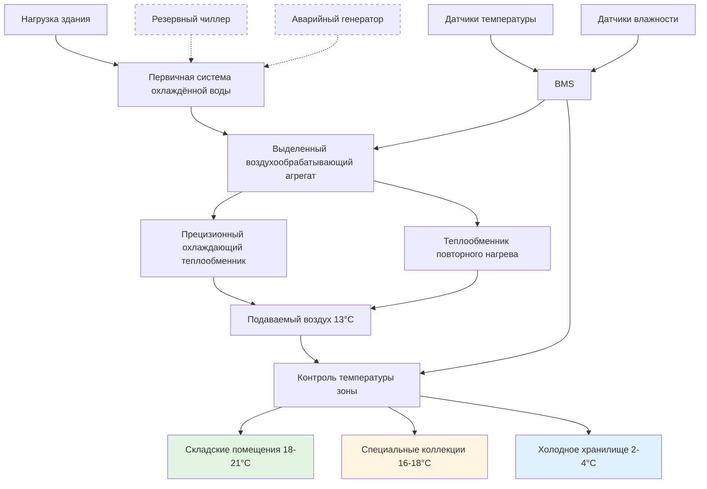

Контроль температуры является основным параметром окружающей среды, влияющим на долговечность коллекций редких книг. Процессы химической деградации, разрушающие бумагу, переплёты и чернила, следуют кинетике реакций, зависящей от температуры, что делает точное управление температурой необходимым для сохранения.

## Целевой диапазон температуры

Стандартный диапазон температур для хранения редких книг составляет **18-21°C**. Этот диапазон уравновешивает требования сохранения с комфортом персонала и исследователей, получающих доступ к материалам. Выбор основан на принципах химической кинетики: более низкие температуры значительно замедляют реакции деградации, оставаясь практичными для занятых помещений.

| Тип хранилища | Диапазон температуры | Требование стабильности | Применение |
|-------------|-------------------|----------------------|-------------|
| Общие редкие книги | 18-21°C | ±0,5°C | Стандартное архивное хранилище |
| Специальные коллекции | 16-18°C | ±0,3°C | Материалы высокой стоимости |
| Холодное хранилище | 2-4°C | ±0,5°C | Долгосрочное сохранение |
| Фотографические материалы | 2-7°C | ±0,5°C | Цветные фотографии, негативы |
| Читальные залы | 20-22°C | ±0,8°C | Занятые исследовательские пространства |
| Рабочие помещения | 20-22°C | ±0,8°C | Консервационные мастерские |

### Скорость химических реакций и температура

Взаимосвязь между температурой и скоростью деградации подчиняется **уравнению Аррениуса**:

$$k = A \cdot e^{-\frac{E_a}{RT}}$$

Где:
- $k$ = константа скорости реакции
- $A$ = предэкспоненциальный множитель
- $E_a$ = энергия активации (обычно 80-100 кДж/моль для деградации бумаги)
- $R$ = универсальная газовая постоянная (8,314 Дж/моль·К)
- $T$ = абсолютная температура (К)

Для практического применения **коэффициент продления срока службы** при снижении температуры с $T_1$ на $T_2$ составляет:

$$\frac{t_2}{t_1} = e^{\frac{E_a}{R}\left(\frac{1}{T_2} - \frac{1}{T_1}\right)}$$

**Пример расчёта**: Снижение температуры хранения с 24°C (297 К) до 18°C (291 К) при $E_a = 90$ кДж/моль:

$$\frac{t_2}{t_1} = e^{\frac{90000}{8.314}\left(\frac{1}{291} - \frac{1}{297}\right)} = e^{0.747} = 2.11$$

Это снижение на 3°C **удваивает ожидаемый срок службы** материалов.

## Требования к стабильности температуры

Стабильность температуры столь же важна, как абсолютная температура. Приемлемые критерии стабильности:

- **Краткосрочные (почасовые)**: максимальное отклонение ±0,5°C
- **Суточные колебания**: максимальный диапазон ±1°C
- **Сезонный дрейф**: Постепенные изменения 1,5-3°C в течение месяцев приемлемы
- **Скорость изменения**: Менее 0,5°C в час для предотвращения механических напряжений

Быстрые колебания температуры вызывают изменения размеров гигроскопических материалов. Бумага расширяется и сжимается с колебаниями температуры, что приводит к:
- Гофрированию и деформации страниц
- Напряжениям в структуре переплёта
- Ускоренному механическому утомлению
- Повышенной восприимчивости к повреждениям при обращении

## Холодное хранилище для специальных коллекций

Высокоценные коллекции получают выгоду от выделенных **хранилищ холодного хранения**, поддерживаемых при 2-4°C. В этом диапазоне температур:

- **Скорость деградации** снижается в 4-8 раз по сравнению с 18°C
- **Ожидаемый срок службы** продлевается с веков до тысячелетий для материалов без кислоты
- **Окислительные реакции** протекают с минимальной скоростью
- **Биологическая активность** (плесень, насекомые) эффективно устраняется

Внедрение холодного хранилища требует:
- **Протоколы акклиматизации**: Материалы должны уравновеситься с комнатной температурой перед обращением (2-4 часа на 2,5 см толщины)
- **Отдельные системы HVAC**: Выделенное оборудование предотвращает перекрёстное загрязнение температурных зон
- **Пароизоляция**: Предотвращает конденсацию при перемещении материалов между зонами
- **Обучение персонала**: Надлежащие процедуры извлечения и возврата материалов

## Стратегии климат-контроля

### Принципы проектирования систем

**1. Выделенные системы HVAC**
- Отдельные воздухообрабатывающие агрегаты для архивных помещений изолируют от нагрузок здания
- Исключают нарушения температуры от смежных помещений
- Позволяют независимое управление уставками и расписанием

**2. Конфигурация повторного нагрева**
- Подаваемый воздух охлаждается до 13°C для осушения
- Электрический или горячий водяной повторный нагрев повышает температуру до уставки
- Разделяет контроль температуры и влажности
- Обеспечивает прецизионное чувствительное охлаждение без переохлаждения

**3. Использование тепловой массы**
- Массивные коллекции книг высокой плотности обеспечивают тепловую инерцию
- Массивное строительство (бетон, кладка) стабилизирует температуру
- Ограничивает скорость изменения температуры при отказах оборудования

**4. Стратегия зонирования**
- Отдельные зоны для различных требований по температуре
- Внутренние зоны для наиболее чувствительных материалов (минимальные нагрузки через ограждающую конструкцию)
- Периметральные зоны с более высокими уставками буферизируют тепловую передачу

## Энергетическая эффективность при более низких температурах

Более низкие уставки температуры создают последствия для энергии HVAC:

**Преимущества отопительного сезона**:
- Сокращённая отопительная нагрузка пропорциональна разности температур внутреннего и наружного воздуха: $Q = UA(T_{indoor} - T_{outdoor})$
- Для уставки 18°C в сравнении с 22°C при $U = 0,002$ кВт/м²·°C и площади ограждающей конструкции 930 м² при наружной температуре -7°C:
  - Уставка 22°C: $Q = 0,002 \times 930 \times (22-(-7)) = 54,2$ кВт
  - Уставка 18°C: $Q = 0,002 \times 930 \times (18-(-7)) = 46,5$ кВт
  - **Экономия**: 14% снижение энергии отопления

**Соображения охлаждающего сезона**:
- Более низкая уставка увеличивает нагрузку охлаждения и энергию компрессора
- Сниженная скрытая нагрузка при более низких температурах (воздух содержит меньше влаги)
- Часы экономайзера расширяются благодаря более низким требованиям к подаваемому воздуху

**Стратегии оптимизации**:
- Приводы с переменной частотой вращения на вентиляторах подачи снижают энергию распределения
- Системы рекуперации энергии захватывают охлаждение/нагрев из вытяжного воздуха
- Ночное снижение уставки невозможно из-за требований стабильности
- Сезонная настройка в приемлемом диапазоне дрейфа (1,5-3°C) оптимизирует годовую энергию

**Анализ стоимости жизненного цикла** последовательно показывает, что энергетические штрафы компенсируются:
- Продлённым сроком службы коллекций (отложенные затраты на замену)
- Сниженными требованиями к консервационной обработке
- Более низкими страховыми премиями для лучшего контроля окружающей среды
- Улучшенной репутацией учреждения и доверием доноров

## Лучшие практики внедрения

**Спецификации системы управления**:
- Контроллеры DDC с точностью управления температурой ±0,3°C
- Несколько избыточных датчиков на зону (минимум 2, усреднённые)
- Регистрация данных каждые 15 минут для мониторинга окружающей среды
- Пороги тревоги: ±1,5°C от уставки вызывает немедленное уведомление

**Требования к пусконаладке**:
- 30-дневный непрерывный мониторинг, демонстрирующий соответствие требованиям стабильности
- Тестирование нагрузки в пиковых летних/зимних условиях
- Испытание режимов отказа резервных систем
- Документирование времени восстановления после нарушений

**Эксплуатационные протоколы**:
- Ежеквартальная калибровка датчиков температуры
- Ежегодная настройка контура управления
- Профилактическое обслуживание предотвращает отказы оборудования
- Обучение персонала процедурам аварийной защиты

Надлежащий контроль температуры продлевает срок службы уникальных культурных материалов при сохранении доступности для научных исследований. Инвестиции в системы прецизионного HVAC приносят дивиденды через улучшенные результаты сохранения и снижение долгосрочных затрат на консервацию.
