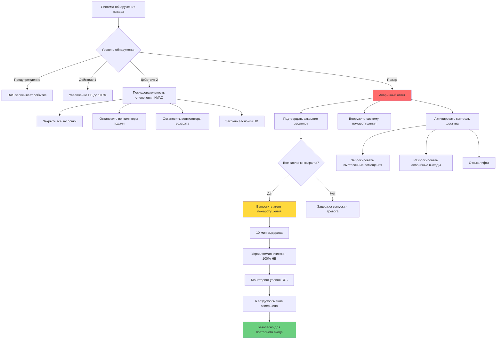

## Координация системы пожаротушения

Интеграция HVAC и противопожарных систем в музеях требует тщательной координации для защиты бесценных экспонатов при сохранении контроля окружающей среды. NFPA 909 (Код защиты культурного наследия) и NFPA 2001 (Стандарт систем пожаротушения чистым агентом) регламентируют эти критические точки соприкосновения.

### Интеграция системы чистого агента

Музеи обычно используют системы пожаротушения чистым агентом (FM-200, Novec 1230, Inergen) вместо водяных систем для предотвращения водяного повреждения коллекций. Требования координации HVAC включают:

**Последовательность перед выпуском:**
1. Система HVAC получает сигнал пожарной тревоги от системы обнаружения
2. Вентиляторы подачи и вытяжки отключаются в течение 30 секунд
3. Противопожарные заслонки закрываются во всех проходах защищаемого помещения
4. Заслонки возвратного воздуха закрываются для предотвращения потерь агента
5. Заслонки наружного воздуха полностью закрываются
6. Система автоматизации здания подтверждает закрытие заслонок перед выпуском агента

**Требования после выпуска:**
- HVAC остается выключенной в течение минимум 10-минутного времени выдержки (проверьте у производителя системы пожаротушения)
- Управляемый цикл очистки начинается после выдержки с использованием 100% наружного воздуха
- Минимум 6 воздухообменов перед повторным входом в помещение
- Мониторинг CO₂ во время очистки для проверки удаления агента

### Координация противопожарных и дымовых заслонок

| Тип заслонки | Расположение | Класс надежности | Требование интеграции |
|-------------|----------|----------------|------------------------|
| Противопожарные заслонки | Все проходы в стены с классом защиты | 1,5-часовые или 3-часовые | Гравитационное или пружинное закрытие, отказобезопасное |
| Дымовые заслонки | Нагнетание ВКУ, возвратный воздух | UL 555S | Электрически приводимые, мониторинг закрытия |
| Комбинированные заслонки | Помещения смешанного использования | Оба класса - противопожарный и дымовой | Двойное управление, мониторинг положения |
| Коридорные заслонки | Общественные пространства циркуляции | Контроль дыма | Интеграция с пультом управления пожарной сигнализацией |

**Критические точки интеграции:**
- Концевые выключатели заслонок должны передавать данные на BAS и пульт управления пожарной сигнализацией
- Отказобезопасная конструкция требует закрытия заслонок при отключении питания
- Требуется ручной сброс после пожарного события
- Ежегодное тестирование согласно NFPA 80 с работающей системой HVAC

## Система очень раннего обнаружения дыма (VESDA)

Системы VESDA обеспечивают наиболее раннее возможное предупреждение в музейной среде благодаря технологии воздушной выборки. Интеграция HVAC необходима для правильной работы.

**Проектирование точек выборки:**
- Пробоотборные датчики расположены в воздуховодах подачи, возврата и потолочных пространствах
- Расстояние между датчиками: 0,019-0,037 м² на точку выборки в зависимости от настройки чувствительности
- Интеграция с системами VAV требует компенсации расхода в BAS
- Минимальная скорость транспорта: 1 м/с в пробоотборных трубопроводах

**Ответ системы HVAC:**
- Уровень предупреждения: Запись события, отсутствие действия HVAC
- Уровень действия 1: Увеличение наружного воздуха до максимума, оповещение персонала
- Уровень действия 2: Отключение HVAC, активация последовательности эвакуации дыма
- Уровень пожара: Полное отключение, закрытие заслонок, вооружение системы пожаротушения

## Интеграция системы контроля доступа

Системы физической безопасности должны координироваться с HVAC для сохранения целостности окружающей среды при одновременном контроле доступа к чувствительным коллекциям.

### Требования интеграции

| Интерфейс системы | Функция | Ответ HVAC | Уровень приоритета |
|-----------------|----------|---------------|----------------|
| Считыватели карт на дверях хранилища | Запись доступа | Проверка давления перед разблокировкой двери | Критический |
| Датчики движения в галереях | Внутренняя тревога | Поддержание температур отключения, запись изменений потока | Высокий |
| Концевые выключатели дверей | Несанкционированное открытие двери | Тревога при потере давления, увеличение НВ | Высокий |
| Турникеты/шлюзы | Мониторинг потока посетителей | Регулировка НВ на основе количества людей | Средний |
| Аварийные выходы | Эвакуация при пожаре | Разблокировка электромагнитных замков, поддержание контроля дыма | Критический |

**Нагнетание давления и контроль доступа:**

Помещения хранилищ и складов поддерживают положительное давление (0,5-1,25 мбар относительно соседних помещений) для предотвращения инфильтрации. Последовательность доступа через дверь:

1. Аутентификация считывателем карт
2. BAS подтверждает поддержание положительного давления
3. Заслонка сброса давления предварительно открывается за 5 секунд до разблокировки двери
4. Дверь разблокируется на 10-секундный временной интервал доступа
5. Концевой выключатель двери подтверждает закрытие
6. Заслонка сброса давления закрывается
7. Система восстанавливает расчетное давление в течение 60 секунд

**Аварийное переопределение:**

Активация пожарной сигнализации вызывает немедленное переопределение контроля доступа согласно NFPA 101 (Кодекс безопасности жизни):
- Электромагнитные замки отпускают все пути эвакуации
- Считыватели карт переходят в режим свободной эвакуации
- HVAC переходит в режим контроля дыма (если оборудована)
- Двери хранилища остаются запертыми, если только они не находятся на пути эвакуации

## Проектирование системы контроля дыма

Для многоэтажных музеев системы контроля дыма согласно NFPA 92 требуют специальных режимов HVAC:

**Режим эвакуации дыма:**
- Вентиляторы вытяжки в зоне пожара работают на 100% производительности
- Вентиляторы подачи в зоне пожара отключаются
- Соседние зоны поддерживают положительное давление (1,25-2,5 мбар)
- Активируется нагнетание воздуха в лестничной клетке (минимум 2,5 мбар)

**Испытание на приемку:**
- Измерение дифференциалов давления с закрытыми и открытыми дверями
- Проверка высоты интерфейса слоя дыма (минимум 1,8 м над полом)
- Подтверждение времени отклика BAS менее 60 секунд от сигнала тревоги
- Документирование времени закрытия и положения заслонок

## Тестирование и пусконаладка системы

Комплексное тестирование должно проверить координацию между всеми системами:

1. **Испытание функциональных характеристик:** Имитация условий пожара, проверка отключения HVAC, закрытия заслонок и последовательности вооружения системы пожаротушения
2. **Испытание связи:** Подтверждение проводных сигналов между пультом пожарной сигнализации и BAS, проверка режимов отказа сети
3. **Проверка последовательности операций:** Документирование фактических значений времени в сравнении с расчетными спецификациями
4. **Ежегодное тестирование:** Согласно NFPA 25, тестирование всех интерфейсов ежегодно с полной работающей системой

**Требования документации:**
- Чертежи по состоянию (as-built) с указанием всех точек интеграции
- Матрицы последовательности операций для каждого сценария пожара
- Ведомость заслонок с классами надежности и точками мониторинга
- Контактная информация подрядчиков пожарной сигнализации, HVAC и безопасности

Интеграция систем безопасности и HVAC в музеях требует строгого инженерного подхода и постоянной пусконаладки. Последствия неудачной координации варьируются от неэффективного пожаротушения до необратимого повреждения экспонатов, что делает это одним из наиболее критических аспектов проектирования системы контроля окружающей среды в музеях.
