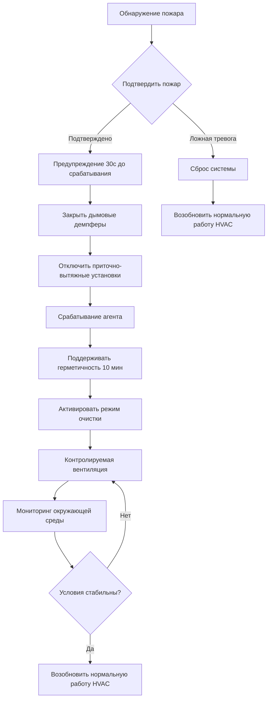
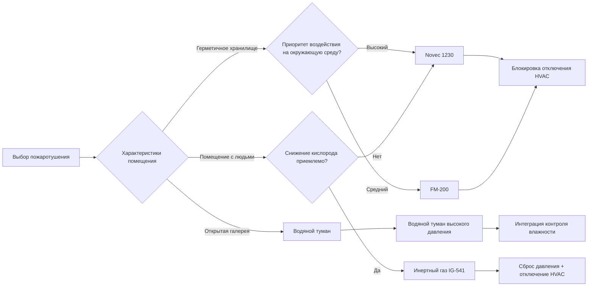

Системы пожаротушения для музеев, галерей, архивов и библиотек требуют специальной интеграции с системами HVAC для защиты бесценных коллекций при минимизации побочного ущерба. В отличие от обычных коммерческих помещений, эти учреждения требуют агентов пожаротушения, которые не оставляют остатков, не наносят водяного ущерба и сохраняют экологическую стабильность во время и после срабатывания.

## Системы пожаротушения чистыми агентами

Чистые агенты тушат пожары путем поглощения тепла и вытеснения кислорода без оставления остатков и без причинения вторичного ущерба артефактам. Эти системы требуют точной координации с работой HVAC для обеспечения надлежащего распределения агента и вентиляции после срабатывания.

### FM-200 (HFC-227ea)

FM-200 тушит пожар, поглощая тепло из процесса горения. Агент снижает температуру пламени ниже точки, при которой горение не может поддерживаться.

**Характеристики системы:**

- Проектная концентрация: 7-9% по объему для опасностей класса А
- Время срабатывания: максимум 10 секунд
- NOAEL (Уровень без наблюдаемого неблагоприятного воздействия): 9,0%
- LOAEL (Наименьший наблюдаемый уровень неблагоприятного воздействия): 10,5%
- Время жизни в атмосфере: 33 года
- Давление хранения: 25 бар при 21°C

Интеграция HVAC требует немедленного отключения приточно-вытяжных установок при обнаружении для предотвращения разбавления агента и обеспечения сохранения проектной концентрации во всем защищаемом объеме. После срабатывания контролируемая вентиляция удаляет остатки агента с такой скоростью, которая предотвращает термический шок для коллекций.

### Novec 1230 (FK-5-1-12)

Novec 1230 обеспечивает характеристики пожаротушения, аналогичные FM-200, с значительно снижённым воздействием на окружающую среду.

**Характеристики системы:**

- Проектная концентрация: 4-6% по объему для опасностей класса А
- Время срабатывания: максимум 10 секунд
- NOAEL: 10%
- LOAEL: >10%
- Время жизни в атмосфере: 5 дней
- Потенциал глобального потепления: 1
- Давление хранения: 25 бар при 21°C

Более низкая требуемая концентрация снижает количество баллонов и занимаемую площадь системы по сравнению с FM-200. Системы HVAC должны поддерживать герметичность помещения во время срабатывания, требуя закрытия демпферов и отключения вентилятора в течение 30 секунд после обнаружения.

### Системы инертного газа

Агенты инертного газа (IG-541, IG-55, IG-01) тушат пожар, снижая концентрацию кислорода до уровней ниже устойчивости горения, оставаясь безопасными для временного пребывания людей.

| Тип агента | Состав | Проектная концентрация | Давление хранения |
|------------|--------|------------------------|-------------------|
| IG-541 (Inergen) | 52% N₂, 40% Ar, 8% CO₂ | 35-43% | 20,0-30,0 МПа |
| IG-55 (Argonite) | 50% N₂, 50% Ar | 38-50% | 20,0-30,0 МПа |
| IG-01 (Argon) | 100% Ar | 38-50% | 20,0-30,0 МПа |

Системы инертного газа требуют больших объёмов хранилища и создают значительное увеличение давления во время срабатывания. Устройства сброса давления HVAC должны вмещать расширение объёма на 30-50%, происходящее в течение нескольких секунд после выпуска агента. Расчёты вентиляции согласно NFPA 2001 определяют требуемую площадь сброса на основе защищаемого объёма и расхода срабатывания.

## Пожаротушение водяным туманом

Системы водяного тумана обеспечивают пожаротушение путём охлаждения и вытеснения кислорода с использованием мелких водяных капель (обычно <400 микрон). Эти системы обладают преимуществами в помещениях, где системы с чистыми агентами неприменимы из-за объёма или ограничений вентиляции.

**Рабочие давления и характеристики капель:**

| Тип системы | Рабочее давление | Средний размер капли | Применение |
|-------------|------------------|----------------------|------------|
| Низкого давления | 1,2 МПа | 200-400 мкм | Общие коллекции |
| Среднего давления | 1,2-3,4 МПа | 100-200 мкм | Хранилище ценностей |
| Высокого давления | >3,4 МПа | <100 мкм | Электроника/серверы |

Интеграция HVAC для систем водяного тумана включает управление влажностью после срабатывания и циркуляцию воздуха для ускорения испарения. В отличие от традиционных спринклеров, системы водяного тумана используют на 50-90% меньше воды, снижая воздействие влаги и облегчая более быстрое восстановление окружающей среды.

## Требования NFPA 909

NFPA 909 (Кодекс защиты объектов культурного наследия) устанавливает требования к пожарной защите, специфичные для музеев, библиотек и архивов. Основные положения, влияющие на интеграцию HVAC:

- Автоматическое отключение систем HVAC, обслуживающих защищаемые помещения, в течение 30 секунд после активации системы пожаротушения
- Дымовые демпферы в приточных и вытяжных воздуховодах, рассчитанные на защищаемое помещение
- Противопожарные демпферы на всех пересечениях воздуховодов через огнестойкие конструкции
- Возможность ручного управления для вентиляции после пожаротушения
- Блокировки, препятствующие перезапуску HVAC до сброса системы пожаротушения

## Последовательность координации HVAC

## Вентиляция после срабатывания

После срабатывания агента системы HVAC должны обеспечивать контролируемую очистительную вентиляцию для удаления продуктов сгорания и агента пожаротушения при сохранении экологической стабильности.

**Параметры очистительной вентиляции:**

- Период задержки: минимум 10 минут для обеспечения тушения пожара
- Скорость очистки: 4-6 воздухообменов в час
- Контроль температуры: ±1,7°C от уставки во время очистки
- Контроль влажности: поддерживать в пределах ±5% ОВ от уставки
- Фильтрация твёрдых частиц: минимум MERV 13 для захвата остатков дыма

Режим экстренной очистки работает независимо от нормальных последовательностей управления HVAC, используя специальные позиции демпферов и скорости вентилятора, оптимизированные для удаления агента без термического шока для коллекций.

## Матрица выбора агента пожаротушения

## Требования интеграции системы

Критические точки интеграции HVAC для систем пожаротушения:

1. **Координация зон обнаружения** - выровнять зоны управления HVAC с зонами пожаротушения для включения целевого отключения
2. **Позиции отказа демпферов** - дымовые демпферы закрываются при отказе; демпферы свежего воздуха закрываются при отказе; демпферы сброса открываются при отказе
3. **Последовательность отключения вентилятора** - приточные вентиляторы останавливаются перед вытяжными вентиляторами для предотвращения избыточного давления
4. **Резервное питание** - приводы демпферов и панели управления сохраняют функциональность в течение минимум 90 минут
5. **Ручное управление** - управление с ключом для экстренной вентиляции независимо от состояния системы
6. **Мониторинг статуса** - индикация в реальном времени положений демпферов, статуса вентилятора и состояния системы пожаротушения

Эти интегрированные системы обеспечивают эффективность пожаротушения при сохранении экологических условий, необходимых для долгосрочного сохранения коллекций.
