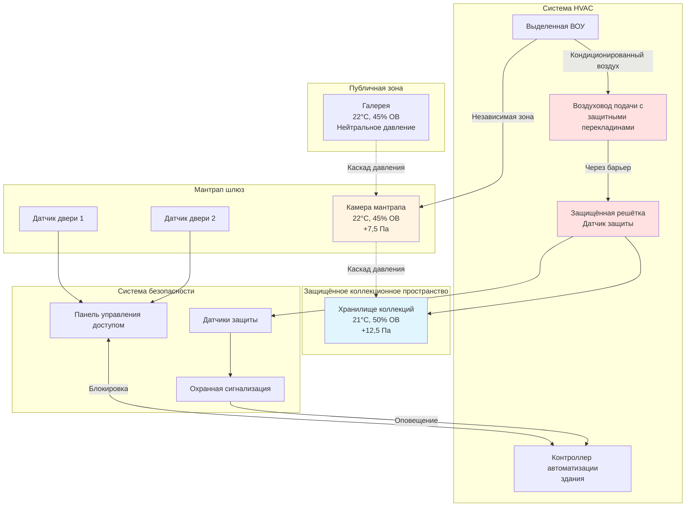

Физические защитные барьеры создают уникальные задачи для систем HVAC, требующие координированного проектирования между механическими и охранными системами. Воздуховоды, решётки и точки доступа к оборудованию создают потенциальные уязвимости безопасности, которые должны быть устранены без ущерба для производительности климатического контроля. Эта интеграция критична в музеях, архивах и галереях, где одинаково важны защита артефактов и безопасность.

## Системы мантрапа шлюза

Мантрапы создают контролируемые входные зоны, где люди проходят через две последовательные двери, никогда не открытые одновременно. Эти пространства требуют специализированного проектирования HVAC для поддержания отношений давления и предотвращения перекрёстного загрязнения окружающей среды.

**Стратегия герметизации шлюза:**

Камера мантрапа должна работать с положительным давлением относительно как наружной зоны, так и защищённого внутреннего пространства. Это создаёт воздушный барьер, который предотвращает проникновение некондиционированного воздуха в защищённое пространство во время переходов дверей. Перепады давления 7,5–12,5 Па обычно достаточны, при этом позволяя дверям открываться без чрезмерных усилий.

Подача воздуха в мантрап должна быть независимо управляемой с помощью отдельных диффузоров, обеспечивающих 6–10 воздухообменов в час. Решётки возврата или вытяжки должны быть расположены так, чтобы создавать нисходящий поток воздуха, предотвращая внесение персоналом загрязнений на уровне головы. Система управления HVAC должна быть заблокирована с датчиками положения двери для повышения потока воздуха во время переходов, затем возврата к базовым условиям при закрытии обеих дверей.

**Буферизация температуры и влажности:**

Мантрапы функционируют как буферные зоны окружающей среды. При открытии наружной двери кондиционированный воздух из мантрапа поглощает тепловую и влажностную нагрузку вместо того, чтобы позволить ей достичь коллекционных пространств. Определите размер ёмкости HVAC мантрапа для наихудших наружных условий при открытии двери минимум на 30 секунд. Рассчитайте пиковую чувствительную нагрузку, используя:

Q = 1,20 × CFM (м³/ч) × ΔT × (t_открытия / 3600)

Где t_открытия представляет время открытия двери в секундах.

## Защищённые duct penetrations

Воздуховоды, пронизывающие защитные барьеры, создают потенциальные пути силового входа. Защитные меры должны поддерживать как целостность безопасности, так и производительность HVAC.

### Типы барьеров и влияние на поток воздуха

| Тип барьера | Рейтинг безопасности | Ограничение потока воздуха | Влияние перепада давления |
|------------|---------------------|---------------------------|--------------------------|
| Решётка с перекладинами и датчик защиты | Средний | Снижение свободной площади 15–25% | 12–29 Па |
| Стальная сетчатая вставка (10 калибр) | Высокий | Снижение свободной площади 30–40% | 36–60 Па |
| Сварная матрица перекладин (шаг 25 см) | Очень высокий | Снижение свободной площади 40–50% | 72–108 Па |
| Баллистически защищённая решётка | Максимальный | Снижение свободной площади 45–55% | 96–144 Па |

### Усиление воздуховода перекладинами

Установите стальные перекладины перпендикулярно воздуховодам при пронизывании стен безопасности, оцененных выше стандартной конструкции. Перекладины должны иметь минимальный диаметр 13 мм, расстояние между ними максимум 15 см, сварены с конструкционными углами, закреплёнными к стенному каркасу. Это создаёт максимальное отверстие 15 см, которое предотвращает прохождение человека при одновременном пропускании потока воздуха.

Матрица перекладин увеличивает турбулентность и уменьшает эффективную площадь воздуховода. Компенсируйте следующим образом:

- Увеличьте размер воздуховода на 20–30% выше по потоку от барьера
- Установите направляющие лопатки, если смена направления происходит вблизи барьера
- Задайте низковелосной дизайн (ниже 6 м/с) через зону барьера
- Добавьте акустическую облицовку ниже по потоку для ослабления шума турбулентности

### Крепежи защиты решётки

Стандартные решётки используют доступные винты или пружинные зажимы, позволяющие снимать с помощью обычных инструментов. Защищённые решётки используют:

- Односторонние винты, требующие специализированных инструментов для снятия
- Пломбы с индикатором защиты, указывающие попытки доступа
- Утопленный крепёж, доступный только после снятия оборудования
- Сварные рамы для применения максимальной безопасности

Указывайте защищённый крепёж для всех решёток в:
- Зонах хранения коллекций
- Консервационных лабораториях
- Подземных хранилищах
- Серверных комнатах, содержащих управление системами безопасности

## Интеграция управления доступом в механические комнаты

Механические комнаты содержат элементы управления HVAC, которые непосредственно влияют на окружающую среду коллекций. Несанкционированный доступ может нарушить климатический контроль или отключить системы. Интегрируйте управление доступом с мониторингом HVAC:

**Логирование доступа и события HVAC:**

Подключите логи доступа двери к системе автоматизации здания. При доступе в механическую комнату вне запланированных окон обслуживания пометьте событие и создайте снимок всех параметров HVAC. Это создаёт судебные записи, если отклонения климата коррелируют с нарушениями безопасности.

**Протоколы аварийного переопределения:**

Пожарная сигнализация или эвакуация в чрезвычайной ситуации должны переопределить управление доступом для обеспечения безопасности жизни. Однако системы HVAC должны реагировать надлежащим образом:

- Отключите воздухообрабатывающие установки, обслуживающие коллекционные пространства
- Закройте моторизованные заслонки, изолирующие критические зоны
- Поддерживайте последовательности управления дымом в соответствии с NFPA 92
- Логируйте все события переопределения с корреляцией временных меток

## Архитектура системы Security-HVAC

## Стандарты проектирования и спецификации

**Справочные стандарты:**

- ASIS GDL PSC-1: Facility Physical Security Guidelines
- UFC 4-020-01: Security Engineering (DoD installations)
- ASHRAE Applications Handbook, Chapter 24 (Museums, galleries)
- GSA Security Criteria for barrier requirements
- ASTM F1233: Security glazing materials and test methods

**Требования спецификации:**

При координировании HVAC с физическими защитными барьерами спецификации должны адресовать:

1. **Координация конструкции** – Определите все duct penetrations на чертежах безопасности с деталями усиления перекладинами
2. **Испытания давления** – Проверьте перепады давления мантрапа при всех комбинациях положения двери
3. **Мониторинг защиты** – Подключите все датчики защиты решётки к системам безопасности и BAS
4. **Координация доступа** – Механический подрядчик получает временные учётные данные доступа на время установки, отозванные при существенном завершении
5. **Валидация производительности** – Пустите в эксплуатацию HVAC-security блокировки с наблюдаемым тестированием всех последовательностей

### Матрица безопасности Penetration

| Тип пронизания | Защищённая зона | Требуемая защита | Координация HVAC |
|----------------|------------------|-------------------|------------------|
| Воздуховод подачи (>30 см диа.) | Хранилище | Сварная матрица перекладин + датчик защиты | Увеличить размер на 25%, добавить глушитель |
| Воздуховод возврата (>30 см диа.) | Хранилище коллекций | Сетчатая вставка 10 калибр | Увеличить подачу на 15% |
| Воздуховод вытяжки | Консервационная лаборатория | Решётка с перекладинами + односторонний крепёж | Проверьте поддержание отрицательного давления |
| Дренажная линия конденсата | Защищённое пространство | Максимум 13 мм труба, защищённая маршрутизация | Установите воздушный разрыв снаружи барьера |
| Линии хладагента | Любое | Маршрутизация через защищённый рукав | Избегайте пронизывания зон с наивысшей безопасностью |
| Контрольная проводка | Любое | Запечатанный кабелепровод, нет распределительных коробок в воздуховоде | Проверьте огнестойкие пломбы пронизания |

## Ограждения клетки оборудования

Оборудование на крыше, обслуживающее высокозащищённые пространства, требует физической защиты от вмешательства или отключения. Сварные сетчатые клетки (минимум 9-калибр, максимум 5 см отверстие) с управлением доступом предотвращают несанкционированное отключение или введение загрязнения через входы наружного воздуха.

Конструкция клетки не должна ограничивать поток воздуха к конденсаторам или входам наружного воздуха. Поддерживайте минимальный зазор 1,5 м со всех сторон оборудования, требующего потока воздуха. Установите клетки с минимальной высотой 2,4 м с верхним закрытием для предотвращения доступа за счёт лазания. Подключите датчики положения двери клетки к системам мониторинга безопасности и BAS.

Интеграция физических защитных барьеров с системами HVAC требует детальной координации при проектировании и тщательной проверки при пуске в эксплуатацию. При надлежащем выполнении эти системы обеспечивают как надёжную безопасность, так и точный контроль окружающей среды без ущерба ни одной из функций.
