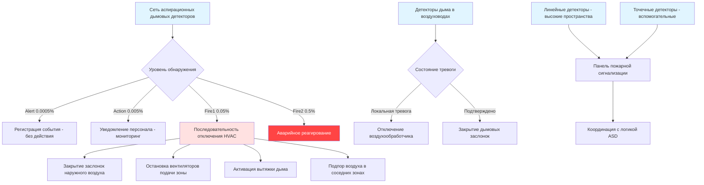

## Обзор

Обнаружение дыма в музейной среде требует повышенной чувствительности и интеграции с системами HVAC для обеспечения раннего предупреждения при минимизации ложных тревог. Сочетание уникальных коллекций, контролируемых условий окружающей среды и непрерывной циркуляции воздуха требует стратегий обнаружения, превышающих стандартные коммерческие требования. NFPA 72 обеспечивает основные требования кодекса, в то время как стандарты, специфичные для музеев, подчеркивают очень ранние возможности предупреждения, позволяющие вмешаться до того, как дым или средства пожаротушения повредят артефакты.

## Выбор технологии обнаружения

Выбор технологии обнаружения дыма напрямую влияет на время реагирования и способность защитить коллекции до возникновения пожара или повреждения дымом.

### Аспирационное обнаружение дыма (ASD)

Аспирационные системы, примером которых является VESDA (Very Early Smoke Detection Apparatus), активно отбирают воздух через сеть трубопроводов малого диаметра. Воздух постоянно поступает в центральный блок обнаружения, содержащий высокочувствительные лазерные датчики. Такой подход обеспечивает обнаружение на начальной стадии — часто в 1000 раз более чувствительно, чем обычные детекторы.

**Ключевые преимущества для музеев:**
- Обнаружение при уровнях затемнения 0,00035% на метр и ниже
- Точки отбора проб, интегрированные в решетки возвратного воздуха и витрины
- Программируемые пороги тревоги (Alert, Action, Fire1, Fire2)
- Минимальное эстетическое воздействие с скрытыми точками отбора проб
- Непрерывный мониторинг воздуха независимо от высоты потолка

**Рассмотрения при установке:**
- Конструкция сетевого трубопровода должна учитывать время транспортировки (обычно 15-60 секунд)
- Расстояние между отверстиями проб: 4,5-6 м в галереях, 1,8-3 м рядом с ценными предметами
- Интеграция с последовательностями отключения воздухообработчика
- Скорость окружающего потока воздуха влияет на эффективность отбора проб

### Линейные дымовые детекторы

Проекционные линейные детекторы используют инфракрасную передачу света на расстояния до 100 м. Частицы дыма прерывают луч, вызывая тревогу при превышении порога затемнения (обычно 20-50% снижения).

**Применение в музеях:**
- Высокие атриумы и выставочные залы (высота более 6 м)
- Большие открытые галереи, где потребуется чрезмерное количество точечных детекторов
- Пространства с эстетическими ограничениями против видимых потолочных устройств

**Ограничения:**
- Более низкая чувствительность, чем аспирационные системы
- Потенциал ложных тревог от пыли во время строительства или обслуживания
- Стабильность выравнивания луча критична в зданиях с тепловым движением

### Обычные точечные детекторы

Фотоэлектрические и ионизационные точечные детекторы остаются необходимыми для определенных приложений, несмотря на их более низкую чувствительность по сравнению с системами ASD.

| Тип детектора | Диапазон чувствительности | Время отклика | Применение в музее |
|--------------|-------------------|---------------|-------------------|
| Аспирационный (VESDA) | 0,00035-2,0% затемнения/м | 30-90 секунд | Основная защита помещений с коллекциями |
| Проекционный луч | 0,5-4,0% затемнения/м | 10-30 секунд | Пространства с высокими потолками, атриумы |
| Фотоэлектрический точечный | 2,0-4,0% затемнения/м | 15-60 секунд | Вспомогательные помещения, механические комнаты |
| Ионизационный точечный | 1,5-3,5% затемнения/м | 10-45 секунд | Помещения с защитой чистым агентом (быстрое пламя) |

## Архитектура интеграции HVAC

Надлежащая интеграция между обнаружением дыма и системами HVAC предотвращает распространение дыма при сохранении экологического контроля для коллекций.

## Зоны обнаружения и стратегия расположения

NFPA 72 устанавливает максимальные требования к расстоянию, но приложения в музеях требуют улучшенного покрытия:

**Области хранения коллекций:**
- Точки аспирационного отбора: расстояние 4,5 м на равномерной сетке
- Дополнительный отбор проб в архивных коробках или высокоплотных мобильных стеллажах
- Обнаружение дыма в воздуховодах на всех воздухообработчиках, обслуживающих хранилище

**Галереи:**
- Основной: Аспирационная система с расстоянием между точками отбора 6 м
- Вторичный: Линейные или точечные детекторы в соответствии с требованиями NFPA 72 к расстоянию
- Отбор проб витрины: Выделенные трубки отбора проб для высокоценных закрытых экспозиций

**Помещения управления окружающей средой:**
- Детекторы дыма в воздуховодах в трубопроводах подачи и возврата (в соответствии с IMC Section 606.2)
- Точечные детекторы в механических помещениях с инициированием локальной панели
- Помещение спринклерной системы предварительного срабатывания: Точечные детекторы для перекрестного управления срабатыванием

## Последовательности реагирования системы HVAC

Система пожарной сигнализации должна выполнять согласованное управление HVAC при обнаружении:

1. **Уровень Alert (начальный)**: Только уведомление, действие HVAC отсутствует
2. **Уровень Action (развивающийся)**: Увеличение наружного воздуха до 100%, подготовка к отключению
3. **Уровень Alarm (подтвержденный пожар)**:
   - Отключение воздухообработчиков, обслуживающих затронутую зону
   - Закрытие заслонок наружного воздуха для предотвращения подачи кислорода
   - Активация выделенной вытяжки дыма, если предусмотрено
   - Закрытие дымовых заслонок на расчетных барьерах
   - Поддержание подпора в соседних зонах для предотвращения миграции

## Параметры чувствительности и предотвращение ложных тревог

Балансирование раннего обнаружения с надежностью операций требует тщательной конфигурации порогов:

| Среда | Порог Alert | Порог Action | Порог Fire1 | Рассмотрения |
|-------------|----------------|------------------|-----------------|----------------|
| Герметичные хранилища | 0,0003% затемнения/м | 0,003% затемнения/м | 0,03% затемнения/м | Минимальная пыль, стабильные условия |
| Активные галереи | 0,0005% затемнения/м | 0,005% затемнения/м | 0,05% затемнения/м | Присутствие публики, переменные нагрузки |
| Консервационные лаборатории | 0,001% затемнения/м | 0,01% затемнения/м | 0,1% затемнения/м | Химические пары, использование растворителей |
| Погрузочные доки | 0,005% затемнения/м | 0,05% затемнения/м | 0,5% затемнения/м | Выхлопные газы транспорта, наружные двери |

**Факторы, влияющие на производительность детектора в кондиционируемых помещениях:**
- Сдвиги относительной влажности (быстрое снижение влажности может создать ложный оптический рассеянный свет)
- Эффективность фильтрации воздуха (MERV 13 и выше снижает фоновые частицы)
- Скорость воздуха в точках отбора проб (поддерживайте 250-2500 м³/ч для оптимального транспорта)
- Температурная стратификация в высоких пространствах (влияет на плавучесть дыма)

## Нормативно-правовая база и стандарты

**Требования NFPA 72 (издание 2022):**
- Глава 17: Устройства инициирования детекторов дыма и испытание чувствительности
- Глава 21: Интерфейсы функций управления в чрезвычайных ситуациях, включая отключение HVAC
- Приложение B: Руководство по проектированию детекторов отбора воздуха

**Руководство, специфичное для музеев:**
- ASHRAE Applications Handbook глава 24: Музеи, галереи, архивы и библиотеки
- Руководящие принципы сохранения наследия для интеграции экологического мониторинга
- Согласование стандартов окружающей среды AIC (American Institute for Conservation)

## Ввод в эксплуатацию и обслуживание

Процедуры проверки подтверждают интеграцию системы:

**Начальное приемочное испытание:**
- Проверка времени транспортировки аспирационной системы при впрыске дымового аэрозоля
- Время выполнения последовательности отключения HVAC (закрытие заслонок, отключение вентилятора)
- Испытание многоуровневого порога тревоги на каждой запрограммированной чувствительности
- Проверка связи между панелью пожарной сигнализации и системой автоматизации здания

**Интервалы регулярного обслуживания:**
- Ежемесячно: Визуальный осмотр целостности трубопровода отбора проб и чистоты впускного отверстия
- Ежеквартально: Испытание смещения чувствительности с использованием калиброванного тестового аэрозоля
- Ежегодно: Полный функциональный тест последовательностей интеграции HVAC
- Раз в два года: Очистка и переполнение лазерной камеры в соответствии со спецификациями производителя

Надлежащим образом спроектированная и обслуживаемая система обнаружения дыма обеспечивает критическое раннее предупреждение, необходимое для защиты бесценного культурного наследия, при этом безупречно интегрируясь с системами экологического контроля, необходимыми для долгосрочного сохранения.
