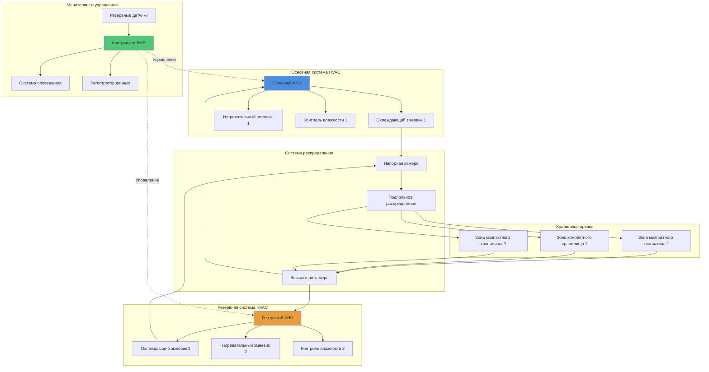

Хранилища архивных материалов и репозитории требуют специализированных систем HVAC, которые поддерживают стабильные условия окружающей среды, соответствуют компактным системам хранения, управляют разнообразными требованиями материалов и обеспечивают отказобезопасное резервирование. Эти герметичные помещения обычно работают при более низких температурах и более жестких допусках влажности, чем общественные помещения, с минимальным движением воздуха для предотвращения нарушения взвешенных частиц.

## Требования к окружающей среде для архивного хранения

Условия в хранилищах архивов варьируются в зависимости от состава материалов и приоритетов консервации. Следующие спецификации соответствуют ISO 11799, рекомендациям NARA и ASHRAE для архивных учреждений.

### Спецификации температуры и влажности по типам материалов

| Категория материала | Температура | Относительная влажность | Допуск колебаний | Воздухообмены |
|-------------------|-------------|-------------------|----------------------|-------------|
| Бумажные документы | 18–21°C | 30–40% ОВ | ±1,1°C, ±3% ОВ в день | 4–6 ACH |
| Фотографии (Ч/Б) | 18–21°C | 30–40% ОВ | ±1,1°C, ±3% ОВ в день | 4–6 ACH |
| Цветные фотографии | 2–10°C | 30–40% ОВ | ±1,1°C, ±3% ОВ в день | 4–6 ACH |
| Магнитные носители | 18–21°C | 20–30% ОВ | ±1,1°C, ±3% ОВ в день | 4–6 ACH |
| Пленка (ацетат) | 2–7°C | 30–40% ОВ | ±1,1°C, ±3% ОВ в день | 4–6 ACH |
| Цифровые носители | 18–21°C | 20–30% ОВ | ±1,1°C, ±3% ОВ в день | 4–6 ACH |
| Смешанные коллекции | 18–21°C | 35–45% ОВ | ±1,1°C, ±3% ОВ в день | 4–6 ACH |

Критическим фактором является стабильность, а не абсолютные значения. Сезонное постепенное изменение (постепенный дрейф в пределах приемлемых диапазонов) предпочтительнее резких изменений уставки, которые создают нагрузку на материалы.

## Проектирование холодного хранилища

Холодные хранилища для фотографических материалов, пленки и химически нестабильных документов продлевают сроки консервации, замедляя реакции деградации. Уравнение Аррениуса демонстрирует, что снижение температуры на 10°C удваивает химическую стабильность большинства органических материалов.

### Рекомендации HVAC для холодного хранилища

**Выделенные системы охлаждения** рассчитанные на 24/7 работу со 100% резервной мощностью предотвращают колебания температуры. Технология холодильного шкафа, адаптированная для архивного использования, обеспечивает надежную работу.

**Контроль влажности в холодной среде** требует тщательного управления влагой. По мере снижения температуры воздуха относительная влажность увеличивается, даже если абсолютное содержание влаги остается неизменным. Системы адсорбционной осушки воздуха поддерживают целевую ОВ без риска конденсации.

**Проектирование тамбура** предотвращает тепловой удар и миграцию влаги. Двухдверный воздушный шлюз с промежуточными условиями (обычно 13°C, 35% ОВ) позволяет материалам и людям адаптироваться перед входом или выходом из холодного хранилища.

**Стратегии размораживания** должны предотвращать скачки температуры. Циклы размораживания с инициализацией по времени, запланированные на периоды низкого доступа, минимизируют тепловые возмущения.

## Интеграция компактных систем хранения

Системы мобильного хранения высокой плотности снижают занимаемую площадь, но создают проблемы HVAC, ограничивая поток воздуха и увеличивая тепловую массу.

**Стратегия распределения воздуха** требует подачи через подпольное пространство или низкие боковые стенки, чтобы обеспечить циркуляцию воздуха внутри хранилища. Возвраты в конце прохода вытягивают воздух через коллекцию, а не пропускают его над ней.

**Расчеты охлаждающей нагрузки** учитывают тепловую массу хранилища, которая стабилизирует температуру, но увеличивает время восстановления после возмущений. Металлическое хранилище добавляет приблизительно 15–20% к расчетам ощущаемой нагрузки.

**Управление тепловыделением при доступе** решает проблему избыточного тепла от людей и освещения во время операций получения. Кратковременные повышения температуры допустимы, если восстановление происходит в течение 2 часов.

## Резервирование системы и надежность

Хранилища архивов требуют отказобезопасной работы, поскольку колебания окружающей среды угрожают незаменимым материалам.

### Архитектура резервирования

**Конфигурация N+1** обеспечивает полную емкость с одним отключенным блоком. Обе системы работают с частичной нагрузкой в нормальных условиях, продлевая срок службы оборудования и обеспечивая немедленную доступность резервной системы.

**Независимые коммунальные услуги** включают отдельные электрические питания, контуры охлажденной воды и панели управления. Резервный генератор питает обе системы HVAC и оборудование мониторинга.

**Автоматическая переключение** передает работу на резервную систему в течение 5 минут от обнаружения отказа основной системы. Ручное управление позволяет тестировать и обслуживать без нарушения условий в хранилище.

## Управление качеством воздуха

Загрязнение твердыми частицами и газами ускоряет деградацию материалов.

**Требования к фильтрации** предусматривают минимум MERV 13 (85% эффективность при 1,0–3,0 микронов) с рекомендуемым MERV 16 для ценных коллекций. Фильтры с активированным углем или перманганатом калия удаляют кислотные газы и летучие органические соединения.

**Положительное давление** 0,5–0,75 см вод. ст. предотвращает проникновение некондиционного воздуха и загрязнений при открытии дверей.

**Циклы очистки воздуха** работают после продолжительного закрытия для удаления продуктов дегазации из материалов и мебели для хранения.

## Мониторинг и документирование

Непрерывный мониторинг окружающей среды проверяет производительность HVAC и обеспечивает раннее предупреждение об отклонениях.

**Размещение датчиков** устанавливает регистраторы температуры и влажности на различные высоты и местоположения в хранилище. Минимум один датчик на 70–80 м³ обеспечивает репрезентативную выборку.

**Интервалы регистрации данных** в 15 минут фиксируют суточные вариации при управлении объемом данных. Критические хранилища могут использовать регистрацию на 5 минут.

**Пороги сигнализации** запускают уведомления при ±1,7°C или ±5% ОВ от уставки, обеспечивая время для корректирующих действий до повреждения материалов.

## Оптимизация последовательности управления

Системы HVAC в хранилище расставляют приоритеты на стабильность над энергоэффективностью.

**Настройка ПИД-управления** использует консервативные параметры с медленной реакцией для предотвращения колебаний и перерегулирования. Пропорциональные полосы 2,2–3,3°C для температуры и 8–10% для влажности сбалансированы между точностью и стабильностью.

**Стратегии снижения нагрузки** обычно избегаются в архивных хранилищах. Снижение нагрузки в неиспользуемое время экономит энергию, но вводит именно те колебания, которые повреждают коллекции.

**Протоколы сезонной корректировки** позволяют постепенные изменения уставки (максимум 0,3°C в неделю) при переходе между зимними и летними целевыми уровнями влажности.

## Рекомендации по проектированию

1. **Рассчитайте оборудование осушки** для пиковой скрытой нагрузки плюс коэффициент безопасности 25% для учета влаги от людей, дверей и дегазации материалов
2. **Установите резервное удаление конденсата** с резервными насосами и сигнализацией высокого уровня для предотвращения затопления
3. **Укажите изоляцию больничного класса** (R-5,3 стен, R-7,0 потолка минимум) для минимизации нагрузок ограждения и улучшения стабильности
4. **Спроектируйте возможность расширения** путем увеличения инфраструктуры распределения на 20–30% сверх первоначальных требований
5. **Реализуйте паровые барьеры** на теплой стороне изоляции для предотвращения миграции влаги и конденсации внутри ограждения

Системы HVAC для хранилищ архивов представляют наивысший стандарт контроля окружающей среды в области консервации, уравновешивая строгие требования с практическими ограничениями эксплуатации для защиты культурного наследия для будущих поколений.
