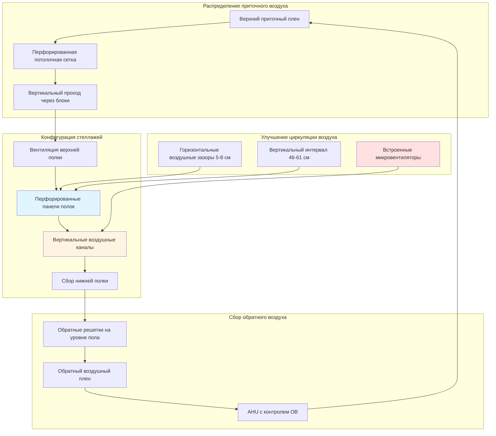

Компактные мобильные стеллажные системы максимизируют плотность хранения, устраняя фиксированные проходы, создавая значительные проблемы HVAC. Плотно упакованная конфигурация ограничивает циркуляцию воздуха, генерирует локализованные микроклиматы и требует специализированных стратегий вентиляции для поддержания условий консервации во всем объеме хранилища.

## Проблемы потока воздуха в компактном хранилище

Мобильные стеллажные системы создают три различные зоны потока воздуха, требующие разных подходов HVAC:

**Условия закрытого стека**
Когда стеллажные блоки сжаты, пространство между блоками сокращается до 3-5 см, создавая зоны с почти стагнирующим воздухом. Воздухообмены в этих закрытых секциях могут снизиться до 0,1-0,3 ACH по сравнению с 4-6 ACH в открытых проходах. Температурная стратификация 1,7-2,8 °C может развиваться между верхними и нижними полками, с колебаниями влажности 5-10 % ОВ.

**Динамика открытого прохода**
Временные проходы испытывают повышенную скорость воздуха, так как приточный воздух предпочтительно течет по пути наименьшего сопротивления. Скорости 0,38-0,76 м/с в открытых проходах контрастируют с <0,05 м/с в закрытых секциях, создавая диспропорции условий консервации по всей коллекции.

**Эффекты периферийного края**
Крайние стеллажные блоки, прилегающие к стенам или приточным диффузорам, получают диспропорциональное кондиционирование, в то время как внутренние блоки остаются изолированными от прямого потока воздуха. Этот градиент "край-ядро" может создавать разности температур, превышающие 2,2 °C, и колебания ОВ 8-12 %.

## Требования к проектированию вентиляции

Стандарты архивного хранения требуют определенные параметры окружающей среды независимо от конфигурации стеллажей:

| Параметр | ISO 11799 | ASHRAE Глава 24 | PAS 198 |
|-----------|-----------|-------------------|---------|
| Стабильность температуры | ±1,1 °C | ±2,2 °C | ±2,0 °C |
| Стабильность ОВ | ±5 % ОВ | ±5 % ОВ | ±5 % ОВ |
| Воздухообмены (открытые) | 4-6 ACH | 4-8 ACH | 6-10 ACH |
| Воздухообмены (закрытые) | 2-4 ACH | Не указано | 3-6 ACH |
| Фильтрация частиц | MERV 13 минимум | MERV 11-13 | MERV 13-14 |
| Скорость воздуха (на коллекциях) | <0,25 м/с | <0,38 м/с | <0,25 м/с |

Достижение этих параметров в компактных стеллажах требует воздухообменов на 50-100 % выше, чем в эквивалентных статических стеллажах, из-за ограниченных путей циркуляции.

## Стратегии интеграции HVAC

## Проектирование перфорированных стеллажей

Стандартные сплошные полки блокируют вертикальный поток воздуха, требуя перфорированных или сетчатых альтернатив:

**Спецификации перфорации**
- Коэффициент открытой площади: 40-60 % для адекватного прохода воздуха
- Диаметр отверстия: 0,64-1,27 см для предотвращения потери мелких предметов
- Паттерн расстояния: Смещенная сетка для структурной целостности
- Материал: Порошковое покрытие стали с коррозионной стойкостью

**Рассмотрение нагрузки полок**
Плотно упакованные материалы на перфорированных полках уменьшают эффективную открытую площадь на 60-80 %. Разработайте расчеты вентиляции на основе наихудших сценариев нагрузки, когда эффективность перфорации снижается до 10-20 % от теоретического максимума.

## Улучшение вентиляции прохода

Кондиционирование временного прохода представляет собой уникальные проблемы, требующие быстрого реагирования окружающей среды:

**Выделенное приточное питание прохода**
Установите компактные линейные диффузоры вдоль верхней части мобильного блока, активируемые при открытии проходов. Температура приточного воздуха на 1,1-1,7 °C теплее окружающей, предотвращает холодное истечение на коллекции. Требования объема воздуха: 1,42-2,37 м³/ч на линейный метр длины прохода.

**Пассивное усиление циркуляции**
Установите низкоскоростные микровентиляторы (11,35-22,7 м³/ч каждый) на интервалах 1,8-2,4 м вдоль вертикальных каналов внутри стеллажных блоков. Работайте непрерывно при 10-15 % скорости для фоновой циркуляции, увеличивая до 40-60 % при доступе к проходам. Мощность вентилятора: 3-8 Вт каждый.

**Интеграция автоматизированного управления**
Свяжите датчики положения прохода с BMS для вентиляции по требованию. Когда блоки разделяются, увеличьте локальный приточный воздух на 30-50 % в течение 15-30 минут для продувки стагнирующего воздуха, затем уменьшите до уровней обслуживания. Эта стратегия снижает годовое потребление энергии HVAC на 15-25 % по сравнению с постоянной максимальной вентиляцией.

## Требования к вентиляции, специфичные для материала

Различные материалы коллекций требуют скорректированные параметры потока воздуха:

| Тип материала | Мин. воздухообмены | Макс. скорость воздуха | Особые соображения |
|---------------|----------------|------------------|------------------------|
| Бумажные архивы | 3-4 ACH | 0,25 м/с | Проблемы миграции кислоты, вертикальная стратификация |
| Фотографические материалы | 4-6 ACH | 0,20 м/с | Чувствительность к выделению газов, точность ОВ ±3 % |
| Магнитные носители | 6-8 ACH | 0,38 м/с | Рассеивание тепла от магнитных полей |
| Текстильное хранилище | 2-3 ACH | 0,15 м/с | Предотвращение осаждения пыли, мониторинг вредителей |
| Книжные коллекции | 3-5 ACH | 0,30 м/с | Ориентация корешка влияет на проникновение воздуха |
| Хранилища микрофильмов | 6-10 ACH | 0,25 м/с | Равномерность температуры критична для размерной стабильности |

## Протокол проверки проектирования

Проведите комиссионирование систем HVAC компактных стеллажей с использованием этой методологии:

1. **Картография базовой линии**: Измерьте температуру и ОВ в 9 точках на стеллажный блок (верх/середина/низ × передняя/центр/задняя) с закрытыми блоками в течение 72 часов
2. **Реагирование на открытие прохода**: Отслеживайте время восстановления окружающей среды при создании проходов, целевое значение <30 минут до достижения установившегося состояния
3. **Тестирование нагрузки**: Повторите измерения при 25 %, 50 %, 75 % и 100 % плотности коллекции
4. **Проверка сезонности**: Проведите полную картографию во время пиковых месяцев охлаждения и отопления
5. **Долгосрочный мониторинг**: Установите постоянные датчики в местах наихудшего случая с точностью ±0,28 °C и ±2 % ОВ

Правильно спроектированные системы HVAC для компактных мобильных стеллажей поддерживают стандарты консервации ISO 11799 при достижении экономии площади на 40-60 % по сравнению со статическими стеллажными конфигурациями. Инвестиции в улучшенную инфраструктуру распределения воздуха обеспечивают долгосрочные преимущества консервации коллекции, которые далеко превосходят премию 15-30 % в начальных затратах на систему HVAC.
