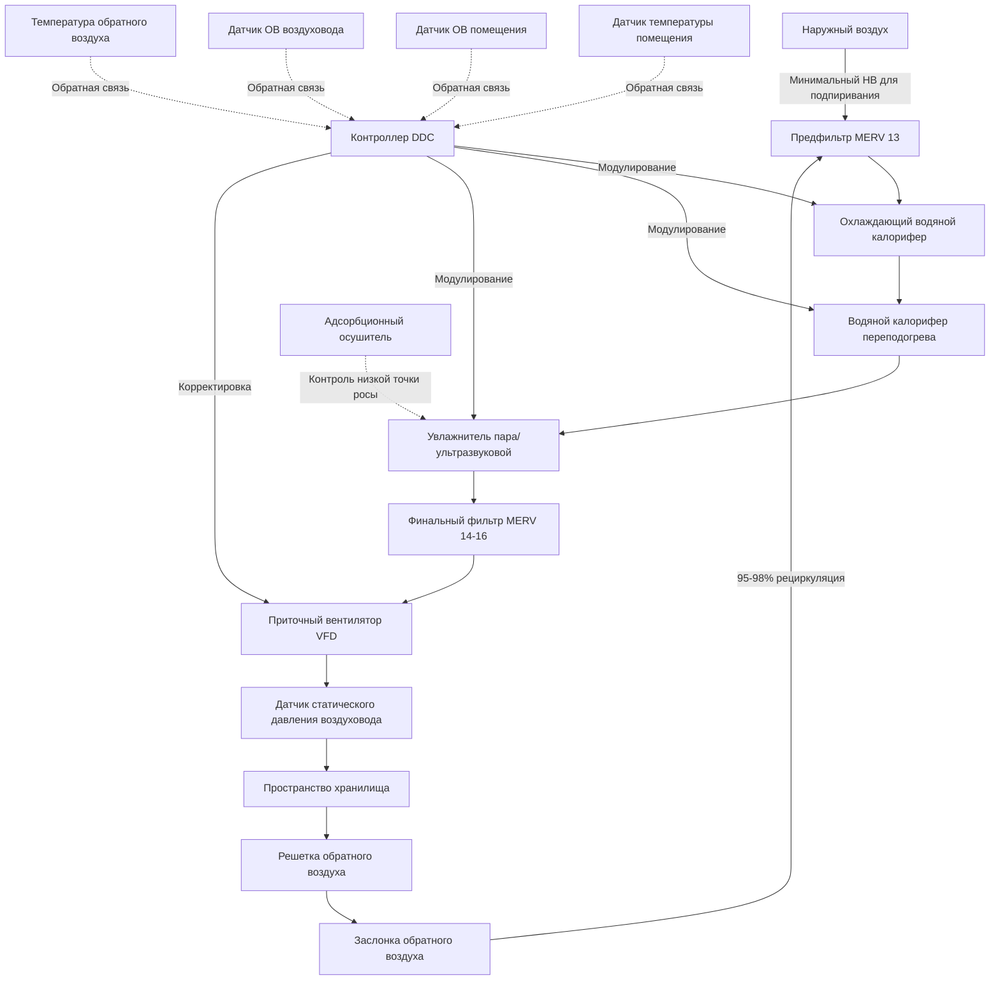

Архивные хранилища для материалов архивов, редких коллекций и чувствительных артефактов требуют прецизионных систем экологического контроля, работающих непрерывно с минимальными колебаниями. В отличие от выставочных пространств, эти выделенные хранилища приоритизируют сохранение материалов над комфортом человека, требуя специализированных подходов HVAC, которые поддерживают жесткие диапазоны допусков для температуры и относительной влажности.

## Основы проектирования климат-контроля хранилища

Системы HVAC хранилищ принципиально отличаются от стандартных приложений в зданиях. Первичная цель проектирования сосредоточена на устранении колебаний окружающей среды, которые ускоряют деградацию материалов через гигроскопическое расширение, скорости химических реакций и биологическую активность. Выделенные приточные установки, обслуживающие только пространства хранилища, обеспечивают превосходный контроль по сравнению с общими системами, предотвращая перекрестное загрязнение и позволяя независимое управление уставками.

Системы хранилища работают с минимальными внутренними нагрузками из-за ограниченной занятости и ограниченного использования освещения. Эта характеристика позволяет уменьшить мощность оборудования, но требует тщательного внимания к минимальным коэффициентам снижения нагрузки, чтобы предотвратить короткие циклы при низконагруженных условиях. Прямые цифровые системы управления с алгоритмами пропорционально-интегрально-дифференциального регулятора поддерживают уставки в узких диапазонах нечувствительности, обычно ±1,1°C и ±3% ОВ.

## Требования по температуре и влажности по типам материалов

Параметры окружающей среды варьируются в зависимости от состава коллекции, различные материалы демонстрируют оптимальные условия сохранения. Следующая таблица представляет полученные от NARA и стандарты сообщества консервации для обычных архивных материалов.

| Тип материала | Диапазон температуры | Относительная влажность | Допуск контроля | Примечания |
|--------------|-------------------|-------------------|-------------------|-------|
| Бумажные документы | 18-21°C | 35-45% | ±1,1°C, ±3% ОВ | Стандартное архивное хранилище |
| Фотопленка (Ч/Б) | 2-7°C | 30-40% | ±1,1°C, ±2% ОВ | Требуется холодное хранилище |
| Фотопленка (цветная) | ≤2°C | 25-35% | ±1,1°C, ±2% ОВ | Оптимально замороженное хранилище |
| Магнитные носители | 16-20°C | 30-40% | ±1,1°C, ±3% ОВ | Избегайте циклирования влажности |
| Пергамент/веллум | 16-18°C | 45-55% | ±1,1°C, ±2% ОВ | Более высокая ОВ предотвращает хрупкость |
| Нитратная пленка | 2-4°C | 30-40% | ±1,1°C, ±2% ОВ | Отдельное хранилище, риск пожара |
| Смешанные коллекции | 18-20°C | 35-45% | ±1,1°C, ±3% ОВ | Условия компромисса |

## Архитектура системы и выбор компонентов

Прецизионное кондиционирование хранилища требует специфических конфигураций оборудования, которые обеспечивают стабильную работу при минимальных колебаниях нагрузки. Диаграмма архитектуры системы ниже иллюстрирует ключевые компоненты и последовательности управления для выделенной приточной установки хранилища.

## Системы холодного хранилища и криогенных хранилищ

Фотопленка, особенно цветные эмульсии, достигает увеличенного срока службы при субнулевых температурах. Хранилища холодного хранения, работающие при температуре 2-4°C, используют стандартное холодильное оборудование, в то время как замороженное хранилище ниже 0°C требует специализированных низкотемпературных систем или конфигураций вспомогательных морозильников.

Соображения проектирования холодного хранилища включают:

- Пароизоляторы с минимальным рейтингом 10 пермь на теплой стороне изоляции
- Изоляционные узлы стен и потолка R-5,3 - R-7,0 м²·K/W
- Тамбурные входы для минимизации инфильтрации при доступе
- Контролируемая акклиматизация материала перед удалением в выставочную температуру
- Управление конденсатом для охлаждающих калориферов, работающих ниже точки росы
- Циклы оттаивания для приложений с субнулевыми температурами

Протоколы переходов предотвращают конденсацию на холодных материалах. Предметы, удаленные из холодного хранилища, должны уравновешиваться в герметичных контейнерах или зонах промежуточной температуры перед воздействием более теплых, влажных условий. Этот период акклиматизации обычно занимает 24-48 часов в зависимости от массы и дифференциала температуры.

## Методологии контроля влажности

Поддержание узких диапазонов относительной влажности представляет первичную задачу управления при кондиционировании хранилища. Стандартные последовательности охлаждающего калорифера/переподогрева обеспечивают осушение, но испытывают трудности ниже 40% ОВ при умеренных температурах. Несколько подходов решают это ограничение:

**Адсорбционное осушение:** Вращающиеся адсорбционные колеса достигают уровней ОВ ниже 30% независимо от охлаждения. Энергия регенерации (обычно 121-177°C) поступает от электрического сопротивления, газового тепла или рекуперации тепла. Эксплуатационные расходы превышают механическое осушение, но обеспечивают превосходную производительность низкой влажности.

**Переохлаждение и переподогрев:** Глубокое охлаждение ниже точки росы удаляет влагу, сопровождаемое чувствительным переподогревом до целевой температуры. Энергоемко, но эффективно, этот метод подходит для умеренных целевых показателей влажности (35-50% ОВ). Пропорциональное управление переподогревом предотвращает колебания температуры.

**Химическое осушение:** Растворы, такие как хлорид лития или подобные гигроскопические вещества, поглощают влагу в выделенном оборудовании. Менее распространено, чем адсорбционные системы, но применимо для специфических установок.

## Фильтрация и управление качеством воздуха

Архивные материалы страдают от деградации из-за твердых частиц, газовых загрязнителей и биологических контаминантов. Многоступенчатая фильтрация защищает коллекции при поддержании приемлемого перепада давления через приточную установку.

| Ступень фильтрации | Тип фильтра | Эффективность | Целевые загрязнители | Типичный Δp |
|-----------------|-------------|------------|---------------------|-----------|
| Предфильтрация | MERV 13 гофрированный | 85% @ 1 мкм | Крупные твердые частицы, волокна | 1,5-2,5 мм вод. ст. |
| Финальная фильтрация | MERV 14-16 мешок | 95% @ 0,3 мкм | Мелкие твердые частицы, споры | 3,0-5,0 мм вод. ст. |
| Угольная фильтрация | Активированный уголь | Удаление газов | Озон, ЛОС, сернистые соединения | 1,0-2,0 мм вод. ст. |
| HEPA (опционально) | 99,97% @ 0,3 мкм | Максимальная защита | Ультрамелкие твердые частицы | 5,0-7,5 мм вод. ст. |

Газовая фильтрация с использованием активированного угля или среды перманганата калия удаляет диоксид серы, оксиды азота и озон—загрязнители, которые ускоряют деградацию бумаги и выцветание красителей. Химическая фильтрация обычно следует после удаления твердых частиц, чтобы предотвратить насыщение среды пылью.

## Расходы вентиляции и подпирание

Хранилища работают с минимальным введением наружного воздуха, обычно 2-4 воздухообмена в час полного подачи с 95-98% рециркуляцией. Этот низкий расход вентиляции:

- Снижает нагрузки на охлаждение и осушение
- Минимизирует введение наружных загрязнителей
- Снижает потребление энергии
- Поддерживает стабильные условия

Положительное подпирание относительно соседних пространств (0,5-1,25 мм вод. ст.) предотвращает инфильтрацию некондиционированного воздуха и твердых частиц. Подпирание происходит от небольшого избытка наружного воздуха над выходом/экфильтрацией, поддерживая внутренний поток воздуха в хранилище при открытии дверей.

## Инфраструктура мониторинга и сигнализации

Непрерывный мониторинг с регистрацией данных позволяет проверить стабильность окружающей среды и быстро реагировать на отклонения. Критические параметры включают температуру помещения, относительную влажность, точку росы и дифференциальное давление. Системы мониторинга должны:

- Записывать измерения с интервалом 5-15 минут
- Генерировать сигналы тревоги при выходе за допустимые пределы
- Предоставлять исторические тренды для проверки
- Оповещать персонал объекта несколькими путями коммуникации
- Включать избыточные датчики для критических пространств

Журналы окружающей среды хранилища становятся частью постоянных записей коллекции, документируя условия сохранения и поддерживая требования страховки.
