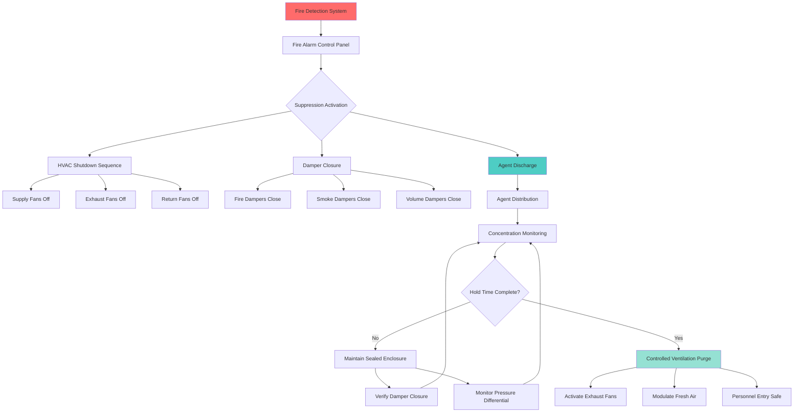

## Системы пожаротушения для музейных хранилищ

Музейные и архивные хранилища требуют систем пожаротушения, которые защищают бесценные коллекции, предотвращая водяные повреждения. Системы газового пожаротушения с чистым агентом обеспечивают быстрое тушение пожара без остатков или вторичных повреждений артефактов, что делает их предпочтительным решением для хранилищ высокой стоимости.

## Основы систем чистого тушения

Системы с чистым агентом тушат пожары благодаря поглощению тепла и вытеснению кислорода без электропроводных остатков. Критическим параметром проектирования является достижение минимальной расчетной концентрации по всему защищенному объему в течение установленного времени выброса.

### Расчет концентрации агента

Требуемая масса агента зависит от защищенного объема, типа агента и расчетной концентрации:

$$W = \frac{V \cdot C}{S} \cdot \left(\frac{T_a}{T_0}\right)$$

Где:
- $W$ = требуемая масса агента (кг)
- $V$ = чистый защищенный объем (м³)
- $C$ = расчетная концентрация (%)
- $S$ = удельный объем пара (м³/кг)
- $T_a$ = температура окружающей среды (K)
- $T_0$ = эталонная температура (обычно 294 K)

### Требования по времени удержания

После выброса концентрация агента должна оставаться выше минимальной концентрации тушения в течение требуемого времени удержания:

$$t_h = t_{min} + t_{extinguish} + t_{safety}$$

Где:
- $t_h$ = общее время удержания (мин)
- $t_{min}$ = 10 минут минимум в соответствии с NFPA 2001
- $t_{extinguish}$ = дополнительное время для глубоко расположенных пожаров
- $t_{safety}$ = запас прочности (обычно 5 минут)

Для музейных хранилищ с горючими материалами время удержания 20-30 минут является стандартом для обеспечения полного тушения тлеющих пожаров внутри контейнеров хранения артефактов.

## Интеграция системы HVAC

Надлежащая интеграция HVAC критична для поддержания концентрации агента и предотвращения конфликтов системы во время пожара.

### Последовательность отключения HVAC

При обнаружении пожара система HVAC должна выполнить координированное отключение для предотвращения потери агента:

1. **Предварительный сигнал тревоги** (за 30-60 секунд до выброса агента)
   - Отключить все вентиляторы подачи воздуха
   - Отключить все вентиляторы возврата и выхлопа
   - Закрыть все противопожарные и дымовые заслонки
   - Закрыть все регулирующие заслонки объема

2. **Выброс агента** (происходит после предварительной задержки)
   - Агент выбрасывается в защищенное пространство
   - Целевая концентрация достигается в течение 10 секунд

3. **Поддержание времени удержания** (20-30 минут)
   - Все оборудование HVAC остается выключенным
   - Заслонки остаются закрытыми
   - Целостность герметичного помещения поддерживается
   - Мониторинг снижения концентрации агента

4. **Послевыбросная вентиляция** (после проверки времени удержания)
   - Постепенное введение свежего воздуха
   - Активация вентиляторов выхлопа на низкой скорости
   - Предотвращение расслоения паров агента
   - Мониторинг безопасных уровней кислорода

## Сравнение агентов пожаротушения

Выбор надлежащего чистого агента зависит от эффективности тушения, воздействия на окружающую среду и совместимости с коллекцией.

| Тип агента | Расчетная концентрация | Время выброса | NOAEL | Воздействие на окружающую среду | Типичное время удержания |
|------------|---------------------|----------------|-------|----------------------|-------------------|
| FM-200 (HFC-227ea) | 7,0-8,5% | 10 секунд | 9,0% | GWP 3220 | 10 минут |
| Novec 1230 (FK-5-1-12) | 4,5-5,8% | 10 секунд | >10% | GWP 1, ODP 0 | 10 минут |
| IG-541 (инертный газ) | 40-42% | 60 секунд | >43% | Нулевой GWP/ODP | 10 минут |
| IG-55 (Argonite) | 40-42% | 60 секунд | >43% | Нулевой GWP/ODP | 10 минут |
| Водяной туман | N/A | 10-30 секунд | N/A | Нулевой | N/A |

**Ключевые параметры:**
- **NOAEL** (уровень без наблюдаемого неблагоприятного воздействия): максимальная безопасная концентрация для воздействия на человека
- **GWP** (потенциал глобального потепления): воздействие на окружающую среду относительно CO₂
- **ODP** (озоноразрушающий потенциал): воздействие на озон стратосферы

### Критерии выбора агента

**FM-200 (гептафторопропан)**
- Быстрое тушение с низкой концентрацией
- Требует меньше места для хранения, чем инертный газ
- Более высокое воздействие на окружающую среду (GWP 3220)
- Подходит для пожаров класса A и класса B
- Узкий запас прочности между расчетной и NOAEL

**Novec 1230 (фторированный кетон)**
- Наименьшее воздействие на окружающую среду среди галокарбоновых агентов
- Отличный запас прочности (NOAEL >10%)
- Минимальное понижение температуры при выбросе
- Повышенная стоимость по сравнению с FM-200
- Предпочтительно для устойчивого развития музейных операций

**Инертный газ (IG-541, IG-55)**
- Нулевое воздействие на окружающую среду
- Тушение путем вытеснения кислорода до 12-13%
- Требует крупных батарей цилиндров для хранения
- Время выброса 60 секунд
- Подходит для электрически включенного оборудования

**Водяной туман**
- Отсутствуют требования к хранению агента
- Эффективное охлаждение для пожаров класса A
- Риск повреждения коллекции водой
- Требует выделенного водоснабжения
- Обычно избегается в хранилищах высокой стоимости

## Соответствие стандартам NFPA

Системы пожаротушения для музейных хранилищ должны соответствовать нескольким стандартам NFPA:

### NFPA 2001 - Системы пожаротушения чистым агентом

- Минимальная расчетная концентрация для топлива класса A: 5,8-8,5% (в зависимости от агента)
- Максимальное время выброса: 10 секунд для галокарбоновых агентов
- Минимальное время удержания: 10 минут (увеличено для глубоко расположенных пожаров)
- Предварительный сигнал тревоги: минимум 30 секунд (до 60 секунд, где требуется безопасность жизнедеятельности)
- Испытание целостности герметичного помещения обязательно (испытание дверного вентилятора в соответствии с приложением C NFPA 2001)

### NFPA 75 - Оборудование информационных технологий

Для хранилищ, содержащих цифровые архивы и электронные носители:

- Координация электрического отключения с активацией подавления
- Системы ИБП должны продолжать работу во время выброса
- Мониторинг окружающей среды во время времени удержания
- Проверка электронного оборудования после выброса

### Требования, специфичные для музеев

В соответствии с руководящими принципами Международного совета музеев (ICOM) по защите от пожара:

- Резервные системы обнаружения (перекрестная проверка зоны)
- Возможность ручного отмены при ложных тревогах
- Протоколы оценки состояния артефактов после выброса
- Время удержания, специфичное для коллекции, для архивных материалов
- Интеграция с мониторингом безопасности и окружающей среды

## Управление заслонками и целостность герметичного помещения

Удержание агента во время времени удержания зависит от достижения и поддержания целостности герметичного помещения.

### Критические точки утечки

1. **Противопожарные и дымовые заслонки**
   - Должны достигать рейтинга утечки класса I в соответствии с UL 555/555S
   - Отказ привода в безопасном положении: нормально открыто, закрыто при пожаре
   - Резервная проверка закрытия через концевые выключатели

2. **Дверные узлы**
   - Требуются автоматические доводчики дверей
   - Электромагнитные устройства удержания открытия отпускаются при тревоге
   - Опускные уплотнения или уплотнители для трехчасовой противопожарной оценки
   - Смотровые панели с огнестойким остеклением

3. **Проникновения и услуги**
   - Все проникновения кабелей, труб и кабелепровода должны быть заполнены огнем
   - Проникновения воздуховода HVAC с противопожарными заслонками
   - Вентиляция сброса давления, рассчитанная в соответствии с разделом 5.4.1.3 NFPA 2001

### Испытание целостности герметичного помещения

До ввода системы в эксплуатацию проведите испытание дверного вентилятора в соответствии с приложением C NFPA 2001:

$$Q = C \cdot A \cdot \sqrt{\Delta P}$$

Где:
- $Q$ = скорость утечки (м³/мин)
- $C$ = коэффициент потока
- $A$ = эффективная площадь утечки (м²)
- $\Delta P$ = дифференциальное давление (Па)

Максимально допустимая утечка обеспечивает, чтобы концентрация агента оставалась выше минимальной концентрации тушения в течение требуемого времени удержания. Типичные целевые показатели утечки хранилища: эквивалентная площадь утечки <0,1% площади пола.

## Восстановление HVAC после выброса

После выброса системы пожаротушения и проверки времени удержания:

1. **Оценка статуса пожара** - подтвердить полное тушение
2. **Мониторинг концентрации агента** - проверить безопасные уровни для входа
3. **Активировать вентиляцию очистки** - 100% наружный воздух при сниженном воздушном потоке
4. **Мониторинг уровней кислорода** - обеспечить >19,5% перед входом персонала
5. **Постепенный возврат в норму** - восстановить уставки после полной очистки
6. **Сброс системы** - перезарядить систему пожаротушения, проверить заслонки
7. **Оценка коллекции** - оценить состояние артефактов после события

Это контролируемое восстановление предотвращает тепловой удар по коллекциям и обеспечивает безопасные условия для спасателей и персонала по консервации.

## Заключение

Системы пожаротушения чистым агентом обеспечивают существенную защиту музейных и архивных хранилищ при надлежащей интеграции с системами HVAC. Успешная реализация требует тщательного выбора агента, точных расчетов концентрации, координированных последовательностей отключения HVAC и строгого испытания целостности герметичного помещения для поддержания требований времени удержания в соответствии с NFPA 2001. Превосходная защита от пожара и минимальные повреждения коллекции, предлагаемые системами газового пожаротушения, делают их стандартом медицинской помощи для защиты бесценных материалов культурного наследия.
