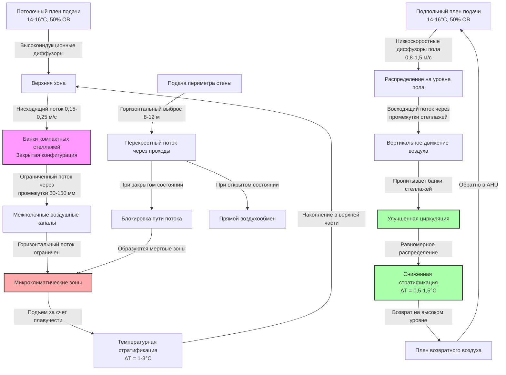

## Физические вызовы высокоплотного хранилища

Системы высокоплотного компактного хранилища—характеризуемые мобильными стеллажами на направляющих, которые устраняют фиксированные проходы—создают серьезные проблемы HVAC. Плотность хранения увеличивается на 40-80% по сравнению со статичными стеллажами, но пропускная способность воздушного потока снижается пропорционально. В результате возникают ограниченные пути воздушного потока, продленное время пребывания воздуха и существенный риск образования микроклимата внутри закрытых банков стеллажей.

Фундаментальная проблема геометрическая: когда стеллажи сжимаются для устранения проходов, воздух должен циркулировать через узкие вертикальные каналы и горизонтальные промежутки (обычно 50-150 мм) вместо открытых проходов. Перепад давления возрастает экспоненциально, а скорость снижается до уровней, где подъемная сила доминирует над вынужденной конвекцией.

## Физика распределения воздуха

### Перепад давления через компактное хранилище

Сопротивление воздушного потока через закрытые банки компактного хранилища соответствует соотношению Дарси-Вейсбаха, модифицированному для пористых сред:

$$\Delta P = f \cdot \frac{L}{D_h} \cdot \frac{\rho v^2}{2} + K \cdot \frac{\rho v^2}{2}$$

Где:
- $\Delta P$ = перепад давления через банк стеллажей (Па)
- $f$ = коэффициент трения (0,02-0,05 для стеллажей с хранимыми материалами)
- $L$ = глубина банка стеллажей (м)
- $D_h$ = гидравлический диаметр канала потока (м), обычно 0,05-0,15 м
- $\rho$ = плотность воздуха (кг/м³), примерно 1,2 кг/м³
- $v$ = скорость воздуха через сужение (м/с)
- $K$ = коэффициент местных потерь для входа/выхода, обычно 1,5-3,0

Для типичного 10 м глубокого банка компактного хранилища с промежутками 75 мм перепад давления варьируется от 15-40 Па при расчетных расходах воздуха, требуя специальных стратегий распределения.

### Требуемая кратность воздухообмена

Высокоплотное хранилище требует повышенной кратности воздухообмена для преодоления ограниченной циркуляции:

$$ACH_{required} = ACH_{base} \cdot \left(1 + \frac{\Delta T_{max}}{2}\right) \cdot \frac{V_{total}}{V_{accessible}}$$

Где:
- $ACH_{base}$ = базовая кратность воздухообмена для открытого хранилища (обычно 4-6 раз в час)
- $\Delta T_{max}$ = максимально допустимое изменение температуры (°C), обычно 2°C
- $V_{total}$ = общий объем хранилища включая стеллажи (м³)
- $V_{accessible}$ = объем доступных воздушных путей при закрытом состоянии (м³)

Этот расчет дает 8-15 кратности воздухообмена для типичных высокоплотных установок против 4-6 кратности для обычных статичных стеллажей.

## Подходы систем HVAC

### Сравнение стратегий распределения

| **Подход** | **Кратность воздухообмена** | **Равномерность температуры** | **Капитальные затраты** | **Риск мертвых зон** | **Оптимальное применение** |
|--------------|---------------------|----------------------------|------------------|--------------------|---------------------|
| **Потолочная подача, низкое возвращение** | 8-12 раз/ч | ±1,5-2,5°C | Базовые | Умеренный (уровень пола) | Стандартные архивы, умеренная плотность |
| **Диффузоры периметра стены** | 10-15 раз/ч | ±1,0-2,0°C | +15-25% | Низкий (при правильном расположении) | Средняя высота (≤4 м), доступ по периметру |
| **Подпольный плен с диффузорами пола** | 12-18 раз/ч | ±0,5-1,5°C | +40-60% | Очень низкий | Критичные коллекции, жесткие допуски |
| **Специализированная подача в проход** | 15-20 раз/ч | ±0,5-1,0°C | +60-80% | Минимальный | Высокая ценность, максимальная плотность |
| **Гибридный (периметр + потолок)** | 10-14 раз/ч | ±1,0-1,5°C | +25-35% | Низкий | Крупные объекты, переменная плотность |

### Подпольное распределение

Подпольная подача с низкоскоростными диффузорами пола, расположенными в потенциальных местах проходов, обеспечивает наиболее эффективное решение для критичного высокоплотного хранилища. Воздух поднимается через банки стеллажей за счет плавучести после начального горизонтального распределения, создавая вертикальный поток, противодействующий стратификации.

Скорость проектирования на диффузорах пола должна быть 0,8-1,5 м/с для обеспечения проникновения без чрезмерной турбулентности. Глубина плена 300-450 мм обеспечивает адекватное уравнивание давления на больших площадях пола.

### Потолочное распределение

Потолочная подача требует высокоиндукционных диффузоров, расположенных для направления воздуха вниз между рядами стеллажей. Высота потолка должна превышать высоту стеллажей минимум на 1,5 м для обеспечения эффективного вовлечения воздуха перед соударением о верхи стеллажей.

Возвратный воздух должен быть расположен на уровне пола на противоположных стенах для создания вертикальной циркуляции через весь объем хранилища. Этот подход более экономичен, но обеспечивает худшую равномерность по сравнению с подпольными системами.

## Конфигурация распределения воздуха

## Контроль стратификации

Температурная стратификация в высокоплотном хранилище результат:

1. **Ограниченная конвекция**: Минимальный вынужденный воздушный поток через закрытые банки стеллажей позволяет плавучести доминировать
2. **Асимметрия тепловой инерции**: Хранимые материалы медленно поглощают тепло, создавая температурное запаздывание
3. **Концентрация притока тепла**: Освещение и тепловыделение оборудования концентрируется на верхних уровнях

Величина стратификации следует:

$$\Delta T_{stratification} = \frac{q \cdot H}{k_{eff} \cdot A_{flow} \cdot v}$$

Где:
- $q$ = внутренний прирост тепла (Вт)
- $H$ = высота потолка (м)
- $k_{eff}$ = эффективная теплопроводность системы воздух/стеллажи (Вт/м·К)
- $A_{flow}$ = эффективное сечение потока (м²)
- $v$ = средняя скорость воздуха (м/с)

Для поддержания стратификации ниже 2°C требуется скорость 0,15-0,25 м/с через объем хранилища, достижимая только при повышенной кратности воздухообмена и правильном распределении.

## Устранение мертвых зон

Мертвые зоны образуются в:
- Углах закрытых банков стеллажей (особенно нижние углы напротив возвратов)
- Центрах больших закрытых банков, превышающих 10 м × 10 м без внутренних воздушных путей
- Областях на уровне пола под нижними полками с недостаточным зазором (<150 мм)

Стратегии смягчения:
- Расположите диффузоры подачи для создания перекрывающегося покрытия с максимальным расстоянием 4-5 м
- Сохраняйте минимальный зазор 200 мм под нижними полками
- Установите вертикальные воздушные каналы в системах стеллажей через каждые 6-8 м для банков, превышающих 12 м в глубину
- Используйте потолочные вентиляторы дестратификации, работающие непрерывно на низкой скорости (0,5-1,0 м/с) в критичных зонах

## Стандарты и допуски

ASHRAE Глава 24 (Архивы и библиотеки) устанавливает:
- Температура: 15-21°C с максимальным изменением ±2°C
- Относительная влажность: 30-50% с максимальным изменением ±5%
- Воздухообмен: минимум 4 кратности для статичного хранилища; увеличьте для компактного хранилища

ISO 11799 (Архивное хранилище) предоставляет более жесткие спецификации:
- Температура: 18±2°C (документы), 2-10°C (фотографии)
- Относительная влажность: 35±5% (документы), 30-40% (фотографии)
- Максимальная скорость изменения: 4°C/сутки, 10% ОВ/сутки

Проектирование высокоплотного хранилища должно ориентироваться на верхний предел требований кратности воздухообмена и более жесткие допуски равномерности (±1,5°C, ±3% ОВ) вследствие ограниченной естественной циркуляции.

## Рекомендации проектирования

Для оптимального контроля окружающей среды в высокоплотном компактном хранилище:

1. **Указывайте подпольное или периметровое распределение** для установок, требующих точности ±2°C или выше
2. **Рассчитайте перепад давления через банки стеллажей** и убедитесь, что система подачи может преодолеть дополнительное сопротивление 15-40 Па
3. **Проектируйте минимум 10-15 кратности воздухообмена** на основе общего объема хранилища
4. **Расположите датчики температуры/ОВ** на нескольких уровнях (пол, середина высоты, потолок) и внутри закрытых банков стеллажей
5. **Обеспечьте независимые циркуляционные вентиляторы** для установок, превышающих 500 м² площади хранилища
6. **Поддерживайте температуру подаваемого воздуха** на 1-2°C ниже установки помещения для преодоления внутренних приходов во время циркуляции
7. **Убедитесь в адекватных путях возвратного воздуха** с максимальным перепадом давления 15 Па между подачей и возвратом

Физика ограниченного воздушного потока в высокоплотном хранилище требует повышенной кратности воздухообмена, стратегического распределения и постоянного мониторинга для поддержания архивных стандартов окружающей среды.
