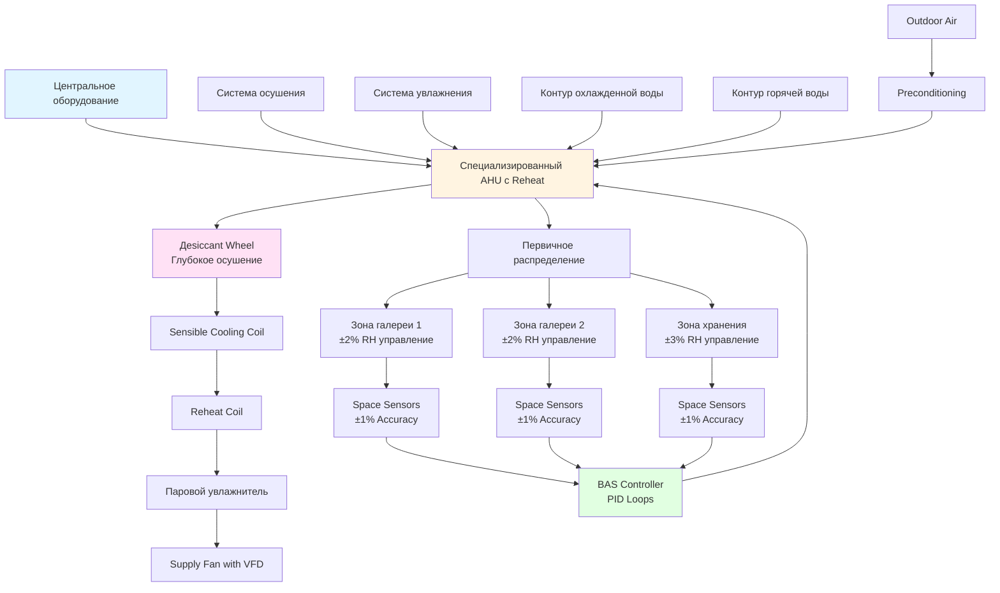

## Обзор

Среды сохранения музейных коллекций требуют систем HVAC, которые поддерживают точную температуру и относительную влажность (RH) в узких пределах, одновременно ограничивая колебания скорости изменения. В отличие от комфортного кондиционирования, системы сохранения приоритизируют стабильность над энергоэффективностью, поскольку даже незначительные изменения окружающей среды могут ускорить деградацию материалов через гигроскопические изменения размеров, химические реакции и биологический рост.

Фундаментальная задача сохранения включает контроль равновесия содержания влаги между гигроскопическими материалами и окружающим воздухом. При изменении RH органические материалы поглощают или выделяют влагу до достижения равновесного содержания влаги (EMC), вызывая размерные напряжения, приводящие к растрескиванию, короблению и расслаиванию.

## Термодинамические принципы консервационного управления

### Расчеты относительной влажности

Относительная влажность представляет собой отношение фактического парциального давления водяного пара к давлению насыщенного пара при данной температуре:

$$\phi = \frac{P_v}{P_{vs}(T)} \times 100\%$$

Где:
- $\phi$ = относительная влажность (%)
- $P_v$ = фактическое парциальное давление водяного пара (Па)
- $P_{vs}(T)$ = давление насыщенного пара при температуре T (Па)

Уравнение Антуана аппроксимирует давление насыщенного пара над водой:

$$\log_{10}(P_{vs}) = A - \frac{B}{C + T}$$

Для воды: A = 8,07131, B = 1730,63, C = 233,426 (T в °C, $P_{vs}$ в mmHg)

### Равновесное содержание влаги

Связь между EMC и RH для целлюлозных материалов следует модели Хендерсона-Томпсона:

$$EMC = \left[\frac{-\ln(1-\phi)}{A(T + B)}\right]^{1/C}$$

Для дерева и бумаги: A = 6,27×10⁻⁵, B = 273, C = 2,0

Это демонстрирует, почему контроль RH имеет приоритет над контролем температуры — содержание влаги в гигроскопических артефактах в основном зависит от RH, при этом температура играет вторичную роль через её влияние на давление пара.

## Уставки стандарта ASHRAE и контрольные диапазоны

ASHRAE Handbook—HVAC Applications, Глава 24 (Музеи, Галереи, Архивы и Библиотеки) устанавливает классы сохранения:

| Тип коллекции | Температура | Уставка RH | Контрольный диапазон | Ограничение скорости изменения |
|----------------|-------------|-------------|--------------|----------------------|
| Общие коллекции | 20–22°C | 50% | ±5% | 5% RH/месяц максимум |
| Металлические артефакты | 18–20°C | 30–40% | ±3% | 10°C/24ч, 5% RH/сутки |
| Фотографии (ч/б) | 18–20°C | 30–40% | ±3% | Строгий: ±2% суточно |
| Масляные живописи | 20–22°C | 50% | ±5% | 3% RH/сутки максимум |
| Бумага/книги | 18–21°C | 40–50% | ±5% | 5% RH/месяц |
| Естественная история (органика) | 16–19°C | 50–55% | ±5% | Сезонные постепенные изменения |
| Плёнка (нитрат/ацетат) | 2–10°C | 30–40% | ±3% | Требует холодного хранения |
| Ткани | 18–20°C | 50–55% | ±3% | 2–3% RH/сутки |

Институт консервации Гетти рекомендует стандарт "±3°C/±5%" (±3°C, ±5% RH) для смешанных коллекций как практический компромисс между идеальным сохранением и операционной реальностью.

## Архитектура системы прецизионного управления

## Инженерные стратегии обеспечения стабильности

### Специализированные системы с Reheat

Музейные системы HVAC используют охлаждение на основе осушения, за которым следует повторный нагрев для достижения независимого управления температурой и влажностью. Процесс:

1. **Переохлаждение подаваемого воздуха** для конденсации влаги ниже уставки
2. **Повторный нагрев до желаемой температуры** с использованием горячей воды или электрических змеевиков
3. **Добавление влаги при необходимости** с помощью паровых или ультразвуковых увлажнителей
4. **Непрерывная модуляция** через пропорционально-интегрально-производный (PID) контроль

Этот подход расходует энергию, но обеспечивает требуемую точность стабильности для сохранения.

### Усиленное осушение с использованием адсорбентов

Для глубокого осушения (ниже 40% RH) системы с компрессионным охлаждением становятся неэффективными. Адсорбентные колёса с использованием силикагеля или хлорида лития достигают точек росы 0–5°C, обеспечивая стабильный контроль в период влажного сезона без чрезмерного переохлаждения.

### Философия сезонной регулировки

Международный институт консервации (IIC) и Американский институт консервации (AIC) теперь признают, что постепенные сезонные изменения RH (40% зимой до 55% летом) вызывают меньше повреждений, чем отказы механических систем при попытке поддерживать круглогодичные уставки. Ключевое требование: скорость изменения не должна превышать 5% RH в месяц.

Это "сезонное дрейф уставки" снижает энергопотребление на 30–40% при одновременном учёте динамики влаги в ограждающей конструкции здания без компромисса долгосрочного сохранения.

### Зонирование и распределение воздуха

Системы высокой точности требуют:

- **Отдельное воздухообработка для каждой зоны** для поддержки различных требований коллекции
- **Низкоскоростная ламинарная подача** (0,8–1,5 м/с) для предотвращения локальных градиентов RH
- **Датчики возвратного воздуха с задержкой 15 минут** для учёта постоянной времени смешивания
- **Избыточные датчики** (минимум три на зону) с усреднением сигнала
- **Постепенное снижение во время неиспользования** (максимум 1°C/час, 2% RH/час)

### Калибровка датчиков и точность

Датчики RH консервационного класса должны поддерживать точность ±1% в диапазоне 30–60% RH. Емкостные тонкопленочные датчики обеспечивают превосходную долгосрочную стабильность по сравнению с резистивными типами. Протокол калибровки:

- **Ежемесячная проверка** по сравнению с солевыми стандартами, прослеживаемыми к NIST
- **Годовая перекалибровка** производителем или сертифицированной лабораторией
- **Замена каждые 5 лет** из-за дрейфа датчика

## Расчеты нагрузок и выбор размеров системы

Скрытые нагрузки в музеях превосходят явные нагрузки из-за:

- **Инфильтрации через ограждающую конструкцию**: 0,2–0,5 ACH типично
- **Выделения влаги посетителями**: 200–250 г/ч на человека
- **Выделения летучих веществ витринами**: требует обработки подпиточного воздуха

Размер мощности осушения для наихудших летних условий при наружной расчётной точке росы плюс 20% коэффициент безопасности. Размер увлажнения требует анализа разности давлений водяного пара для зимних условий внутри/снаружи.

## Мониторинг и сигнализация

Консервационные среды требуют непрерывного мониторинга с пороговыми значениями сигнализации, установленными в пределах контрольного диапазона:

- **Регистрация данных с интервалом 15 минут** минимум
- **Немедленные сигналы тревоги** при отклонении ±3% RH или ±3°C отклонении температуры
- **Анализ тенденций** для выявления медленных сезонных дрейфов до превышения ограничений ежемесячной скорости изменения
- **Резервные системы** с автоматической переключением для критичных коллекций

## Практические соображения при реализации

Наиболее надежные музейные системы HVAC имеют следующие характеристики:

1. **Непрерывная работа 24/7** без ночного снижения нагрузки (поддержание стабильности)
2. **Резервирование N+1** для всех критичных компонентов
3. **Байпасные воздуховоды** для временной изоляции зон при техническом обслуживании
4. **Возможность ручного переключения** для консерваторов во время чрезвычайных ситуаций в окружающей среде

Система HVAC должна служить целям консервации в первую очередь, комфорту пассажиров — во вторую очередь. Если эти требования вступают в конфликт, сохранение коллекций имеет приоритет.

---

**Ссылки**: ASHRAE Handbook—HVAC Applications Глава 24, Руководства по окружающей среде Института консервации Гетти, Декларация по руководящим принципам окружающей среды IIC (2014), Комментарии AIC к Декларации (2016), ISO 11799 Стандарт архивного хранилища.
