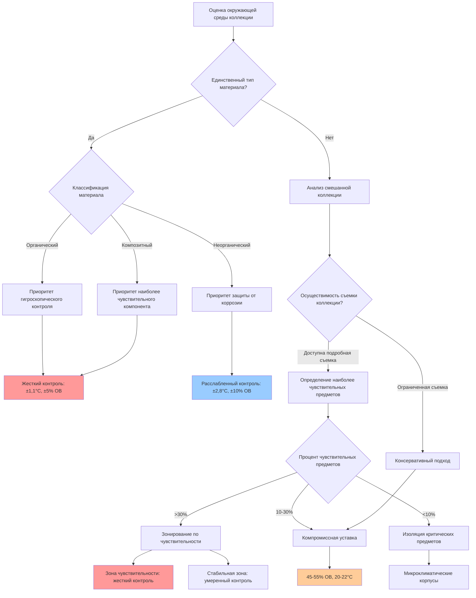

## Требования к окружающей среде по типам коллекций

Музейные коллекции демонстрируют существенно различную чувствительность к температуре и относительной влажности в зависимости от состава материалов, гигроскопических свойств и механизмов деградации. Глава 24 ASHRAE (Музеи, Галереи, Архивы и Библиотеки) является основой для стратегий контроля окружающей среды, специфичных для коллекций, которые сбалансируют потребности сохранения с энергопотреблением и эксплуатационной целесообразностью.

### Категории материалов и классификация чувствительности

**Органические материалы** (высокая гигроскопическая чувствительность):
- Бумага, пергамент, фотографические материалы
- Текстиль, кожа, мех
- Дерево, бамбук, натуральные волокна
- Биологические образцы

**Неорганические материалы** (низкая гигроскопическая чувствительность):
- Металлы (черные и цветные)
- Керамика, стекло, камень
- Устойчивые пластмассы и синтетические полимеры
- Минералы и геологические образцы

**Композитные материалы** (промежуточная чувствительность):
- Картины на холсте или деревянных панелях
- Мебель с компонентами из нескольких материалов
- Этнографические предметы со смешанной конструкцией
- Монтированные образцы и диорамы

### Спецификации окружающей среды ASHRAE по типам коллекций

| Тип коллекции | Диапазон температуры | Относительная влажность | Допустимые колебания | Коэффициент риска |
|-----------------|-------------------|-------------------|----------------------|-------------|
| Бумажные архивы | 20-22°C | 30-50% ОВ | ±1,1°C, ±5% ОВ/день | Высокий |
| Фотографии (желатина серебра) | 18-21°C | 30-40% ОВ | ±1,1°C, ±3% ОВ/день | Критический |
| Масляная живопись на холсте | 20-24°C | 45-55% ОВ | ±2,2°C, ±5% ОВ/день | Высокий |
| Деревянная мебель/панели | 20-22°C | 45-55% ОВ | ±1,7°C, ±5% ОВ/день | Высокий |
| Текстиль и кожа | 18-21°C | 45-55% ОВ | ±1,7°C, ±5% ОВ/день | Высокий |
| Металлы (черные) | 20-22°C | <35% ОВ | ±2,8°C, ±10% ОВ/день | Средний |
| Керамика и стекло | 20-24°C | 40-60% ОВ | ±2,8°C, ±10% ОВ/день | Низкий |
| Камень и минералы | 18-24°C | 35-65% ОВ | ±4,4°C, ±15% ОВ/день | Низкий |

### Методология оценки риска

Риск деградации гигроскопических материалов следует соотношению Аррениуса для скоростей химических реакций в сочетании с механическим напряжением, вызванным влагой. Совокупный индекс деградации может быть выражен как:

$$
D_{total} = \int_{0}^{t} k(T, RH) \, dt
$$

где $k(T, RH)$ представляет коэффициент скорости деградации, зависящий от температуры и относительной влажности.

Для температурно-зависимой деградации:

$$
k_T = A \cdot e^{-\frac{E_a}{RT}}
$$

где:
- $A$ = предэкспоненциальный множитель (специфичный для материала)
- $E_a$ = энергия активации (кДж/моль)
- $R$ = универсальная газовая постоянная (8,314 Дж/моль·К)
- $T$ = абсолютная температура (К)

Для механического напряжения, вызванного колебаниями влажности в гигроскопических материалах:

$$
\sigma_{RH} = E_{eff} \cdot \alpha_{RH} \cdot \Delta RH
$$

где:
- $\sigma_{RH}$ = индуцированное напряжение (Па)
- $E_{eff}$ = эффективный модуль упругости (Па)
- $\alpha_{RH}$ = коэффициент гигроскопического расширения (%/% ОВ)
- $\Delta RH$ = изменение относительной влажности (%)

Допустимый предел суточного колебания для деревянных предметов можно рассчитать как:

$$
\Delta RH_{max} = \frac{\sigma_{yield}}{E_{eff} \cdot \alpha_{RH}}
$$

Типичные значения для предела текучести дерева $\Delta RH_{max} \approx 5-7\%$ суточного изменения, что согласуется с рекомендациями ASHRAE.

### Дерево решений для оценки типа коллекции

### Стратегии компромисса для смешанных коллекций

Реальные музеи редко содержат однородные коллекции, что требует компромиссных стратегий:

**1. Приоритет наиболее чувствительного предмета**
Установите параметры окружающей среды на основе наиболее уязвимых материалов. Для смешанной коллекции, содержащей бумагу, металл и керамику, требования к бумаге (45-50% ОВ) определяют условия всего пространства.

**2. Зонирование по чувствительности материалов**
Отдельные зоны управления HVAC для:
- Высокочувствительные органические материалы: 45-55% ОВ, ±5% суточного колебания
- Среднечувствительные композиты: 40-60% ОВ, ±10% суточного колебания
- Низкочувствительные неорганические материалы: 35-65% ОВ, ±15% суточного колебания

**3. Микроклиматические корпусы**
Для исключительно чувствительных предметов в рамках более широкой коллекции герметичные витрины с независимым буферированием влажности обеспечивают локальную защиту без кондиционирования всего выставочного пространства.

**4. Сезонная адаптация**
ASHRAE допускает сезонные корректировки уставок (зима: 45% ОВ, лето: 55% ОВ) для снижения энергопотребления при сохранении совокупной деградации в пределах допустимых значений. Среднегодовое значение остается в целевом диапазоне.

### Требования к съемке коллекции

Эффективная спецификация окружающей среды требует полного учета коллекции:

- Оценка состава материалов и состояния
- Классификация гигроскопической чувствительности
- Существующие модели деградации
- Иерархия ценности (культурная, историческая, денежная)
- Требования к дисплею и хранению

Консерваторы применяют методологию оценки риска для расстановки приоритетов инвестиций в HVAC там, где преимущества сохранения наибольшие. Коллекция с 80% керамики и 20% акварелей должна инвестировать в жесткий контроль для галереи акварелей, а не единообразное кондиционирование по всему зданию.

### Соображения при реализации

**Выбор допуска управления:**
Более жесткие допуски требуют:
- Датчики более высокой точности (±2% ОВ точность против ±5%)
- Увеличенная емкость оборудования HVAC для быстрого реагирования
- Улучшенное каскадное осушение/увлажнение
- Повышенное энергопотребление (увеличение на 30-50% для ±3% ОВ против ±8% ОВ)

**Мониторинг и документирование:**
Непрерывное развертывание регистраторов данных на уровне артефактов проверяет производительность HVAC и выявляет микроклиматические отклонения. Интервалы записи 15-60 минут фиксируют суточные циклы и реакции механических систем.

### Протокол консультаций с консерватором

Проектировщикам HVAC необходимо сотрудничать с профессионалами консервации во время:
- Первоначальной оценки коллекции и идентификации материалов
- Разработки спецификаций окружающей среды
- Переговоров по компромиссам уставок для смешанных коллекций
- Определения допусков контроля на основе бюджетных ограничений
- Установления стратегии мониторинга и пороговых значений тревоги

Экспертиза материаловедения консератора преобразует абстрактные механизмы деградации в количественные требования к производительности HVAC, обеспечивая защиту механической системой, а не повреждение неповторимого культурного наследия.
