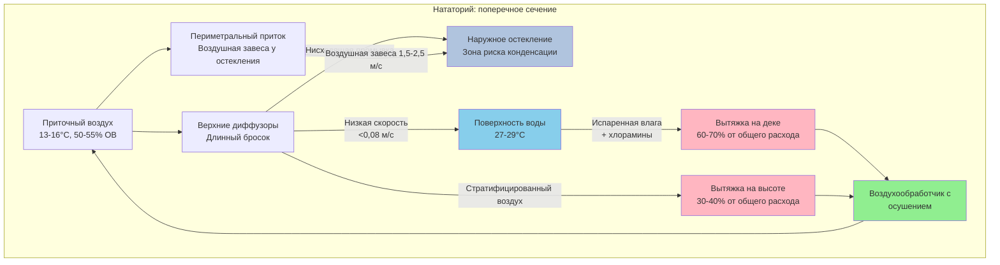

# Системы распределения воздуха для крытых бассейнов

Надлежащее распределение воздуха в помещениях нататориев критически важно для контроля миграции влаги, предотвращения конденсации на ограждающих конструкциях здания и поддержания комфорта пловцов. В отличие от обычных применений HVAC, распределение воздуха в бассейнах должно учитывать высокие влагонагрузки, воздействие хлора и виды деятельности, происходящие в дыхательной зоне рядом с поверхностью воды.

## Основные принципы проектирования

Распределение воздуха в нататориях служит трем основным целям:

1. **Контроль испарения с поверхности** - Прямой низкоскоростной воздушный поток через поверхность воды минимизирует скорость испарения
2. **Предотвращение конденсации** - Поддерживать поверхности ограждающей конструкции выше температуры точки росы посредством надлежащей промывки воздухом
3. **Разбавление загрязняющих веществ** - Удалять хлорамины и побочные продукты дезинфекции в дыхательной зоне

В справочнике ASHRAE Applications (Глава 6) указано, что системы распределения воздуха должны обеспечивать достаточное движение воздуха для предотвращения стратификации, избегая чрезмерных скоростей, которые увеличивают испарение. Зависимость между скоростью воздуха и скоростью испарения выглядит следующим образом:

$$E = A \cdot (P_w - P_a) \cdot (0.089 + 0.0782 \cdot V)$$

Где:
- $E$ = скорость испарения (кг/ч)
- $A$ = площадь поверхности воды (м²)
- $P_w$ = давление насыщения при температуре воды (кПа)
- $P_a$ = парциальное давление водяного пара в воздухе (кПа)
- $V$ = скорость воздуха над поверхностью воды (м/с)

Это уравнение демонстрирует, что скорость воздуха имеет прямую линейную зависимость от испарения сверх базовой скорости. Поддержание скоростей ниже 0,05-0,08 м/с на поверхности воды снижает ненужные влагонагрузки.

## Стратегии распределения воздуха

### Приточный воздух сверху с низкой вытяжкой по периметру

Наиболее распространенный подход подает кондиционированный воздух через верхние диффузоры с вытяжными отверстиями на уровне дека. Эта конфигурация:

- Обеспечивает нисходящий воздушный поток для промывки наружных стен и окон
- Снижает температурную стратификацию
- Позиционирует вытяжные решетки для захвата хлораминов, концентрирующихся рядом с поверхностью воды

Приточные диффузоры требуют длинных потоков для достижения периметральной остекления. Дальность броска рассчитывается по формуле:

$$L = K \cdot \sqrt{\frac{Q}{V_t}}$$

Где:
- $L$ = дальность броска до конечной скорости (м)
- $K$ = константа, характерная для диффузора (обычно 2.0–4.0)
- $Q$ = расход воздуха (м³/ч)
- $V_t$ = конечная скорость (м/с)

Для нататориев с высокими потолками (4,5–9 м) выбирайте диффузоры с коэффициентами K 3,5 или выше для достижения адекватного броска без чрезмерных скоростей приточного воздуха.

### Периметральное распределение воздуха

Периметральные системы подают кондиционированный воздух вдоль наружных стен через линейные диффузоры или щелевые выходы. Этот подход:

- Создает эффект воздушной завесы над остекленными поверхностями
- Прямо решает проблемы зон риска конденсации
- Снижает требования к броску в сравнении с верхними системами

Приточные выходы, расположенные на расстоянии 30–45 см от остекленных поверхностей, должны подавать воздух со скоростью выпуска 1,5–2,5 м/с под углом вниз 15–30 градусов. Воздушная завеса должна простираться от потолка до пола, создавая тепловой барьер, который поддерживает температуру поверхности стекла выше точки росы помещения.

### Вытесняющая вентиляция

Низкоскоростные системы вытесняющей вентиляции подают воздух на уровне дека или рядом с ним при температурах всего на 1–2°C ниже температуры помещения. Приточный воздух распространяется по полу, поглощает тепло и загрязняющие вещества, а затем естественным образом поднимается к верхним вытяжным точкам. Преимущества включают:

- Превосходную эффективность удаления загрязняющих веществ в дыхательной зоне
- Сниженные скорости воздуха над поверхностью воды
- Пониженную энергию вентилятора из-за сниженных перепадов давления

Вытесняющая вентиляция требует скоростей приточного воздуха ниже 0,25 м/с и особого внимания к контролю температуры приточного воздуха. Перепады температур, превышающие 3°C, создают дискомфортные сквозняки на уровне щиколоток.

## Сравнение стратегий распределения воздуха

| Стратегия | Преимущества | Недостатки | Оптимальное применение |
|----------|-----------|---------------|------------------|
| Приточный воздух сверху | Проверенная надежность, эффективная промывка стен, простой контроль | Более высокие скорости испарения, значительный требуемый бросок | Стандартные прямоугольные бассейны, модернизация |
| Периметральное распределение | Прямой контроль конденсации, равномерная защита остекления | Сложная разводка воздуховодов, ограниченная гибкость | Большие остекленные площади, спортивные объекты |
| Вытесняющая вентиляция | Превосходное качество воздуха, энергетическая эффективность, низкое испарение | Контроль температуры критичен, более высокие первоначальные затраты | Терапевтические бассейны, помещения с низкой активностью |

## Размещение приточных и вытяжных отверстий

Размещение вытяжных решеток существенно влияет на производительность системы. Позиционируйте вытяжки для:

- Захвата хлораминов в дыхательной зоне (1,8–2,4 м над деком)
- Создания воздушных потоков, которые отводят загрязненный воздух из занятых зон
- Избежания короткого замыкания с приточным воздухом

Соотношение низкоуровневой к высокоуровневой вытяжке должно быть 60:40 или 70:30, причем большая часть вытяжки находится рядом с деком бассейна. Высокоуровневая вытяжка предотвращает стратификацию и решает проблему скопления плавучей влаги у потолка.

Распределение приточного воздуха должно поддерживать скорости воздуха в помещении 0,13–0,18 м/с в занятых зонах для обеспечения мягкого движения воздуха без создания сквозняков. Области над деком бассейна и мест для зрителей требуют тщательной балансировки для предотвращения холодных сквозняков в периоды низкой активности.

## Системы воздушных завес

Входные двери требуют систем воздушных завес для предотвращения инфильтрации наружного воздуха и миграции влаги. Эффективное проектирование воздушной завесы требует:

- Скорости выпуска 2,5–5,0 м/с
- Расход воздуха 0,1–0,2 м³/ч на сантиметр ширины двери
- Минимальное соотношение скоростей 3:1 (выпуск к перекрестному потоку)

Эффективность воздушной завесы выражается как:

$$\eta = 1 - \frac{Q_i}{Q_{i,max}}$$

Где $\eta$ — эффективность герметизации, $Q_i$ — фактическая скорость инфильтрации, а $Q_{i,max}$ — инфильтрация без воздушной завесы. Надлежащим образом спроектированные системы достигают эффективности герметизации 70–85%.

## Схема распределения воздуха

## Рекомендации по проектированию

1. **Контроль скорости** - Поддерживайте скорость на поверхности воды ниже 0,08 м/с для минимизации испарения при обеспечении достаточного движения воздуха для контроля конденсации (0,10–0,15 м/с на ограждающих конструкциях)

2. **Акцент на дыхательную зону** - Расположите 60–70% вытяжной мощности в пределах 2,4 м от дека для захвата хлораминов перед их достижением занятых дыхательных зон

3. **Защита остекления** - Обеспечьте, чтобы все наружное остекление получало непрерывный воздушный поток при температурах, поддерживающих состояние поверхности по крайней мере на 2°C выше точки росы помещения

4. **Гибкость** - Спроектируйте системы с переменными возможностями потока для регулировки распределения воздуха в соответствии с изменяющимися нагрузками занятости и уровнями активности

5. **Интеграция** - Координируйте распределение воздуха с емкостью осушения, обеспечивая, чтобы точка росы приточного воздуха оставалась на 1–2°C ниже точки росы помещения для обеспечения непрерывного удаления влаги

Надлежащее распределение воздуха является основой успешного контроля окружающей среды нататория, прямо влияя на потребление энергии, долговечность здания и комфорт занимающихся.
