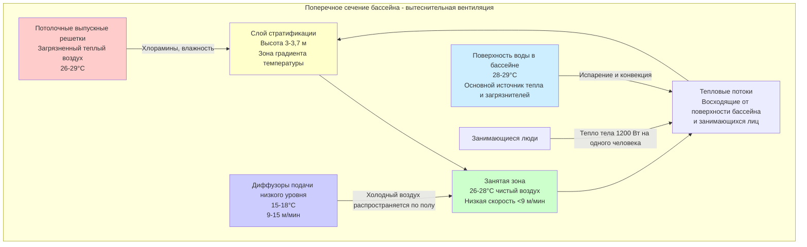

## Вытеснительная вентиляция в бассейнах

Вытеснительная вентиляция представляет принципиально иной подход к распределению воздуха в бассейнах по сравнению с традиционными смешивающими системами. Эта стратегия подает кондиционированный воздух с низкой скоростью у уровня пола, позволяя силам тепловой плавучести управлять вертикальным потоком воздуха через занятую зону и удалять загрязнители на уровне потолка.

## Физические принципы

Вытеснительная вентиляция использует естественные конвекционные токи, генерируемые источниками тепла в среде бассейна. Первичные тепловые потоки исходят от поверхности воды, занимающихся лиц и любых нагреваемых поверхностей. Воздух, подаваемый при температурах на 2-4°C ниже температуры занятой зоны, остается стратифицированным около пола до встречи с источниками тепла.

Скорость теплового потока над источником тепла следует соотношению:

$$w(z) = 1.14 \left(\frac{Q}{z}\right)^{1/3}$$

Где:
- $w(z)$ = вертикальная скорость на высоте $z$ (м/мин)
- $Q$ = конвективный тепловой поток (кДж/ч)
- $z$ = высота над источником тепла (м)

Высота интерфейса стратификации может быть оценена с использованием:

$$h_s = \frac{Q_t^{1/3} A^{1/2}}{(C_p \rho \Delta T)^{1/3}}$$

Где:
- $h_s$ = высота стратификации (м)
- $Q_t$ = общий конвективный прирост тепла (кДж/ч)
- $A$ = площадь пола (м²)
- $C_p$ = удельная теплоемкость воздуха (1000 Дж/кг·°C)
- $\rho$ = плотность воздуха (кг/м³)
- $\Delta T$ = разница температур подачи и помещения (°C)

## Конфигурация подачи воздуха

Диффузоры вытеснительной вентиляции низкого уровня должны подавать воздух со скоростями ниже 15 м/мин на высоте 0,9 м выше уровня пола, чтобы предотвратить нарушение стратифицированного слоя. Температуры подачи воздуха обычно находятся в диапазоне 15-18°C в бассейнах с установками занятой зоны 26-28°C.

Расположение диффузоров вдоль периметров палубы бассейна обеспечивает равномерное покрытие при минимизации риска сквозняков. Расход воздуха подачи на один диффузор должен учитывать тепловую нагрузку в его зоне покрытия:

$$\dot{V}_{diffuser} = \frac{Q_{zone}}{60 \rho C_p (T_{room} - T_{supply})}$$

Где $\dot{V}_{diffuser}$ — расход воздуха на один диффузор (CFM).

## Управление хлораминами и загрязнителями

Вытеснительная вентиляция обеспечивает превосходную эффективность удаления загрязнителей в бассейнах, поскольку она использует плавучесть теплого воздуха, богатого хлораминами, поднимающегося от поверхности бассейна. Связанные хлорамины (трихлорамин в частности) испаряются вместе с водой и захватываются тепловыми потоками.

Эффективность вентиляции по удалению загрязнителей выражается как:

$$\epsilon_c = \frac{C_e - C_s}{C_{occ} - C_s}$$

Где:
- $\epsilon_c$ = эффективность удаления загрязнителей (безразмерная)
- $C_e$ = концентрация на выходе (ppm)
- $C_s$ = концентрация подачи (ppm)
- $C_{occ}$ = концентрация в занятой зоне (ppm)

Системы вытеснения достигают значений $\epsilon_c$ 1,5-2,0, в сравнении с 1,0 для идеальных смешивающих систем, что означает удаление загрязнителей более эффективно при том же расходе воздуха.

## Сравнение производительности системы

| Параметр | Вытеснительная вентиляция | Смешивающая вентиляция |
|-----------|-------------------------|-------------------|
| Скорость подачи на диффузоре | 9-15 м/мин | 120-240 м/мин |
| Температура подачи | 15-18°C | 20-22°C |
| Стратификация температуры | 2-3°C от пола к потолку | 0,5-1°C от пола к потолку |
| Эффективность удаления загрязнителей | 1,5-2,0 | 0,9-1,1 |
| Скорость воздуха в занятой зоне | <9 м/мин | 15-30 м/мин |
| Объем подачи воздуха (при одинаковой нагрузке) | 85-90% смешивающей | 100% исходное значение |
| Потребление энергии вентилятором | 40-50% смешивающей | 100% исходное значение |
| Жалобы на тепловой комфорт | Ниже | Выше |

## Энергетические характеристики

Вытеснительная вентиляция снижает энергопотребление посредством трех механизмов:

1. **Более низкая мощность вентилятора**: Пониженные скорости воздуха и упрощенная работа воздуховодов снижают требования к статическому давлению на 50-60%

2. **Более высокие температуры подачи**: На 4-7°C более высокая температура подачи (по сравнению со смешивающими системами) снижает нагрузку на охлаждающий змеевик и позволяет использовать экономайзер в течение большего количества часов

3. **Сниженные расходы воздуха**: Превосходная эффективность удаления загрязнителей позволяет сократить расход воздуха на 10-15% при сохранении качества воздуха в занятой зоне

Снижение мощности вентилятора следует соотношению закона сродства:

$$\frac{HP_2}{HP_1} = \left(\frac{CFM_2}{CFM_1}\right)^3 \times \frac{\Delta P_2}{\Delta P_1}$$

## Рекомендации по проектированию в соответствии с руководящими принципами ASHRAE

Исследования ASHRAE (RP-1271 и последующие исследования) устанавливают несколько требований для вытеснительной вентиляции в приложениях бассейнов с высокой влажностью:

- Поддерживать точку росы подаваемого воздуха по крайней мере на 1°C ниже температуры поверхности палубы бассейна во избежание конденсации на полах
- Ограничить скорость подачи воздуха, чтобы предотвратить нарушение стратифицированного слоя (максимум 15 м/мин на высоте 0,9 м)
- Обеспечить минимум 6 воздухообменов в час на основе площади поверхности воды бассейна и численности людей
- Спроектировать высоту стратификации для позиционирования интерфейса выше занятой зоны, но ниже выпускных решеток (обычно 3-3,7 м)
- Учитывать тепловые мостики и потери тепла оболочки, которые могут нарушить характеры стратификации у наружных стен

## Проблемы реализации

Успешная реализация вытеснительной вентиляции в бассейнах требует тщательного внимания к:

- **Тепловая эффективность оболочки**: Плохая теплоизоляция или тепловые мостики создают нисходящие потоки холодного воздуха, нарушающие стратификацию
- **Распределение нагрузки**: Сконцентрированные источники тепла (гидромассажные ванны, зоны для зрителей) могут требовать дополнительной смешивающей вентиляции
- **Условия запуска**: Холодные помещения бассейна требуют временной работы в режиме смешивания до установления тепловой стратификации
- **Управление влажностью**: Управление точкой росы становится критическим для предотвращения конденсации на полу при холодной подаче воздуха

## Операционные преимущества

Помимо экономии энергии, вытеснительная вентиляция улучшает работу бассейна через:

- Сокращенное воздействие хлораминов для занимающихся и персонала на уровне палубы
- Исключение высокоскоростных сквозняков, вызывающих тепловой дискомфорт
- Более тихая работа благодаря низким скоростям воздуха
- Сниженное загрязнение воздуховодов отложениями хлораминов (загрязнители извлекаются до конденсации в воздуховодах)
- Продленный срок службы оборудования благодаря пониженным скоростям вентилятора и сниженному коррозионному воздействию
