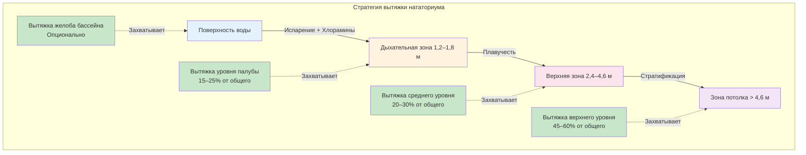

## Стратегии вытяжного воздуха для нататориумов

Эффективные стратегии вытяжного воздуха критически важны для поддержания качества воздуха в помещении, контроля влажности и удаления хлораминов в условиях нататориума. Стратегическое размещение и объемный баланс точек вытяжки непосредственно влияют на комфорт людей, качество воздуха и долговечность строительных материалов.

## Основные требования к вытяжке

Основные задачи систем вытяжки нататориумов включают:

- **Извлечение хлораминов** из дыхательной зоны и поверхности воды
- **Контроль влажности** для предотвращения конденсации на строительных конструкциях
- **Разбавление загрязняющих веществ** для поддержания приемлемого качества воздуха в помещении
- **Управление тепловой стратификацией** для предотвращения накопления горячего влажного воздуха у потолка

Справочник применения ASHRAE, глава 6 (Нататориумы) устанавливает минимальные расходы наружного воздуха и подчеркивает важность расположения вытяжки относительно источников загрязняющих веществ.

## Расчеты объема вытяжного воздуха

Общий объем вытяжного воздуха должен соответствовать подаче воздуха при поддержании надлежащего давления в помещении. Для нататориумов расход вытяжки обычно рассчитывается на основе требований вентиляции:

$$
Q_{\text{exhaust}} = Q_{\text{supply}} - Q_{\text{infiltration}} + Q_{\text{exfiltration}}
$$

Где нататориумы обычно поддерживают **отрицательное давление** 12–25 Па относительно соседних помещений для предотвращения миграции влаги:

$$
Q_{\text{exhaust}} = Q_{\text{supply}} \times (1 + P_{\text{factor}})
$$

Где $P_{\text{factor}}$ варьируется от 0,05 до 0,15 в зависимости от герметичности здания и требуемого перепада давления.

Минимальные требования к наружному воздуху согласно ASHRAE 62.1 для зон палубы бассейна:

$$
Q_{\text{OA}} = 0,48 \, \text{CFM/(м² палубы)} \times A_{\text{deck}} + 0,06 \, \text{CFM/(м² воды)} \times A_{\text{water}}
$$

## Стратегии размещения вытяжки

Эффективность удаления загрязняющих веществ значительно зависит от расположения решетки вытяжки относительно зон образования загрязняющих веществ.

### Вытяжка уровня палубы

Решетки вытяжки низкого уровня, расположенные на высоте 1,2–1,8 м над палубой бассейна, захватывают хлорамины и влагу в дыхательной зоне до того, как плавучесть перенесет загрязняющие вещества вверх. Эта стратегия особенно эффективна для:

- Дыхательных зон пловцов и зрителей
- Периодов высокой загруженности с повышенным образованием хлораминов
- Объектов с соревновательным плаванием, где спортсмены дышат активно у поверхности воды

Вытяжка уровня палубы должна составлять **15–25 процентов** от общего объема вытяжки. Размещение решетки должно быть:

- **0,9–2,4 м** от края бассейна
- **1,2–1,8 м** над готовым полом
- Расположено для предотвращения короткого замыкания с подачей воздуха низкого уровня

### Вытяжка потолка высокого уровня

Верхние точки вытяжки захватывают плавучий теплый влажный воздух, который естественным образом стратифицируется у потолка. Это расположение вытяжки:

- Предотвращает конденсацию на поверхностях потолка и кровельных конструкциях
- Удаляет основную часть влагонагрузки естественной конвекцией
- Захватывает хлорамины, поднявшиеся через тепловые скопления

Вытяжка верхнего уровня обычно составляет **45–60 процентов** от общей вытяжки и должна быть распределена по потолку для предотвращения мертвых зон.

### Вытяжка желоба и поверхности воды

Некоторые конструкции предусматривают вытяжку, интегрированную в системы желобов бассейна или расположенную непосредственно над поверхностью воды. Этот подход:

- Захватывает испарение и хлорамины у источника
- Снижает концентрацию загрязняющих веществ до воздействия в дыхательной зоне
- Требует специализированного дизайна решетки для предотвращения увлечения воды

Эта стратегия является опциональной и обычно добавляет **5–15 процентов** к общей мощности вытяжки.

## Сравнение подходов вытяжки

| Стратегия вытяжки | Расположение | % от общей вытяжки | Эффективность удаления загрязняющих веществ | Применение | Особенности проектирования |
|---|---|---|---|---|---|
| **Только верхний уровень** | Потолок (> 3,7 м) | 100% | Умеренная для хлораминов, Высокая для влаги | Экономичные конструкции, малонагруженные бассейны | Простая установка, полагается на стратификацию, плохой контроль дыхательной зоны |
| **Только уровень палубы** | 1,2–1,8 м от готового пола | 100% | Высокая для хлораминов, Умеренная для влаги | Не рекомендуется в качестве единственной стратегии | Короткие замыкания с естественной плавучестью, увеличивает энергию вентилятора |
| **Комбинированный верхний/палубный** | Многоуровневый | 15–25% палубный, 45–60% верхний, 20–30% средний | Очень высокая для обоих | Соревновательные бассейны, высоконагруженные нататориумы | Лучшее качество воздуха в помещении, повышенная сложность воздуховодов |
| **Интегрированный желоб** | Поверхность воды | 5–15% (дополнительно) | Отличное у источника | Объекты со специализированными системами желобов | Предотвращает миграцию влаги, требует пользовательского дизайна |

## Эффективность удаления загрязняющих веществ

Эффективность воздухообмена для систем вытяжки зависит от размещения относительно источников загрязняющих веществ. Эффективность вентиляции может быть количественно определена:

$$
\epsilon_v = \frac{C_{\text{exhaust}} - C_{\text{supply}}}{C_{\text{breathing zone}} - C_{\text{supply}}}
$$

Для хорошо спроектированных многоуровневых систем вытяжки в нататориумах $\epsilon_v$ варьируется от **1,2 до 1,8**, что указывает на превосходную производительность по сравнению с смешивающей вентиляцией ($\epsilon_v = 1,0$).

Скорость удаления хлораминов зависит от близости вытяжки к источникам образования:

$$
\eta_{\text{removal}} = 1 - e^{-\frac{Q_{\text{local}} \times t}{V_{\text{zone}}}}
$$

Где:
- $Q_{\text{local}}$ = местный расход вытяжки (CFM)
- $t$ = время пребывания (минуты)
- $V_{\text{zone}}$ = объем зоны (м³)

## Контроль стратификации

Тепловая стратификация естественным образом возникает в нататориумах из-за:

- Температур поверхности воды (26–28 °C)
- Выделения энергии испарением
- Высоких потолков (обычно 4,6–7,6 м)

Температурные перепады между палубой и потолком могут достигать **4–8 °C** без надлежащего распределения воздуха. Стратегии вытяжки должны работать в координации с схемами подачи воздуха для:

1. Извлечения самого теплого и влажного воздуха у потолка
2. Предотвращения чрезмерных температурных градиентов, снижающих комфорт
3. Поддержания надлежащего движения воздуха через дыхательную зону

Коэффициент стратификации может быть оценен:

$$
S_f = \frac{T_{\text{ceiling}} - T_{\text{deck}}}{T_{\text{supply}} - T_{\text{deck}}}
$$

Хорошо спроектированные системы поддерживают $S_f < 0,5$.

## Рекомендации по проектированию и реализации

**Размер и выбор вытяжных решеток:**
- Максимальная скорость на входе: **2,5–3,6 м/с** для минимизации шума
- Свободная площадь решетки: **50–60%** от номинального размера
- Коррозионностойкая конструкция (нержавеющая сталь 316-го типа, порошковое покрытие алюминия)

**Размещение воздуховодов:**
- Изолируйте вытяжные воздуховоды в кондиционируемых помещениях для предотвращения конденсации
- Поддерживайте скорость в воздуховоде: **6–9 м/с** для предотвращения накопления влаги
- Наклонные горизонтальные участки в сторону дренажных точек

**Балансировка давления:**
- Установите заслонки вытяжки для балансировки зон
- Предусмотрите регулирование объема на основных ветвях вытяжки
- Контролируйте давление в здании относительно соседних помещений

**Целевые значения концентрации хлораминов:**
- Трихлорамин (NCl₃): **< 0,3 мг/м³** согласно рекомендациям ВОЗ
- Отбор проб дыхательной зоны на высоте 0,9–1,5 м над палубой
- Непрерывный мониторинг рекомендуется для объектов с высокой интенсивностью использования

## Операционные соображения

Стратегии вытяжки должны адаптироваться к изменяющейся загруженности и использованию бассейна:

- **Периоды высокой загруженности:** Увеличьте долю вытяжки уровня палубы
- **Неиспользуемые периоды:** Снизьте общую вытяжку при поддержании давления в здании
- **События обработки воды:** Временно увеличьте вытяжку во время ударного хлорирования

Система вытяжки должна интегрироваться с элементами управления оборудованием осушения для оптимизации рекуперации энергии при одновременном поддержании качества воздуха и уставок влажности.

## Источники

- ASHRAE Handbook—HVAC Applications, Chapter 6: Natatoriums
- ASHRAE Standard 62.1: Ventilation for Acceptable Indoor Air Quality
- WHO Guidelines for Indoor Swimming Pools and Similar Environments
