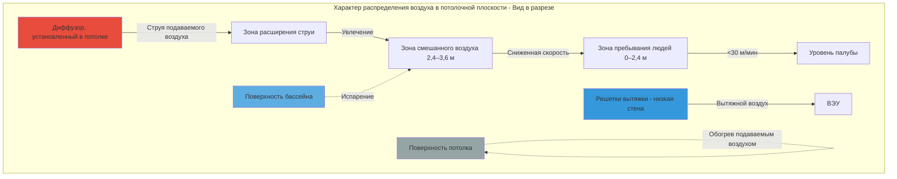
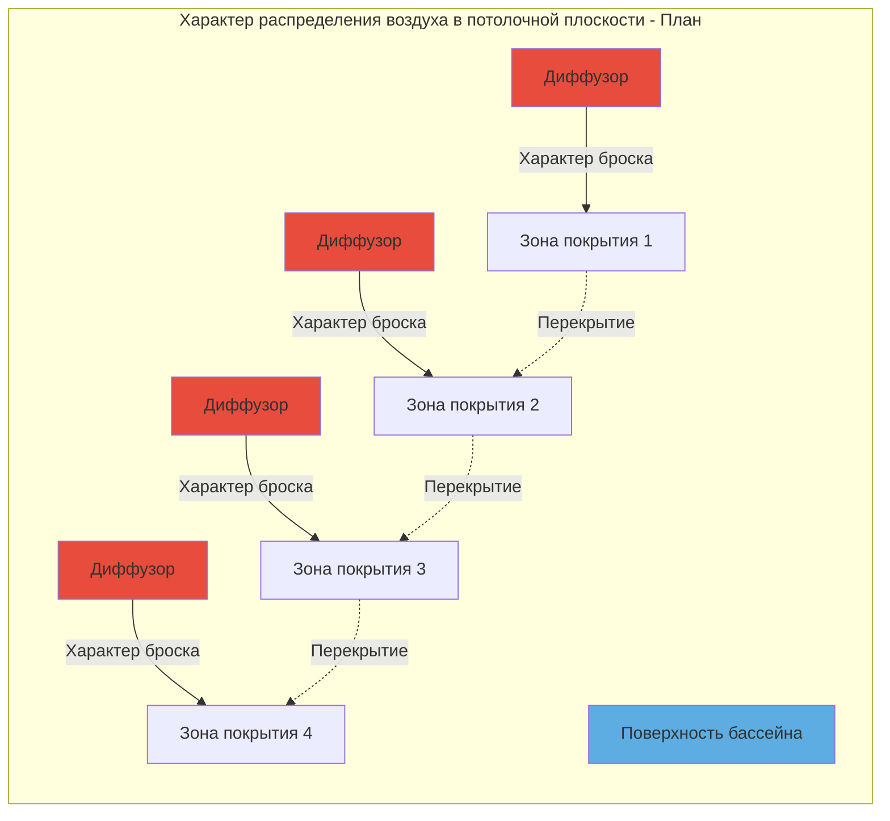

## Системы распределения воздуха в потолочной плоскости

Распределение воздуха в потолочной плоскости представляет наиболее распространённый подход для вентиляции крытых бассейнов, при котором выходные отверстия размещаются в потолочной плоскости или высоко на боковых стенах. Эта конфигурация использует естественную стратификацию воздуха и обеспечивает полное покрытие палубы бассейна и поверхности воды. Основная инженерная задача заключается в подаче достаточного движения воздуха для контроля влажности и температуры без создания неудобных сквозняков в зоне пребывания людей.

### Физические принципы

Воздушные струи, выходящие из диффузоров в потолочной плоскости, следуют предсказуемым закономерностям затухания, управляемым передачей импульса и увлечением воздуха. Скорость по оси свободной струи уменьшается в соответствии с:

$$V_x = K \cdot V_0 \cdot \sqrt{\frac{A_0}{A_x}}$$

Где:
- $V_x$ = скорость на расстоянии x от диффузора (м/мин)
- $V_0$ = скорость выхода на выходе диффузора (м/мин)
- $A_0$ = эффективная площадь диффузора (м²)
- $A_x$ = площадь поперечного сечения струи на расстоянии x (м²)
- $K$ = коэффициент расхода диффузора (0,8–1,2)

Для изотермических условий расстояние дальнобойности до терминальной скорости рассчитывается:

$$T_{50} = \frac{V_0 \cdot \sqrt{A_0}}{K_d \cdot V_t}$$

Где $T_{50}$ представляет дальнобойность до 50 м/мин, $V_t$ — терминальная скорость (обычно 50 м/мин), а $K_d$ — коэффициент дальнобойности диффузора из данных производителя.

### Увлечение струей и затухание температуры

По мере распространения воздушной струи она увлекает окружающий воздух со скоростью, пропорциональной периметру струи и скорости. Температурный перепад затухает в соответствии с:

$$\frac{\Delta T_x}{\Delta T_0} = \frac{A_0}{A_x}$$

Это соотношение является критичным для предотвращения холодных сквозняков. Для температуры подаваемого воздуха на 8 K ниже температуры помещения, коэффициент увлечения 4:1 снижает перепад до 2 K в зоне пребывания людей.

### Критерии проектирования для крытых бассейнов

Справочник ASHRAE Applications Handbook, глава 6, устанавливает специфические требования:

- **Максимальная скорость в зоне пребывания**: 30 м/мин на уровне палубы
- **Максимальная скорость на поверхности воды**: 15–25 м/мин (предотвращает увеличение испарения)
- **Минимальная кратность воздухообмена**: 4–6 ACH для вентиляции
- **Температура подаваемого воздуха**: на 1–2 K выше температуры помещения (минимизирует риск конденсации)

Критический параметр проектирования — соотношение дальнобойности к высоте потолка. Для типовых установок:

$$\frac{T_{50}}{H} = 0,8 \text{ до } 1,2$$

Где $H$ — высота потолка над палубой. Это обеспечивает адекватное смешивание воздуха до того, как струя достигнет зоны пребывания людей.

### Стратегия предотвращения конденсации

Системы в потолочной плоскости должны предотвращать конденсацию на потолке и конструктивных элементах. Температура поверхности должна оставаться выше точки росы:

$$T_s > T_{dp} = T_{db} - \frac{100 - RH}{5}$$

Где $T_s$ — температура поверхности, $T_{dp}$ — точка росы, $T_{db}$ — температура по сухому термометру, $RH$ — относительная влажность. Для помещения с 28°C/60% RH точка росы составляет 18°C. Все поверхности должны поддерживать температуры выше 18°C, что требует значений теплоизоляции:

$$R_{min} = \frac{T_{room} - T_{outdoor}}{U \cdot (T_{room} - T_{dp})}$$

Высокоскоростное распределение воздуха по поверхности потолка поддерживает повышенные температуры поверхности благодаря конвективной теплопередаче.

### Сравнение типов диффузоров

| Тип диффузора | Характеристики дальнобойности | Применение | Преимущества | Ограничения |
|---------------|------------------------------|-----------|-------------|------------|
| **Линейный щелевой** | Равномерное распределение, дальнобойность 4,5–7,5 м | Средние потолки (3,5–5,5 м), периметральные зоны | Отличный контроль характера, архитектурная интеграция | Ограниченная дальнобойность для высоких потолков |
| **Барабанный жалюзийный** | Многонаправленный, дальнобойность 6–10,5 м | Общее распределение, потолки 4,8–7,3 м | Высокий коэффициент увлечения, гибкие характеры | Требует больше отверстий в потолке |
| **Сопловой/Струйный** | Дальний бросок, дальнобойность 10,5–18 м | Высокие потолки (>6 м), большие пространства | Максимальная дальнобойность, высокое увлечение | Возможность шума, требуется аккуратное направление |
| **Перфорированная панель** | Горизонтальное распределение, дальнобойность 3,5–6 м | Низкие потолки (<3,5 м), малые бассейны | Низкий уровень шума, равномерное распределение | Недостаточно для больших пространств |

### Схемы расположения системы

### Расчёты для высоких потолков

Высота потолка более 6 м требует специализированных подходов:

1. **Сопловые диффузоры** с дальнобойностью 12–18 м
2. **Повышенные скорости выхода** (370–610 м/мин) для достижения дальнобойности
3. **Аккуратное направление** для предотвращения попадания струи на противоположные стены
4. **Увеличенный температурный перепад подаваемого воздуха**, ограниченный 3–3,5 K максимум

Расчёт дальнобойности для высокоскоростных сопел учитывает эффект Коанда при размещении рядом с поверхностью потолка:

$$T_{100} = C_n \cdot \sqrt{Q}$$

Где $T_{100}$ — дальнобойность до 30 м/мин, $Q$ — расход воздуха (м³/ч), $C_n$ — коэффициент сопла (8–12 для типовых установок).

### Снижение риска сквозняков

Жалобы на сквозняки возникают при локальных скоростях, превышающих пороги комфорта, или при попадании холодного воздуха на людей. Стратегии предотвращения включают:

- **Контроль температуры подаваемого воздуха**: поддержание в пределах 1–2 K от температуры помещения
- **Расстояние между диффузорами**: размещение для достижения 50% перекрытия дальнобойности на 1,8 м над палубой
- **Размещение вытяжки**: вытяжка с низкой боковой стеной или на уровне палубы предотвращает нисходящие воздушные потоки
- **Системы переменного расхода**: снижение расхода воздуха во время низкой загруженности

### Проверка характеристик

Наладку систем в потолочной плоскости следует проводить путём измерения:

1. **Траверса скорости** на уровне палубы (должна быть <30 м/мин)
2. **Стратификация температуры** (вертикальный температурный градиент <1,5 K от палубы до 2,4 м)
3. **Равномерность относительной влажности** (<5% вариации по всему пространству)
4. **Температуры поверхностей** потолочных элементов (должны превышать точку росы минимум на 3 K)

Измерения термоанемометра с сеткой шагом 3–4,5 м по палубе обеспечивают проверку равномерного распределения без чрезмерных скоростей.

## Рекомендации по проектированию

Для оптимального распределения воздуха в потолочной плоскости в крытых бассейнах:

- Выбирайте дальнобойность диффузора, соответствующую 80–120% расстояния между диффузорами
- Размещайте диффузоры для направления воздуха по поверхности бассейна под скользящим углом
- Избегайте направления воздуха прямо вниз на поверхность воды (увеличивает испарение)
- Используйте возврат воздуха через потолок только в приложениях без конденсации
- Предусмотрите изолированные загрузочные устройства и пленумы диффузоров во всех случаях
- Спроектируйте на максимум 37 Па перепада давления через диффузоры
- Проверьте акустические характеристики (NC 35–40 максимум для бассейнов)

Системы в потолочной плоскости при надлежащей инженерной подготовке обеспечивают надежный контроль влажности, предотвращение конденсации и комфорт для пребывающих людей в крытых бассейнах всех размеров.
