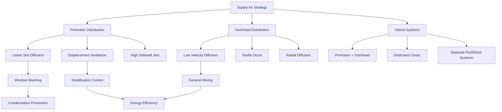

## Основы конфигурации приточного воздуха

Стратегии подачи приточного воздуха в бассейнах должны одновременно решать три критические задачи: предотвращение конденсации на поверхностях ограждающей конструкции, управление испарением на поверхности водного зеркала и обеспечение теплового комфорта для пловцов и зрителей. Выбор и проектирование систем подачи воздуха напрямую влияют на энергопотребление, качество воздуха в помещении и успех эксплуатации.

## Распределение приточного воздуха по периметру

Системы подачи приточного воздуха по периметру подают кондиционированный воздух вдоль наружных стен и остекления для предотвращения образования конденсата. Температура и скорость подачи воздуха должны поддерживать температуру поверхности выше точки росы, избегая при этом неудобных сквозняков в зонах пребывания.

**Критические параметры проектирования:**

Требуемая температура приточного воздуха для предотвращения конденсации:

$$T_{supply} = T_{dewpoint} + \Delta T_{safety}$$

Где $\Delta T_{safety}$ обычно находится в диапазоне 2,8–5,6°C для обеспечения адекватного запаса прочности при переменных внешних условиях и внутренних нагрузках.

Скорость выброса на периметральных поверхностях должна поддерживать надлежащую инерцию для очистки поверхностей остекления:

$$v_{discharge} = 2,0–4,1 \text{ м/с на диффузоре}$$

$$v_{surface} = 0,25–0,51 \text{ м/с на стеклянной поверхности}$$

Дальность броса и спад скорости следуют соотношению:

$$\frac{v_x}{v_0} = K \cdot \frac{\sqrt{A_0}}{x}$$

Где $v_x$ — скорость на расстоянии $x$, $v_0$ — начальная скорость выброса, $A_0$ — площадь выхода диффузора, и $K$ — константа, зависящая от типа диффузора (обычно 4–6 для линейных диффузоров).

## Варианты стратегий подачи воздуха

## Стратегии подачи по типам бассейнов

| Тип бассейна | Основная стратегия | Температура приточного воздуха | Диапазон ACH | Ключевые соображения |
|-----------|------------------|------------------------|-----------|---------------------|
| Спортивный | Верхняя подача + периметр | 27,8–30,0°C | 4–6 | Однородные условия, комфорт зрителей |
| Лечебный/СПА | Смещение по периметру | 30,0–32,2°C | 6–8 | Высокая влажность, минимальные сквозняки |
| Развлекательный | Гибридные зоны | 28,9–31,1°C | 4–6 | Переменная вместимость, зоны активности |
| Волновой/игровой | Верхняя подача высокого уровня | 27,8–29,4°C | 6–8 | Высокий клиренс потолка, защита от брызг |
| Отель/жилой | Линейная подача по периметру | 28,9–31,1°C | 4–6 | Эстетическая интеграция, бесшумная работа |

## Проектирование системы очистки окон воздухом

Системы подачи приточного воздуха по периметру должны обеспечивать достаточную скорость для поддержания непрерывной воздушной завесы на остекленных поверхностях. Метод проектирования зависит от высоты окна и его конфигурации.

**Для окон высотой до 4,6 м:**

Линейные щелевые диффузоры на уровне пола или подоконника обеспечивают эффективное восходящее очищение воздухом. Требуемый объем приточного воздуха:

$$Q_{window} = A_{glass} \cdot v_{avg}$$

Где $Q_{window}$ в м³/ч, $A_{glass}$ — площадь остекления в м², а $v_{avg}$ — средняя скорость поверхности (0,38–0,51 м/с).

**Для окон высотой более 4,6 м:**

Необходимы двойные точки подачи (пол и середина высоты) или боковые струи высокого уровня. Верхняя подача компенсирует отделение потока, вызванное плавучестью, которое возникает при подаче только с пола на высоком остеклении.

## Рассмотрение комфорта пловцов

Подача приточного воздуха непосредственно над пловцами вызывает дискомфорт из-за испарительного охлаждения мокрой кожи. Эффективная температура, ощущаемая мокрым пловцом:

$$T_{effective} = T_{air} - \frac{h_{evap}}{h_{total}} \cdot (T_{air} - T_{wetbulb})$$

При типичных условиях в бассейне (28,9°C воздуха, 60% ОВ), мокрый пловец ощущает эффективную температуру на 4,4–6,7°C ниже температуры сухого термометра при воздействии воздуха со скоростью 0,25 м/с.

**Рекомендации по проектированию зон пловцов:**

- Ограничить скорость воздуха на поверхности водного зеркала максимум 0,15 м/с
- Поддерживать температуру приточного воздуха в пределах 1,1°C от температуры воды
- Расположить выходы подачи, чтобы избежать прямого воздействия на поверхность бассейна
- Использовать системы низкоскоростного смещения или текстильные воздуховоды для зон палубы

## Распределение приточного воздуха в зоне палубы

Зоны палубы требуют отдельного рассмотрения от поверхности водного зеркала бассейна. Повышенные температуры приточного воздуха и контролируемые скорости предотвращают тепловой дискомфорт при сохранении адекватного воздухообмена.

**Параметры подачи воздуха в зону палубы:**

- Температура приточного воздуха: $T_{water} + 1,1\text{°C до } T_{water} + 2,2\text{°C}$
- Скорость на уровне палубы: 0,13–0,25 м/с (зоны пребывания)
- Размещение диффузора: Минимум 1,8 м от края бассейна
- Направление выброса: Параллельно краю бассейна, если возможно

## Интеграция зоны для зрителей

Зоны для зрителей допускают стандартные условия комфорта (22–24,4°C) в отличие от теплой, влажной среды, необходимой на уровне бассейна. Отдельные агрегаты обработки воздуха или выделенные зоны в блоке бассейна обслуживают эти зоны.

Стратегия подачи приточного воздуха для зон зрителей приоритизирует:

- Перепад температуры от палубы бассейна (обычно на 3,3–5,6°C ниже)
- Независимое управление влажностью (40–50% ОВ против 50–60% у бассейна)
- Стандартный выбор диффузоров и расстояние между ними
- Смешивающие схемы вентиляции вместо смещения

## Руководящие принципы ASHRAE

Справочник приложений ASHRAE, глава 6 (Бассейны) устанавливает минимальные показатели вентиляции и критерии распределения. Ключевые требования включают:

- Минимум наружного воздуха: 0,81 м³/(ч·м²) поверхности бассейна плюс зона палубы
- Температура приточного воздуха: Не менее чем на 1,1°C выше температуры воды
- Скорость воздуха на поверхности воды: 0,05–0,15 м/с для управления испарением без чрезмерных сквозняков
- Производительность осушения: На основе расчетов скорости испарения с учетом коэффициента активности

Стандартное уравнение испарения, включающее движение воздуха:

$$W = \frac{A \cdot Y \cdot (P_w - P_a)}{(1 + 0,089 \cdot v)}$$

Где $W$ — скорость испарения (кг/ч), $A$ — площадь бассейна (м²), $Y$ — коэффициент активности (0,5–1,0), $P_w$ и $P_a$ — давления водяного пара в воде и воздухе (Па), и $v$ — скорость воздуха над водой (м/с).

## Стратегия управления температурой приточного воздуха

Заданное значение температуры приточного воздуха должно балансировать несколько конкурирующих требований. Рекомендуемая последовательность управления:

1. Рассчитать минимальную температуру для предотвращения конденсации: $T_{glass,inside} > T_{dewpoint} + 2,8\text{°C}$
2. Проверить комфорт пловца: $T_{supply} \geq T_{water} - 1,1\text{°C}$
3. Подтвердить управление испарением: $T_{supply} = T_{water} + 1,1\text{°C до } T_{water} + 2,2\text{°C}$
4. Сбросить температуру приточного воздуха на основе внешних условий и вместимости

В периоды неиспользования температура приточного воздуха может быть снижена для увеличения производительности осушения при сохранении защиты ограждающей конструкции.

## Критерии выбора системы

Оптимальная стратегия подачи воздуха зависит от факторов, характерных для конкретного объекта:

**Линейные щелевые диффузоры по периметру:** Лучше всего подходят для объектов с обширным остеклением, обеспечивают отличную очистку окон, более высокие первоначальные затраты

**Верхние текстильные воздуховоды:** Однородное распределение низкой скорости, сниженные затраты на установку воздуховодов, сложный отвод конденсата в условиях высокой влажности

**Боковые струи высокого уровня:** Эффективное смешивание, хорошие характеристики броса, требует осторожного наведения, чтобы избежать прямого воздействия на пловцов

**Смещающая вентиляция:** Энергоэффективная стратификация, отличный комфорт в лечебных бассейнах, требует адекватной высоты потолка (минимум 3,7 м)

Стратегия распределения приточного воздуха формирует основу успешного управления окружающей средой в бассейне. Надлежащее проектирование предотвращает повреждение конденсацией, управляет показателями испарения и поддерживает комфорт жильцов во всех различных зонах активности в помещении.
