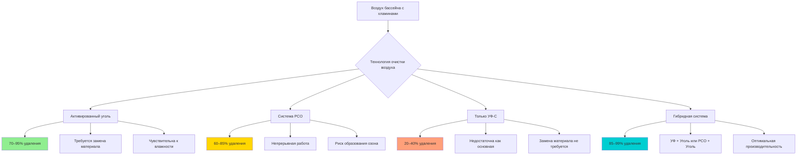

## Физические принципы удаления газообразных загрязнителей

Хламины (в основном трихлорамин NCl₃) представляют уникальную проблему при обработке воздуха в бассейнах из-за их молекулярной природы. В отличие от твёрдых загрязнителей, удаляемых механической фильтрацией, газообразные хламины требуют физического или химического взаимодействия на молекулярном уровне. Стандартные HVAC фильтры для удаления твёрдых частиц (MERV 8-16) обеспечивают незначительное удаление хламинов, поскольку молекулярный диаметр NCl₃ (примерно 0,0003 мкм) на несколько порядков меньше пор в волокнистых материалах.

Скорость массопередачи для удаления газообразных загрязнителей следует общему соотношению:

$$\frac{dm}{dt} = k_g A (C_g - C_i)$$

где $k_g$ — коэффициент массопередачи (м/с), $A$ — площадь поверхности (м²), $C_g$ — концентрация в основном потоке газа (мг/м³), $C_i$ — концентрация на границе раздела. Эффективные технологии очистки воздуха максимизируют площадь поверхности и поддерживают благоприятные градиенты концентрации.

## Адсорбция активированным углём

### Физический механизм

Активированный уголь удаляет хламины посредством физической и химической адсорбции на микропористых углеродных структурах. Объём микропор (обычно 0,3–0,5 см³/г) обеспечивает площади поверхности 800–1500 м²/г. Молекулы хлорамина диффундируют в структуру пор и прилипают благодаря ван-дер-ваальсовым силам и химическому связыванию с функциональными группами на поверхности.

Ёмкость адсорбции следует изотерме Фрейндлиха:

$$q_e = K_F C_e^{1/n}$$

где $q_e$ — равновесная ёмкость адсорбции (мг/г), $C_e$ — равновесная концентрация (мг/м³), $K_F$ и $n$ — эмпирические константы, зависящие от типа углерода и температуры.

### Характеристики производительности

| Параметр | Типичный диапазон | Примечания |
|-----------|-------------------|-----------|
| Время контакта | 0,05–0,15 секунд | При скорости потока 1,27–2,54 м/с |
| Эффективность удаления | 70–95% | Один проход, свежий материал |
| Перепад давления | 74,8–198 Па | Увеличивается при загрузке |
| Ёмкость | 5–15% по массе | До насыщения адсорбционных мест |
| Глубина слоя | 5–10 см | Более глубокие слои повышают эффективность |

**Критическое ограничение**: Активированный уголь демонстрирует прорыв при насыщении адсорбционных мест. В условиях высокой влажности в бассейнах (относительная влажность 50–60%) водяной пар конкурирует за адсорбционные места, снижая ёмкость удаления хламинов на 30–50%. Замена материала требуется каждые 6–18 месяцев в зависимости от загрузки загрязнителями и влажности.

## Фотокаталитическое окисление (PCO)

### Механизм фотокаталитической реакции

Системы PCO используют ультрафиолетовый свет (обычно 254 нм) для активации поверхностей катализатора диоксида титана (TiO₂). Когда энергия фотона превышает энергию запрещённой зоны (3,2 эВ для анатаза TiO₂), образуются пары электрон-дырка:

$$\text{TiO}_2 + h\nu \rightarrow e^- + h^+$$

Эти носители заряда производят гидроксильные радикалы (OH·) и ионы супероксида (O₂⁻), которые окисляют хламины до азота, воды и ионов хлорида:

$$\text{NCl}_3 + \text{OH}· \rightarrow \text{N}_2 + \text{H}_2\text{O} + \text{Cl}^-$$

### Характеристики производительности

Эффективность PCO зависит от нескольких взаимосвязанных факторов:

1. **Интенсивность УФ**: Должна превышать 2–5 мВт/см² на поверхности катализатора
2. **Площадь поверхности катализатора**: 50–200 м²/г для нано-TiO₂
3. **Время контакта**: 0,5–2,0 секунд, необходимых для завершения окисления
4. **Влажность**: Умеренная влажность (40–60% ОВ) способствует образованию OH·

**Ограничение**: Системы PCO производят озон как побочный продукт, когда молекулы кислорода поглощают УФ-энергию ниже 240 нм. ASHRAE Standard 62.1 ограничивает озон в помещении до 0,05 ppm (среднее значение за 8 часов). УФ-лампы должны излучать в основном на 254 нм, и могут требоваться фильтры разложения озона.

## УФ-С дезинфекционная обработка

### Прямой фотолиз

УФ-С излучение (200–280 нм) напрямую разрывает химические связи в молекулах хлорамина. Скорость фотолиза следует кинетике первого порядка:

$$\frac{dC}{dt} = -k_{UV} I C$$

где $k_{UV}$ — константа скорости фотолиза (м²/мДж), $I$ — интенсивность УФ (мВт/см²), $C$ — концентрация.

**Критическое ограничение**: УФ-С только обеспечивает ограниченное разрушение хламинов (20–40% при одном проходе) при практических скоростях потока воздуха. Хламины поглощают УФ-энергию менее эффективно, чем микроорганизмы, требуя УФ-доз 500–2000 мДж/см² в сравнении с 40–100 мДж/см² для инактивации микроорганизмов. Это требует значительно большей интенсивности УФ или более длительного времени контакта, чем для дезинфекционных приложений.

## Сравнение эффективности

## Гибридный подход для оптимальной производительности

Наиболее эффективные системы очистки воздуха в бассейнах объединяют технологии для синергетических преимуществ:

### Рекомендуемая конфигурация

1. **Стадия предварительного окисления**: УФ-С или PCO частично окисляет хламины и снижает молекулярную сложность
2. **Стадия адсорбции**: Активированный уголь удаляет продукты окисления и оставшиеся хламины
3. **Финальная полировка**: Дополнительная стадия PCO или углерода для максимального удаления

Этот поэтапный подход снижает загрузку углеродного материала на 40–60%, продлевая интервалы замены при сохранении эффективности удаления >90%.

| Технология | Эффективность на один проход | Годовые эксплуатационные расходы* | Периодичность техническое обслуживания |
|-----------|----------------------|----------------------|---------------------|
| Активированный уголь | 70–95% | 262 000–491 000 руб. | 6–18 месяцев |
| PCO | 60–85% | 65 000–164 000 руб. | Замена лампы 12–18 месяцев |
| Только УФ-С | 20–40% | 49 000–98 000 руб. | Замена лампы 12 месяцев |
| Гибридная (УФ+Уголь) | 85–95% | 196 000–393 000 руб. | 12–24 месяца |
| Гибридная (PCO+Уголь) | 85–99% | 229 000–458 000 руб. | 18–24 месяца |

*На основе 340 м³/ч (20 000 CFM) бассейна с концентрацией хлорамина 0,5 ppm

## Проектные соображения в соответствии со стандартами ASHRAE

ASHRAE Standard 62.1 требует вентиляции бассейна для поддержания приемлемого качества воздуха в помещении. При интеграции технологий очистки воздуха:

- **Вентиляция наружным воздухом не может быть исключена**: Очистка воздуха дополняет, но не заменяет требования вентиляции (обычно минимум 2,44 м³/(ч·м²))
- **Рекуперация энергии**: Объединение очистки воздуха с рекуператорами энергии (ERV) в соответствии с ASHRAE 90.1 снижает нагрузку на осушение при сохранении качества воздуха
- **Мониторинг**: Рекомендуется непрерывный мониторинг концентрации хлорамина для проверки эффективности системы очистки воздуха
- **Перепуск**: Проектируйте системы с возможностью перепуска для техническое обслуживания без полного отключения HVAC

Интеграция технологий очистки воздуха может снизить требуемые скорости вентиляции на 25–50% при поддержании превосходного качества воздуха, что приводит к существенной экономии энергии при осушении и кондиционировании воздуха, которые доминируют в эксплуатационных расходах HVAC в бассейнах.
