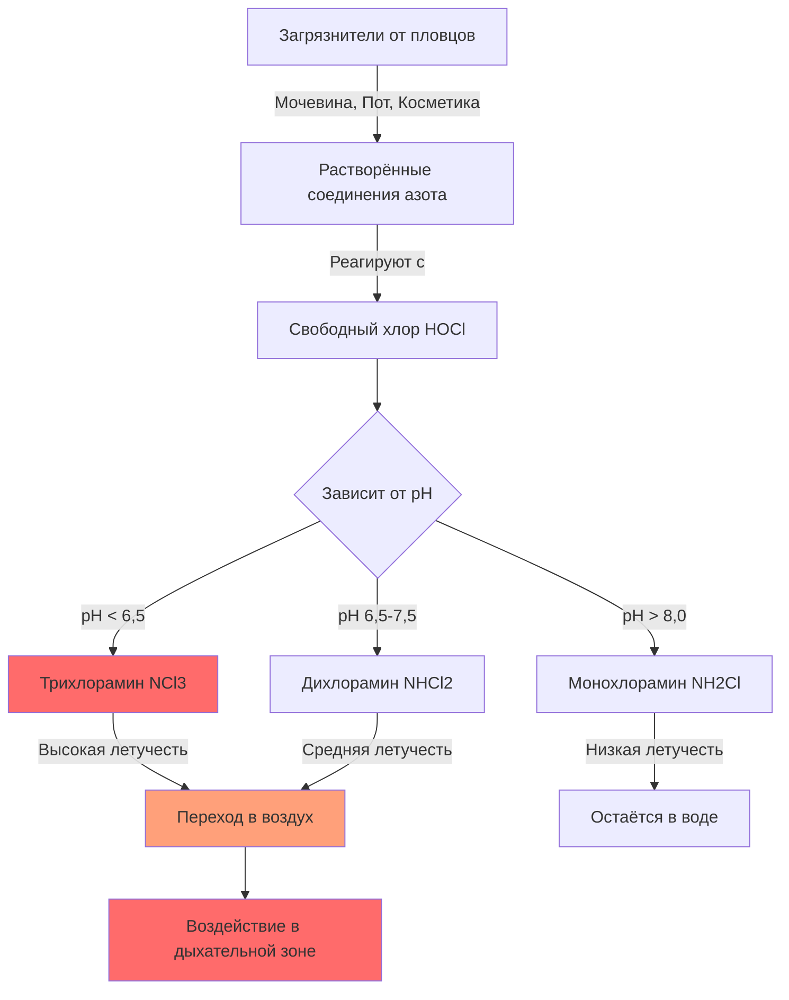
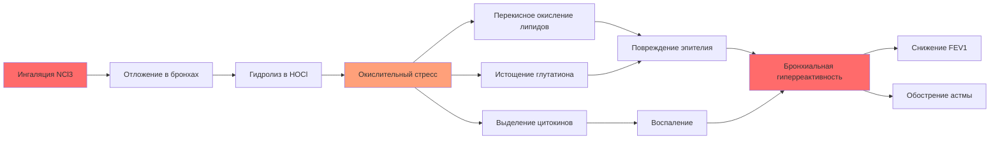
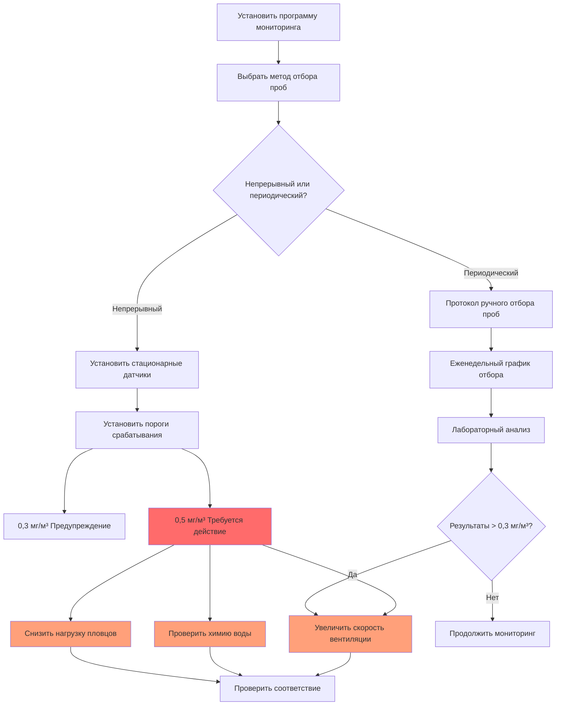

## Обзор

Хлорамины представляют основную опасность для качества воздуха в помещениях бассейнов, образуясь в результате реакций между хлорсодержащими дезинфектантами и содержащими азот органическими соединениями, поступающими от пловцов. Из трёх видов хлораминов дихлорид азота (NCl3) представляет наиболее значительную опасность для здоровья из-за его летучести, раздражающих свойств и склонности накапливаться в воздухе крытых бассейнов.

Концентрация летучих хлораминов в воздухе зависит от химии исходной воды, практики дезинфекции, нагрузки пловцов и, в критической степени, от производительности системы вентиляции. Неадекватная вентиляция создаёт условия, при которых концентрация хлораминов превышает предельно допустимые концентрации профессионального воздействия, что приводит к респираторному расстройству, раздражению глаз и ускоренной коррозии строительных материалов.

## Химия образования хлораминов

Хлорамины образуются посредством последовательного хлорирования аммиака и органических соединений азота:

$$\text{NH}_3 + \text{HOCl} \rightarrow \text{NH}_2\text{Cl} + \text{H}_2\text{O}$$

$$\text{NH}_2\text{Cl} + \text{HOCl} \rightarrow \text{NHCl}_2 + \text{H}_2\text{O}$$

$$\text{NHCl}_2 + \text{HOCl} \rightarrow \text{NCl}_3 + \text{H}_2\text{O}$$

Распределение между монохлораминой (NH2Cl), дихлораминой (NHCl2) и трихлораминой (NCl3) сильно зависит от pH. Образование трихлорамина ускоряется при pH ниже 7,0, в то время как монохлорамин преобладает при pH выше 8,5.

**Константа Генри для трихлорамина:**

Летучесть NCl3 обусловливает её переход из воды в воздух:

$$C_{air} = H \cdot C_{water}$$

Где H ≈ 0,014 (безразмерная величина) при 25°C, что указывает на легкую улетучиваемость NCl3 с поверхности бассейна. Скорость этого переноса увеличивается с температурой воды и турбулентностью поверхности.

## Профиль воздействия на здоровье

### Токсичность трихлорамина (NCl3)

Трихлорамин проявляет острую токсичность несколькими механизмами:

**Респираторные эффекты:**
- Прямое повреждение эпителия бронхиальной слизистой оболочки
- Повышенная бронхиальная гиперреактивность
- Обострение симптомов астмы
- Снижение объёма форсированного выдоха за первую секунду (FEV1)
- Хроническое воздействие связано с профессиональной астмой

**Раздражение глаз:**
- Нарушение эпителия роговицы
- Слёзоотделение и воспаление конъюнктивы
- Снижение стабильности слёзной плёнки

**Дермальные эффекты:**
- Нарушение липидов рогового слоя
- Контактный дерматит
- Ускоренное поглощение хлора через повреждённый кожный барьер

### Эффекты дихлорамина (NHCl2)

Хотя дихлорамин менее летуч, чем NCl3, он значительно способствует общему воздействию хлорамина:

- Раздражение в водной фазе при плавании
- Респираторное раздражение при аэрозолизации
- Синергетические эффекты с трихлораминой

### Соотношение доза-ответ

Профиль концентрации во времени определяет тяжесть симптомов:

$$\text{Доза} = C \cdot t \cdot \text{RR}$$

Где:
- $C$ = концентрация в воздухе (мг/м³)
- $t$ = продолжительность воздействия (часы)
- $\text{RR}$ = частота дыхания (м³/ч)

Острые симптомы обычно проявляются при концентрации NCl3 выше 0,5 мг/м³ с продолжительностью воздействия, превышающей 1 час.

## Предельно допустимые концентрации профессионального воздействия

| Организация | Тип предела | Значение | Примечания |
|--------------|-----------|---------|-----------|
| **NIOSH** | REL (Рекомендуемый предел воздействия) | 0,4 мг/м³ | 8-часовое TWA |
| **ANSES (Франция)** | ПДК | 0,5 мг/м³ | 8-часовое TWA |
| **WHO** | Рекомендация | 0,5 мг/м³ | Воздух в помещении бассейна |
| **Германия (DFG)** | MAK | 0,2 мг/м³ | Консервативный предел |
| **Бельгия** | ПДК | 0,34 мг/м³ | 8-часовое TWA |

**Последствия стандарта ASHRAE 62.1-2022:**

Хотя ASHRAE 62.1 не устанавливает пределы хлораминов напрямую, процедура определения скорости вентиляции (VRP) и процедура качества воздуха в помещении (IAQP) стандарта применяются к проектированию бассейнов. Достижение приемлемого качества воздуха требует скоростей вентиляции значительно выше, чем для типичных помещений:

- Минимальный наружный воздух: 0,48 CFM/м² площади палубы
- Целевая концентрация хлорамина: < 0,3 мг/м³
- Повышенная вентиляция в периоды высокой загруженности

## Механизмы респираторных эффектов

Трихлорамин вызывает респираторный дистресс через пути окислительного стресса:

**Повреждение бронхиального эпителия:**

$$\text{NCl}_3 + \text{H}_2\text{O} \rightarrow \text{HOCl} + \text{Реактивные виды азота}$$

Эта реакция генерирует гипохлорную кислоту и реактивные азотные промежуточные соединения, которые:
1. Окисляют липиды мембран (перекисное окисление липидов)
2. Истощают резервы глутатиона (антиоксиданты)
3. Активируют каскады воспалительных цитокинов (IL-8, TNF-α)
4. Увеличивают проницаемость эпителия

**Зависимость доза-ответ для функции лёгких:**

Исследования демонстрируют измеримое снижение FEV1:

$$\Delta \text{FEV}_1 = -0,08 \cdot C_{NCl_3} - 0,05 \cdot t$$

Где снижение FEV1 (в процентах) коррелирует с концентрацией NCl3 (мг/м³) и продолжительностью воздействия (часы).

## Коррозия строительных материалов

Хлорамины ускоряют коррозию металлов и деградацию строительных материалов посредством электрохимических и химических механизмов:

**Скорость коррозии металлов:**

Для стальных конструктивных элементов:

$$\text{CR} = K \cdot C_{NCl_3}^{0,6} \cdot \text{RH}^{1,2}$$

Где:
- $\text{CR}$ = скорость коррозии (мкм/год)
- $K$ = константа материала
- $\text{RH}$ = относительная влажность (доля)

**Затронутые материалы:**
- Углеродистая сталь: коррозия в 5-10 раз быстрее нормы
- Алюминий: питтинговая и щелевая коррозия
- Нержавеющая сталь (304): стресс-коррозионное растрескивание, вызванное хлоридами
- Медь: обезцинкование в латунных сплавах
- Бетонная арматура: ускоренное окисление

**Экономическое воздействие:**

Преждевременный отказ конструкции и затраты на техническое обслуживание представляют значительные операционные расходы, с средними затратами на обслуживание бассейна в 3-4 раза выше, чем в сравнимых зданиях, из-за вызванной хлораминами коррозии.

## Стратегии мониторинга

### Методы отбора проб

| Метод | Предел обнаружения | Преимущества | Ограничения |
|-------|----------------|------------|-------------|
| **Спектрофотометрия** | 0,05 мг/м³ | Точность лаборатории | Требует сбора проб |
| **Электрохимические датчики** | 0,1 мг/м³ | Данные в реальном времени | Перекрёстная чувствительность к Cl2 |
| **HPLC анализ** | 0,02 мг/м³ | Дифференциация видов | Сложная процедура |
| **Портативные мониторы** | 0,1 мг/м³ | Немедленная обратная связь | Дрейф калибровки |

### Протокол отбора проб

**Метод NIOSH 6011 (Хлорамины):**
1. Отбор проб на высоте дыхательной зоны (1,2-1,8 м над палубой)
2. Минимальный объём пробы: 50 л
3. Скорость потока: 0,5-1,0 л/мин
4. Продолжительность отбора: 2-4 часа для определения TWA

**Стратегические места отбора проб:**
- Посты спасателей (наивысшее профессиональное воздействие)
- Периметр палубы бассейна (общее качество воздуха)
- Зоны спа/гидромассажных ванн (повышенная летучесть)
- Воздухозаборники механического отделения (проверка производительности системы)

## Руководящие принципы воздействия и стратегии контроля

### Иерархия контроля

**1. Снижение источника (наиболее эффективно):**
- Соблюдение предварительного душа перед плаванием (снижает нагрузку азота на 70%)
- Поддержание оптимального pH (7,4-7,6) для минимизации образования NCl3
- Внедрение дополнительной дезинфекции ультрафиолетом или озоном
- Ограничение связанного хлора на уровне < 0,2 мг/л посредством регулярного шока

**2. Инженерные контрольные меры:**
- Проектирование систем вентиляции для 0,06 CFM/м² на одного человека
- Обеспечение захвата источника у поверхности воды (вытесняющая вентиляция)
- Поддержание отрицательного давления в помещении бассейна относительно смежных помещений
- Достижение 6-8 воздухообменов в час минимум

**3. Административные контрольные меры:**
- Ограничение продолжительности непрерывного присутствия персонала
- Ротация позиций спасателей для снижения индивидуального воздействия
- Планирование высокоинтенсивных мероприятий в периоды малой вентиляционной нагрузки

**4. Средства индивидуальной защиты (наименее эффективно):**
- Непрактично для пловцов и большинства персонала
- Зарезервировано для работ по техническому обслуживанию в замкнутых пространствах

### Метрика эффективности вентиляции

Эффективность удаления хлорамина зависит от подачи наружного воздуха:

$$\eta = \frac{Q_{OA}}{Q_{OA} + V \cdot k}$$

Где:
- $\eta$ = эффективность удаления
- $Q_{OA}$ = скорость потока наружного воздуха (CFM)
- $V$ = объём помещения (м³)
- $k$ = скорость генерации хлорамина (эквивалент CFM)

Целевая эффективность: > 90% для поддержания концентраций ниже 0,3 мг/м³.

## Соответствие нормативным требованиям

**Требования OSHA:**

Хотя OSHA не устанавливает пределы воздействия для хлораминов (PEL), работодатели должны соответствовать Общему положению об обязанности (раздел 5(a)(1)) по предоставлению рабочего места «свободного от известных опасностей». Это требует:

- Программы мониторинга качества воздуха
- Записи об обслуживании систем вентиляции
- Документирование воздействия на работников
- Медицинское наблюдение за работниками с симптомами

**Государственные и местные кодексы:**

Многие юрисдикции вводят ASHRAE 62.1 по ссылке, делая соответствие обязательным для нового строительства и крупных реконструкций. Проектировщики должны продемонстрировать, что системы вентиляции достигают приемлемого качества воздуха в помещении при условиях проектирования.

## Заключение

Контроль качества воздуха в отношении хлораминов в помещениях бассейнов требует интегрированного управления химией воды, производительностью вентиляции и операционной практикой. Концентрация трихлорамина в воздухе должна оставаться ниже 0,3 мг/м³ для защиты здоровья людей и инфраструктуры здания. Регулярный мониторинг, в сочетании с упреждающим техническим обслуживанием системы вентиляции и мерами контроля источника, обеспечивает соответствие рекомендациям по предельно допустимым концентрациям профессионального воздействия и создаёт безопасную, комфортную среду для пловцов и персонала.

Эффективное управление хлораминами согласуется с принципами вентиляции стандарта ASHRAE 62.1 при одновременном решении уникальных характеристик образования загрязнителей в гидротехнических сооружениях. Физика образования, летучести и переноса хлорамина определяет инженерные решения, необходимые для поддержания приемлемого качества воздуха в этих сложных помещениях.
