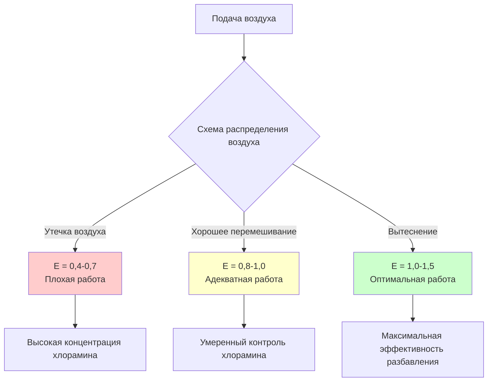
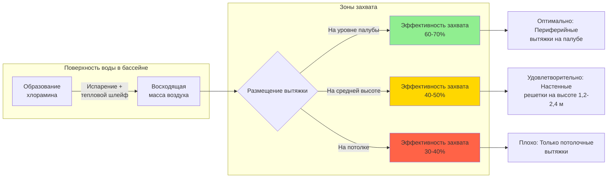

## Обзор

Разбавляющая вентиляция представляет собой основное инженерное решение для управления концентрацией аэрозольного хлорамина в крытых бассейнах. Этот подход основан на подаче наружного воздуха для разбавления концентрации загрязняющих веществ ниже предельных значений воздействия при одновременной вытяжке воздуха, загруженного хлорамином. Эффективность разбавляющей вентиляции зависит от вентиляционного расхода, схемы распределения воздуха и взаимодействия между местоположениями подачи и вытяжки.

## Фундаментальный принцип разбавления

Концентрация загрязняющего вещества в установившемся состоянии в хорошо перемешиваемом пространстве подчиняется уравнению баланса масс:

$$C_{ss} = \frac{G}{Q \cdot E}$$

Где:
- $C_{ss}$ = концентрация хлорамина в установившемся состоянии (мг/м³)
- $G$ = скорость образования хлорамина (мг/ч)
- $Q$ = расход наружного воздуха для вентиляции (м³/ч)
- $E$ = коэффициент эффективности вентиляции (безразмерный, 0,5-1,5)

Эта зависимость демонстрирует, что удвоение вентиляционного расхода приводит к уменьшению концентрации в установившемся состоянии в два раза при условии постоянных скоростей образования и эффективности.

## Требования к вентиляционному расходу

### Минимальное количество воздухообменов

ASHRAE Standard 62.1 определяет минимальные требования к вентиляции для бассейнов, хотя контроль хлорамина часто требует более высоких расходов.

| Тип помещения | Минимальный воздухообмен | Рекомендуемый воздухообмен | Проектный воздухообмен |
|------------|-------------|-----------------|------------|
| Только площадка бассейна | 4 | 6-8 | 8-10 |
| Бассейн со зрительской зоной | 4 | 6-8 | 8-12 |
| Терапевтические/спа-бассейны | 6 | 8-10 | 10-15 |
| Спортивные объекты | 4 | 8-10 | 10-15 |

Одного значения воздухообмена недостаточно для определения эффективности. Система с 6 воздухообменами и плохым распределением может работать хуже, чем система с 4 воздухообменами и оптимизированной схемой потока воздуха.

### Расчет требуемого наружного воздуха

Требуемый объем наружного воздуха зависит от целевой концентрации хлорамина и измеренных скоростей образования:

$$Q_{OA} = \frac{G \cdot SF}{(C_{target} \cdot E) - C_{OA}}$$

Где:
- $Q_{OA}$ = требуемый расход наружного воздуха (м³/ч)
- $G$ = измеренная скорость образования хлорамина (мг/ч)
- $SF$ = коэффициент безопасности (обычно 1,2-1,5)
- $C_{target}$ = целевая внутренняя концентрация (обычно 0,3-0,5 мг/м³)
- $C_{OA}$ = концентрация хлорамина в наружном воздухе (обычно ≈0)

## Эффективность воздухообмена

Коэффициент эффективности вентиляции $E$ количественно определяет, насколько эффективно подаваемый воздух достигает и разбавляет загрязненную зону. Идеальное перемешивание дает $E = 1,0$, в то время как утечка воздуха снижает эффективность ниже 1,0, а вытеснительная вентиляция может достичь $E > 1,0$.

### Факторы, влияющие на эффективность

**Тепловая стратификация:** Теплый, влажный воздух над поверхностью бассейна сопротивляется смешиванию с более холодным подаваемым воздухом. Разница температур между подаваемым воздухом и воздухом в зоне бассейна не должна превышать 2,8°C для предотвращения стратификации.

**Градиенты скорости воздуха:** Чрезмерные скорости подачи создают высокоскоростные струи, которые обходят зону дыхания, уменьшая эффективное разбавление. Целевые скорости в зонах занятости: 0,15-0,25 м/с.

**Размещение вытяжки:** Низкоуровневые вытяжки вблизи поверхности воды захватывают восходящие шлейфы хлорамина перед их рассеиванием по всему помещению.

## Стратегии распределения подаваемого воздуха

### Потолочная подача с низкоуровневой вытяжкой

Этот традиционный подход вводит кондиционированный воздух из потолочных диффузоров при вытяжке на уровне палубы или из системы желобов бассейна.

**Преимущества:**
- Простая прокладка воздуховодов
- Равномерное распределение температуры
- Возможность осушения воздуха на уровне потолка

**Недостатки:**
- Требуется высокий вентиляционный расход из-за потерь при смешивании
- Подаваемый воздух должен проходить через зону занятости
- Риск тепловой стратификации в помещениях с высокими потолками

### Подпольная подача с потолочной вытяжкой

Вытеснительная вентиляция вводит низкоскоростной воздух ниже уровня палубы бассейна, создавая восходящий поток воздуха, который переносит хлоламины к высокоуровневым вытяжкам.

**Преимущества:**
- Более высокая эффективность вентиляции ($E = 1,2-1,5$)
- Сниженное энергопотребление на единицу удаления загрязнителя
- Лучшее качество воздуха в зоне дыхания

**Недостатки:**
- Сложные требования подпольного плена
- Ограниченный диапазон регулирования температуры
- Не подходит для реконструкции

## Оптимизация размещения вытяжки

Хлорамины проявляют легкую положительную плавучесть из-за тепловых шлейфов от теплой поверхности воды. Оптимальные стратегии вытяжки захватывают это восходящее движение.

### Системы вытяжки через желоба

Системы желобов бассейна могут функционировать как низкоуровневые вытяжки, удаляя воздух непосредственно у поверхности воды:

$$Q_{gutter} = V_{avg} \cdot P \cdot h_{effective}$$

Где:
- $Q_{gutter}$ = объемный расход через желоб (м³/ч)
- $V_{avg}$ = средняя скорость воздуха у входа желоба (м/мин)
- $P$ = периметр бассейна (м)
- $h_{effective}$ = эффективная высота зоны захвата воздуха (обычно 0,15-0,30 м)

Целевая скорость у входа желоба: 0,25-0,50 м/с для предотвращения возмущения поверхности воды при сохранении эффективности захвата.

## Рассмотрение скорости воздуха над поверхностью воды

Скорость воздуха над поверхностью воды напрямую влияет на скорость испарения и образование хлорамина. Скорость испарения подчиняется:

$$E_{rate} = A \cdot K \cdot V^{0.6} \cdot (P_{sat} - P_{air})$$

Где:
- $E_{rate}$ = скорость испарения (кг/ч)
- $A$ = площадь поверхности воды (м²)
- $K$ = эмпирическая константа
- $V$ = скорость воздуха над поверхностью воды (м/мин)
- $P_{sat}$ = давление насыщенного пара при температуре воды
- $P_{air}$ = фактическое давление пара в воздухе помещения

Чрезмерная скорость над поверхностью увеличивает испарение и выделение хлорамина. Целевой диапазон: 0,05-0,15 м/с над спортивными бассейнами, 0,025-0,075 м/с над терапевтическими бассейнами.

## Рекомендации по проектированию

1. **Минимум наружного воздуха:** 0,025 м³/(мин·м²) площади поверхности воды плюс площадь палубы, или 6 воздухообменов, в зависимости от того, какое значение больше
2. **Температура подаваемого воздуха:** В пределах 1,1-2,8°C от температуры помещения для предотвращения тепловой стратификации
3. **Распределение вытяжки:** Минимум 50% от общей вытяжки на уровне палубы или ниже
4. **Выбор диффузора подачи:** Низкоскоростные диффузоры с высокой индукцией для обеспечения смешивания без сквозняков
5. **Мониторинг:** Непрерывные датчики хлорамина с сигналом тревоги при 0,5 мг/м³ для проверки адекватности вентиляции

## Тестирование эффективности распределения вентиляции

Эффективность вентиляции может быть измерена с использованием методов трассерного газа:

$$\varepsilon = \frac{C_{exhaust} - C_{supply}}{C_{breathing zone} - C_{supply}}$$

Значения $\varepsilon > 1,0$ указывают на вентиляцию лучше, чем с идеальным смешиванием, в то время как $\varepsilon < 1,0$ выявляет утечку воздуха или мертвые зоны, требующие корректировки схемы потока воздуха.

## Энергетические последствия

Разбавляющая вентиляция влечет за собой значительные энергетические затраты на кондиционирование наружного воздуха. Годовая энергия на нагревание для вентиляции наружным воздухом:

$$Q_{annual} = Q_{OA} \cdot \rho \cdot c_p \cdot HDD \cdot 24 \cdot \eta^{-1}$$

Где:
- $Q_{annual}$ = годовая энергия на нагревание (кДж)
- $\rho$ = плотность воздуха (кг/м³)
- $c_p$ = удельная теплоемкость воздуха (кДж/кг·°C)
- $HDD$ = градусо-дни отопления
- $\eta$ = эффективность рекуперации тепла

Рекуперация тепла через нагревание воды в бассейне или специальные вентиляторы рекуперации тепла может снизить энергопотребление на 40-60%.

## Ограничения разбавляющей вентиляции

Разбавляющая вентиляция одна не может решить проблемы:
- Пиковые события с хлорамином при большой нагрузке посетителей
- Объекты с недостаточной емкостью наружного воздуха
- Помещения с изначально плохой геометрией распределения воздуха
- Высокое образование хлорамина из-за плохой химии воды в бассейне

Эти сценарии требуют дополнительных методов контроля, включая вентиляцию по захвату у источника, системы очистки воздуха или улучшенные протоколы обработки воды в бассейне.
