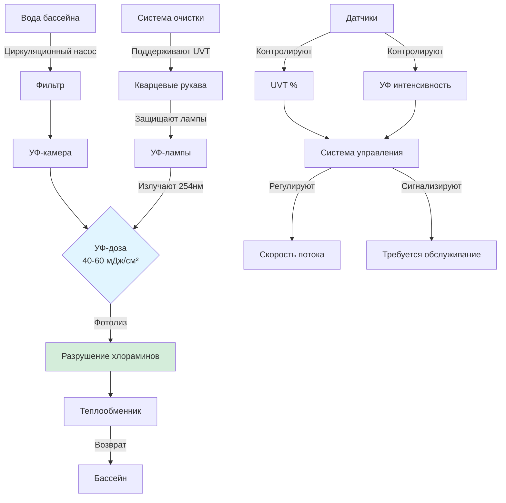
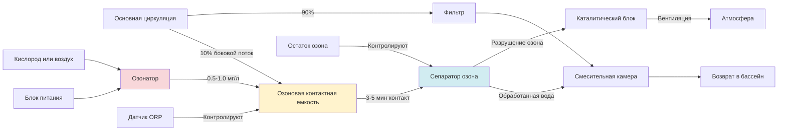

Контроль образования хлораминов у источника представляет наиболее эффективную и энергетически выгодную стратегию для управления качеством воздуха в закрытых бассейнах. Хотя вентиляционное разбавление может справиться с воздушными хлораминами, предотвращение их образования посредством управления химией воды и гигиены пловцов дает превосходные результаты с более низкими операционными затратами. Контроль источника снижает скорость образования хлораминов ($G$) вместо попытки разбавить загрязнение после его образования.

## Основы образования хлораминов

Хламины образуются, когда свободный хлор (гипохлорная кислота, HOCl) реагирует с содержащими азот соединениями, вносимыми пловцами. Первичные источники азота:

**Выделения жидкостей организма**:
- Мочевина: 20-80 мг выделяется одним пловцом в час
- Аммиак: 5-15 мг на пловца в час
- Креатинин: 3-8 мг на пловца в час
- Аминокислоты: 10-30 мг на пловца в час

**Косметические и средства личной гигиены**:
- Остатки солнцезащитных средств
- Кремы и масла для тела
- Средства для волос
- Дезодоранты и ароматизаторы

### Последовательность реакций

Реакции образования хлораминов протекают последовательно в зависимости от молярного соотношения хлора к азоту:

**Этап 1: Образование монохлорамина** (соотношение Cl:N < 5:1)
$$\text{NH}_3 + \text{HOCl} \rightarrow \text{NH}_2\text{Cl} + \text{H}_2\text{O}$$

**Этап 2: Образование дихлорамина** (соотношение Cl:N 5:1 к 7.6:1)
$$\text{NH}_2\text{Cl} + \text{HOCl} \rightarrow \text{NHCl}_2 + \text{H}_2\text{O}$$

**Этап 3: Образование трихлорамина** (соотношение Cl:N > 7.6:1)
$$\text{NHCl}_2 + \text{HOCl} \rightarrow \text{NCl}_3 + \text{H}_2\text{O}$$

При типичном pH бассейна (7.2-7.8) все три вида образуются одновременно, с относительными концентрациями, управляемыми pH, температурой и кинетикой реакции. Трихлорамин ($\text{NCl}_3$) является проблемным видом из-за:

- Низкой растворимости в воде (1.5 г/л при 20°C)
- Высокой летучести (константа закона Генри $H = 0.67$ при 25°C)
- Сильного запаха и раздражающих свойств при концентрациях выше 0.3 мг/м³

### Скорость летучести

Массопередача трихлорамина из воды бассейна в воздух следует теории двойной пленки:

$$J = K_L \cdot A \cdot (C_w - C_w^*)$$

Где:
- $J$ = Скорость массопередачи (мг/ч)
- $K_L$ = Общий коэффициент массопередачи (м/ч)
- $A$ = Площадь поверхности воды (м²)
- $C_w$ = Концентрация трихлорамина в основном потоке воды (мг/л)
- $C_w^*$ = Равновесная концентрация, соответствующая концентрации в воздухе

Коэффициент массопередачи зависит от турбулентности воды (уровень активности) и скорости воздуха над поверхностью:

$$K_L = 0.001 \cdot (1 + 0.3 \cdot v_{воздух}) \cdot (1 + \alpha \cdot v_{вода})$$

Где:
- $v_{воздух}$ = Скорость воздуха над поверхностью (м/с)
- $v_{вода}$ = Коэффициент турбулентности поверхности воды (безразмерный, 1.0 = спокойно, 3.0 = интенсивная активность)
- $\alpha$ = Коэффициент активности (обычно 0.5-1.0)

Эта зависимость демонстрирует, почему спокойные бассейны с низким движением воздуха производят меньше летучести, чем высокоактивные бассейны с водными объектами или высокой циркуляцией воздуха.

## Программы предварительного душа перед плаванием

Обязательный предварительный душ перед плаванием представляет единственную наиболее экономически эффективную стратегию снижения хлораминов, удаляя 75-95% мочевины, косметики и других источников азота перед входом в бассейн.

### Данные об эффективности

Исследования европейских бассейнов демонстрируют эффективность душа:

| Параметр | До душа | После душа 30 сек | После душа 60 сек | Снижение |
|----------|---------|-------------------|-------------------|----------|
| Мочевина на теле | 100 мг | 15 мг | 5 мг | 95% |
| Остатки косметики | 100% | 35% | 10% | 90% |
| Аммиак | 100 мг | 20 мг | 8 мг | 92% |
| Общая азотная нагрузка | 100% | 22% | 8% | 92% |

**Требуемая продолжительность душа**: Минимум 30 секунд с мылом, желательно 60 секунд для пловцов с обильным использованием косметики.

### Стратегии внедрения

**Конструктивное исполнение**:
1. **Обязательный маршрут**: Организуйте учреждение так, чтобы пловцы должны были пройти через душевую зону, чтобы добраться до бассейна
2. **Достаточная вместимость**: Предусмотрите 1 душевую головку на 15-20 пловцов (пиковая вместимость)
3. **Комфортная температура**: 35-41°C способствует соблюдению
4. **Надлежащий дренаж**: Предотвратите застой воды, который препятствует использованию

**Методы контроля**:
- Визуальное наблюдение спасателей/персонала
- Автоматические таймеры душей с индикаторными огнями
- Информационные таблички, объясняющие образование хлораминов
- Программы стимулирования для детей (наклейки и т.д.)
- Системы браслетов, показывающие завершение душа

**Измеренное влияние**: Учреждения с обязательным предварительным душом перед плаванием сообщают о снижении на 60-80% скорости образования комбинированного хлора и соответствующем снижении концентраций воздушного трихлорамина с 0.6 мг/м³ до 0.15 мг/м³.

### Соображения качества воды для душа

Качество воды для душа влияет на эффективность удаления азота:

- **Теплая вода** (>35°C): Открывает поры, улучшает удаление косметики
- **Мягкая вода**: Лучшее действие поверхностно-активного вещества, улучшенная чистота
- **Надлежащее давление**: 140-210 кПа для эффективного ополаскивания

## Управление нагрузкой пловцов

Скорость образования хлораминов прямо пропорциональна количеству пловцов и уровню их активности. Управление занятостью предотвращает перегрузку системы водоочистки.

### Расчет нагрузки

Общая скорость азотной нагрузки:

$$N_{total} = \sum (n_i \cdot f_i \cdot A_i)$$

Где:
- $n_i$ = Количество пловцов в категории активности $i$
- $f_i$ = Коэффициент выделения азота для активности (мг/человека·ч)
- $A_i$ = Множитель активности (1.0 = спокойно, 2.5 = интенсивно)

**Скорости выделения азота в зависимости от активности**:

| Тип активности | Выделение азота (мг/человека·ч) | Множитель активности |
|----------------|--------------------------------|----------------------|
| Плавание вольным стилем | 40-60 | 1.2 |
| Рекреационное плавание | 60-90 | 1.5 |
| Детские игры в воде | 90-120 | 2.0 |
| Водная аэробика | 80-110 | 1.8 |
| Тренировка в соревнованиях | 100-150 | 2.5 |

### Пределы вместимости

Проектная вместимость должна соответствовать возможности системы водоочистки:

$$n_{max} = \frac{Q_{обработка} \cdot C_{удаление}}{N_{выделение}}$$

Где:
- $n_{max}$ = Максимальное устойчивое количество пловцов
- $Q_{обработка}$ = Скорость циркуляции воды (л/ч)
- $C_{удаление}$ = Способность системы удаления хлораминов (мг/л за проход)
- $N_{выделение}$ = Средняя скорость выделения азота одним пловцом (мг/ч)

**Пример расчета**:

Бассейн с циркуляцией 500 GPM (1,893 л/мин = 113,580 л/ч)
УФ система удаляет 0.3 мг/л комбинированного хлора за проход
Средний пловец выделяет 80 мг азота/ч

$$n_{max} = \frac{113,580 \cdot 0.3}{80} = \frac{34,074}{80} = 426 \text{ пловцов}$$

Этот теоретический максимум должен быть снижен на коэффициент безопасности 0.5-0.7 для проектной вместимости: максимум 210-300 пловцов.

### Методы контроля занятости

**Конструктивные элементы управления**:
- Размер площади бассейна (площадь поверхности на одного пловца)
- Конфигурация разделителей дорожек, ограничивающая плотность
- Отдельные зоны для различных уровней активности

**Административные элементы управления**:
- Ограничения сеансов/времени допуска
- Системы резервирования для периодов высокого спроса
- Контролируемые спасателем пределы вместимости
- Ценовые стратегии для распределения спроса

## Оптимизация химии воды

Надлежащая химия воды минимизирует образование хлораминов и улучшает процессы удаления.

### Контроль pH

pH оказывает глубокое влияние на распределение видов хлораминов и летучесть. Оптимальный диапазон уравновешивает эффективность дезинфекции против образования трихлорамина:

**Эффекты pH на химию**:

| Диапазон pH | HOCl % | OCl⁻ % | Скорость образования трихлорамина | Рекомендация |
|-------------|--------|--------|-----------------------------------|--------------|
| 7.0-7.2 | 75-70% | 25-30% | Умеренная | Приемлемо |
| 7.2-7.4 | 70-60% | 30-40% | Низкая | **Оптимально** |
| 7.4-7.6 | 60-50% | 40-50% | Низко-умеренная | Приемлемо |
| 7.6-7.8 | 50-40% | 50-60% | Умеренно-высокая | Избегать |
| 7.8-8.0 | 40-30% | 60-70% | Высокая | Неудовлетворительно |

**Целевой pH**: 7.3-7.5 обеспечивает оптимальный баланс между эффективностью дезинфекции (требует HOCl) и минимальным образованием трихлорамина.

pH влияет на равновесие:

$$\text{HOCl} \rightleftharpoons \text{H}^+ + \text{OCl}^-$$

С $pK_a = 7.5$ при 25°C. При pH 7.3 примерно 61% существует как HOCl (активный дезинфектант), в то время как более высокий pH смещает равновесие в сторону менее эффективного гипохлорит-иона.

### Поддержание свободного хлора

Поддержание адекватного свободного хлора предотвращает накопление органических азотных соединений:

**Целевые значения свободного хлора**:
- Минимум: 1.0 мг/л
- Оптимум: 2.0-3.0 мг/л
- Максимум: 5.0 мг/л (предел комфорта)

**Пределы комбинированного хлора**:
- Максимально приемлемо: 0.2 мг/л
- Уровень действия: 0.4 мг/л (инициировать суперхлорирование)
- Критично: >0.5 мг/л (немедленное хлорирование до точки насыщения)

Отношение свободного хлора к комбинированному хлору указывает на качество воды:

$$R_{хлор} = \frac{[\text{Свободный Cl}_2]}{[\text{Комбинированный Cl}_2]}$$

Целевое соотношение: $R_{хлор} > 10$ (указывает на то, что <10% хлора связано с хлораминами)

### Хлорирование до точки насыщения

Хлорирование до точки насыщения окисляет хламины обратно в азот, перезагружая химию воды:

**Реакция точки насыщения**:
$$2\text{NH}_2\text{Cl} + \text{HOCl} \rightarrow \text{N}_2 + 3\text{HCl} + \text{H}_2\text{O}$$

Теоретическая потребность в хлоре составляет 7.6× концентрацию комбинированного хлора, но практическое дозирование требует 10× из-за конкурирующих реакций:

$$Cl_{доза} = 10 \times [\text{Комбинированный Cl}_2]$$

**Процедура**:
1. Измерьте концентрацию комбинированного хлора
2. Рассчитайте требуемую дозу хлора: $Доза = 10 \times C_{комбинированный}$ (мг/л)
3. Добавляйте хлор постепенно в течение 30-60 минут
4. Поддерживайте циркуляцию в течение 4-8 часов
5. Проверьте возврат свободного хлора в нормальный диапазон
6. Повторно проверьте комбинированный хлор через 24 часа

**Пример**: Бассейн с 0.6 мг/л комбинированного хлора требует дополнительной дозы хлора 6.0 мг/л. Для бассейна объемом 100,000 галлонов:

$$Масса = 6.0 \frac{\text{мг}}{\text{л}} \times 100,000 \text{ гал} \times 3.785 \frac{\text{л}}{\text{гал}} \times \frac{1 \text{ г}}{1000 \text{ мг}} = 2,271 \text{ г} = 5.0 \text{ фунта}$$

**Частота**: Еженедельно для рекреационных бассейнов, 2-3 раза еженедельно для интенсивно используемых соревновательных учреждений.

## УФ-системы обработки

Ультрафиолетовое облучение разрушает хламины посредством фотолитического разложения, обеспечивая непрерывное удаление без химического добавления.

### Принципы работы

УФ свет с длиной волны 200-280 нм фотолизирует связи азот-хлор:

$$\text{NCl}_3 + h\nu \rightarrow \text{NCl}_2 + \text{Cl}^{\bullet}$$

Последующие реакции разлагают промежуточные соединения азот-хлор в азот и хлорид-ионы. Процесс также окисляет мочевину и другие органические предшественники азота, предотвращая образование хлораминов.

### Параметры проектирования системы

**Требуемая УФ-доза**: 40-60 мДж/см² для эффективного снижения хлораминов (лампы среднего давления обеспечивают более широкий спектр, чем низкого давления)

**Скорость потока**: Обычно обрабатывают 100% циркуляционного потока для максимальной эффективности

**Пропускаемость**: Вода бассейна должна поддерживать >75% УФ пропускаемость (UVT) при 254 нм; снижается органикой, мутностью

**Конфигурация лампы**:
- Конструкция камеры: Несколько ламп параллельно в камере потока
- Мощность лампы: 5-15 кВт на лампу
- Срок службы лампы: 9,000-12,000 часов (примерно 1 год непрерывной работы)

### Корреляция эффективности

Эффективность разрушения хлораминов следует кинетике первого порядка:

$$\eta = 1 - e^{-k \cdot D}$$

Где:
- $\eta$ = Эффективность разрушения (доля)
- $k$ = Константа скорости (см²/мДж), обычно 0.020-0.035 для трихлорамина
- $D$ = УФ-доза (мДж/см²)

Для $D = 50$ мДж/см² и $k = 0.025$:

$$\eta = 1 - e^{-0.025 \times 50} = 1 - e^{-1.25} = 1 - 0.287 = 0.713 = 71\%$$

**Измеренные результаты**: Надлежащим образом спроектированные УФ-системы снижают комбинированный хлор на 50-80% и уменьшают концентрации воздушного трихлорамина на 40-70%.

### Требования к техническому обслуживанию

**Критические параметры**:
- Мониторинг интенсивности УФ лампы (датчики проверяют выход)
- Очистка кварцевого рукава (автоматические щетки или химическая очистка)
- Поддержание качества воды (UVT >75%)
- Годовая замена ламп

**Операционные затраты**:
- Электроэнергия: 0.5-1.5 кВт на 10,000 галлонов циркуляции
- Замена ламп: $200-500 за лампу в год
- Обслуживание: 4-8 часов в год

## Системы обработки озоном

Озон ($\text{O}_3$) обеспечивает мощное окисление хлораминов и органических предшественников, хотя с более высокими капитальными и операционными затратами, чем УФ.

### Химические реакции

Озон окисляет хламины несколькими путями:

**Прямое окисление**:
$$\text{NHCl}_2 + \text{O}_3 \rightarrow \text{NO}_2^- + \text{HCl} + \text{O}_2$$

**Образование гидроксильного радикала** (продвинутое окисление):
$$\text{O}_3 + \text{H}_2\text{O} \rightarrow \text{OH}^{\bullet} + \text{O}_2 + \text{H}^+$$

Гидроксильный радикал ($\text{OH}^{\bullet}$) чрезвычайно реактивен (окислительный потенциал +2.8 В против +2.1 В для озона) и разрушает хламины, мочевину и другие органики.

### Конфигурация системы

**Производство озона**: Озонаторы с корончатым разрядом, производящие 1-3% озона по весу из газообразного кислорода или воздуха

**Дозирование**: 0.5-1.0 мг/л применяется к боковому потоку (10-30% от общей циркуляции)

**Время контакта**: 3-5 минут в специальной контактной камере

**Удаление газа**: Остаточный озон должен быть удален перед возвратом в бассейн (каталитическое разрушение или активированный уголь)

**Схема системы**:

### Расчеты озонного дозирования

Требуемый массовый расход озона:

$$\dot{m}_{O_3} = Q_{боковой} \cdot C_{доза} \cdot \rho$$

Где:
- $\dot{m}_{O_3}$ = Массовый расход озона (г/ч)
- $Q_{боковой}$ = Скорость бокового потока (л/мин)
- $C_{доза}$ = Концентрация озонной дозы (мг/л или м/л)
- $\rho$ = Плотность воды (~1 кг/л)

**Пример**: Боковой поток 50 GPM (189 л/мин), доза озона 0.8 мг/л

$$\dot{m}_{O_3} = 189 \frac{\text{л}}{\text{мин}} \times 60 \frac{\text{мин}}{\text{ч}} \times 0.8 \frac{\text{мг}}{\text{л}} \times \frac{1 \text{ г}}{1000 \text{ мг}} = 9.07 \text{ г/ч}$$

Озонатор должен производить 9-10 г/ч при концентрации 1-2% (требует 450-1,000 г/ч пропускания воздуха/кислорода).

### Производительность и экономика

**Эффективность**:
- Снижение комбинированного хлора: 70-90%
- Окисление органических предшественников: 50-80%
- Снижение воздушного хлорамина: 60-85%

**Затраты** (относительно УФ):
- Капитальные затраты: 2-3× стоимость УФ-системы
- Операционная мощность: 1.5-2× потребление мощности УФ
- Обслуживание: Более сложно, требует мониторинга поставки кислорода, замены катализатора

**Преимущества перед УФ**:
- Разрушает более широкий диапазон органических загрязнений
- Снижает общую потребность в хлоре на 30-50%
- Обеспечивает дополнительную окислительную способность

**Недостатки**:
- Более высокая стоимость
- Более сложная эксплуатация
- Требует систему удаления газа
- Потенциал чрезмерного окисления при отсутствии контроля

## Комбинированные стратегии лечения

Наиболее эффективное управление хлораминами объединяет несколько подходов в интегрированной стратегии:

### Уровень 1: Поведение и эксплуатация

**Первичная профилактика**:
1. Обязательный предварительный душ перед плаванием (снижение азота на 75-90%)
2. Управление нагрузкой пловцов (предотвращает перегрузку системы очистки)
3. Требования к подгузникам для плавания детей
4. Программы образования по гигиене бассейна

**Ожидаемое влияние**: Снижение скорости образования хлораминов на 60-75%

### Уровень 2: Химия воды

**Химический контроль**:
1. Оптимизация pH (7.3-7.5)
2. Поддержание свободного хлора (2.0-3.0 мг/л)
3. Еженедельное хлорирование до точки насыщения
4. Регулярная обратная промывка и обслуживание фильтра

**Ожидаемое влияние**: Дополнительное снижение на 20-30% (совокупное 70-85% всего)

### Уровень 3: Дополнительная обработка

**Продвинутое окисление**:
1. УФ обработка (40-60 мДж/см² на 100% потока) **ИЛИ**
2. Озоновая обработка (0.5-1.0 мг/л на 10-30% бокового потока)
3. Комбинированный УФ + озон для максимальной эффективности

**Ожидаемое влияние**: Дополнительное снижение на 10-20% (совокупное 80-95% всего)

### Мониторинг производительности

Отслеживайте эффективность через:

**Метрики качества воды**:
- Свободный хлор: 2-3 раза в день
- Комбинированный хлор: Ежедневно
- pH: Непрерывно или 2-3 раза в день
- Циануровая кислота: Еженедельно

**Метрики качества воздуха**:
- Концентрация трихлорамина: Ежемесячный анализ в лаборатории
- Жалобы жильцов: Непрерывное логирование
- Коррозия оборудования: Ежеквартальная проверка

**Проверка системы обработки**:
- Мониторинг интенсивности УФ/дозы: Непрерывный мониторинг
- Производство озона: Непрерывный мониторинг
- Скорости потока: Непрерывный мониторинг

## Пример реализации

**Учреждение**: Соревновательный бассейн на 25 метров, 500,000 галлонов, 200-300 пловцов в день

**Базовые условия** (до контроля источника):
- Комбинированный хлор: 0.6-0.8 мг/л
- Воздушный трихлорамин: 0.5-0.7 мг/м³
- Вентиляция: 6 ACH
- Частые жалобы на запах

**Внедренные меры**:

| Мера | Стоимость внедрения | Годовые операционные затраты |
|------|--------------------|-----------------------------|
| Программа обязательного душа | $15,000 (табличка, таймеры) | $2,000 (мониторинг) |
| Обновление контроллера pH | $8,000 | $1,500 (химикаты) |
| Автоматические дозаторы хлора | $12,000 | $3,000 (химикаты) |
| УФ-система (60 мДж/см²) | $45,000 | $8,000 (мощность, лампы) |
| Еженедельное суперхлорирование | - | $4,000 (химикаты) |
| **Всего** | **$80,000** | **$18,500** |

**Результаты через 6 месяцев**:
- Комбинированный хлор: 0.1-0.2 мг/л (снижение на 75%)
- Воздушный трихлорамин: 0.15-0.25 мг/м³ (снижение на 65%)
- Вентиляция снижена до 4 ACH (экономия энергии)
- Нулевые жалобы на запах
- Коррозия оборудования снижена

**Экономия энергии**: Снижение вентиляции с 6 ACH до 4 ACH экономит примерно 30,000 кВт·ч/год отопления/охлаждения ($3,600 годовая экономия), обеспечивая 4.5-летний простой период окупаемости инвестиций в контроль источника при значительном улучшении качества воздуха.

## Устранение неполадок при отказе контроля источника

Когда комбинированный хлор остается повышенным, несмотря на меры контроля источника:

**Последовательность диагностики**:

1. **Проверьте соответствие душа**: Наблюдайте фактическое поведение пловцов; используются ли души должным образом?

2. **Проверьте работу УФ/озона**:
   - УФ: Проверьте выход лампы, проверьте UVT >75%, осмотрите на предмет загрязненных кварцевых рукавов
   - Озон: Подтвердите скорость образования, проверьте время контакта, проверьте удаление озона

3. **Анализируйте нагрузку пловцов**: Рассчитайте фактическую азотную нагрузку против проектной вместимости

4. **Проверьте химию воды**:
   - pH в оптимальном диапазоне (7.3-7.5)?
   - Адекватный свободный хлор (2-3 мг/л)?
   - Надлежащая циркуляция и фильтрация?

5. **Выполните хлорирование до точки насыщения**: Перезагрузите базовую химию воды

6. **Рассмотрите дополнительные меры**:
   - Увеличьте дозу УФ или концентрацию озона
   - Добавьте вторичную систему окисления
   - Временно снизьте вместимость пловцов

Успех контроля источника требует постоянного операционного внимания во всех компонентах системы. Физика образования хлораминов неумолима—азотные входы неизбежно объединяются с хлором. Только благодаря комплексному многоуровневому подходу учреждения могут достичь целевого качества воздуха ниже 0.3 мг/м³ трихлорамина.
