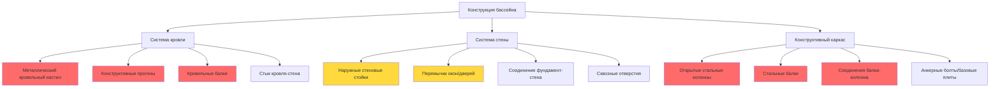

## Риск конденсации на конструкциях бассейнов

Конденсация на конструктивных элементах представляет один из наиболее критических режимов отказа при проектировании крытых бассейнов. Сочетание повышенной влажности в помещении (обычно 50–60% ОВ), высокой температуры воздуха (27,8–30°С) и холодных наружных поверхностей создает идеальные условия для накопления влаги на недостаточно изолированных конструктивных элементах. Эта конденсация приводит к коррозии стальных элементов, деградации бетона, разрушению кровельного настила и потенциальному отказу конструкции.

Физика, управляющая конденсацией, проста: когда температура поверхности падает ниже температуры точки росы соседнего воздуха, влага конденсируется. В крытых бассейнах, где внутренняя температура точки росы обычно достигает 15,6–21,1°С, любой конструктивный элемент с недостаточным тепловым сопротивлением будет подвергаться конденсации в холодную погоду.

## Расчет температуры поверхности

Критический расчет для предотвращения конденсации определяет минимальную внутреннюю температуру поверхности конструктивных элементов. Эта температура должна оставаться выше температуры точки росы внутреннего воздуха при расчетных условиях.

Температура поверхности внутри конструктивного элемента $T_{si}$ рассчитывается как:

$$T_{si} = T_i - \frac{T_i - T_o}{R_{total} \cdot h_i}$$

где:
- $T_i$ = температура внутреннего воздуха (°С)
- $T_o$ = наружная расчетная температура (°С)
- $R_{total}$ = полное тепловое сопротивление конструкции (м²·°С/Вт)
- $h_i$ = коэффициент пленки на внутренней поверхности (обычно 8,5 Вт/м²·°С для неподвижного воздуха, 14,2 для движущегося воздуха)

Для предотвращения конденсации требование составляет:

$$T_{si} > T_{dp}$$

где $T_{dp}$ — температура точки росы внутреннего воздуха.

**Пример расчета:**

Для крытого бассейна с внутренними условиями 28,9°С и 60% ОВ (точка росы ≈ 20,6°С), наружной расчетной температурой –17,8°С и кровельной конструкцией с полным R-значением 5,3 м²·°С/Вт:

$$T_{si} = 28,9 - \frac{28,9 - (-17,8)}{5,3 \cdot 8,5} = 28,9 - \frac{46,7}{45,05} = 28,9 - 1,04 = 27,86°С$$

Эта температура поверхности (27,86°С) превышает точку росы (20,6°С), предотвращая конденсацию. Однако тепловые мостики через конструктивные элементы могут создавать локальные холодные точки ниже этого рассчитанного значения.

## Локализация риска конденсации

**Легенда:** Красный указывает на наивысший риск конденсации, требующий сплошной теплоизоляции; желтый указывает на умеренный риск, требующий тщательного проектирования деталей.

## Стратегии предотвращения конденсации по конструктивным элементам

| Конструктивный элемент | Основной риск | Стратегия предотвращения | Минимальное R-значение* | Критические детали |
|------------------------|---------------|--------------------------|------------------------|-------------------|
| **Металлический кровельный настил** | Прямая конденсация на холодной металлической поверхности | Сплошная теплоизоляция над настилом; пароизолятор под настилом | R-6,2–R-8,8 м²·°С/Вт | Исключить все отверстия в настиле; загерметизировать швы |
| **Стальные прогоны/балки** | Тепловые мостики через непрерывные элементы | Термически разомкнутые крепежи; внешний слой теплоизоляции | Эффективное R-5,3+ м²·°С/Вт | Использовать тепловые разделители в соединениях |
| **Стальные колонны** | Конденсация на открытых поверхностях колонн | Инкапсулировать колонны внутри изолированного ограждения | Полная инкапсуляция | Внутренний каркас с теплоизоляцией |
| **Бетонные стены** | Конденсация на внутренней поверхности; ущерб от циклов замораживания-оттаивания | Сплошная внешняя теплоизоляция | R-3,5–R-5,3 м²·°С/Вт | Без зазоров на переходах |
| **Кровельные балки** | Конденсация на стыке балка-настил | Тепловые разделители; обмотка теплоизоляцией | Локальное R-2,6 минимум | Загерметизировать все сквозные отверстия через теплоизоляцию |
| **Стеновые стойки (металлические)** | Тепловые мостики через полость стены | Внешняя сплошная теплоизоляция | R-0,9 сплошная минимум | Исключает 30–50% потерь тепла |
| **Стык фундамент-стена** | Холодный мостик у основания стены | Теплоизоляция, продолжающаяся ниже уровня земли | R-1,8 на расстояние 0,6 м ниже | Критическое интегрирование влагозащиты |
| **Сквозные отверстия** | Локализованные холодные точки вокруг воздуховодов, труб | Герметичные тепловые разделители; изолированные проходные втулки | Соответствуют соседней конструкции | Используют изготовленные тепловые бортики |

*R-значения предполагают ASHRAE 90.1 климатический регион 5–7; отрегулировать по местным условиям.

## Тепловые мостики и сплошная теплоизоляция

Наиболее распространенный отказ конденсации в крытых бассейнах происходит у тепловых мостиков — непрерывных путей теплопроводности через ограждающую конструкцию. Стальная колонна, пронизывающая изолированную стену, создает тепловой короткий путь, резко снижая эффективное R-значение в этом месте.

Эффективное R-значение конструкции с тепловыми мостиками:

$$R_{effective} = \frac{1}{\frac{f_{bridge}}{R_{bridge}} + \frac{1-f_{bridge}}{R_{cavity}}}$$

где:
- $f_{bridge}$ = доля площади, занятая тепловым мостиком (обычно 0,15–0,25 для металлического каркаса)
- $R_{bridge}$ = R-значение через путь теплового мостика
- $R_{cavity}$ = R-значение через изолированную полость

Для стены с R-3,3 м²·°С/Вт полость из теплоизоляции, но 20% стальных стоек (R-0,18 м²·°С/Вт), эффективное R-значение падает примерно до R-1,2 м²·°С/Вт — снижение на 64%. Это объясняет, почему сплошная внешняя теплоизоляция конструктивного каркаса необходима при проектировании крытых бассейнов.

## Рекомендации ASHRAE и строительной науки

ASHRAE Standard 62.1 и Руководство по проектированию крытых бассейнов ASHRAE устанавливают минимальные требования вентиляции, но не указывают характеристики ограждающей конструкции. Однако принципы строительной науки и полевой опыт устанавливают четкие требования:

1. **Сплошная тепловая изоляция** должна быть установлена на внешней стороне всех конструктивных элементов для предотвращения тепловых мостиков
2. **Минимальная температура поверхности** должна превышать точку росы по крайней мере на 2,8°С для безопасности конденсации
3. **Пароизоляторы** (не паробарьеры) должны быть установлены на теплой (внутренней) стороне кровельных конструкций, с паропроницаемостью, согласованной с климатом и типом конструкции
4. **Герметизация воздуха** критична — утечка воздуха через ограждающую конструкцию переносит влагу прямо на холодные поверхности
5. **Конструктивная сталь**, подвергаемая воздействию воздуха в бассейне, должна быть полностью инкапсулирована внутри теплового ограждения или нагрета для предотвращения конденсации

## Предотвращение конденсации на кровельном настиле

Конденсация на кровельном настиле представляет наиболее разрушительный режим отказа из-за большой площади поверхности и конструктивной критичности. Металлические кровельные настилы особенно уязвимы из-за высокой теплопроводности. Эффективное предотвращение требует:

- **Размещение теплоизоляции:** вся теплоизоляция должна быть расположена над металлическим настилом, без теплоизоляции между настилом и внутренним пространством
- **Контроль пара:** самоклеящийся пароизолятор должен быть установлен на верхней части настила перед теплоизоляцией
- **Сплошное покрытие:** теплоизоляция должна распространяться непрерывно над всеми конструктивными элементами без зазоров
- **Минимальная толщина:** обычно R-6,2 до R-8,8 м²·°С/Вт в зависимости от климатического региона, рассчитанная для поддержания температуры настила выше точки росы при холоднейших расчетных условиях

Температура поверхности настила может быть приблизительно рассчитана как:

$$T_{deck} = T_i - \frac{(T_i - T_o)}{1 + R_{above} \cdot h_i}$$

где $R_{above}$ — R-значение теплоизоляции над настилом.

## Мониторинг и проверка

Даже при надлежащем проектировании проверка фактических температур поверхности необходима. Обследования инфракрасной термографией в холодную погоду выявляют тепловые мостики и участки, склонные к конденсации. Постоянно установленные датчики температуры поверхности в критических местах (открытые колонны, стыки кровля-стена, соединения балка-колонна) обеспечивают непрерывный мониторинг и предупреждают операторов учреждения об опасности конденсации до того, как произойдет ущерб.

Мониторинг температуры поверхности должен вызывать предупреждения, когда:

$$T_{surface} < T_{dp} + 2,8°С$$

Этот запас на 2,8°С учитывает точность датчика и вариации локального движения воздуха.

## Заключение

Предотвращение конденсации на конструктивных элементах крытого бассейна требует тщательного применения принципов строительной науки: сплошной тепловой изоляции, расположенной на внешней стороне всех конструктивных элементов, устранение тепловых мостиков, стратегии контроля пара, подходящие для климата, и проверка путем расчета и мониторинга. Окружающая среда высокой влажности и потенциал катастрофической коррозии конструкции требуют подходов проектирования, которые превосходят типичные строительные стандарты. Надлежащее проектирование ограждающей конструкции, при котором температуры поверхностей поддерживаются выше точки росы при всех рабочих условиях, обеспечивает долгосрочную структурную целостность и надежность эксплуатации.
