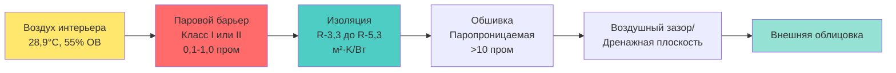

## Системы паровых барьеров

Паровые барьеры в ограждающих конструкциях нататориумов служат критическими элементами контроля влаги, которые предотвращают миграцию водяного пара из помещений с высокой влажностью в стеновые и кровельные сборки. Учитывая, что крытые бассейны поддерживают уровни относительной влажности 50-60% при температурах 27,8-30°C, дифференциал давления пара между интерьером и экстерьером вызывает значительный поток влаги через ограждающие конструкции. Без надлежащего контроля пара эта влага мигрирует на холодные поверхности в полости стены, конденсируется в плоскости точки росы и вызывает структурное разрушение, рост плесени и деградацию изоляции.

## Физика паровода и конденсации

Основной механизм, определяющий необходимость парового барьера, — это дифференциал давления пара. Водяной пар движется из областей высокого давления пара (теплый, влажный интерьер нататориума) в области более низкого давления пара (более холодный экстерьер). Движущая сила этой миграции выражается следующим образом:

$$q_v = \frac{\Delta p}{\sum R_v}$$

где $q_v$ — поток пара (г/ч·м²), $\Delta p$ — разница давления пара (Па), и $\sum R_v$ — общее паровое сопротивление (м²·ч·Па/г).

Критической проблемой является **плоскость конденсации**—расположение в сборке стены, где температура равна температуре точки росы мигрирующего воздуха. В этой плоскости:

$$T_{assembly} = T_{dp}$$

где $T_{dp}$ рассчитывается из условий интерьера:

$$T_{dp} = T_{db} - \frac{100 - RH}{5}$$

Это упрощенное приближение (действительное для типичных условий нататориума) показывает, что при 28,9°C и 55% относительной влажности точка росы составляет примерно 18,3°C. Любая поверхность в сборке стены при или ниже этой температуры будет испытывать конденсацию, если водяной пар достигает ее.

## Стратегия размещения парового барьера

Справочник ASHRAE Applications указывает, что пароретарды в нататориумах должны располагаться на **теплой стороне** изоляции — стороне, обращенной к кондиционируемому помещению. Такое размещение предотвращает попадание влаги на холодные поверхности, где возникает конденсация.

Паровой барьер создает высокое паровое сопротивление близко к теплому интерьеру, ограничивая количество влаги, которая может попасть в сборку. Внешние слои должны оставаться **паропроницаемыми** (высокая проницаемость) для выхода любой влаги, попавшей внутрь, наружу в теплую погоду или в периоды внутреннего высыхания.

## Классификация паровой проницаемости

Материалы парового барьера классифицируются по рейтингу проницаемости в пром (г/ч·м²·Па):

| Класс | Проницаемость | Примеры материалов | Применение в нататориуме |
|-------|-----------|-------------------|------------------------|
| **Класс I** | ≤0,1 пром | 6-миллиметровый полиэтилен, фольгированная изоляция, самоклеящаяся мембрана | Первичный паровой барьер для экстремальных нагрузок влажности |
| **Класс II** | 0,1-1,0 пром | Крафт-облицованная изоляция, некоторые краски-пароретарды | Дополнительный контроль в мягком климате |
| **Класс III** | 1,0-10 пром | Латексная краска, некоторые строительные обертки | Не подходит для интерьеров нататориумов |
| **Паропроницаемая** | >10 пром | Неокрашенный гипс, войлочная бумага, строительная пленка | Требуется для внешних слоев обшивки |

Для применений в нататориуме **пароретарды Класса I обязательны** из-за экстремальной нагрузки влажности. Типичные рейтинги проницаемости для конкретных материалов:

| Материал | Толщина | Проницаемость (пром) | Примечания по монтажу |
|----------|-----------|------------------|--------------------|
| Полиэтиленовый лист | 0,15 мм | 0,06 | Наиболее экономичный; требует тщательного герметизации швов |
| Полиэтиленовый лист | 0,25 мм | 0,04 | Большая долговечность и устойчивость к прокалыванию |
| Фольгированный полиизоциануратный материал | 38 мм | 0,05 | Непрерывная изоляция с интегрированным паровым барьером |
| Самоклеящаяся мембрана | 1,0 мм | 0,02 | Наибольшая надежность; самогерметизация вокруг крепежа |
| Напыляемая закрытоячеистая пена | 50 мм | 0,8-1,2 | Класс II при использовании отдельно; требует дополнительного слоя |
| Алюминиевый фольгированный ламинат | 0,025 мм | 0,01 | Крайне низкая проницаемость; сложность монтажа |

## Критические требования к монтажу

### Непрерывность парового барьера

Эффективность парового барьера зависит исключительно от **непрерывности**—любой разрыв, разрыв или незагерметизированное отверстие создает путь для массивной миграции влаги. Отверстие площадью 1 кв.см в паровом барьере позволяет потоку влаги, эквивалентному потоку через 0,2 кв.м 0,15-миллиметрового полиэтилена. Требования к монтажу включают:

1. **Нахлесты швов**: минимум 15 см нахлеста на всех стыках
2. **Загерметизированные швы**: акустический герметик или одобренная производителем лента на всех нахлестах
3. **Герметизация периметра**: непрерывная герметизация к фундаменту, кровельной палубе и смежным стенам
4. **Обработка отверстий**: герметизация вокруг всех электрических коробок, механических отверстий и конструктивных элементов

### Протокол герметизации отверстий

Каждое отверстие через паровой барьер создает потенциальный путь конденсации:

- **Электрические розетки**: используйте герметичные электрические коробки с прокладками
- **Прохождение труб**: применяйте загрузочные фитинги парового барьера или несколько слоев герметика
- **Конструктивные элементы**: герметизируйте зазоры между каркасом и паровым барьером совместимым герметиком
- **Окна и двери**: интегрируйте паровой барьер непрерывно с уплотнениями периметра окна/двери

### Интеграция воздушного барьера

Функции парового барьера и воздушного барьера часто совпадают на одной плоскости в конструкции нататориума. Утечка воздуха переносит намного больше влаги, чем одна диффузия пара—один кубический метр насыщенного воздуха при 28,9°C содержит примерно 18 г воды, тогда как диффузия через один квадратный метр парового барьера может передавать только 2-3 г в день.

Интегрированная система воздушного/паровогобарьера требует:

$$Q_{total} = Q_{diffusion} + Q_{airflow}$$

где $Q_{airflow} >> Q_{diffusion}$ в большинстве отказов. Поэтому достижение герметичности воздуха столь же критично, как выбор низкопроницаемых материалов.

## Критерии выбора материала

### Полиэтиленовые листовые паровые барьеры

**Преимущества:**
- Наименьшая стоимость за квадратный метр
- Проницаемость 0,04-0,06 пром превышает требования
- Легко доступен в больших рулонах для непрерывного покрытия

**Ограничения:**
- Подвержен прокалыванию во время строительства
- Требует тщательного герметизации швов
- Сложно интегрируется с неправильной геометрией

**Спецификация**: минимум 0,15 мм толщины, предпочтительно 0,25 мм для строительных зон с интенсивным движением.

### Системы фольгированной изоляции

Жесткие изоляционные плиты с фольгированной облицовкой обеспечивают комбинированный тепловой и паровой контроль:

$$R_{total} = R_{insulation} + R_{airfilm}$$

Фольгированная облицовка (0,05 пром) служит паровым барьером, а изоляция обеспечивает тепловое сопротивление, которое поддерживает температуру сборки выше точки росы.

**Преимущество монтажа**: однокомпонентная система снижает координацию между специальностями.

### Системы самоклеящихся мембран

Премиум паровые барьеры, состоящие из резинобитумных или бутиловых полимеров с полиэтиленовым покрытием, обеспечивают превосходную надежность:

- Самогерметизация вокруг отверстий крепежа
- Конформируемость к неправильным основаниям
- Контролируемые на производстве толщина и проницаемость
- Сокращенное время монтажа и требования к навыкам рабочих

**Рассмотрение стоимости**: в 3-5 раз дороже полиэтиленового листа, но исключает отказы парового барьера.

## Интеграция стратегии контроля влажности

Паровой барьер является одним компонентом комплексной стратегии контроля влажности:

1. **Контроль источника**: поддерживайте температуру воды в бассейне и точку росы воздуха в пределах рекомендуемых дифференциалов ASHRAE
2. **Паровой барьер**: ограничьте попадание влаги в ограждающие конструкции
3. **Тепловая изоляция**: поддерживайте температуры сборки выше точки росы
4. **Дренажная плоскость**: удалите любую объемную воду с экстерьера
5. **Паропроницаемый экстерьер**: позвольте выходящее высыхание любой накопленной влаги

Массовый баланс влаги в стеновой сборке должен удовлетворять:

$$m_{in} = m_{storage} + m_{out}$$

Надлежащая конструкция парового барьера обеспечивает $m_{in} \approx 0$, тогда как паропроницаемые экстерьеры максимизируют $m_{out}$ для предотвращения долгосрочного накопления.

## Проверка конструкции

Проверьте адекватность парового барьера путем гигротермального анализа:

1. Рассчитайте давление пара интерьера: $p_i = p_{sat}(T_i) \times RH_i$
2. Определите давление пара экстерьера: $p_o = p_{sat}(T_o) \times RH_o$
3. Рассчитайте профиль температуры через сборку, используя тепловые сопротивления
4. Нанесите плоскость точки росы
5. Проверьте, что паровой барьер предотвращает попадание влаги на температуры ниже $T_{dp}$

Для сборок нататориума этот анализ должен учитывать **зимние условия** (максимальный паровой привод наружу) и **летние условия** (возможный паровой привод внутрь во влажном климате).

## Заключение

Системы паровых барьеров в ограждающих конструкциях нататориумов требуют материалов Класса I (≤0,1 пром), размещения на теплой стороне, непрерывного монтажа и интеграции с системами воздушных барьеров. Экстремальная нагрузка влажности в крытых бассейнах—результат стойкой высокой влажности и повышенных температур—создает дифференциалы давления пара, которые вызывают конденсацию в неправильно защищенных сборках. Успешный контроль влажности требует понимания физики паровода, надлежащего выбора материалов, тщательного монтажа и проверки того, что температуры сборки остаются выше точки росы на протяжении всех условий эксплуатации.
