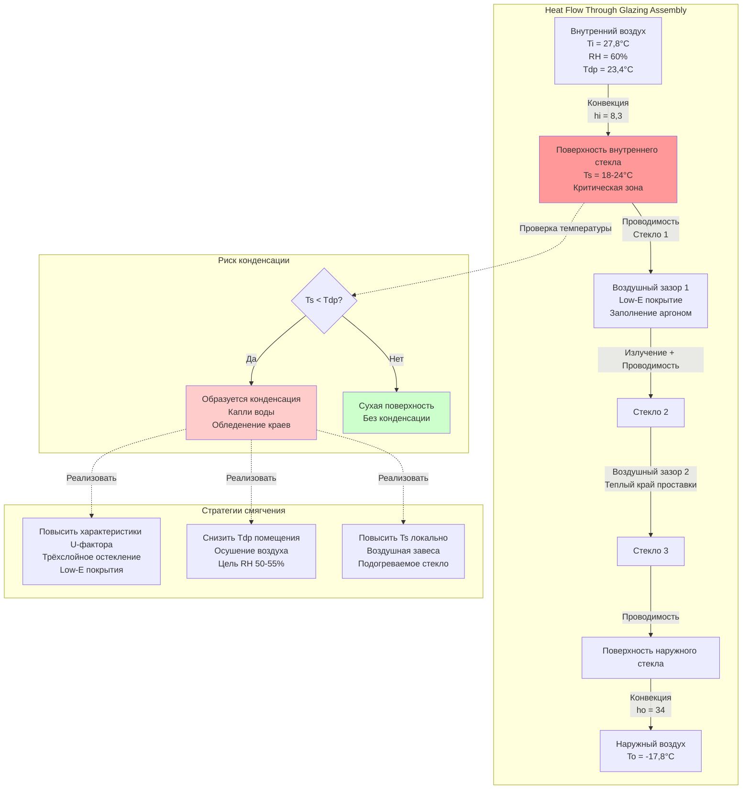

## Обзор

Конденсация на окнах в плавательных бассейнах представляет одну из наиболее сложных проблем проектирования ограждающей конструкции из-за сочетания повышенной влажности воздуха в помещении, высоких температур точки росы и значительных температурных перепадов через остекленную систему. Конденсация образуется, когда температура поверхности внутреннего стекла падает ниже температуры точки росы внутреннего воздуха, вызывая накопление влаги, которое приводит к повреждению водой, образованию плесени и ухудшению визуальной эстетики.

## Физика формирования конденсации

Конденсация на поверхностях остекления подчиняется фундаментальным принципам теплопередачи и психрометрии. Критическое соотношение:

$$T_s > T_{dp}$$

Где:
- $T_s$ = температура поверхности внутреннего стекла (°C)
- $T_{dp}$ = температура точки росы внутреннего воздуха (°C)

Температура точки росы для воздуха в бассейне рассчитывается из:

$$T_{dp} = T_{db} - \frac{100 - RH}{5}$$

Для типичных условий в бассейне при 27,8 °C и 60% RH:

$$T_{dp} = 27,8 - \frac{100 - 60}{5} = 27,8 - 8 = 23,4°C$$

Справочник ASHRAE Applications рекомендует поддерживать относительную влажность в бассейне между 50-60% для баланса комфорта пользователей и контроля конденсации.

## Анализ температуры поверхности

Температура поверхности внутреннего стекла зависит от общего коэффициента теплопередачи (U-фактор), наружной температуры и внутренней температуры:

$$T_s = T_i - \frac{U \cdot (T_i - T_o)}{h_i}$$

Где:
- $T_i$ = температура внутреннего воздуха (°C)
- $T_o$ = температура наружного воздуха (°C)
- $U$ = общий U-фактор (Вт/(м²·К))
- $h_i$ = коэффициент конвекции во внутренней пленке (8,3 Вт/(м²·К) для вертикальных поверхностей)

Для окна с U-фактором 1,70 Вт/(м²·К), внутренней температурой 27,8 °C и наружной температурой -17,8 °C:

$$T_s = 27,8 - \frac{1,70 \times (27,8 - (-17,8))}{8,3} = 27,8 - 9,3 = 18,5°C$$

Эта температура поверхности 18,5 °C ниже точки росы 23,4 °C, что приводит к конденсации.

## Требования к характеристикам остекления

### Спецификации U-фактора

Для предотвращения конденсации в северном климате (расчетная наружная температура ниже -6,7 °C) ASHRAE рекомендует:

$$U_{max} = \frac{h_i \cdot (T_i - T_{dp})}{T_i - T_o}$$

Для условий примера:

$$U_{max} = \frac{8,3 \times (27,8 - 23,4)}{27,8 - (-17,8)} = \frac{36,5}{45,6} = 0,80 \text{ Вт/(м²·К)}$$

Это требование требует высокопроизводительных остекленных систем.

### Сравнение систем остекления

| Тип остекления | U-фактор Вт/(м²·К) | CRF при 21°C | Температура поверхности при -17,8°C наружной | Риск конденсации |
|---|---|---|---|---|
| Однослойное стекло | 5,9 | 14 | -16°C | Сильное обледенение |
| Двойное остекление, прозрачное | 2,8 | 37 | -3°C | Сильная конденсация |
| Двойное остекление, Low-E, аргон | 1,65 | 57 | 19°C | Умеренная конденсация |
| Трёхслойное остекление, Low-E, аргон | 1,14 | 69 | 21,7°C | Минимальная конденсация |
| Трёхслойное остекление, 2× Low-E, криптон | 0,85 | 76 | 23,3°C | Без конденсации |
| Система с подогревом стекла | 1,42 (эффективный) | 85+ | 25,6°C | Без конденсации |

**CRF** = Коэффициент устойчивости к конденсации (шкала 0-100, выше лучше)

## Коэффициент устойчивости к конденсации

Коэффициент устойчивости к конденсации количественно определяет способность оконного продукта сопротивляться конденсации:

$$CRF = \frac{T_s - T_o}{T_i - T_o} \times 100$$

Для трёхслойного остекления с $T_s = 21,7°C$, $T_i = 27,8°C$, $T_o = -17,8°C$:

$$CRF = \frac{21,7 - (-17,8)}{27,8 - (-17,8)} \times 100 = 86,6$$

Значения CRF выше 70 рекомендуются для бассейнов в холодном климате.

## Технические стратегии смягчения

### Трёхслойное остекление с Low-E покрытиями

Трёхслойные изоляционные стеклопакеты с двумя низкоэмиссионными покрытиями на поверхностях 2 и 5 (отсчет от наружного к внутреннему) обеспечивают:
- U-факторы до 0,85 Вт/(м²·К)
- Температуры поверхности на 11-14 °C выше, чем у двойного остекления
- Сниженные тепловые мосты на краях

### Теплые боковые проставки

Системы изолированных проставок снижают конденсацию на краях путем минимизации потерь тепла через проводимость на периметре стекла. Теплые боковые проставки повышают температуру края на 3-6 °C по сравнению с алюминиевыми проставками.

### Изолированные и подогреваемые рамы

Термически прерванные алюминиевые или композитные рамы с внутренней изоляцией предотвращают конденсацию на рамах. Системы с подогреваемой рамой включают встроенные элементы с низким напряжением сопротивления для поддержания температуры рамы выше точки росы.

### Системы с подогревом стекла

Встроенный электрический нагрев в стеклянной сборке поддерживает температуру внутренней поверхности на 3-8 °C выше окружающей. Плотность мощности составляет 160-430 Вт/м² в зависимости от условий проектирования. Эти системы обеспечивают абсолютный контроль конденсации, но увеличивают операционные расходы.

### Стратегическое распределение воздуха

Подача теплого, осушенного воздуха вдоль поверхностей окна повышает локальную температуру поверхности и снижает риск конденсации:

- Линейные щелевые диффузоры, установленные на периметре окна
- Скорость воздуха на поверхности остекления: 0,75-1,25 м/с
- Температура подаваемого воздуха: 29-32 °C (на 2-4 °C выше температуры помещения)
- Объем воздуха: 0,45-0,75 м³/ч на погонный метр окна

Завеса теплого воздуха повышает эффективный коэффициент конвекции во внутренней пленке с 8,3 до приблизительно 11-14 Вт/(м²·К), повышая температуру поверхности.

## Интеграция в проектирование

Эффективный контроль конденсации на окнах требует координированного проектирования по нескольким дисциплинам:

1. **Проектирование ограждающей конструкции**: Указать U-фактор остекления ≤ 1,14 Вт/(м²·К) для холодного климата
2. **Емкость осушения**: Рассчитать механическое осушение для поддержания максимум 50-55% RH
3. **Распределение воздуха**: Спроектировать подачу воздуха на периметр с адекватным прямолинейностью и повышением температуры
4. **Интеграция управления**: Контролировать температуру поверхности остекления и модулировать нагрев/воздушный поток
5. **Устройства дренажа**: Предусмотреть сбор конденсата на подоконнике для редких событий конденсации

## Справочные стандарты

- ASHRAE Handbook—HVAC Applications, Chapter 6: Natatoriums
- NFRC 500: Procedure for Determining Fenestration Product Condensation Resistance
- ASHRAE Standard 160: Criteria for Moisture-Control Design Analysis in Buildings

## Заключение

Контроль конденсации на окнах в плавательных бассейнах требует высокопроизводительных остекленных систем с U-факторами ниже 1,14 Вт/(м²·К), теплыми боковыми проставками, изолированными рамами и координированным распределением воздуха. Трёхслойные сборки с множественными низкоэмиссионными покрытиями представляют минимальный стандарт для холодного климата, тогда как системы с подогревом стекла обеспечивают абсолютную защиту в экстремальных условиях. Успех требует комплексного проектирования, которое одновременно решает проблемы тепловых характеристик, емкости осушения и подачи воздуха.
