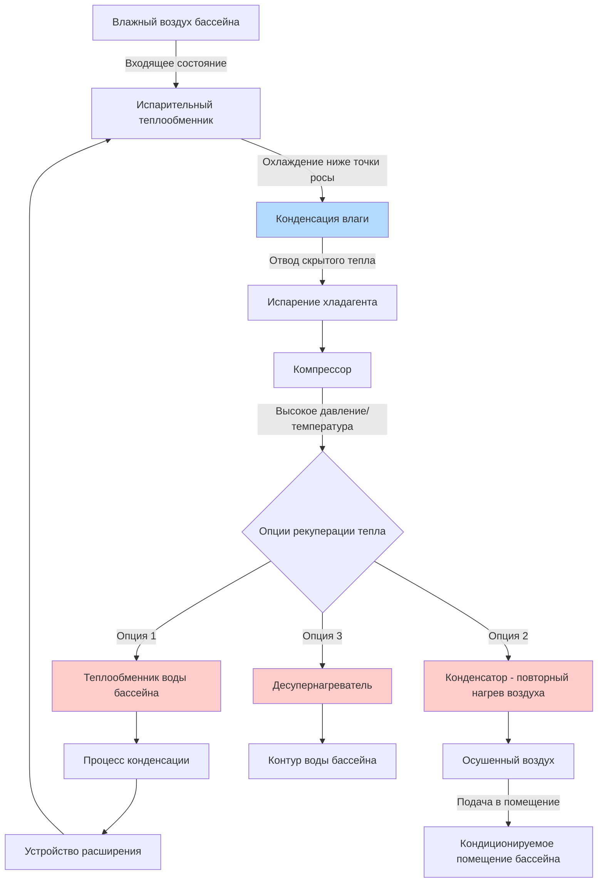

## Обзор

Специализированные осушители для бассейнов — это инженерные холодильные системы, разработанные специально для контроля влажности в нататориумах. Эти установки работают по циклу паровой компрессионной холодильной машины, конденсируя водяной пар из воздуха помещения бассейна и одновременно обеспечивая рекуперацию тепла для отопления помещения, повторного нагрева воздуха и нагрева воды бассейна. В отличие от стандартных осушителей HVAC, осушители для бассейнов изготавливаются из коррозионно-стойких материалов для работы в агрессивной среде хлораминов и высокой влажности.

## Принципы работы

### Холодильный цикл с рекуперацией тепла

Специализированные осушители для бассейнов используют модифицированный холодильный цикл, который захватывает энергию в нескольких точках для полезного использования:

### Удаление скрытого тепла

Производительность скрытого охлаждения напрямую связана с производительностью удаления влаги:

$$Q_L = 2500 \cdot L/h$$

где:
- $Q_L$ = производительность скрытого охлаждения (кВт)
- $L/h$ = литры в час удаленного конденсата

Производительность по удалению влаги обычно указывается в килограммах в час (кг/ч):

$$\dot{m}_w = \rho_{air} \cdot \dot{V} \cdot (W_{in} - W_{out})$$

где:
- $\dot{m}_w$ = производительность удаления влаги (кг/ч)
- $\rho_{air}$ = плотность воздуха (~1.2 кг/м³)
- $\dot{V}$ = расход воздуха (м³/ч)
- $W_{in}$ = влагосодержание входящего воздуха (г/кг сухого воздуха)
- $W_{out}$ = влагосодержание выходящего воздуха (г/кг сухого воздуха)

## Основные компоненты и особенности

### Опции рекуперации тепла

**1. Рекуперация тепла для нагрева воды бассейна**
- Холодильно-водяной теплообменник (десупернагреватель или конденсатор)
- Передает 60-80% от общего теплоотвода в воду бассейна
- Типичная производительность нагрева воды бассейна: 117-879 кВт
- Снижает затраты на работу котла/нагревателя на 40-70%

**2. Повторный нагрев воздуха конденсатором**
- Горячий газ хладагента нагревает осушенный воздух после испарительного теплообменника
- Предотвращает чрезмерное охлаждение помещения во время осушки
- Регулируемая производительность повторного нагрева через управление холодильным контуром
- Поддерживает заданную температуру помещения при удалении влаги

**3. Десупернагревание**
- Захватывает энергию супернагрева перед полной конденсацией
- Подает высокотемпературную воду (60-71°C) в бассейн или систему горячего водоснабжения
- Повышает общую эффективность системы на 15-25%

### Интеграция наружного воздуха

Стандарт ASHRAE 62.1 требует вентиляционного воздуха для нататориумов. Специализированные осушители для бассейнов обеспечивают наружный воздух через:

- **Канальное подключение наружного воздуха** к смесительной камере установки
- **Минимальные заслонки наружного воздуха** с управлением привода
- **Рекуперацию энергии** между вытяжным и наружным воздухом
- **Предварительный нагрев наружного воздуха** во время зимней работы для предотвращения обмерзания теплообменника

Типичные расходы наружного воздуха: 0.3 м³/(ч·м²) площади поверхности бассейна плюс вентиляция, основанная на численности людей.

## Руководство по расчету производительности

В соответствии с Справочником приложений ASHRAE (Глава 6 — Нататориумы):

**Расчет скорости испарения:**

$$E = \frac{A \cdot (P_{pool} - P_{air}) \cdot F}{Y}$$

где:
- $E$ = скорость испарения (кг/ч)
- $A$ = площадь поверхности бассейна (м²)
- $P_{pool}$ = давление насыщенного пара при температуре воды бассейна (Па)
- $P_{air}$ = парциальное давление пара воздуха помещения (Па)
- $F$ = коэффициент активности (0.5 без людей, 1.0 с людьми)
- $Y$ = коэффициент скрытого тепла (~2500 кДж/кг)

**Выбор осушителя:**
Выберите установку с производительностью удаления влаги ≥ 1.3 × расчетная скорость испарения для обеспечения запаса прочности и учета:
- Пиков заполнения
- Мокрых палуб
- Брызг и переноса влаги
- Инфильтрации воздуха через утечки

## Сравнение производителей

| Производитель | Диапазон производительности (кг/ч) | Нагрев воды бассейна (кВт) | Диапазон расхода воздуха (м³/ч) | Специальные возможности |
|--------------|------------------------|------------------------------|---------------------|------------------|
| Desert Aire | 34-272 | 44-351 | 3,400-34,000 | Тройная защита от коррозии, модульная конструкция |
| Seresco | 23-227 | 29-293 | 2,550-30,600 | Конструкция из нержавеющей стали, интеллектуальное управление |
| Dectron | 27-249 | 35-322 | 3,050-32,300 | Катушка Kinetic™, интерфейс с сенсорным экраном |
| Calorex | 20-218 | 26-278 | 2,040-27,200 | Реверсивный тепловой насос, гликольное отопление бассейна |
| DRI | 32-281 | 41-366 | 3,740-35,700 | Продвинутая диагностика, удаленный мониторинг |

## Рассмотрение производительности

**Производительность явного охлаждения:**
Большинство специализированных осушителей для бассейнов обеспечивают 0-50 кВт явного охлаждения. Явная тепловая нагрузка помещения типично невелика в нататориумах из-за:
- Высоких коэффициентов теплопередачи остекления, необходимых для управления конденсацией
- Требований к изоляции оболочки здания
- Ограниченных внутренних источников тепла

**Производительность повторного нагрева:**
Повторный нагрев предотвращает чрезмерное охлаждение во время осушки. Требуемая производительность повторного нагрева:

$$Q_{reheat} = 1.25 \cdot \dot{V} \cdot (T_{supply} - T_{evap,out})$$

где:
- $Q_{reheat}$ = производительность повторного нагрева (кВт)
- $\dot{V}$ = расход воздуха (м³/ч)
- $T_{supply}$ = желаемая температура подаваемого воздуха (°C)
- $T_{evap,out}$ = температура воздуха на выходе испарительного теплообменника (°C)

**Энергетическая эффективность:**
- Коэффициент производительности (COP) для осушки: 2.5-4.0
- Коэффициент производительности нагрева воды бассейна: 3.5-5.5
- Общий COP системы (осушка + рекуперация тепла): 4.5-7.0

## Стратегии управления

Специализированные осушители для бассейнов используют несколько контрольных контуров:

1. **Управление влажностью помещения** — основное задание (50-60% ОВ)
2. **Управление температурой помещения** — модулирующий повторный нагрев
3. **Управление температурой воды бассейна** — рекуперация тепла в контур бассейна
4. **Экономайзер наружного воздуха** — бесплатное охлаждение при благоприятных условиях
5. **Каскадирование осушителей** — несколько установок или модуляция производительности компрессора

Продвинутые установки включают:
- Частотные преобразователи (VFD) на вентиляторах подачи и возврата
- Электронные клапаны расширения (EEV) для точного управления супернагревом
- Байпас горячего газа для модуляции производительности
- Управление на основе микропроцессора с интеграцией BACnet/LonWorks

## Требования к монтажу

**Защита от коррозии:**
- Теплообменники с эпоксидным покрытием или из нержавеющей стали
- Поддоны конденсата из устойчивого к ультрафиолету полимера
- Герметичные электрические компоненты (NEMA 4X минимум)

**Управление конденсатом:**
- Затворные соединения слива в соответствии с требованиями UPC
- Минимальный размер трубы слива 25 мм
- Воздушный зазор или обратный клапан при подключении к канализационной системе

**Трубопроводы хладагента:**
- Пайка медные соединения, испытанные под давлением 3100 кПа
- Изоляция линии всасывания для предотвращения конденсации
- Надлежащие положения для возврата масла в трубопроводах рекуперации тепла

## Рассмотрение технического обслуживания

Критические задачи технического обслуживания:

- **Проверка теплообменника** — квартальная чистка для удаления отложений хлорамина
- **Замена фильтра** — MERV 8 минимум, ежемесячная проверка
- **Проверка заряда хладагента** — ежегодно через подохлаждение/супернагрев
- **Тестирование слива конденсата** — проверка целостности затвора и потока
- **Промывка теплообменника** — сторона воды бассейна ежегодно

Ожидаемый срок службы: 15-20 лет при надлежащем техническом обслуживании в условиях нататориума.
