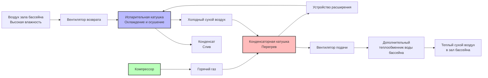

Системы осушения бассейна интегрируют несколько компонентов холодильной и воздухоснабжения в единую систему контроля влажности. Понимание функции каждого компонента, методологии расчета размеров и взаимодействия с другими элементами системы необходимо для надлежащего проектирования, монтажа и устранения неисправностей.

## Архитектура системы и траектория воздушного потока

## Испарительная катушка: ядро осушения

Испарительная катушка удаляет как явную, так и скрытую теплоту из воздуха зала бассейна. Воздух, проходящий по холодной поверхности катушки, охлаждается ниже точки росы, что приводит к конденсации влаги и её отводу.

### Методология расчета размеров

Производительность испарителя должна обрабатывать общую нагрузку:

$$Q_{evap} = Q_{sensible} + Q_{latent}$$

$$Q_{evap} = \dot{m}_{air} \cdot c_p \cdot (T_{db,in} - T_{db,out}) + \dot{m}_{air} \cdot (h_{in} - h_{out})$$

Где:
- $Q_{evap}$ = полная производительность испарителя (кДж/ч)
- $\dot{m}_{air}$ = массовый расход воздуха (кг/ч)
- $c_p$ = удельная теплоёмкость воздуха (1.005 кДж/кг·°C)
- $T_{db}$ = температура по сухому термометру (°C)
- $h$ = энтальпия (кДж/кг)

**Критические параметры проектирования:**
- Лицевая скорость катушки: 2.0–2.8 м/с (оптимальное удаление влаги)
- Воздух на входе в катушку: обычно 27–29°C сухой, 24–25°C мокрый
- Воздух на выходе из катушки: 10–13°C (ниже точки росы)
- Расстояние между рёбрами: 8–10 рёбер/дюйм для слива конденсата
- Ряды: 6–8 рядов типичны для приложений с бассейнами

## Конденсаторная катушка: отвод тепла и перегрев

Конденсатор выполняет две функции в осушителях бассейна — отводит тепло из холодильного цикла и одновременно перегревает холодный осушенный воздух перед его возвратом в помещение.

### Эффективность рекуперации тепла

Конденсатор отводит тепло, поглощённое испарителем, плюс работу компрессора:

$$Q_{cond} = Q_{evap} + W_{comp}$$

$$Q_{cond} = \dot{m}_{ref} \cdot (h_{cond,in} - h_{cond,out})$$

Где:
- $Q_{cond}$ = отвод тепла конденсатора (кДж/ч)
- $W_{comp}$ = мощность компрессора (кДж/ч)
- $\dot{m}_{ref}$ = массовый расход хладагента (кг/ч)

**Рассмотрения при проектировании:**
- Расположение воздушного потока: противоток для максимальной теплопередачи
- Повышение температуры: 11–17°C через конденсатор
- Целевая температура подачи: 27–32°C в зал бассейна
- Лицевая скорость: 2.5–3.5 м/с

## Компрессор: сердце системы

Компрессор циркулирует хладагент и создаёт перепад давления, необходимый для теплопередачи. Осушители бассейна требуют точной модуляции производительности для соответствия переменным нагрузкам влажности.

### Расчет производительности компрессора

Требуемый объём вытеснения компрессора:

$$V_{disp} = \frac{\dot{m}_{ref} \cdot v_{suction}}{\eta_{vol}}$$

Где:
- $V_{disp}$ = объём вытеснения (м³/мин)
- $v_{suction}$ = удельный объём на всасывании (м³/кг)
- $\eta_{vol}$ = объёмная эффективность (0.70–0.85)

### Требование по мощности компрессора

$$W_{comp} = \frac{\dot{m}_{ref} \cdot (h_{discharge} - h_{suction})}{\eta_{comp}}$$

Где:
- $\eta_{comp}$ = эффективность компрессора (0.60–0.75 для спирального)

## Сравнение компонентов

| Тип компонента | Технологические опции | Диапазон производительности | Эффективность | Возможность управления | Типичное применение |
|---|---|---|---|---|---|
| **Компрессор** | Спиральный | 10.5–70 кВ | Высокая (EER 10–12) | Вкл/выкл, 2-ступень | Малые и средние бассейны |
| | Спиральный с разгрузкой | 10.5–70 кВ | Высокая | Ступени 50–100% | Бассейны с переменной нагрузкой |
| | Спиральный с переменной скоростью | 10.5–88 кВ | Очень высокая (EER 12–15) | Непрерывно 25–100% | Премиум приложения |
| | Винтовой | 70–700 кВ | Умеренная | Модуляция скользящего клапана | Большие нататориумы |
| **Испаритель** | Медная трубка/алюминиевое оребрение | Все размеры | Стандартная | Фиксированная геометрия | Стандартное использование |
| | Медная трубка/покрытое оребрение | Все размеры | Стандартная | Фиксированная геометрия | Хлорустойчивость |
| | Микроканальный | Малый–средний | Высокая | Фиксированная геометрия | Компактные конструкции |
| **Конденсатор** | Воздушный охладитель с перегревом | Все размеры | COP 3.5–4.5 | Фиксированные/ступенчатые вентиляторы | Стандартные осушители бассейна |
| | Водяной охладитель с отдельным перегревом | Большие системы | COP 4.5–6.0 | Модулирующие | Конструкции с высокой эффективностью |
| | Катушка нагрева воды бассейна | Все размеры | COP 5.0–7.0 | Модулирующий клапан | Максимальная рекуперация тепла |
| **Устройство расширения** | Термостатический расширительный клапан (TXV) | Все размеры | Хорошая | Управление перегревом | Стандартные системы |
| | Электронный расширительный клапан (EEV) | Все размеры | Отличная | Точное управление перегревом | Системы с переменной скоростью |
| **Воздухоснабжение** | Прямого привода плеум-вентиляторы | <35 кВ | Стандартная | Вкл/выкл, 2-скоростной | Малые блоки |
| | Ременный центробежный привод | 35–175 кВ | Высокая статическая способность | Совместим с VFD | Воздуховодные системы |
| | Вентиляторы EC мотора | Все размеры | Очень высокая эффективность | Интегрированный VFD | Премиум эффективность |

## Опции рекуперации тепла

Осушители бассейна могут восстанавливать отводимое тепло для трёх целей:

1. **Перегрев помещения (стандартный):** Конденсатор нагревает осушенный воздух перед возвратом
2. **Нагрев воды бассейна:** Теплообменник хладагент-вода нагревает бассейн непосредственно
3. **Горячее водоснабжение:** Дополнительный теплообменник для потребностей в ГВС объекта

### Рекуперация тепла воды бассейна

$$Q_{pool} = \dot{m}_{water} \cdot c_{p,water} \cdot (T_{out} - T_{in})$$

Где:
- $Q_{pool}$ = тепло, подаваемое в воду бассейна (кДж/ч)
- $\dot{m}_{water}$ = расход воды бассейна (кг/ч)
- $c_{p,water}$ = 4.18 кДж/кг·°C
- Повышение температуры: обычно 1–3°C

**Типы теплообменников:**
- Медно-никелевая трубка в оболочке (устойчива к хлору)
- Титановая пластинчато-рамная (компактная, эффективная)
- Конструкции с двойной стенкой безопасности (коды могут требоваться)

## Методы управления производительностью

Точная модуляция производительности предотвращает циклирование и обеспечивает стабильные условия в помещении.

### Горячий газовый байпас

Отводит горячий газ хладагента вокруг конденсатора непосредственно на вход испарителя, уменьшая эффективную производительность без циклирования компрессора.

- **Диапазон производительности:** 30–100% полной нагрузки
- **Штраф на энергию:** Умеренный (компрессор всё ещё работает на полной нагрузке)
- **Отклик:** Быстрый (секунды)
- **Применение:** Старые системы, простые потребности в управлении

### Цифровая разгрузка спирального компрессора

Спиральный компрессор механически разгружает карманы для уменьшения вытеснения.

- **Ступени производительности:** 33%, 67%, 100% (типичные)
- **Эффективность:** Высокая (мощность соответствует уменьшению производительности)
- **Отклик:** Умеренный (10–30 секунд за ступень)
- **Применение:** Современные системы среднего диапазона

### Привод с переменной скоростью (VFD)

Непрерывно управляет скоростью двигателя компрессора от минимального до максимального об/мин.

- **Диапазон производительности:** 25–100% (непрерывный)
- **Эффективность:** Наивысшая (мощность пропорциональна нагрузке)
- **Отклик:** Медленный (1–2 минуты для стабильности)
- **Применение:** Премиум системы, стабильное управление

## Системы управления и датчики

Современные осушители бассейна используют сложные системы управления для балансирования осушения, нагрева и энергоэффективности.

**Основные датчики:**
- Относительная влажность помещения (основное управление)
- Температура помещения (режим нагрева/охлаждения)
- Температура подачи воздуха (защита от замерзания)
- Давления хладагента (безопасность, оптимизация)
- Температура воды бассейна (управление рекуперацией тепла)

**Стратегии управления (согласно справочнику ASHRAE Applications Handbook):**
- Установка влажности: обычно 50–60% ОВ
- Мёртвая полоса: 5% ОВ для предотвращения колебаний
- Ночной спад: может увеличиться до 65% ОВ когда помещение не занято
- Восстановление утром: увеличение производительности за 2 часа до занятости
- Экономайзер наружного воздуха: когда условия позволяют (редко для бассейнов)

**Дополнительные функции:**
- Вентиляция по требованию (датчики CO₂ в зрительских зонах)
- Прогнозный размораживание (обнаружение льда испарителя)
- Удалённый мониторинг и диагностика
- Интеграция с покрытиями бассейна (уменьшение нагрузки при закрытии)

## Компоненты холодильного контура

**Приёмник:** Сохраняет избыток жидкого хладагента при переменных нагрузках, необходим для систем с рекуперацией тепла воды бассейна, где нагрузка конденсатора варьируется.

**Фильтр-осушитель жидкой линии:** Удаляет влагу и загрязнения из хладагента. Критичен в приложениях с бассейнами из-за потенциала ускоренного разложения хладагента и масла, вызванного хлором.

**Аккумулятор всасывания:** Предотвращает возврат жидкого хладагента в компрессор во время понижения давления или ненормальных условиях.

**Смотровой глазок:** Указывает на заряд хладагента и уровень влажности. Должен показывать чистую жидкость (без пузырей) при установившемся режиме работы.

## Справочные материалы и стандарты

Проектирование и выбор компонентов осушения бассейна должны соответствовать:
- **ASHRAE Handbook—HVAC Applications, Chapter 6:** Natatoriums
- **ASHRAE Standard 62.1:** Требования вентиляции
- **ASHRAE Standard 15:** Безопасность холодильной системы
- Сертифицированные данные производителя (стандарты AHRI)

---

**Ключевой вывод:** Системы осушения бассейна интегрируют компоненты холодильной системы (компрессор, испаритель, конденсатор, устройство расширения) с оборудованием воздухоснабжения (вентиляторы, катушки) и сложными системами управления для одновременного удаления влаги и рекуперации тепла. Надлежащий расчет размеров компонентов и выбор на основе точных расчетов нагрузки обеспечивает эффективную и надежную работу в различных условиях зала бассейна.
