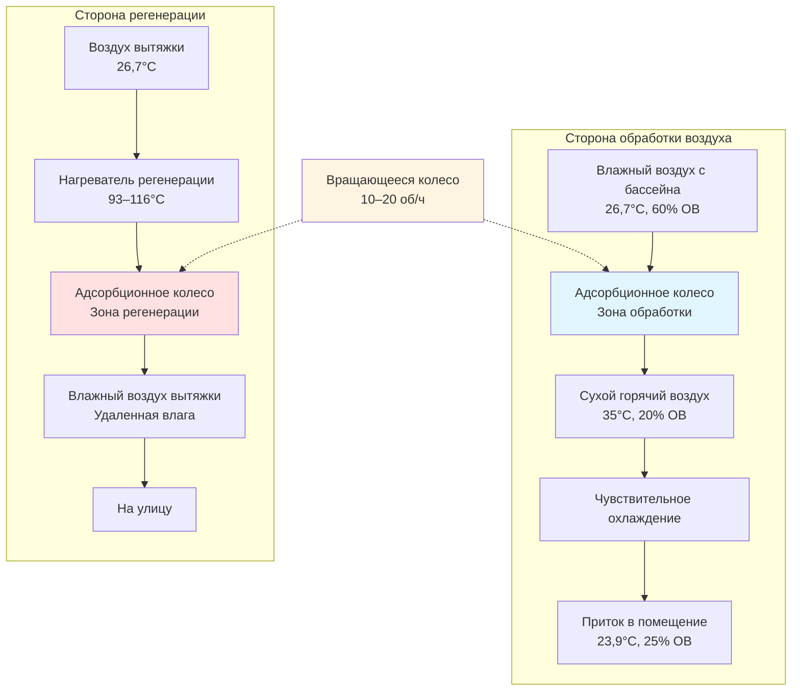

Системы осушения воздуха адсорбентами обеспечивают специализированный контроль влажности в средах нататориумов путем адсорбции водяного пара непосредственно из воздушных потоков посредством химического сродства, а не конденсации. Эти системы достигают чрезвычайно низких точек росы и эффективно работают при широком диапазоне температур, что делает их ценными для специфических приложений объектов с бассейнами, где обычные системы на основе хладагентов достигают пределов производительности.

## Физические принципы работы адсорбентов

Материалы-адсорбенты удаляют влагу путем адсорбции (твердые адсорбенты) или абсорбции (жидкие адсорбенты), создавая химическую или физическую связь с молекулами воды. Этот процесс высвобождает тепло адсорбции, повышая температуру приточного воздуха на 5,6–8,3°C на каждый гран влаги, удаленной при типичных условиях эксплуатации.

Емкость адсорбента по удалению влаги соответствует соотношению изотермы Ленгмюра для твердых адсорбентов:

$$W = W_m \frac{bP}{1 + bP}$$

Где:
- $W$ = влагосодержание адсорбента (кг воды/кг адсорбента)
- $W_m$ = максимальная емкость мономолекулярного слоя
- $b$ = константа адсорбционного равновесия
- $P$ = парциальное давление водяного пара

Требуемое тепло регенерации зависит от энергии десорбции и разности температур:

$$Q_{regen} = \dot{m}_{air} \left[ c_p(T_{regen} - T_{ambient}) + \Delta m_{water} \cdot h_{fg} \right]$$

Где:
- $Q_{regen}$ = подводимое тепло регенерации (кДж/ч)
- $\dot{m}_{air}$ = расход воздуха регенерации (кг/ч)
- $c_p$ = удельная теплоемкость воздуха (кДж/кг·°C)
- $T_{regen}$ = температура регенерации (типично 82–121°C)
- $\Delta m_{water}$ = скорость удаления влаги (кг воды/ч)
- $h_{fg}$ = удельная теплота парообразования (2326 кДж/кг при атмосферном давлении)

## Цикл работы адсорбционного колеса

## Сравнение твердых и жидких адсорбентных систем

| Параметр | Твердый адсорбент (колесо) | Жидкий адсорбент (LiCl) |
|-----------|-------------------------|--------------------------|
| **Материал адсорбента** | Силикагель, молекулярное сито, активированный оксид алюминия | Раствор хлорида лития, бромида лития |
| **Удаление влаги** | 4,3–21,4 г/кг воздуха | 5,7–28,6 г/кг воздуха |
| **Температура регенерации** | 82–121°C | 60–82°C |
| **Минимальная точка росы** | –40°C до +6,7°C | 0°C до +10°C |
| **Нагрев обработанного воздуха** | 5,6–8,3°C | 2,8–4,4°C |
| **Перепад давления** | 20–38 Па | 29–48 Па |
| **Техническое обслуживание** | Низкое (годовой осмотр) | Среднее (контроль раствора, фильтрация) |
| **Риск выноса капель** | Отсутствует | Возможен унос раствора |
| **Сложность системы** | Простое вращающееся колесо | Насосы, распыливающие камеры, теплообменники |
| **Капитальные затраты** | Умеренные | Выше |
| **Эффективность (COP)** | 0,8–1,2 | 1,0–1,4 |

## Возможность глубокого осушения для нататориумов

Адсорбентные системы достигают точек росы ниже 4,4°C, обеспечивая точный контроль влажности во время эксплуатации в холодную погоду, когда температуры воды в бассейне создают высокие темпы испарения, но температуры наружного воздуха ограничивают производительность конденсационных осушителей.

Справочник приложений ASHRAE (глава 6: Нататориумы) признает адсорбентные системы для следующих сценариев:

1. **Объекты в холодном климате**, где температура наружного воздуха падает ниже 1,7°C на продолжительные периоды
2. **Требования низкой влажности**, такие как соревновательные объекты, поддерживающие 50–55% ОВ
3. **Нагрузки с высоким коэффициентом чувствительного тепла**, где латентное охлаждение превышает чувствительное охлаждение
4. **Существующие здания** с ограниченной охлаждающей способностью для отвода тепла конденсационного модуля

Эффективность удаления влаги при низкотемпературных условиях:

$$\eta_{latent} = \frac{W_{inlet} - W_{outlet}}{W_{inlet} - W_{regen}} \times 100\%$$

Высокопроизводительные адсорбционные колеса достигают эффективности латентной теплоты 60–75%, удаляя 10,0–14,3 г/кг обрабатываемого воздуха при типичных условиях входа нататориума (26,7°C, 60% ОВ).

## Источники энергии регенерации и требования

Энергия регенерации составляет 50–70% от общих расходов на эксплуатацию адсорбентной системы. Выбор источника энергии существенно влияет на экономику системы:

**Газовая регенерация**: Прямые горелки обеспечивают регенерирующий воздух 93–116°C при термическом КПД 80–85%. При стоимости природного газа 0,027 руб./кДж стоимость регенерации составляет примерно 0,0016–0,0020 руб. за килограмм удаленной воды.

**Электрическое сопротивление нагреву**: Обеспечивает точный контроль температуры, но увеличивает эксплуатационные расходы в 2,5–3,0 раза по сравнению с газовыми системами в большинстве структур тарификации.

**Утилизация тепла от нагревателей бассейна или когенерационных систем**: Захватывает отходящее тепло при 60–82°C, достаточное для регенерации жидкого адсорбента или низкотемпературных циклов твердого адсорбента.

**Солнечные тепловые коллекторы**: Плоские или вакуумные трубчатые коллекторы генерируют регенерирующее тепло 71–93°C во время дневной работы, снижая энергетические затраты на 40–60% в климатических зонах с высокой инсоляцией.

## Гибридные системы адсорбента и хладагента

Гибридные конфигурации объединяют глубокое осушение адсорбентом с обычными системами на основе хладагента для оптимизации энергетической производительности при различных режимах эксплуатации:

**Последовательный гибрид**: Адсорбционное колесо предварительно осушает воздух перед поступлением на хладагентный теплообменник, снижая поверхностную температуру теплообменника и предотвращая замерзание конденсата во время низкотемпературной работы. Снижает общую энергию системы на 15–25% по сравнению с системами только на хладагенте в холодном климате.

**Параллельный гибрид**: Адсорбентная система обрабатывает пиковые латентные нагрузки, а хладагентная система поддерживает базовое охлаждение. Логика управления переключается между режимами на основе температуры наружного воздуха и влагосодержания.

**Предварительная обработка вентиляционного воздуха**: Адсорбционное колесо обрабатывает только 100% наружного вентиляционного воздуха, снижая нагрузку по влаге на основной осушитель бассейна на 30–50% и исключая проблемы отрицательного давления.

Коэффициент производительности гибридной системы:

$$COP_{system} = \frac{Q_{latent,total}}{Q_{electric,ref} + Q_{thermal,desiccant}/\eta_{source}}$$

Правильно спроектированные гибридные системы достигают сезонного COP 2,5–3,5 в северном климате, превосходя системы только на хладагенте (COP 1,8–2,2), при этом поддерживая превосходный контроль влажности.

## Конструктивные соображения и ограничения

**Преимущества для нататориумов:**
- Достигает точек росы на 8,3–16,7°C ниже, чем системы на хладагенте
- Эффективно работает при температуре наружного воздуха ниже 0°C
- Снижает избыточное охлаждение и энергию переподогрева в переходные сезоны
- Исключает проблемы замерзания конденсата в воздухораспределителях
- Обеспечивает независимый контроль латентного и чувствительного охлаждения

**Ограничения системы:**
- Высокое требование к энергии регенерации (561–702 кДж/кг удаленной воды)
- Увеличивает температуру приточного воздуха, требуя дополнительной чувствительной охлаждающей способности
- Выше начальная стоимость по сравнению с обычными осушителями для бассейнов
- Требует надежного источника тепла регенерации
- Больший размер оборудования при эквивалентном удалении влаги

Осушение воздуха адсорбентами служит специализированным приложениям нататориумов, где обычные системы достигают пределов производительности, особенно объекты в холодном климате и те, которые требуют точного контроля низкой влажности. Правильная интеграция с утилизацией тепла и стратегиями гибридной работы максимизирует энергоэффективность при сохранении превосходного контроля влажности на протяжении годовых циклов эксплуатации.
